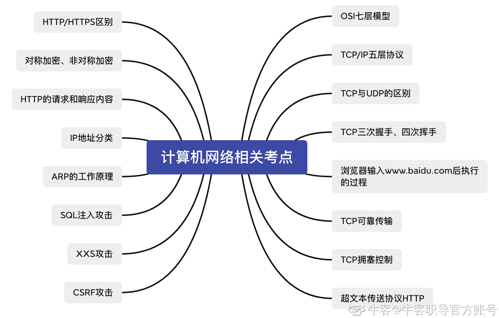
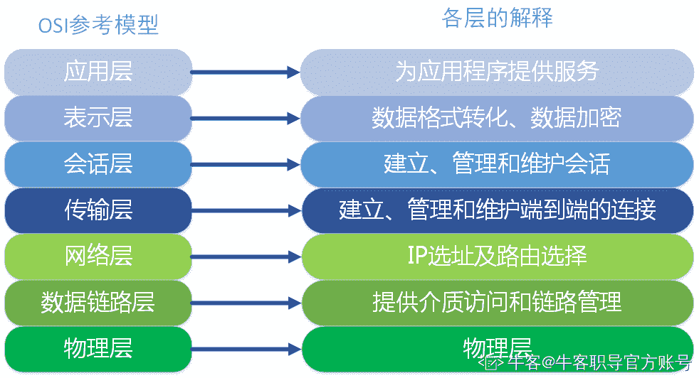
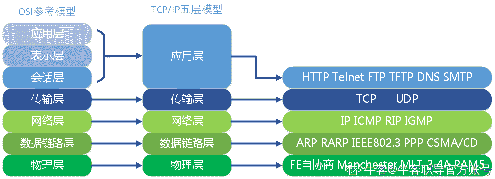
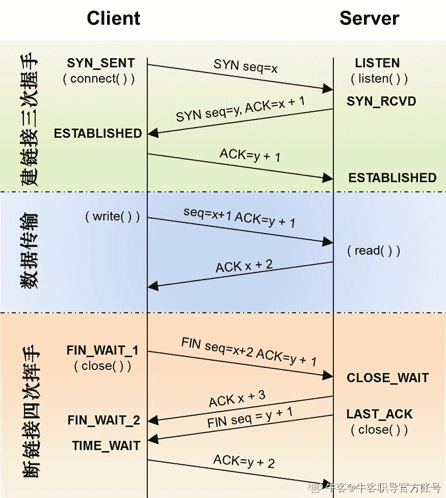

# 第七章 第 1 节 必会考点（上）

> 原文：[`www.nowcoder.com/tutorial/10091/a54a3d4101374aebbb2d8aa7939f6a70`](https://www.nowcoder.com/tutorial/10091/a54a3d4101374aebbb2d8aa7939f6a70)

### 1 必会考点（上）

### 【考点简介】

浏览器是页面的载体与根基，其相关知识是前端开发岗的必备基础，也是笔试面试的必考部分，本章将重点分析浏览器相关的高频考点，主要知识点如下图所示

计算机网络是软件开发岗位校招的必考内容，无论是前端开发、c++开发还是测试开发，这方面的知识也是必须要掌握的，本章会分析一些计算机网络方面的校招常考点，主要知识点如下图所示：

### 【例题示例】

#### 1.1 请问你了解 OSI 七层模型吗？

【频率】★★★★★（必考题）

【难度】☆☆

【参考答案】 

*   **应用层**

        OSI 参考模型中最靠近用户的一层，是为计算机用户提供应用接口，也为用户直接提供各种网络服务。我们常见应用层的网络服务协议有：HTTP，HTTPS，FTP，POP3、SMTP 等。

*   **表示层**

        表示层提供各种用于应用层数据的编码和转换功能,确保一个系统的应用层发送的数据能被另一个系统的应用层识别。如果必要，该层可提供一种标准表示形式，用于将计算机内部的多种数据格式转换成通信中采用的标准表示形式。数据压缩和加密也是表示层可提供的转换功能之一。

*   **会话层**

        会话层就是负责建立、管理和终止表示层实体之间的通信会话。该层的通信由不同设备中的应用程序之间的服务请求和响应组成。

*   **传输层**

        传输层建立了主机端到端的链接，传输层的作用是为上层协议提供端到端的可靠和透明的数据传输服务，包括处理差错控制和流量控制等问题。该层向高层屏蔽了下层数据通信的细节，使高层用户看到的只是在两个传输实体间的一条主机到主机的、可由用户控制和设定的、可靠的数据通路。我们通常说的，TCP UDP 就是在这一层。端口号既是这里的“端”。

*   **网络层**

       本层通过 IP 寻址来建立两个节点之间的连接，为源端的运输层送来的分组，选择合适的路由和交换节点，正确无误地按照地址传送给目的端的运输层。就是通常说的 IP 层。这一层就是我们经常说的 IP 协议层。IP 协议是 Internet 的基础。

*   **数据链路层 **

        将比特组合成字节,再将字节组合成帧,使用链路层地址 (以太网使用 MAC 地址)来访问介质,并进行差错检测。

     数据链路层又分为 2 个子层：逻辑链路控制子层（LLC）和媒体访问控制子层（MAC）。

        MAC 子层处理 CSMA/CD 算法、数据出错校验、成帧等；LLC 子层定义了一些字段使上次协议能共享数据链路层。 在实际使用中，LLC 子层并非必需的。

*   **物理层     **

        实际最终信号的传输是通过物理层实现的。通过物理介质传输比特流。规定了电平、速度和电缆针脚。常用设备有（各种物理设备）集线器、中继器、调制解调器、网线、双绞线、同轴电缆。这些都是物理层的传输介质。

#### 1.2 请问你了解 TCP/IP 五层协议吗？它与 OSI 七层模型有什么关系吗？

【频率】★★★★★（必考题）

【难度】☆☆

【参考答案】

TCP/IP 协议包含四个概念层，其中有三层对应于 OSI 模型中的相应层，TCP/IP 协议族并不包含物理层和数据链路层，因此它不能独立完成整个计算机网络系统的功能，必须与许多其他的协议协同工作。

*   **网络接口层**

用于协作 IP 数据在已有网络介质上传输的协议。实际上 TCP/IP 标准并不定义与 ISO 数据链路层和物理层相对应的功能。相反，它定义像地址解析协议(Address Resolution Protocol,ARP)这样的协议，提供 TCP/IP 协议的数据结构和实际物理硬件之间的接**口。**

*   **网络层**

对应于 OSI 七层模型的网络层。本层包含 IP 协议、RIP 协议(Routing Information Protocol，路由信息协议)，负责数据的包装、寻址和路由。同时还包含网间控制报文协议(Internet Control Message Protocol,ICMP)用来提供网络诊断信息。

*   **传输层**

对应于 OSI 七层模型的传输层，它提供两种端到端的通信服务。其中 TCP 协议(Transmission Control Protocol)提供可靠的数据流运输服务，UDP 协议(Use Datagram Protocol)提供不可靠的用户数据报服务。

*   **应用层**

对应于 OSI 七层模型的应用层、表达层与会话层。因特网的应用层协议包括 Finger、Whois、FTP(文件传输协议)、Gopher、HTTP(超文本传输协议)、Telent(远程终端协议)、SMTP(简单邮件传送协议)、IRC(因特网中继会话)、NNTP（网络新闻传输协议）等。

TCP/IP 五层协议与 OSI 的七层模型对应关系如下：

#### 1.3 请问你能阐述下 TCP 与 UDP 的区别吗？

【频率】★★★★★（必考题）

【难度】☆

【参考答案】

TCP 和 UDP 是 OSI 模型中的运输层中的协议。TCP 提供可靠的通信传输，而 UDP 则常被用于让广播和细节控制交给应用的通信传输。

TCP：

充分实现了数据传输时各种控制功能，可以进行丢包的重发控制，还可以对次序乱掉的分包进行顺序控制。而这些在 UDP 都没有。此外，TCP 作为一种面向有连接的协议，只有在确认通信对端存在时才会发送数据，从而可以控制通信流量的浪费。

TCP 通过检验和、序列号、确认应答、重发控制、连接管理以及窗口控制等机制实现可靠性传输。

UDP：

不提供复杂的控制机制，利用 IP 提供面向无连接的通信服务。并且它是将应用程序发来的数据在收到的那一刻，立刻按照原样发送到网络上的一种机制。

即使是出现网络拥堵的情况下，UDP 也无法进行流量控制等避免网络拥塞的行为。此外，传输途中如果出现了丢包，UDO 也不负责重发。

TCP 与 UDP 区别：

1、TCP 面向连接（如打电话要先拨号建立连接），UDP 是无连接的，即发送数据之前不需要建立连接

2、TCP 提供可靠的服务。通过 TCP 连接传送的数据，无差错，不丢失，不重复，且按序到达，UDP 尽最大努力交付，即不保证可靠交付

3、TCP 面向字节流，实际上是 TCP 把数据看成一连串无结构的字节流；UDP 是面向报文的，UDP 没有拥塞控制，因此网络出现拥塞不会使源主机的发送速率降低（对实时应用很有用，如 IP 电话，实时视频会议等）

4、每一条 TCP 连接只能是点到点的；UDP 支持一对一，一对多，多对一和多对多的交互通信

5、TCP 首部开销 20 字节；UDP 的首部开销小，只有 8 个字节

6、TCP 的逻辑通信信道是全双工的可靠信道，UDP 则是不可靠信道

#### 1.4 请问你能阐述下 TCP 三次握手与四次挥手的过程吗？

【频率】★★★★★（必考题）

【难度】☆☆

【参考答案】

TCP 的三次握手与四次挥手的过程可参考以下图例加以理解：

TCP 三次握手：

1、客户端发送 SYN 包来建立连接。包信息: [SYN=1,ACK=0] Seq=1000(随机生成的初始序号 client_isn,目前假设 1000)；Len=0；MSS=1460(通常情况下是 1460)；

2、服务端收到包之后，提取 SYN 的报文信息，然后分配 TCP 缓存和变量，发送允许连接的报文段。包信息 [SYN=1,ACK=1] Seq=666(随机生成的初始序号 server_isn,目前假设 535);Ack=1000(上一个包的 Seq)+1;Len=0;MSS=1200(这个不是固定的，根据当前窗口来判断能接受的最大报文段长度)在第三次握手之前分配缓存容易收到 SYN 洪泛的拒绝服务攻击

3、客户端接受到服务端的确认包之后，发送确认包[ACK=1,SYN=0] Seq=1001(上一个包的 Ack), Ack=666(上一个包的 Seq)+1;之后就可以正常通信了。前两次不能有效负载，第三次就可以携带客户数据了，后面在通信的时候标志位都将置为 0

TCP 四次挥手：

1、客户端给服务器发送 TCP 包，用来关闭客户端到服务器的数据传送。将标志位 FIN\=1 表示请求断开连接，同时把 Seq = u

2、服务器收到 FIN 后,先检验 Ack \=u+1，发回一个 ACK = 1(标志位 ACK=1)表示确认断开连接请求，同时把 Seq = v ,服务器开始断开工作

3、服务器断开工作完成，发送一个 FIN \= 1 请求断开连接，ACK=1 (标志位 ACK=1)表示确认断开连接请求, 同时把 Seq =w

4、客户端收到服务器发送的 FIN\=1 之后，发回 ACK=1(标志位 ACK=1)确认关闭请求，同时把 Ack= w+1 服务器在检验 Ack\= 服务器 Seq+1 之后关闭连接，客户端在等待 2msl 时间后关闭连接

注意：为什么建立连接只要三次握手，但是断开连接要四次挥手？

因为三次握手的第二次由服务器发送 SYN 建立连接的信息和 ACK 确认建立连接的信息是在同一个报文中传输的，而四次挥手的由服务器发送的 ACK 确认断开请求的信息和 FIN 发送断开连接的信息是在两个报文中传输的

#### 1.5 请问在浏览器中输入[www.baidu.com](http://www.baidu.com)后执行了哪些过程？

【频率】★★★

【难度】☆

【参考答案】

*   客户端浏览器通过 DNS 解析到[www.baidu.com](http://www.baidu.com)的 IP 地址 220.181.27.48，通过这个 IP 地址找到客户端到服务器的路径。客户端浏览器发起一个 HTTP 会话到 220.161.27.48，然后通过 TCP 进行封装数据包，输入到网络层。

*   在客户端的传输层，把 HTTP 会话请求分成报文段，添加源和目的端口，如服务器使用 80 端口监听客户端的请求，客户端由系统随机选择一个端口如 5000，与服务器进行交换，服务器把相应的请求返回给客户端的 5000 端口。然后使用 IP 层的 IP 地址查找目的端。

*   客户端的网络层不用关系应用层或者传输层的东西，主要做的是通过查找路由表确定如何到达服务器，期间可能经过多个路由器，这些都是由路由器来完成的工作，我不作过多的描述，无非就是通过查找路由表决定通过那个路径到达服务器。

*   客户端的链路层，包通过链路层发送到路由器，通过邻居协议查找给定 IP 地址的 MAC 地址，然后发送 ARP 请求查找目的地址，如果得到回应后就可以使用 ARP 的请求应答交换的 IP 数据包现在就可以传输了，然后发送 IP 数据包到达服务器的地址。

#### 1.6 请问 TCP 如何保证数据的可靠传输的呢？

【频率】★★★★★

【难度】☆

【参考答案】

TCP 提供一种面向连接的、可靠的字节流服务。其中，面向连接意味着两个使用 TCP 的应用（通常是一个客户和一个服务器）在彼此交换数据之前必须先建立一个 TCP 连接。在一个 TCP 连接中，仅有两方进行彼此通信；而字节流服务意味着两个应用程序通过 TCP 链接交换 8bit 字节构成的字节流，TCP 不在字节流中插入记录标识符。

TCP 通过以下方式保证数据传输的可靠性：

数据包校验：目的是检测数据在传输过程中的任何变化，若校验出包有错，则丢弃报文段并且不给出响应，这时 TCP 发送数据端超时后会重发数据

对失序数据包重排序：既然 TCP 报文段作为 IP 数据报来传输，而 IP 数据报的到达可能会失序，因此 TCP 报文段的到达也可能会失序。TCP 将对失序数据进行重新排序，然后才交给应用层

丢弃重复数据：对于重复数据，能够丢弃重复数据

应答机制：当 TCP 收到发自 TCP 连接另一端的数据，它将发送一个确认。这个确认不是立即发送，通常将推迟几分之一秒

超时重发：当 TCP 发出一个段后，它启动一个定时器，等待目的端确认收到这个报文段。如果不能及时收到一个确认，将重发这个报文段

流量控制：TCP 连接的每一方都有固定大小的缓冲空间。TCP 的接收端只允许另一端发送接收端缓冲区所能接纳的数据，这可以防止较快主机致使较慢主机的缓冲区溢出，这就是流量控制。TCP 使用的流量控制协议是可变大小的滑动窗口协议

#### 1.7 请问 TCP 如何拥塞控制呢？

【频率】★★★★

【难度】☆☆

【参考答案】

防止过多的数据注入到网络中，这样可以使网络中的路由器或链路不致过载。拥塞控制所要做的都有一个前提：网络能够承受现有的网络负荷。拥塞控制是一个全局性的过程，涉及到所有的主机、路由器，以及与降低网络传输性能有关的所有因素。

拥塞控制代价：需要获得网络内部流量分布的信息。在实施拥塞控制之前，还需要在结点之间交换信息和各种命令，以便选择控制的策略和实施控制。这样就产生了额外的开销。拥塞控制还需要将一些资源分配给各个用户单独使用，使得网络资源不能更好地实现共享。

几种常见拥塞控制方法：

慢开始(slow-start )、拥塞避免(congestion avoidance )、快重传( fastretransmit )和快恢复( fastrecovery )。