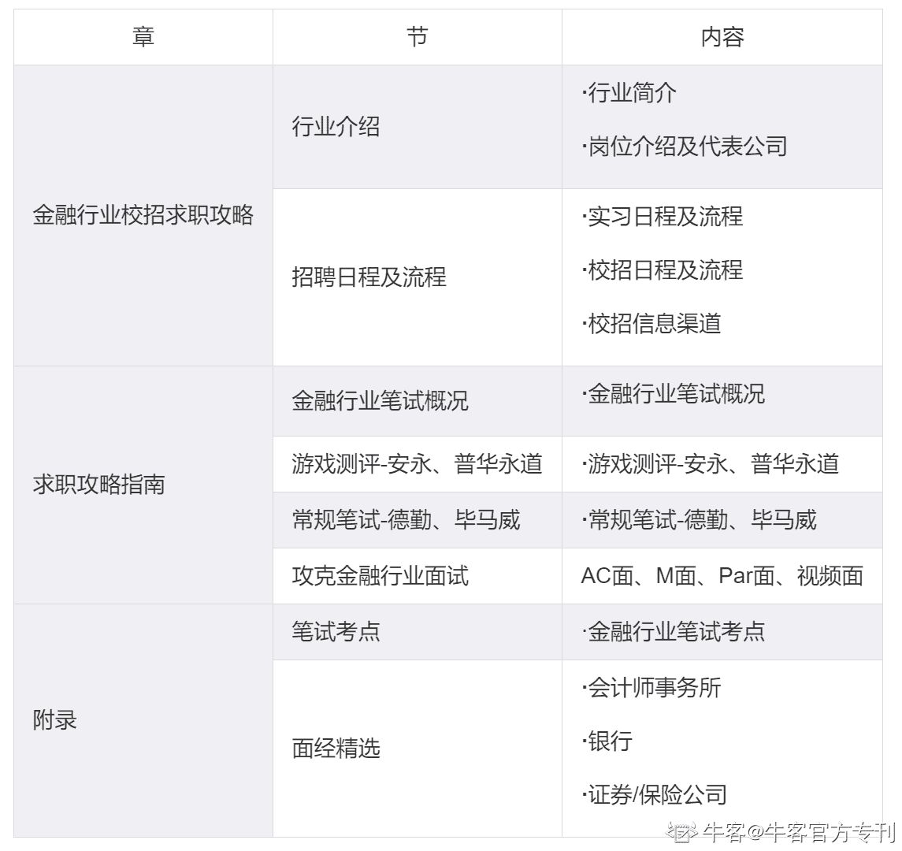

# 第一章 第 1 节 开篇词：金融行业校招如何拿到满意的 offer

> 原文：[`www.nowcoder.com/tutorial/10023/90217b8a3f034b5188c53a9505fcc658`](https://www.nowcoder.com/tutorial/10023/90217b8a3f034b5188c53a9505fcc658)

## 专刊介绍

本专刊由牛客官方团队打造，主要讲解金融行业校招如何拿到满意的 offer。目前内容为成体系的且全的，但是后面还会不断更新，现在订阅的可以以早鸟价享受后期永久的更新。大家有相关需求的也可以在本文下方留言，我们会根据大家的需求补充相关内容。

## 专刊大纲

