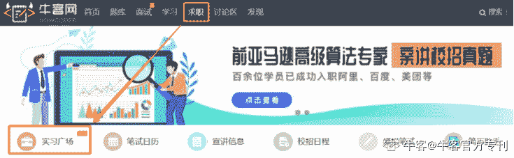

# 第二章 第 2 节 招聘日程及流程

> 原文：[`www.nowcoder.com/tutorial/10023/ccfa27d4cd0543cd839e805c36c57163`](https://www.nowcoder.com/tutorial/10023/ccfa27d4cd0543cd839e805c36c57163)

## **实习日程及流程**

四大的忙季一般在年初，所以寒假实习招人较多，而暑假实习几乎不招人。

德勤和毕马威一般在大二下学期以“Deloitte Club”和“精英计划”的名义招人，普华永道和安永则在大三上学期。

#### 【德勤和毕马威的招聘流程】

网申（4 月中）→笔试（4 月底-5 月初）→面试（5 月底）→offer（6 月）

#### 【普华永道和安永的招聘流程】

网申（9 月-10 月）→笔试（10 月-11 月）→AC 面+M 面（10 月-11 月）→offer（11 月-12 月）更多金融行业的实习信息，可扫码关注牛客【经管校招实习】公众号，随时获取求职资源，及时提醒网申。 扫一扫，领取校招助手

### **实习****通用注意事项****：**

**1、中英文简历：**提前准备好中英文简历，以供网申需要。网申时不要填错邮箱及手机号码。

**2、注意邮箱：**网申后每天检查邮箱收件箱及垃圾桶，以防漏收笔试链接。

**3、笔试准备：**笔试一般要求在 2 到 3 天内完成，平均耗时 60 分钟，准备充分再开始笔试，做笔试时记得寻找一个不会被人打扰的安静地方。

**4、面试安排：**实习面试通常半天结束，人数在 5 到 10 人，AC 面不一定是案例分析，可能是辩论或其他。

### **各家****实习****注意事项****：**

**1、毕马威**网申时需要回答 5 个 open question（简称 OQ），请提前准备好，回答最好体现出想加入毕马威的决心。

【毕马威 open question】

1、Please give a brief summary of your current recreational and leisure activities, including sports and hobbies. 

请简要介绍你目前的娱乐和休闲活动，包括运动和爱好。

2、What clubs and societies are you a member of and in what capacity?

你是什么俱乐部和社团的成员？以什么身份？

3、 What factors have influenced your career choice?

什么因素影响了你的职业选择？

4、 Outline your career ambitions and objectives.

概述你的职业抱负和目标。

5、 At KPMG our global values guide the way that we interact with each other and help to create our open, friendly and supportive culture. Please tell us about a situation where you have used two of KPMG's values to achieve a positive outcome.

在毕马威，我们的全球价值观指引着我们相互交流的方式，帮助我们创造开放、友好和支持性的文化。请告诉我们您使用毕马威的两个价值观取得积极成果的情况。

**2、安永**需要提交本人签字的诚信承诺书、身份证、奖学金、四六级证明和实习证明等材料的扫描件，请提前准备。

**3、德勤**上传完中英文简历后有个可填可不填的“求职申请”，如果不是对自己的简历和学历很有信心的建议不要空着，可以表达下自己想进德勤的迫切心情，或写写自己的优势特长，就当自己在写 cover letter。

**4、普华永道**提交网申后，不管过没过都会收到笔试链接，所以网申前建议也做好笔试的准备。

## **校招日程及流程**

### **提前批**

提前批分成两种，一种是实习期间表现优秀的，在 5 月底到 6 月会收到 par 面的邮件，通过 par 面即可收到 offer；另一种可以理解为秋招的提前批，只有安永和毕马威会招提前批，安永称之为 summer leader program（简称 SLP），毕马威称之为“早鸟计划”。

#### 【安永 SLP 的招聘流程】

网申（5 月初）→笔试（5 月）→面试（7 月中）→offer（8 月初）

#### 【毕马威早鸟计划的招聘流程】

网申（5 月初）→笔试（5 月）→AC 面+M 面（7 月初）→Par 面（7 月中）→offer（7 月底到 8 月初）

#### **提前批****注意事项****：**

1、实习的所有注意事项此处也适用。

2、毕马威“早鸟计划”的招聘流程与正规的秋招差不多。一面一结束 HR 就会通知有没有进二面，一面结束后一周左右就是二面。AC 面中小组讨论完就结束，没有小组总结的环节。

3、安永 SLP 的面试在一天之内完成，抛开签到、宣传和吃饭等环节，上午和下午分别是做游戏和小组讨论，Partner 和 manager 会全程陪同，小组活动结束后 partner 会对小组每位成员进行 5 到 15 分钟的谈话，可能是点评也可能是闲聊。

### **正式批**

四大在秋招都会招人，但因存在实习留用和提前批的影响，秋招反而招人不是太多，点名德勤和安永。

#### 【德勤、安永、毕马威的招聘流程】

网申（8 月-10 月）→笔试（8 月-11 月）→AC 面+M 面（10 月-12 月）→Par 面（10 月-12 月）→offer（11 月-12 月）

#### 【普华永道的招聘流程】

网申（8 月-10 月）→游戏笔试又称 GBA（网申结束后的 48h 之内）→视频面试又称 VI（10 月-11 月）→AC 面+Par 面又称 superday（10 月-12 月）→offer（11 月-12 月）

### **秋招****注意事项****：**

1、实习的所有注意事项此处也适用。

2、参加提前批的同学需注意，如提前批未过，也无法再参加该公司的正式批招聘

3、具体日期以各家官网及邮件通知为准，但是官网太多，一个个翻找会很浪费时间， 建议**直接关注牛客网校招日程汇总，节省查找时间，避免错过网申。**通过牛客校招日程汇总，**一键直达各个公司官网：**牛客网>求职>校招日程汇总（地址：[`www.nowcoder.com/school/schedule`](https://www.nowcoder.com/school/schedule)）

## **校招信息渠道**

### **·****公司官网+官方招聘公众号**

如上所述，正常的校园招聘信息获取途径最快捷最准确的是公司官网或官微，但是官网那么多，一个个翻找会浪费很多时间和精力。

所以，这时候认准牛客网就可以了。

### **·牛客网**

**实习广场：**企业最新招聘信息，由用人部门/企业 HR 直接发布，信息真实可靠，简历处理效率快，岗位齐全，随时可以找到职位发布者直接联系。 

地址：牛客网>求职>实习广场：[`www.nowcoder.com/job/center`](https://www.nowcoder.com/job/center)  

移动端地址：牛客 APP > 求职

**讨论区**：内推消息，由已拿到 offer 的前辈以及 HR 发布

电脑端地址：牛客网>讨论区>招聘信息[`www.nowcoder.com/discuss?type=7`](https://www.nowcoder.com/discuss?type=7) 

移动端地址：牛客 APP > 社区 

关注牛客讨论区，随时查看同行动态、校招/内推信息、offer 比较、面试交流等等。

### **公众号：**

**牛客网：**官方资源第一手送到，陪你走过秋招各种坎儿。

**经管校招实习：**每日推送校招/内推资讯以及面经干货。

 

 牛客网                                 经管校招实习

通过以上方式，大家能更快获取招聘信息，避免浪费大量时间在查找信息上。事半功倍，将时间运用到更重要的事情——准备校招。