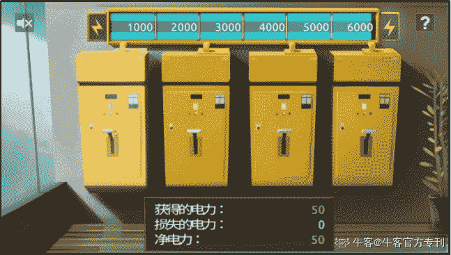

# 第三章 第 2 节 攻克笔试，游戏测评-普华永道、安永

> 原文：[`www.nowcoder.com/tutorial/10023/49d10c704e334c08a02fa68c86082d74`](https://www.nowcoder.com/tutorial/10023/49d10c704e334c08a02fa68c86082d74)

笔试求职者需要通关 10 到 11 个游戏，完成后不仅能看到游戏得分，还能收到一份根据求职者在游戏中的行为为分析的性格报告。据称，游戏总分不重要，四大的 HR 更看重性格报告，用以判断求职者是否符合公司招聘要求。

下面直接为大家罗列每道题目。

**第一关：**

【题目简介】

给气球充气，每充一次得五分，充气次数越多气球越值钱，不过气球有充气次数上限（未知），超过上限将会爆，爆炸的气球不得钱。只要气球不爆炸，求职者可以随时卖出气球换钱，最后统计所获金额。

【题目分析】

考察取舍能力和判断能力。

气球一共四种形状，最好在前几个气球拼命充气以试出四种不同形状气球的可充气上限的一个大概范围，接下来的气球的充气次数控制在这个范围里。一些充气上限小卖钱少的气球爆就爆了，不用管，重点是找到充气上限大卖钱多的气球，这样总收入才高。

**第二关**

【题目简介】

按空格键或鼠标左键使阴影面积覆盖高亮面积。

【题目分析】

考察反应力、耐心和面对困难的反应。

最好控制在第 16 或第 17 个数字，不建议过早放弃。

**第三关**

【题目简介】识别人脸情绪。

【题目分析】

考察对情绪的识别能力。

尽量细腻敏感一些，你觉得是什么就是什么。

**第四关**

【题目简介】三个黑格，依次出现灯泡和齿轮两种图案，灯泡按 Q，齿轮按 P。图案出现速度会越来越快。

【题目分析】

考察反应能力和处理速度。

**第五关**

【题目简介】中间箭头向左按 Q，向右按 P。

【题目分析】

考察反应能力和处理速度。

**第六关**

【题目简介】

按四个电闸，每次可能获得也可能损失电力（存在规律），必须按够特定的次数本关才会结束，结束时电力越高分数越高。

【题目分析】

考察找规律能力和风险承担能力。

有个电闸基本每次都能获得 50 电力，偶尔损失 25/50/75 电力，一直点这个电闸能保证净电力为正且总电力加到最满，找到这个电闸即可。这个方法能保证本关拿满分，性格报告偏审慎稳重。通关方法不唯一，通关方法不同对性格报告的影响不同。

**第七关**

【题目简介】

绿色的瓶盖会按顺序出现在 15 个盒子里，偶尔会有红色的邮票出现干扰，记忆瓶盖出现的顺序。

【题目分析】

考察记忆力。

但是建议备好纸笔，一个个记录下来，毕竟好记性不如烂笔头，而且最多一次要记十几个瓶盖。

**第八关**

【题目简介】

求职者队和电脑队都属于普华永道公司，求职者和电脑队比出价，都出高价得 200，都出低价得 50，一方高一方低，低的得 300 高的得 0，最终看本队总收入和两队总收入。

【题目分析】

囚徒困境，考察博弈能力。

理论上一直点低价能保证本队总收入高，但是这么做对性格测试评价不好，因为这么做会使两队总收入也就是公司的收入低，这某种程度上反应你比较关心个人利益。本队总收入影响本关分数，本队总收入和两队总收入影响性格报告。建议一直点低价最后几次点高价。

第九关

【题目简介】

回答问题，“是”按 Q，“否”按 P。

【题目分析】

考察反应力和处理速度。

**第十关**

【题目简介】

从下面四个选项选出满足上列图形变化规律的选项

【题目分析】

考察逻辑推理能力。

主要通过变色或移动的图形来发现规律，注意移动的图形有时可能会被其他图形覆盖。

**第十一关**

【题目简介】根据给出数字推算第六位数字。

【题目分析】

考察计算和推理能力。

加减乘除计算即可，有的需要 135 和 246 跳着看。