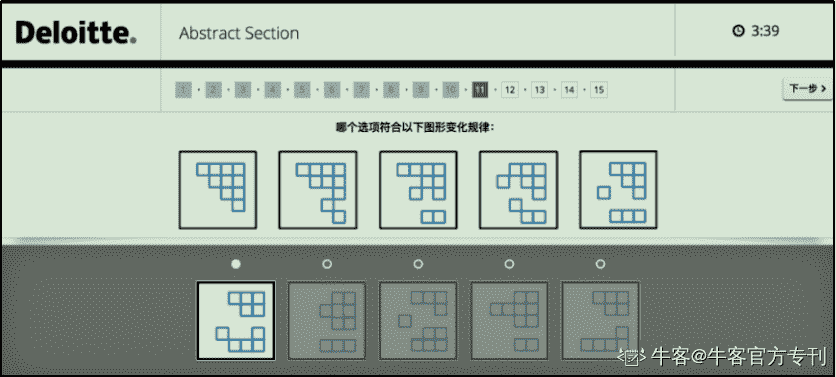
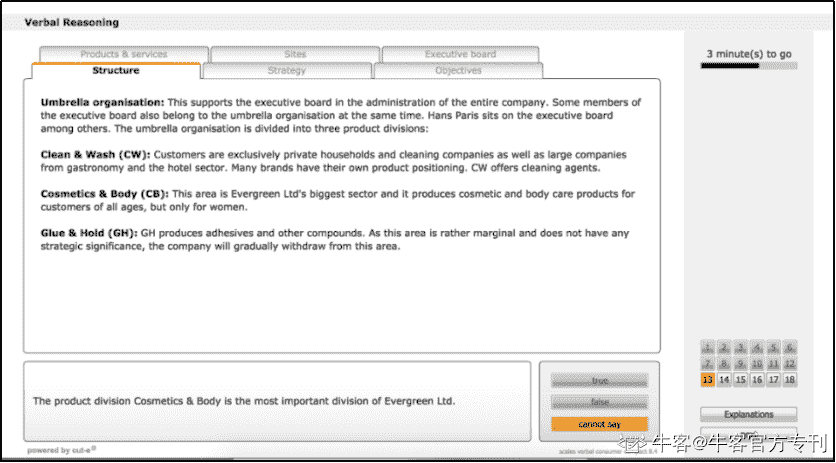
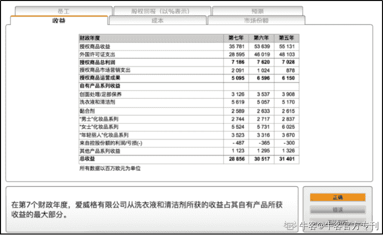

# 第三章 第 3 节 攻克笔试，常规笔试-德勤、毕马威

> 原文：[`www.nowcoder.com/tutorial/10023/b77f8711f3da42b1a204c98bf4fb940c`](https://www.nowcoder.com/tutorial/10023/b77f8711f3da42b1a204c98bf4fb940c)

笔试的四个部分包含：逻辑 L、语言 V、数字 N 和性格测试，在规定时间内完成即可，不一定要一次性做完，大家可以根据自己的情况合理安排。

由于普华永道和安永 2019 年采用了游戏笔试，故往年笔试形式不再赘述，此处仅详解德勤和毕马威的。

德勤采用的是 ACE 题库，中文；毕马威采用的是 CUTE 题库，英文。难度上来说毕马威大于德勤，不过德勤比毕马威多一个英语小作文。

关于笔试准备还是如前面所述，多刷多练，就基本没有什么问题。即便遇到了新题，也可以凭借刷题得来的经验做出来。

**四大校招题库：**[`www.nowcoder.com/contestRoom?categories=4`](https://www.nowcoder.com/contestRoom?categories=4)

**1、德勤**

**（1）逻辑推理**

【题目简介】从下方的五个选项中选出满足图形变化规律的一项**（6 分钟 15 题）**

 

 

【题目分析】

德勤的逻辑测试较为简单，一般变化规律与图案大小、长短、形状、数量、增减、旋转角度、旋转方向等方面有关。

**（2）语言理解**

【题目简介】根据短文内容选择满足题意的一项**（12 分钟 18 题）**

 

【题目分析】

有些选项存在争议，选择你认为正确的那个。

（3）数字分析

【题目简介】根据图表数据选择满足题意的选项**（12 分钟 12 题）**

 

【题目分析】

多练多做，老生常谈。

**（4）性格测试**

【题目简介】

根据自己情况回答问题

**（30 分钟 76 题）**

【题目分析】

从心所欲，千万别撒谎。一般来说，四大喜欢团结合作、诚信友善、吃苦耐劳、勇于创新的人，可参考公司介绍里的价值观。

**（5）英文写作**

【题目简介】30 分钟内按题目要求写出一篇不少于 250 个单词的英语作文。

作文题包括但不限于：

① 如果人类被机器人抢走了 50%的工作会怎样

② Some people quit their job or study to go to working holiday. Would you do the same?

有些人辞去工作或学习去度假。你也会这样做吗？

③ Which one of the following super powers do you want to possess? Why? (1.Instant travel 2.Future prediction 3\. Mind control)

如果让你拥有以下超能力，你会选择哪一种，说明理由（1、远距离移动 2、预测未来 3、控制思维）

④ cloud computing（云计算对生活的影响？）

⑤ aerial cameras（航空相机）对个人隐私问题造成的影响，你对此的看法是什么？

⑥ a few years ago, a person died from driving a Tesla by using its autopilot system. do you think the autopilot system is reliable or not?

几年前，一个人因驾驶特斯拉汽车的自动驾驶系统而死亡。你认为自动驾驶系统可靠与否？

⑦ 很多年轻人毕业后创业，你怎么看？

⑧如果让你在 light bulb（电灯泡）和 telephone（电话）中选择一个不要被发明出来你会选择哪个？

⑨ mobile payment（移动支付）会取代 physical money（实物货币）吗？

【题目分析】

可视情况提前准备。不一定要使用高级词汇句法来展示文采，表达清楚自己想说的，不犯拼写和语法错误即可。

**2、毕马威**

（1）逻辑推理

【题目简介】

往年为数独题，每列每行不能有重复的图案，选出“？”一格的图案。

**（6 分钟，答题数量没有限制）**

【题目分析】

题目难度会随着正确率的提升逐渐加大，一开始是 3x3，然后是 4x4，最后是 5x5，没有 6x6。答案正确与否会立马反馈给答题者，所以考验智力的同时也十分考验心态。理论上来说正确的数量越多越好，但是有的人答对了二三十个没过，而有的人只答对了八个过了，可见正确率更为重要一些。

但是，毕马威今年将数独题改为翻转管道题，如下图所示：

【题目简介】每个图形代表 1 到 4 中的一个数字，改变或交换图形或数字的顺序后，选择正确的图形或数字的顺序选项。

**（6 分钟，答题数量没有限制）**

【题目分析】

多练多做，提高做题速度。

**（2）语言理解**

【题目简介】

根据短文内容判断选项正确与否**（6 分钟 18 题）**

 

【题目分析】

毕马威有两套题，欧陆银行 euro bank 或者爱威格 evergreen（也称为长荣）。即便是一套题，细节可能不一样，不可根据所背题库作答，需要根据所给原文作答。

**（3）数字分析**

【题目简介】

根据图表数据选择满足题意的选项**（6 分钟 18 题）**

【题目分析】

毕马威有两套题，欧陆银行 euro bank 或者爱威格 evergreen（也称为长荣）。总之多练多做，老生常谈。

**（4）性格测试**

【题目简介】

假设你是一名毕马威的员工，你会如何处理工作事务和同事来信**（25 分钟）**

【题目分析】

可以参考毕马威喜欢什么样的人的回答，注意分清轻重缓急。