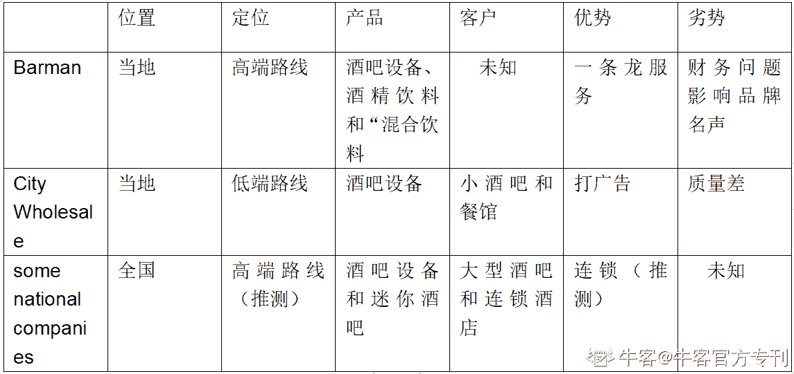
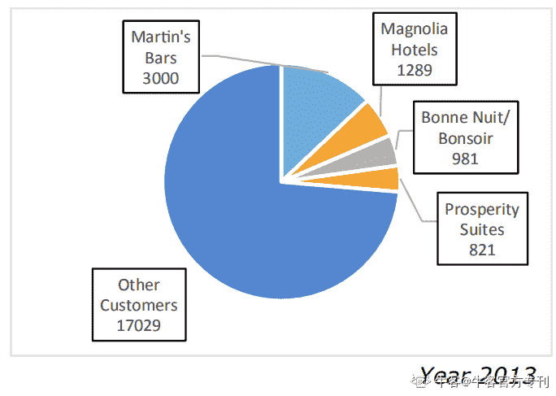
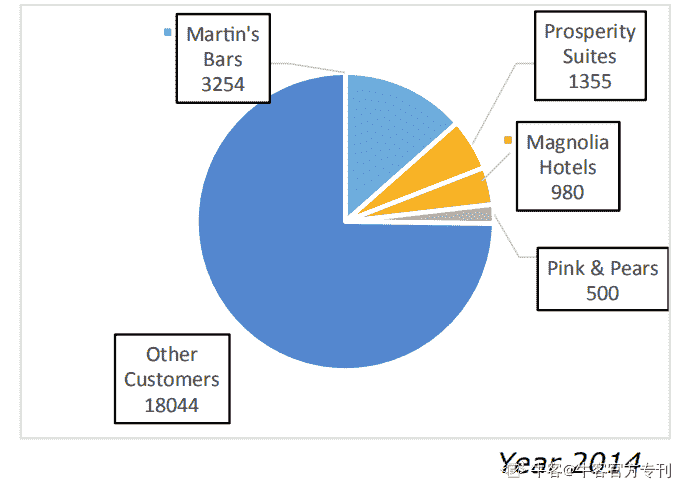
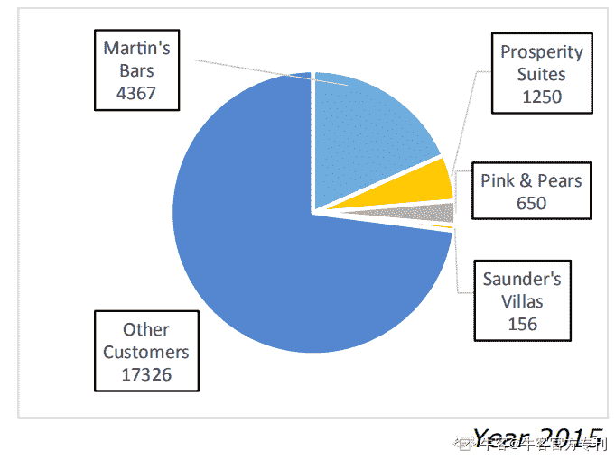

# 第三章 第 5 节 群面 CASE：Shake n’ Stir

> 原文：[`www.nowcoder.com/tutorial/10023/32d99fec80644364bdaabaf90ec0c2d5`](https://www.nowcoder.com/tutorial/10023/32d99fec80644364bdaabaf90ec0c2d5)

**Summary of the current situation**

**Shake n’ Stir**

一家酒吧设备制造商，提供三种服务：Bar equipment，Mini-bars，Installation service。

创始人理念为提供高质量产品和专家建议，推测走高端路线，对客户讨价还价能力强。

比起购买零件更倾向于自己生产，对供应商讨价还价能力强。

由财报可知，Bar Equipment 和 Installation Service Contracts 收入减少，成本增加，Mini-bar / Mini-fridge 与之相反。

想进入全国市场但进展有限，这也不是优先事项。

正致力于进一步增加 mini-bars/ mini-fridges 的销售额。

**市场**

客户：遍布全国但大多数客户是 independent pubs, bars, hotels or small hospitality chains in the local region。总体客户数量减少，Mini-bars 和 Martin's Bars 客户数量增加。

竞争者：

**Key issues and risks**

问题：毛利率下降，盈利能力减弱

风险：受到竞争对手冲击，市场份额减少。

**Recommendations and action plan**

建议：打响品牌知名度增加客户数量，先稳固当地市场再进入全国市场

为什么：①竞争对手并非无懈可击②进入全国市场优先级不高③Shake n’ Stir 在当地经营多年，本土优势大

怎么做：

当地市场：产品：①坚持走高端路线，提供高质量产品和专家服务

价格：一条龙服务/分享品牌给予优惠

渠道：坚持自造零件，减少对供应商尤其是海外供应商的依赖

营销：打广告，提高品牌知名度

财务：减少 Installation Service Contracts 的成本

人事：重金挖角 Barman 的优质人才

国际市场：

①向全国推广 mini-bars/ mini-fridges（以新媒体宣传、分期付款等方式）②以相对于 MCB Bars 的低价销售③客户为小酒吧和餐厅④打造自己的运输渠道

（市场以当地为重，全国为轻；具体行动 75%主要以材料为基础，剩下 25%自由发挥）SHAKE N’ STIRCOMPANY OVERVIEWShake n’ Stir are a bar equipment manufacturer. It was set up in 1986 to provideequipment to restaurants, hotels and high-end bars. It also supports some customerswith the bar installation. The business has grown over the past 30 years. It is basedout of a single location called Morton. Shake n’ Stir wants to enter the internationalmarket, but so far, this has not been a priority and limited progress has been made.BackgroundShake n’ Stir was started by Sarah Johnson, who played a fundamental role in buildingup the business. Her vision was to support customers in fitting out their bars byproviding high quality products and expert advice to meet their needs. She wasfocused on manufacturing in-house as much as possible, rather than buying incomponents. Sarah retired in 2001 and left the business to her children. Since then,business growth has slowed considerably.Shake n’ Stir originally only manufactured basic equipment for bars, starting withglassware. Ten years ago, they expanded their product offering to include mini-barsand mini-fridges, targeting the hotel market in particular. However, this relied onbuying components from other manufacturers, some based overseas. In 2012, Shaken’ Stir decided to reduce its reliance on foreign imports of two particularly importantcomponents, condensers and evaporators since these were proving expensive andunreliable. They began manufacturing these in-house. Whilst this was a considerableinvestment, the last few years have seen sales steadily increasing in this area.Products and ServicesShake n’ Stir offers the following products and services:1) Bar equipment: Manufacturing glassware, cocktail shakers and strainers, icebuckets, blenders, wine coolers, beer taps, soda guns, garnish bins, glass racks,corkscrews, bottle openers, paring knives, cutting boards, glass mats, washing racksand other cleaning products. All of the above are provided to hotels, restaurants, bars,pubs and clubs, nationwide. They can be ordered in bulk, as part of a package for anew bar set-up or sold individually.2) Mini-bars: Producing mini-bars and mini-fridges, manufacturing all parts of thefridges including condensers, evaporators, thermostats and compressors. Installationand some maintenance is included.3) Installation service: Installing bar taps, soda guns and other equipment (asidefrom mini-bars/ mini-fridges.Since developing its manufacturing capabilities for mini-bars/ mini-fridges, Shake n’Stir are focusing on further increasing sales in this area.CustomersShake n’ Stir service customers nationally yet a lot of their business comes fromindependent pubs, bars, hotels or small hospitality chains in the local region. Thefollowing charts provide some statistics from the last three years:Shake n’ Stir Customer Breakdown (by income - figures given in $000s)

