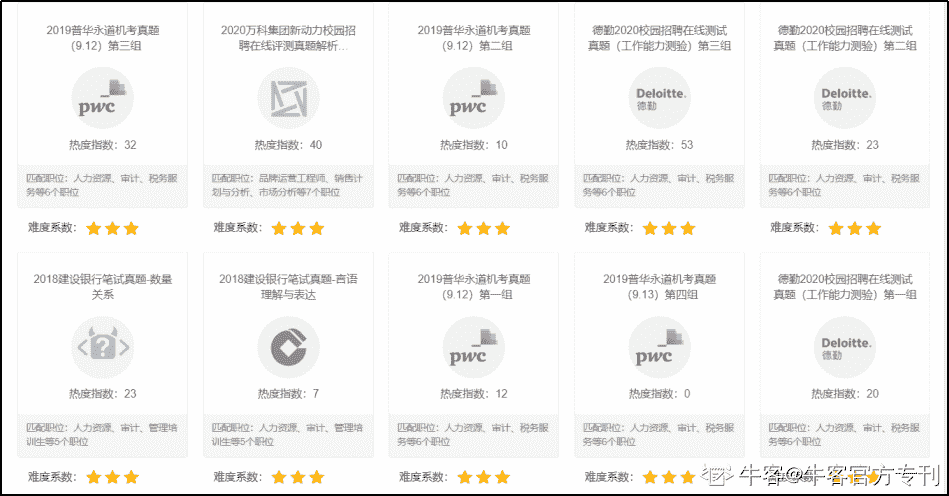
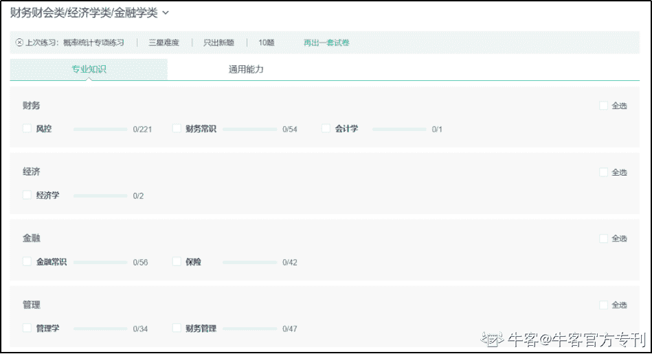

# 第四章 第 1 节 笔试考点

> 原文：[`www.nowcoder.com/tutorial/10023/19980fbc8faf45ceb98dd1f5334dfaf8`](https://www.nowcoder.com/tutorial/10023/19980fbc8faf45ceb98dd1f5334dfaf8)

## **1、企业真题**

包含四大会计师事务所、各大银行等知名地产公司笔试真题原卷（如图 1），题库地址如下：

电脑端：牛客网>题库>公司真题>财务财会类/经济学类/金融学类

网址：[`www.nowcoder.com/contestRoom?categories=4`](https://www.nowcoder.com/contestRoom?categories=4)

手机端：牛客 APP > 公司套题

 

图 1 

## **2、行测题库**

电脑端：牛客网> 题库> 知识点专项练习>财务财会类/经济学类/金融学类（图 2）

手机端：牛客 APP > 专项练习

地址：[`www.nowcoder.com/intelligentTest?categories=5`](https://www.nowcoder.com/intelligentTest?categories=5)

扫描下面二维码下载牛客 APP，题库装口袋，随时随地刷题复习！

