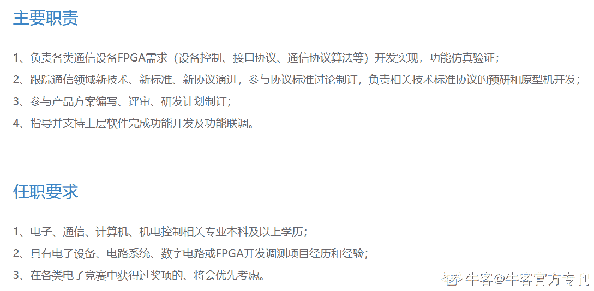
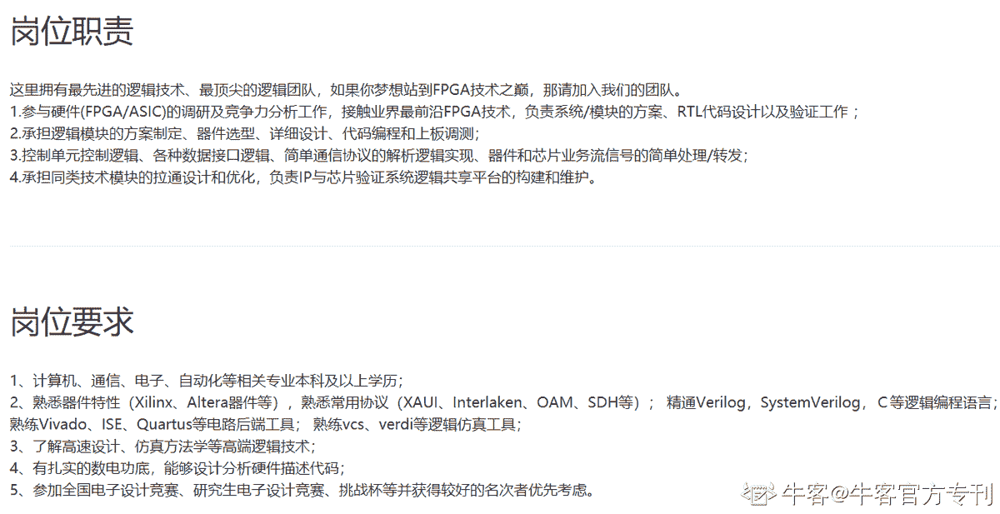
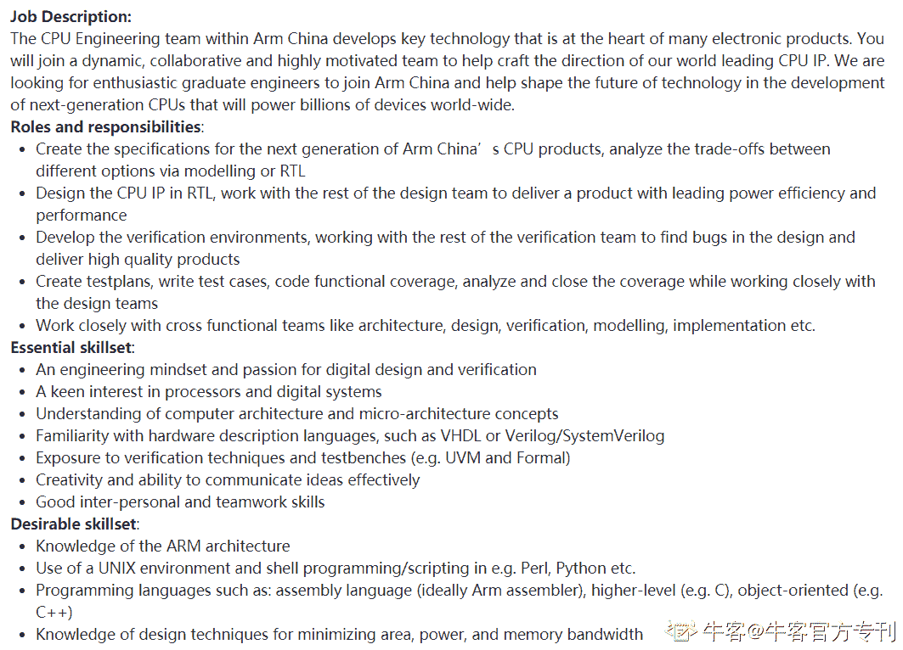

# 第二章 第 1 节 求职规划

> 原文：[`www.nowcoder.com/tutorial/10045/98a1956146604d1780a49fdb7938f10f`](https://www.nowcoder.com/tutorial/10045/98a1956146604d1780a49fdb7938f10f)

# 1\. 了解校招

在我看来，毕业出来的第一份工作会对后续整个职业生涯产生非常大的影响，校招对每一个应届生来说都非常重要。此外，目前许多的大厂和国企的招聘策略会把重心放在校招，应届生在参加这些企业的招聘时会有更大的机会和更多的选择。相应的，以后想以社招的形式再进去这些企业，难度会比校招大得多。因此，我们需要认真对待校招，做好规划和准备，把握好这次机会。

## 

*   校招的时间点

校招从时间上大体可以分为三个批次：提前批、秋招、春招。想要参加校招的话可以留意以下几个时间点：暑期实习的招聘在春节后到 3~4 月；第一批提前批 3~4 月(这一批的规模相对较小)；第二批提前批 6~8 月；正式秋招 7 月份陆陆续续开始；春招是毕业当年的 2~4 月。举个例子来说，如果你是 2021 年毕业，那么相应的岗位在 2020 年的上半年就已经开放招聘通道了，到 2021 年上半年才会结束。可以看到校招的时间跨度接近一年，时间比较长，有些同学可能想着全程参与，有多几次机会，但我个人建议主要还是把精力放到第二批提前批和正式秋招上。这两个批次最密集、机会也最多，在这段时间内集中投入时间去刷题，去做项目经历的准备，性价比最高。需要补充一点的是，对技术岗来说，企业的大部分岗位会在秋招完成招聘，到春招的时候能选择的岗位相对不多。与此同时，春招的时候会有考研失败的同学、海归的同学(学制原因年底才能毕业)、错过秋招的同学与你竞争，所以一般来说能在秋招就能拿到 Offer 的话，不要拖到春招才去找。

## 

*   获取校招的相关信息

在知道校招的时间点之后，就可以按照自己的具体情况来规划自己的校招计划了，而制定校招计划的第一步，当然是要收集校招相关的信息。获取校招相关信息的途径有很多，下面介绍一下主要的几种途径：**宣讲会：**宣讲会是获取企业第一手信息的最好机会，在这里你能保证到获取的信息是最新、最准确的。宣讲会分线下宣讲会和线上宣讲会，线下宣讲会一般会在当地的名校或者名校附近的酒店进行，有兴趣的话去参加同城的宣讲会是不错的选择；线上宣讲会一般采用直播的形式，没有地点的限制，虽然能采取的互动相当有限，但也不失是一种获取信息的好方式。**企业招聘公众号：**企业的招聘公众号同样会发布一些一手的校招信息，虽然可能不会像宣讲会那么系统和详细，但至少能让你了解到基本的信息，不会错过心仪企业的简历投递。**学院通知群：**一般到了招聘季，学院的通知群里多多少少会有一些招聘信息的发布，如果你所在的学院是学科强势的学院，那通知群里可能会出现招聘轰炸的情况。很多时候学院通知群里除了发招聘信息，也会把招聘群聊的二维码也发出来，我建议可以多加一些这种群，一方面会比较容易获得进一步的信息，另一方面也更容易与 HR 建立联系。**牛客网：**到了校招季，在牛客的论坛和圈子里会有很多企业的 HR 发布相关招聘信息，一些牛客网的官方账号，比如牛客校招助手，也会发布一些相关信息。

## 

*   校招的流程

无论是哪一个批次，校招的流程一般是这样的：
**宣讲会：**前面也有提到过，宣讲会是获取企业校招一手信息的好机会，而宣讲会同样是校招开始的信号。当你看到某个企业在开宣讲会的时候，那么该企业的校招要么即将开始，要么已经开始了。**网申：**对于一些大企业来说，网申一般是在它自己的招聘官网上注册账户，填写信息并投递；一些小一点企业则会在第三方上的招聘网上，比如牛客网、猎聘、智联之类的开放简历投递；当然也有部分企业喜欢在宣讲会的时候现场收简历，这可以从招聘公众号发布的消息或者通知群提前去了解。**笔试：**笔试分线上线下，线上笔试系统基本上大同小异，题型也比较接近，但是每个企业都会有自己的题库。客观题和平时做的问卷调查差不多，代码题或者主观题就留一个文本框；线下笔试一般就是给张卷子现场做，和考试差不多。**面试：**面试同样也是分线上线下，但要做的事情是一样的，客观来说线上视频面试给面试者的压力会小一些，这对大家都是一样的，也算不上什么优势。

## 

*   FPGA 岗的基本情况

首先需要说明的是单纯叫 FPGA 开发/设计岗的坑位并不多，而 FPGA 岗和数字 IC 设计岗基本上是相通的(除了一些特殊方向)，因此一般在投递的时候除了 FPGA 岗，也会投递数字 IC 岗。后面说的 FPGA 岗实际上指的是 FPGA/数字 IC 岗。接下来从专业要求、求职难度、薪资待遇、区域分布、主要企业几个方面来介绍 FPGA 岗的基本情况：

### 专业要求

很多电子类的专业会学习 FPGA 的相关课程，也很有可能在后续的项目和比赛中接触 FPGA，因此并不是只有微电子专业和集成电路专业的同学能投递 FPGA 岗，整个电子信息大类甚至计算机的同学都可以投递。如果你的硬件基础扎实，有相关项目和比赛经历，即使不是电子信息类专业也可以尝试。下面贴几个 FPGA 岗/数字 IC 岗的岗位描述，可以看到基本要求都是一样的，不过可能不同的企业会有不同的侧重点，比如说中兴的 FPGA 岗会对接口方面的要求比较高（中兴有另外的数字 IC 岗），ARM 的硬件工程师岗-CPU 方向会对计算机结构、CPU 结构之类的要求比较高：
**中兴：****** **华为：****** **ARM：**

### 求职难度

FPGA 岗的求职难度中等，具体来说程阶梯式分布：想去一线大厂、独角兽、外企会有一定的难度；去二线大厂、中型企业难度一般；去各种子公司、小企业相对简单。当然这也不是绝对的，一方面，去一线大厂的难度是波动的，主要看当年的效益；另一方面，也有一些小企业和子公司对应聘者要求很高，但这种情况薪酬可能会开到比较高。

### 薪资待遇

下面是华为在 2021 届校招中给硬件工程师开的定级和薪资，，某种程度上能够代表目前国内大厂 FPGA 岗的薪资水平：

|  | 定级 | 总包 |
| SSP | 15a/15a+ | 40w+ |
| SP | 15b | 38W |
| 15c | 35W |
| 白菜 | 14a | 30~32W |
| 14b | 27~29W |

针对上表，需要说明的有两点：

1.  上表的薪资是以二线城市的薪资为基准，如果是一线城市，月薪可能会再高 1~2k，总包能多 1~3W 左右；
2.  这是以华为为代表的一线大厂的薪资水平，并不意味着二线大厂或者中小型企业也能开到这水平。

薪资可以说比上不足比下有余，比不上计算机、金融，但和其他工科比还是相当不错的，应届硕士差一点的一般也有 20~25W，好一点的能到 28~36W，但要再往上走到 40W 基本上就是 SSP 了，相当于华为 15a 的水平，我有认识的同学拿到海思 15b 的定级，但 15a 的好像没听说。另外华为为了和一线互联网大厂抢人才，更倾向于给软开和算法的同学开 15 级，所以在牛客网上经常能看到“华为的 14 级不值得去”这样的言论，因为对计算机的同学来说 15 级才是白菜价，而对于我们这些做硬件的人来说，14 级也算是不错的 Offer 了。当然具体薪资能拿到多少，主要还是看招聘中的评级，而评级一方面和个人在笔试、面试中的表现有关；另一方面也和成果、学校出身有关，据我的了解，华为开给 Top2 学生的 Offer 都是 15 级起步(FPGA 岗)。大家在和 HR 谈薪的时候一方面要打听一下当年的市场价，另一方面也掂量掂量自己。

### 区域分布

区域分布上来说，主要集中在一线城市，其中上海机会最多，其次深圳，北京和广州也有但是不多，在其他地方比如珠海、南京、武汉、东莞等也会零零星星有一些机会，在投递的时候要注意你的目标城市里有没有对应的岗位。比如说 OPPO 的总部虽然在东莞，但在东莞是没有芯片设计岗的，要去 OPPO 的芯片岗得去上海或者成都。

### 主要企业

那么有哪些企业会招 FPGA 岗呢？按照我个人的标准来分，有以下这几种（排名不分先后）：一线大厂，比如华为、大疆、OPPO；外企，比如 Nvidia、ArmChina；独角兽，像是寒武纪、商汤；二线大厂(PS 分一线二线主要是待遇不同)和中型企业，比如中兴、海康、汇顶、全志；小企业和子公司，比如慧智微、紫光同创、紫光展锐。上面只是一个分类上的参考，而且并不是说大厂就会更好：如果单论芯片设计这方面，可能汇顶和全志涉及到的方面会比华为大疆这些要广；论薪资，展锐的 SSP 开得可能比华为高(还没算上那 12%的公积金)。

### 生涯规划

一般来说，大厂的起薪高，涨薪快，工作强度高；外企起薪高，涨薪较慢，工作强度低；中小厂起薪一般，涨薪较慢，工作强度一般。虽然这样看来中小厂的吸引力比较低，但中小厂有一个好处，就是内部竞争较小，同样的水平、同样的付出，可能在中小型企业你会升得更快，而且对于没有上市的公司，万一哪天上市了，财务自由不是梦。当然具体去哪里，一方面要看你拿到哪里的 Offer，另一方面也要看你自己的职业生涯规划。有人在大厂泡了几年镀金，跳槽去小厂当骨干；也有人在小厂做出了成绩，被大厂高薪挖走做技术专家。对于硬件工程师来说，只要技术过硬，总是不怕找不到下家的 。