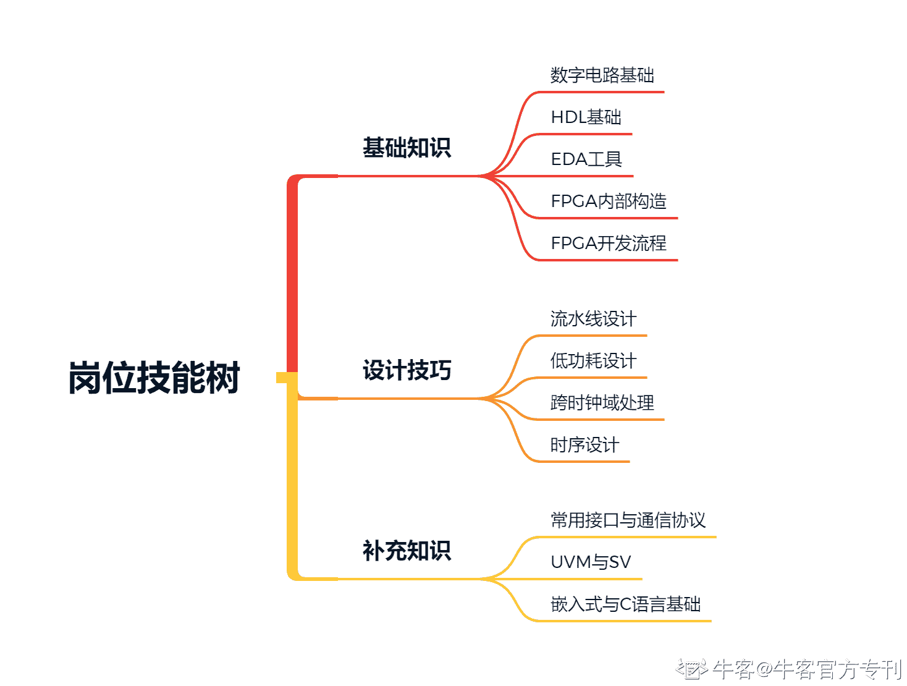
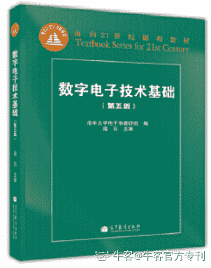
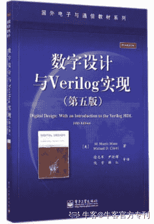
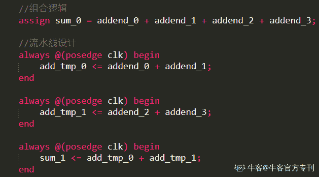
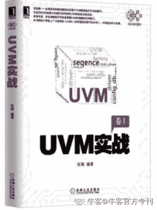

# 第二章 第 3 节 校招中的学习规划

> 原文：[`www.nowcoder.com/tutorial/10045/8bb42cd997c6496d9e3d358784f5b6be`](https://www.nowcoder.com/tutorial/10045/8bb42cd997c6496d9e3d358784f5b6be)

# 1 校招岗位技能树

上面的就是 FPGA 校招岗位的技能树，熟练掌握以上技能，一般来说拿个方向对口的大厂白菜 offer 还是不难的。不过要想拿 SP 和 SSP，除了这些基础之外，还得看项目、面试表现以及学校出身了。具体每个技能需要掌握到什么程度，会放到第三章来讲。

# **2\. 学习资源推荐**

## 2.1 基础知识

### 数字电路基础

《数字电子技术基础》清华大学出版社，这本书的中的前面六章可以算是基础中的基础，必须全部掌握，建议选一下课后习题做一做。第八章第七节和第九章可以了解一下，其他的内容可以如果是和项目有关或者个人感兴趣的，也可以研究一下。

### HDL 基础

由于当年上课我们用的是英文教材，效果不是很好，就不推荐我自己用的教材了。现在用得比较多的好像是《数字逻辑与 verilog 程序设计》，但我自己没有完整看过，所以也不好做太多评价。看通过看书学习了最基本的语法之后，可以跟着书里的例子，或者说找些样例（要找例子的话无论是组合逻辑电路还是时序逻辑电路，上面的数电书里一大堆）自己用 verilog 写出来，如果编译不通过就按照报错信息搜一下是哪里出错了。HDL 的语法基础和一些注意事项，个人觉得还是边写边学会比较好，遇到问题了就搜一下，慢慢就会了。

### EDA 工具

目前主流的 FPGA 主要是 XILINX 和 ALTERA 这两家，前者可能要被 AMD 收购，后者已经被 Intel 收购，不过名气已经打响了，应该也不会改名。XILINX 的 FPGA 设计工具主要是 Vivado，ALTERA 的 FPGA 设计工具主要是 Quartus。关于 EDA 工具的入门，最好的教程实际上就是的官方教程，在官网上能找得到 pdf，不过可能比较长，而且很多是英文的，估计很多人不愿意看，那么退而求其次，可以多翻翻前辈们写的博客。[Vivado：](https://www.jianshu.com/p/b76a42dce9ce)[Quartus：](https://blog.csdn.net/botao_li/article/details/84312917)

### FPGA 内部构造

FPGA 的内部构造总体上是差不多的(可编辑逻辑模块、IO 模块等等)，但不同的品牌、甚至同一品牌不同系列的 FPGA 内部具体的构成是不一致的，下面这只是举个例子：[XILINX：](https://china.xilinx.com/support/documentation/product-briefs/virtex7-product-brief.pdf)[ALTERA：](https://www.intel.cn/content/www/cn/zh/programmable/products/fpga/features/stxiv-alm-architecture.html)看这些介绍结构的文档的时候，可以先好好看一下框图，对整体结构有一个大概的认知，再去仔细看每一个模块是做什么的。

### FPGA 开发流程

与前面的 EDA 工具的使用不同，这里说的是偏概括、偏宏观的流程。根据使用的 EDA 工具不同，可能一些操作、设置、界面会有所不同，但整个 FPGA 开发流程，或者说整个数字 IC 前端设计的流程是一样的。下面这篇博客介绍了 FPGA 的开发流程，文章不长，主要是要对整个流程有一个完整的印象。[《典型 FPGA 设计开发流程》](http://www.elecfans.com/pld/673005.html)

## 2.2 设计技巧

### 流水线设计

这篇博客介绍了流水线的概念和特点，并且给了一个流水线加法器的代码作为代码：[《FPGA 中的流水线设计（Pipeline Design）》](https://blog.csdn.net/yc16032399/article/details/100833296)这篇博客的解释比较简单易懂，但加法器的代码的样例感觉不太好让人理解，我这里给大家一个简单的流水线设计的例子：
上图同样是组合逻辑加法器和流水线加法器的代码例子，sum_0 是直接通过组合逻辑得到的，而 sum_1 则是通过两级的流水线之后才得到结果。流水线了 add_tmp_0、add_tmp_1 和 sum_1 三个寄存器，并且还引入了两个时钟周期的数据延时。看起来流水线的引入不仅增加了资源的消耗，还带来了数据的延时，但事实是在硬件设计时，很多时候一个时钟周期内组合逻辑算不完，在没算完的情况下迎来下一个时钟的上升沿就会引入亚稳态。为了避免一个时钟周期内完不成任务所带来的错误，我们才会引入流水线。

### 低功耗设计

在这一部分我贴两篇博客给大家学习，其中第一篇博客中介绍功耗的类型的部分比较重要，只有理解了 IC 中的功耗的主要来源，才能够针对性地提出低功耗设计的方法。[《低功耗设计入门（一）——低功耗设计目的与功耗的类型》](https://www.cnblogs.com/IClearner/p/6893645.html)第二篇博客则是笼统地介绍了主流的低功耗设计方法有哪一些，当然需要理解第一篇博客中关于功耗类型的分析，才能真正搞明白第二篇博客中介绍的低功耗设计方法是如何运作的。[《低功耗 FPGA 设计技术》](https://blog.csdn.net/weixin_42602247/article/details/105619418)注意到第一篇博客的标题包含了一个（一），这是一个系列，你可以在博主的空间里找到后续的文章。由于后续文章讲得会比较深，这里留给对低功耗设计有兴趣的同学去研究。

### 跨时钟域处理

要学习跨时钟域的处理方法，首先要理解什么叫做跨时钟域。下面这两篇博客介绍了跨时钟域处理的基本概念和跨时钟域所带来的问题。[《一 CDC 的基本概念》](http://blog.sina.com.cn/s/blog_72c14a3d0101de82.html)[《二 跨时钟域设计的潜在问题》](http://blog.sina.com.cn/s/blog_72c14a3d0101fj3z.html)第三篇博客则介绍了最常见的三种跨时钟域处理的具体方法[《揭秘“跨时钟域处理”的三大方法》](http://dengkanwen.com/238.html)

### 时序设计

时序设计这里我可以提供一个 PPT，这个是一个师兄自己做的，做得非常用心。这个 PPT 从时序分析的概念，到基本模型，再到分析工具都有完整介绍，在部分页面的备注里还有补充说明，认真学习这个 PPT 会对你有很大的帮助。链接：[`pan.baidu.com/s/10QTOlLM4zwm8QQQXSZKsuA`](https://pan.baidu.com/s/10QTOlLM4zwm8QQQXSZKsuA) 
提取码：tafd 

## 2.3 补充知识

### 常用接口与通信协议

常用接口与通信协议真的非常多，这里不一一列举，同学们根据自己实际会接触到的接口和协议去搜一下吧，应该都能搜到相应的博客。以最常见的串口为例，下面第一篇博客介绍了串口通信的概念、数据格式、通讯方式等等，当你明白了串口通信的工作方式，第二篇博客则介绍了如何用 verilog 来接收和发送串口信号。当你学习其他的接口和协议时过程也是一样的，先弄清楚接口和协议本身的工作方式，再考虑 verilog 的实现方式。

### UVM 与 SV

要学习 UVM 以及 SV，可能用得最多的就是张强写的《UVM 实战》。实际上 UVM 和 SV 涉及的内容相当多，而验证并非 FPGA 岗的本职，更多只是先了解一下，有个概念。因此我建议先把第一章给看完，如果可以的话，跟着第二章把一个简单的 UVM 验证平台给搭起来（书里带有各个部分所需的代码，不需要你写 system verilog）。

### 嵌入式与 C 语言基础

嵌入式主要是考虑到现在越来越多的 FPGA 自带 SoC，就算没有 SoC 很多时候在系统里也会用到 MCU。在嵌入式开发的过程中使用得最多的还是 C 语言，因此 C 语言的基础还是相当重要的。C 语言基础的学习个人认为用谭浩强的教材都没有问题，虽然饱受诟病，但我认为打基础的话并没有多大的问题。此外，C 语言与嵌入式开发中用到的 C 语言还是稍微有点区别的：[《C 和嵌入式 C 有什么区别》](https://blog.csdn.net/cumubi7453/article/details/107796816)这部分终究还是补充知识，如果项目中用到了，最好把涉及到嵌入式的部分给弄清楚，这需要你对照这原理图和引脚约束把代码弄明白；如果没有用到，那就简单了解一下相关的知识，有一个简单的概念即可。