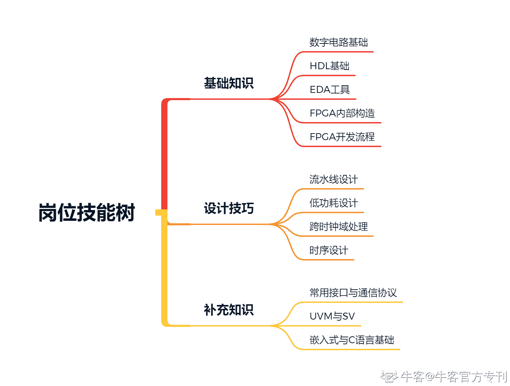

# 第三章 第 1 节 岗位技能树详解

> 原文：[`www.nowcoder.com/tutorial/10045/c08a96da04014a72ad9505fca97dc4a1`](https://www.nowcoder.com/tutorial/10045/c08a96da04014a72ad9505fca97dc4a1)

# 1.  专业技能准备与提升

我把 FPGA 岗会用到的知识和技能大体上分成了三类：基础知识、设计技巧、补充知识，在专业技能准备与提升的过程中应当按着：基础知识>设计技巧>补充知识的优先度来准备。

## 1.1 基础知识：

一方面，基础知识是做好 FPGA 岗的保障；另一方面，也是 FPGA 岗笔试和面试中经常会考察的点。基础扎实，不仅能让你在笔试中拿到高分，也会让你在技术面中获得较高的印象分。下面简单说说各项的具体要求：

### 数字电路基础

要做数字电路设计，最重要的是把组合逻辑电路和时序逻辑电路给搞清楚，还有一些基础的技能如：逻辑化简、卡诺图化简、状态机设计、逻辑门的使用、电路分析。前面三个很好理解，这里稍微说一下后面两个：逻辑门的使用，举个简单的例子来说：用与非门搭一个 D 触发器。电路分析，最常见的是给你一个电路图和输入端的信号波形，让你画出输出波形。这些基础技能难度虽然不高，但由于是笔试中的必考题，建议可以多拿教材中的课后习题，或者网上找的题目来练练手，保证解题的速度以及正确率。

### HDL 基础

FPGA 岗的工作内容本质上也是写代码，因此需要懂基础的语法，有较好的代码风格，知道哪些语句能综合，哪些不能综合。除了在设计过程中涉及到的 hdl 语法，有一些会用在 Testbench 里的代码也必须搞懂，比如说用于初始化的语句 initial，又或者说用于读取外部数据的系统函数$readmemb。最常用的 hdl 语言有两个：vhdl 和 verilog hdl。这两个之中会一个就行，现在的用得比较多的是 verilog hdl，有时候笔试题需要看代码，所以平时用 vhdl 的同学至少要能看懂 verilog hdl，当然掌握其中一种，简单了解另一种是最好的。在笔试和面试的过程中都会有手撕代码的情况，后者由于需要当场写出来给面试官看，难度会比较低，主要就是看有没有基本的语法错误和代码风格。hdl 中会有许多需要掌握的基本规则，比如说“两个 always 模块中不能对同一个变量赋值”，对这些规则的掌握，应该是基于对 hdl 本身的理解，而不是像背政治一样死记硬背。需要意识到 hdl 本质上是对电路的描述，如果允许在两个不同的 always 块中对同一个变量赋值，那么就可能出现同一个时刻两个不同的电信号到达同一个输入端这种不该出现的情况。只有理解 hdl 的实质，才能理解它的设计规则，掌握它的设计技巧。

### EDA 工具

由于做 FPGA 开发肯定离不开 EDA 工具，用 Xilinx 的 FPGA 则会用到 Vivado，用 Altera 的 FPGA 则会用到 Quartus。如果有真正参与 FPGA 开发，自然会对至少一种 EDA 工具比较熟悉，这种熟悉体现在对流程和功能的熟悉。需要在开发流程与 EDA 工具之间建立一个具体的映射，以 Quartus 为例，如果你要做引脚约束，那你应该知道用的是 Pin Planner，如果你要做时序约束，那你应该知道用 TimeQuest Timing Analyzer。比如说面试官问你上板调试的时候怎么看内部寄存器的结果，用 Quartus 的会说用 Signaltab，用 Vivado 的会说用 ILA，如果你说看那个 LED 灯闪不闪，面试官会怀疑这个人没有真的用 FPGA 做过东西。

### FPGA 内部构造

如果你多看几个 FPGA 岗的岗位职责，你会发现除了承担开发的任务以外，很多时候还需要参与 FPGA 的选型。只有熟悉 FPGA 的内部构造的人，才能够胜任选型的工作，这个熟悉具体来说，可以分为两个方面：一是指熟悉各类型号 FPGA 的具体参数，比如说最大时钟速率、逻辑单元数量、DSP 单元数、Bram 块的数量等等；二是指熟悉 FPGA 从顶层到底层的构造，这意味着你对 FPGA 的工作原理和资源消耗理解比较深刻。当然，考虑到在校学生一般也不会去把市面上的 FPGA 都了解一遍，因此在这里只需要熟悉自己用的 FPGA 的内部构造就可以了。记住自己用的 FPGA 的具体型号和可用资源是一个基本要求，如果面试官问起你用的 FPGA 型号是什么而你答不上来，那基本上就可以说再见了。很多面试官喜欢问资源消耗相关的问题，比如用了多少个 LE，占总资源的多少，也可能会顺藤摸瓜问资源消耗的意义。在面试中有面试官问我 Stratix 系列 FPGA 中的 LUT 是几输入的，回答上来后面试官点点头说“还是有了解的嘛，基础不错。”，整个技术面顿时轻松了起来。

### FPGA 开发流程

虽然在前面有提到，熟悉了 EDA 工具自然会对开发流程更熟悉，这里说的开发流程指的一种更宏观的流程，不是说哪一步要在 EDA 里按哪个选项。熟悉 FPGA 的开发流程，就是要弄清楚 FPGA 开发中每一步做的都是什么，为什么要这样做。

## 1.2 设计技巧：

设计技巧是在写 verilog hdl 代码中会用到的技能，设计技巧的掌握程度既代表了你对 FPGA 开发的熟悉程度，也代表了你对数字电路的理解深度。技能树中列出来的几种设计技巧经常会在笔试中考察，因此掌握这些技巧非常重要。

### 流水线设计

流水线设计可以说是时序电路设计中的基础，一方面，需要搞清楚流水线是怎么设计的（往组合逻辑中插寄存器）；另一方面，需要弄清楚流水线设计的意义是什么（面积换性能）。

### 低功耗设计

虽然可能大部分的同学在做自己的 FPGA 项目时，没有考虑低功耗设计的问题，但企业非常喜欢考察这方面的知识（特别是数字 IC 岗）。学习低功耗设计方面的知识之前，首先需要将集成电路中的主要功耗来源给弄清楚：**动态功耗**，主要是由于信号的翻转从而导致器件内部的寄生 RC 充放电引起的；**静态功耗**，则是由器件在通电状态下的泄漏电流引起的；针对这两种不同的功耗来源，分别会有不同的设计方法来对其进行遏制，在学习低功耗设计方法的时候，在脑中最好建立一个物理图像，这样才能记得快，记得牢。举例来说，Clock Gating，是关掉不需要的部分的时钟，减少翻转次数，降低的是动态功耗；使用 HVT 库进行设计，即选用阈值电压比较高的管子进行设计，可以降低泄露电流，降低的是静态功耗。在一些笔试题，特别是客观题中，经常会列出好几种低功耗设计的方法，然后让你选哪一种是降低静态（动态）功耗。

### 跨时钟域处理

由于 FPGA 很多时候会作为数据采集端、转换端，因此如何处理跨时钟域的数据是非常实用、也是企业非常重视的技巧。要掌握跨时钟域处理，首先你要能回答这几个问题：什么叫跨时钟域？跨时钟域传输带来的问题是什么？什么是亚稳态？亚稳态带来的问题是什么？理解了跨时钟域处理的必要性之后，学习跨时钟域处理方***相对简单一些。此外，对这部分知识的考察，主要还是以主观题和概念题的形式出现（比如说列举跨时钟域处理的方法并分析其优缺点），因此在理解的前提下尽可能地掌握更多的跨时钟域处理方法是很有必要的。

### 时序设计

对时序设计的掌握可以分为以下几个阶段：一、明白什么叫做时序约束，为什么要对时序进行约束；二、掌握时序分析的基本模型，能够根据给定的保持时间、建立时间和工作频率，分析电路是否满足时序要求；三、能够使用 EDA 中的工具对代码进行分析，看懂时序分析报告；四、能够根据时序分析报告对代码进行修改，使得其能够满足时序要求。以上四个阶段，我们都需要掌握，其中对前面两个阶段的考察主要出现在技术笔试中，会考察概念，也会给出电路让你分析其是否满足时序要求；后面两种可能会在面试中被面试官问到，会让你说明分析时序和修改代码的过程。**这部分的内容可以说是高频考点**，基本每家企业都会在笔试或者面试中考察。如果想对时序设计有更深的了解，建议结合流水线设计一起看。

## 1.3 补充知识

这一部分主要是一些补充的内容，有一些企业可能也会把这里的内容写到招聘要求里面，掌握了更好，没有掌握关系其实也不大。如果补充知识中的内容和你的项目直接相关，那么我还是建议你去多学习，即使那可能不在你的职责范围内。被面试官问起来的时候，比起直接说“这个部分不是我负责的”，稍微解释和说明一下会显得你学习能力和学习欲望比较强。此外补充知识不局限于这几条，可以针对自己的具体方向去再补充些知识，比如说做通信算法的同学，至少要把 Matlab 玩得比较溜，最好能弄一个 Matlab 和 Modelsim 联合仿真。

### 常用接口与通信协议

这对做接口方向的同学来说是必修的知识，对其他的方向同学来说，在未来的工作中或多或少也还是会接触。对于 FPGA 岗来说，“掌握接口和协议”包含了两个层面：一是在软件、通信的层面理解这种协议的工作方式，包括其数据格式、数据速率、工作模式（单工、半双工、全双工？）等等；二是在 FPGA 的层面上理解，即如何在理解其工作方式的基础上，去用 hdl 写一个接收这种格式的数据的模块。一般来说接口相关的问题，很多时候是面试官了解了你的项目后再问的，问的也不会很深。笔试题很少会考到，可能会在客观题考一些概念，没有见过在代码题考协议相关的内容。这部分内容以了解为主。

### UVM 和 SV

只用过 FPGA 的同学可能听过这两个词，但不知道具体是干什么的。UVM 是一种验证方法学，而 SV 则是 System Verilog，它与 verilog 的关系有点像 C++和 C 的关系。UVM 和 SV 主要是做数字验证的同学去学，但我们也可以简单了解一下，对这两个词有一个大概的概念即可。可能有同学会不理解为什么我做设计要去管验证的事情，实际上数字 IC 前端中设计与验证的关系非常紧密，有的面试官也会问有没有听过 UVM 和 SV，虽然不懂也没关系（因为这确实不属于 FPGA 岗范畴的知识），但要是有些基本的了解是一个小小的加分项。

### 嵌入式与 C 语言基础

虽说一般来说 FPGA 岗的笔试和面试中不会直接考察这两方面的内容，但由于目前 MCU+FPGA 或者 SoC+FPGA 是非常常见的配置，所以有一点嵌入式的知识和会点 C 语言是非常有帮助的。同样的，一般来说不会一上来就考察这方面的内容，毕竟不是所有做 FPGA 的学生都接触过嵌入式。但如果面试官了解到你的项目中涉及到了这方面的内容，那么他/她可能会问一些相关的问题。嵌入式是一个很广泛的概念，这里我说的嵌入式主要还是围绕 FPGA 来：SoC 与 FPGA 的通信方式、SoC 与 FPGA 的分工等等。对 C 语言的掌握同样围绕着硬件来，因此对 C 语言的要求也没有多高，主要是掌握一些嵌入式 C 中的常用函数的使用，比如说 delay_ms()。