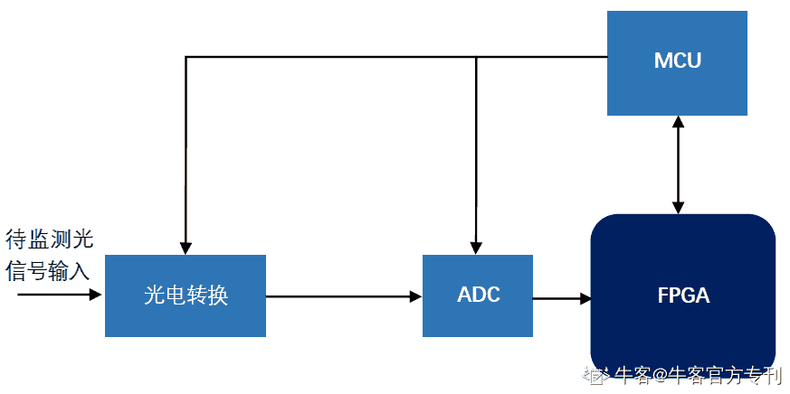

# 第三章 第 2 节 项目经历准备与提升

> 原文：[`www.nowcoder.com/tutorial/10045/b1f5243fe0d545e0ba81a6d208637da0`](https://www.nowcoder.com/tutorial/10045/b1f5243fe0d545e0ba81a6d208637da0)

项目经历可以说是技术面试中最重要的一点，没有之一，大部分的技术面试中，在你做完自我介绍后面试官就会开始问项目相关的问题。一般来说，技术面的面试官会由资深的工程师来担任，因此在简历中的项目宁缺毋滥，放五个比较水的项目上去效果还不如放一个有真材实料的、你很熟悉的项目。当然如果你觉得项目经历只放了一个太寒碜也可以再加一个凑数的项目上去，一般由于时间关系面试官只会揪着那个对口的、难度较大的项目去问你。

# 

*   什么样的项目适合用来求职

第一种是有工程价值、工程应用的项目，这可能是大创的项目，也可能是导师的项目，但不管项目来源是什么，最重要的是在这种项目中 FPGA 是系统中的一个部分，会接收来自系统的真实、实时的数据，也会把数据反馈到系统中或是终端上。FPGA 是数据的采集端、数据的处理端，也是数据的发送端、设备的控制端，只有把它放到一个真正的系统中才能完整地体现它的价值。很多学校的电子类专业会开设 verilog 的课程，在这些课程上往往会有一些课程设计要做，其中最经典的莫过于一个五级流水线 CPU 的设计。这些课程项目看着高大上，但往往都只是在板子上稍微跑一下，没有输入，也没有输出，它的水分无论是你、我还是面试官都很清楚，因此我不建议把这些课程设计放到你的项目经历里面。第二种则是在含金量较高的比赛中获得好名次的项目，因为这种项目已经得到一些专家的认可了。举个例子来说，如果你之前参加全国大学生集成电路创新创业大赛，拿到了总决赛二等奖以上，那么你做的东西可以好好地在项目经历上写一下。至于还有哪些 FPGA 相关的高含金量比赛，我建议你可以找找学院保研条例中那些加分比较多的比赛。

# 

*   关于参加项目的一点建议

我们都知道相关的项目经历在求职时是一个很大的加分项，但可能有些同学不太清楚该什么时候去参加什么样的项目，我这里也谈谈自己的看法。

## 对本科生的建议

如果你是本科生，想要本科毕业就找相关工作，难度会很大，这更需要你的项目经历来支撑起你的简历。一般来说工科学生在大二和大三（特别是大三）会变得比较忙，我建议有这方面想法的同学在大二升大三的暑假就可以参加到比赛和项目中去。这个时候你已经有了一定的基础知识，也不算特别忙，可以主动去联系导师，参加大创和双创比赛之类的。对于参加双创比赛的同学，选题是选择题，相对比较确定；对于参加大创，选题更多地是填空题，要和老师提前沟通自己想做的东西，不然到时候做的都是和自己求职无关的事情，事倍功半。需要补充一点的是，由于大部分老师会把精力放到自己带的研究生身上，对本科生的项目、科研更多的是一种放养的状态，如果你真的想做出点名堂，就要多鞭策自己，多点主动联系导师。但换个角度看，由于本科生与导师的联系不是那么紧密，如果想要换方向、换项目，直接换一个导师也没什么问题。

## 对研究生的建议

如果你是研究生，最好一开始就和老师讨论和确定自己的方向，如果想参加什么比赛，也要在一开始和老师沟通好。大部分工科的实验室或多或少都会承包一些项目，一旦你进了项目组，很多事情就要按着既定的计划去推进，这个时候如果你突然要换方向，或者临时要参加什么比赛，对老师和学生双方都是一个折磨。理想情况下，你在研究生期间做的东西、跟的项目都是 FPGA 相关的，那即使你没有竞赛奖项或者实习经历，只要你把项目做好，对项目比较熟悉，找 FPGA 岗的工作还是相对简单的。另一种情况，就是你研究生期间做的东西和 FPGA 或者数字 IC 无关，但你又想找这方面的工作，那最好就是和自己的导师沟通好（一般来说就业形势不太好的课题组，学生们总是会找各种办法来提高自己的竞争力，导师大部分时候都会默许这种行为），比如说一年之内把项目的要求达到，然后为自己争取几个月的学习时间。这段时间你可以打打基础、刷刷题，如果可以的话最好去找个相关的实习，但不建议去参加比赛。一方面，竞赛会对研究生的要求更高，对跨行的同学来说难度太大；另一方面，竞赛很多时候拼的是实验室的技术积累，但对跨行的同学来说，课题组并不能提供什么帮助。总的来说，一旦确定自己想要找 FPGA 相关的岗位，那么最好做好规划，尽早行动起来。

## 如果你是临时冲刺

我能理解由于各种各样的原因，会有部分同学到找工作的时候才开始准备学习相关知识和准备项目，因此接下来我会给这些同学一点建议。首先我是非常不建议找 FPGA 岗的时候才临时准备项目的，硬件和软件不同，不是在电脑上跑一跑就可以了，需要实际上板测试。在编写和调试 verilog hdl 的过程中，有许多坑你不自己踩一遍是不会成长的，因此硬件的学习周期会比软件要长一些。如果硬件基础知识和项目都是“速成”的，面试官是能够一眼就看出来，所以话说丑话在前头，这种情况下你可能需要降低你的求职预期。前面也说过，硬件的学习离不开上板，因此如果是要用来求职的项目，至少要在板子上面跑过。我的建议是可以买一块 ZYQN 板，这种开发板上除了 Xilinx 的 FPGA，有着非常丰富的接口：URAT、LPC、OTG、HDMI、音频口等等，也有着一些如 OLED、DDR3 等常用模块，虽然是入门级的板子，但能做的事情还是很多。最重要的是这种开发板的资料特别多，在 ZYNQ 板的官方资料中，包括了数据手册、用户手册以及一些例程，其中例程中既有说明流程的文档，也有每一步用到的源码，新手能够一步一步跟着去把例程实现出来。把例程都理解并实现一遍，基本上就算是入门了，也能在简历上稍微写写。除了官方教程，你在百度上一搜“ZYNQ 项目”就能搜到一些用 ZYNQ 板做的项目，最多的就是图像处理和音频处理，可以跟着做一下。如果你是自己买的 ZYNQ 板，还可以向商家索要教程和样例，他们一般也会有很多这些东西。总的来说，对于临时准备项目的同学，围绕 ZYNQ 板可以做一些小项目然后写到简历上。不过不要光顾着做小项目而忽视掉基础知识的学习，在我看来缺少基础知识会比缺少项目经历更致命。

# 

*   项目经历分享

由于之后需要以我自己的项目作为例子，在讲解如何准备和提升之前，我先抛砖引玉，分享一下自己做的项目。由于导师不放实习，我主要的项目经历，就是研究生期间的一个用 FPGA 做光信号处理的项目，通过相干接收机把光纤中的光信号转化成电信号，再用高速 ADC 采集电信号，传给 FPGA 进行数字信号处理，计算出一些结果，最终传回上位机，大概的框图如下所示：
这是一个简化版的框图，因为涉及到项目，有一些细节没有具体展示，FPGA、MCU 以及上位机（未标出）的工作我都有参加，其中 FPGA 与 MCU 部分主要由我来负责，整个系统从功能上可以分成两个部分：高速数据采集部分和数字信号处理部分。

### 高速数据采集部分

ADC 的采样率为 2GSa/s，使用的是 LVDS 接口，由于 FPGA 的最大时钟频率达不到 2G，借助 LVDS_RX 这个 IP 核进行数据解串以及数据降速。高速数据处理的部分会涉及到一些异步处理，对时序的要求也比较高。在项目中使用的 ADC 是多通道采样的 ADC，即通过多个相位错开的通道对同一个信号进行采样，从而达到高速采样的效果，许多高速 ADC 都会有这样的结构。这种结构的 ADC 在进行采样的时候，若通道之间相位同步没有保持严格的关系(比如说双通道采样，则两个通道之间的相位需要相差 pi)，那么采集回来的信号会失真。因此在高速数据采集部分，需要对 ADC 进行校准，这部分需要 FPGA 将降速并且重新编排好的数据传到 MCU，MCU 计算通道之间的相位差，再根据计算结果通过 SPI 总线对 ADC 内部的寄存器进行操作，进而调整通道之间的相位。这部分的工作主要是在 MCU 上，还需要涉及到 MCU 与 FPGA、MCU 与 ADC 之间的接口问题。

### 数字信号处理部分

在项目中，我需要将光信号处理算法在 FPGA 上实现，而光信号处理算法本身是已经现成的。由于我缺少光学和通信方向的知识，在项目的前期我一边看文献，一边看 matlab 代码，尝试理解每一步计算的意义。在理解到一定程度后，我开始对一些不适合在 FPGA 上计算的步骤进行等效、拆解、还有近似，最后自己重新用 matlab 把算法写了一遍，中间的每一步都是能在 FPGA 上直接实现，在 matlab 上的计算结果没有问题后，才开始进行 hdl 代码的设计。由于涉及到具体的项目，我这里不具体介绍光信号处理算法，但实际上涉及到的运算与数字信号处理相差不大，同样涉及到 FFT、IFFT、FIR 滤波、求模、互相关、频移等常用数字信号处理步骤。除此之外，由于光的物理特性，也会涉及到一些矩阵运算。

# 

*   项目经历的准备与提升

下面我以自己的项目为例子，讲一下我是怎么准备和提升项目经历的。

## 项目经历的准备

这个项目涉及到一个系统，涵盖的点也比较多，前面的技能树中除了低功耗设计和 UVM 与 SV 其他都有涉及。如果只是一个个细节地扣，数量较多而且比较零散，为了让自己的准备更加系统，我选择自上而下地重新审视整个项目：整个系统的最终要实现的功能是什么？为了实现这个功能，各个模块需要实现什么功能？模块中的器件需要达到怎样的性能要求？在既定的硬件条件下，怎样做能够保证性能的同时减少运行时间和硬件资源消耗？根据这些问题，我整理出一份资料，其中包括系统的总体设计（包括选型）、各个模块的型号和参数、硬件实现上的细节和难点、实际运行中会遇到的问题以及解决的方案等，并对这份项目资料烂熟于心。另外我也针对一些很有可能被面试官追问的部分多次推敲，把逻辑捋顺，不求得到最完美的回答，至少要能够给出一个逻辑上没有错误的回答。

## 项目经历的提升

做好项目经历的准备后，并非就一劳永逸了，由于自身的经验所限，很多时候我们的准备的东西还是不够充分。因此在整个校招的过程中，需要不停的完善和提升项目经历这块的准备。在面试中，面试官一般不会宽泛地问各种细节，而是追着某些关键点穷追猛打。以我这个项目为例子，面试官最关注的点有三个：**一是 FPGA 怎么处理高速 ADC 采集来的数据，毕竟 FPGA 的最大时钟频率到不了 2G，而且也会涉及到跨时钟域处理的问题；****二是 FPGA 里的算法有哪些，具体是怎么实现的；****三是如何验证 FPGA 中的计算结果是否正确。**前面两点我准备得比较多，基本上能应付过来，而第三点是我有点意外的，验证功能的正确性确实很重要，但我没想到大部分面试官对这个很感兴趣。这里顺便分享一下我验证 FPGA 计算结果是否正确的方法：前面我说过，我先在 matlab 以 FPGA 能实现的形式重新写了一遍算法，并且通过了测试。我将测试用的数据量化成与 ADC 位宽相同的有符号二进制数，导出为 txt 文本，然后在进行 modelsim 仿真时读取 txt 文本的数据，观察仿真的结果与 matlab 是否能对应。在上板测试的时候，则先将测试数据写到 ROM 中(需要将二进制数据以 mif 或 hex 的形式与程序一起烧到板子上)，上电后模块从 ROM 中读取数据进行运算，使用 signaltab 观察计算的结果是否正确。这种验证方法得到了一部分面试官的肯定，但也有面试官指出这样的验证手段覆盖率太低，有很多情况没有考虑到。于是我向他们请教正确的验证方法，他们说会用 UVM 来验证，但并不会要求 FPGA 岗的应聘者掌握这方面的知识。自此之后我开始补验证方面的知识，虽然我不能在短时间之内掌握 UVM 并应用于已有的项目上，但在之后面试官提到验证方面问题，除了描述我自己的验证方法，我也会主动去聊一聊 UVM 方面的东西。上面的例子说了这么多，我想表达的是项目经历是需要一直完善和提升的，在前期的面试中我会尽量记录面试官针对项目提出的问题，总结出他们喜欢问的点，然后重点准备。大部分的技术面考官都是资深的工程师，而学生做的项目一般来说不会太复杂，面试官来一眼就能看出关键点在哪里，因此只要根据他们的提问去不断补强自己的准备，对后续技术面的帮助会非常大。