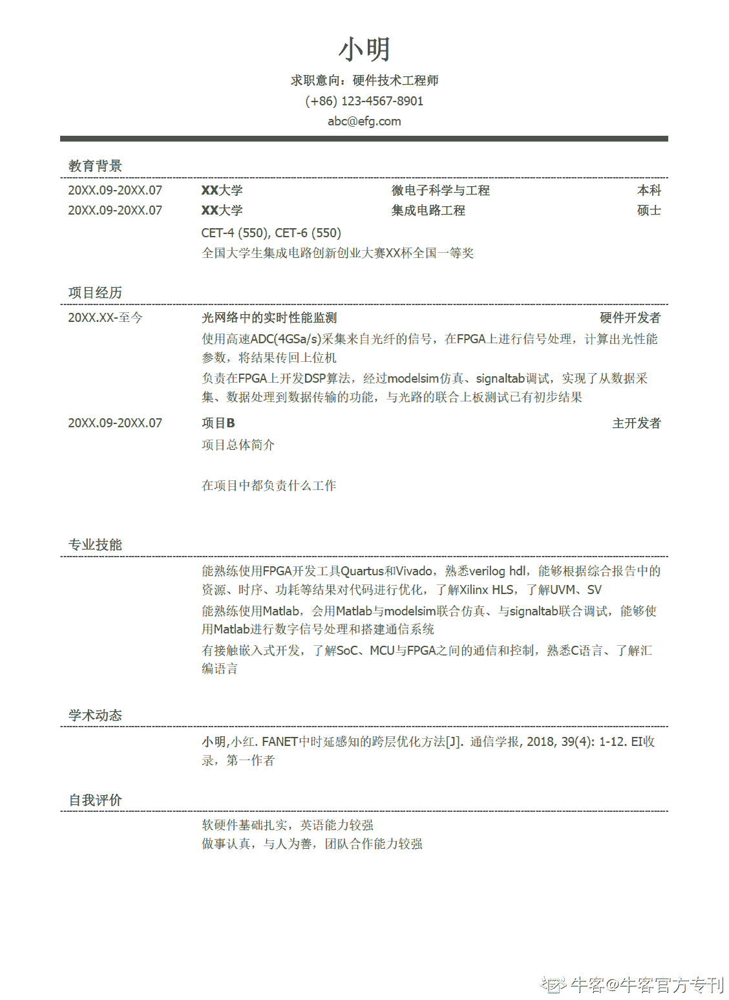

# 第四章 第 1 节 简历撰写及投递

> 原文：[`www.nowcoder.com/tutorial/10045/d075b190ee304920bc85957d09ca4e59`](https://www.nowcoder.com/tutorial/10045/d075b190ee304920bc85957d09ca4e59)

# 1.  如何制作一份简历

简历决定了用人单位对你的第一印象，也是第一道关卡，只有简历过关了，才会有后续的流程。现在许多大厂在你填好网申的信息之后，已经会自动帮你生成一份简历并在你提交后发给他们的 hr，当然在一些内推和一些中小企业招聘的过程中，你可能还是需要带上自己的简历，因此自己设计和制作一份简历还是很有必要的。那么如何制作一份属于自己的简历呢？实际上只要参考大厂网申时帮你自动生成的简历，就能得到一份合适的简历了。一般来说，简历可以分成以下几个部分：基本信息、教育背景、项目经历、学术动态、专业技能、自我评价，看起来好像很多，但实际上只需要给出关键点即可，一般来说除非你著作等身、文章和专利无数，列都列不完，不然一页就够了。下面介绍一下每个部分要写什么，怎么写，另外在这一部分的最后，我会附上一份简历，里面包含了各个部分的样例供参考，希望给大家提供一点帮助。

## 基本信息

基本信息这一栏首先把姓名和联系方式(手机+邮箱)给放上去，建议把求职意向写在明显的位置，方便 HR 分类。注意一点是最好根据具体的企业修改一下意向岗位这一栏，因为每个企业对这些岗位的具体称呼可能会不同，它可能会叫 FPGA 设计岗，也可能叫数字 IC 设计岗，又或者叫硬件技术工程师。如果求职意向没改，一方面 HR 可能不知道你投的是什么岗位，另一方面会显得你没什么诚意。至于照片个人觉得没有必要放上去，毕竟我们这行并不是靠脸吃饭的。而且如果放上去了，打印的时候往往需要彩印，还得多花钱。虽然不建议在自己设计的简历上放照片，但在网申的过程种也有很多企业会要求上传个人照片。因此建议提前准备好正装证件照，以备不时之需。

## 教育背景

教育背景主要就是让人了解你的受教育程度，需要列出从本科起都待过哪些学校，修读的专业是什么，在校时间段等。四六级可以列在这一栏中，分数比较高的话把分数也标出来。同样的，如果说有相关的专业课分数特别高，比如数电，通信原理(仅限通信类企业)，也可以标注出来。这些能够成为教育背景中的一个小亮点。在校期间获得的一些相关奖项也可以在教育背景这一栏列举出来，主要是相关竞赛奖项，或者奖学金，个人认为没有必要把关系不大的奖项放上去。

## 项目经历

在这一栏需要列举相关的项目经历或者实习经历，它们的填法是类似的，因此可以放到同一个部分里介绍。项目经历的介绍应当包括进行的时间、项目的主要内容、在项目中负责的工作内容。这一栏是体现你与其他竞争者最大区别的部分，也是在面试中考官重点关注的部分，因此这一部分需要下的功夫最多。但是下的功夫最多并不代表着你要写的字数很多，简历讲究的还是简洁明了，重点突出，一个项目经历的长度建议在 150 个字以内。首先在项目选择上，建议宁缺毋滥，只有那些和岗位相关度较高，能够证明你的个人能力的项目经历才值得被放上去，至于什么样的项目才值得放上去，这在第三章也讲过。其次是项目经历这一栏的具体内容，主要可以分成两个部分，项目总体的描述和在项目中负责的工作。项目总体的描述可以归纳为使用什么方法，实现什么功能，在写项目描述的时候，最好能把项目的难度给体现出来，以我自己做的一个项目为例“使用高速 ADC(4GSa/s)采集来自光纤的信号，在 FPGA 上进行信号处理，计算出光性能参数，将结果传回上位机”，面试官看到 4G 的采样率，就知道这个项目会有一定的难度。项目中负责的工作可以归纳为具体职责、工作过程、工作结果，具体职责和工作过程可以尽量往招聘要求中的一些点上靠，工作结果必须放出来，如果可以最好有数据支撑，同样以我自己的项目为例“负责在 FPGA 上开发 DSP 算法，经过 modelsim 仿真、signaltab 调试，实现了从数据采集、数据处理到数据传输的功能，与光路的联合上板测试已有初步结果”。

## 学术动态

在这一部分你可以列出自己发表过的文章、参加过的会议、申请过的专利等等，格式设置可以和论文中的参考文献一致。你可以把自己在里面的名字标粗，或者直接在最后加一个补充说明自己是第几作者。文章的层次同样也可以标记在后面，比如说 EI，或者 SCI 二区之类的

## 专业技能

这部分主要写的是和岗位相关的专业技能，建议按熟练程度将专业技能由上往下地排列。此外，如果只是写“掌握 XX”、“熟悉 XX”，会显得没有什么说服力，建议把掌握的专业技能所能做的事情也上去。填写专业技能时注意尽量对照招聘要求上的各个条目，但是不要把不会的专业技能写上去，在面试的时候考官很有可能会针对你写的专业技能进行提问，如果到时候一问三不知印象分会大大降低。下面的是我自己简历上列举的专业技能：

1.  能熟练使用 FPGA 开发工具 Quartus 和 Vivado，熟悉 verilog hdl，能够根据综合报告中的资源、时序、功耗等结果对代码进行优化，了解 Xilinx HLS，了解 UVM、SV；
2.  能熟练使用 Matlab，会用 Matlab 与 modelsim 联合仿真、与 signaltab 联合调试，能够使用 Matlab 进行数字信号处理和搭建通信系统；
3.  有接触嵌入式开发，了解 SoC、MCU 与 FPGA 之间的通信和控制，熟悉 C 语言、了解汇编语言。

## 自我评价

自我评价可以分成两个部分：一是对上面填的项目、竞赛、技能等各个部分的一个总结，二则是对自己的性格、为人处世等方面的一个评价。第一部分的自我评价需要基于简历上的其他部分进行支撑，需要 hr 在看完上面的部分再看到这个自我评价的时候，觉得“嗯，确实如此”。第二部分的自我评价则是相对主观的自我评价，可以挑一些自己认为拿得出手的优点写上去，同样也不要偏离太多。假如你自己在自我评价那里写了个“抗压能力强”，结果在压力面的时候紧张得不行，面试官看到这一条只会皱紧眉头。我自己写的自我评价是“软硬件基础扎实，英语能力较强；做事认真，与人为善，团队合作能力较强“ 。

## 简历样例

上面的是求职者小明的简历，大家可以参考这个简历的格式和排版，总的来说就是要给人一种简洁、重点突出的感觉，不要在自己的简历上写小作文，现在的 hr 都很忙的。可能有的同学不清楚怎样做才能达到上面的排版效果，这里教你一个小技巧：通过插入表格来排版，像下面这样：然后把边框给隐去，就得到下面的效果了：表格排版是一种比较常用的技能，通过调整表格，你可以调整条目的位置，也可以调整每个格子往哪一边对齐。可以参考小明的简历，也可以在网上找一些自己觉得好看的模板，再通过表格排版，基本上能做出一样的效果。如果你实在不会或者不想自己做简历，可以去找别人帮你做，这里推荐一个网站：乔布简历。这些简历代做的网站会提供一些简历模板让你选择，选好之后往里面填信息，完成后就能导出排好版的简历，比较方便，不过这种服务一般都是要收费的，各位同学可以根据自己的实际情况来安排。

# 2\. 如何投递简历

做好简历之后自然要开始投简历，一般简历的投递有三种途径：**一是网申**，网申一般是在企业的招聘官网上注册账号，填写好信息，上传附件，然后就能把简历投递出去；**二是现场投递**，有的企业在开宣讲会的时候会现场接收简历，甚至接收了简历就直接在现场开始面试；**三是内推**，即通过内部员工的推荐进行投递，内推的具体方式多种多样，有些内推是在网申提交信息时多填一个内推码、也有些是直接把简历发给对方，让对方帮你登记和投递、还有些是对方发一个特殊的内推链接给你，点进去填信息投递等等。由于普通的网申流程比较清晰，接下来主要讲一下内推的事情。从提前批开始，你就能在各种群聊、牛客的讨论区里看到各家企业的内部员工在内推，在牛客网上还有专门的内推广场，上面有许多免费的内推机会。有些企业的内推码似乎随处可见，有的同学可能会觉得疑惑：如果内推是随处都有的，那又有什么作用呢？我先介绍一下我了解到的内推的机制：内推是企业招聘人才的方式之一，主要的途径是发动内部员工去邀请一些优秀的人来投递简历(比如说实验室里的师弟师妹)，一般来说如果被推荐人最终入职了，那么内推人是会有一定的奖励的，所以一般内部员工都会愿意帮忙内推，也会有人直接把自己的内推码丢到网上广撒网，反正也不会亏，万一有人入职了自己还有奖励。这样看来内推似乎是对内部员工的一种权利和福利，那么对于求职者来说内推又有什么用呢？按照我的经验来说，内推的作用主要有两种：一种是可能能够免笔试，能少一点风险就少一点风险，但能够让你免笔试的内推并不多；另一种作用是能够帮你查询简历流程和面试反馈，很多时候你能在招聘系统上查到的状态信息非常有限，如果有内推人，那么他/她就是了解具体情况的最佳选择。可能有的同学觉得有内推可以加分，我的经验告诉我那是不存在的（可能如果推荐人是真正的大牛，或许会有），内推可能能让你的简历“优先筛选”，但不会让你的简历“优先通过”，该过的会过，过不了的依然会挂掉。因此，在内推这个事情上，我的建议是如果有认识的师兄师姐能帮你内推，那最好找他们内推，因为你能和他们保持联系，了解招聘的情况；如果内推能够免掉笔试，也可以找不认识的人去内推，能少冒些风险就少冒些风险。除此之外，我的建议是没必要说一定要找到内推才去投简历，内推确实能提供一点帮助，但不会提供捷径，与其在那里磨磨蹭蹭地找内推，不如做好笔试面试的准备，早点投递以防心仪的岗位招满。当然，一些具体情况还是要具体分析，最终选择权还是取决于你自己。