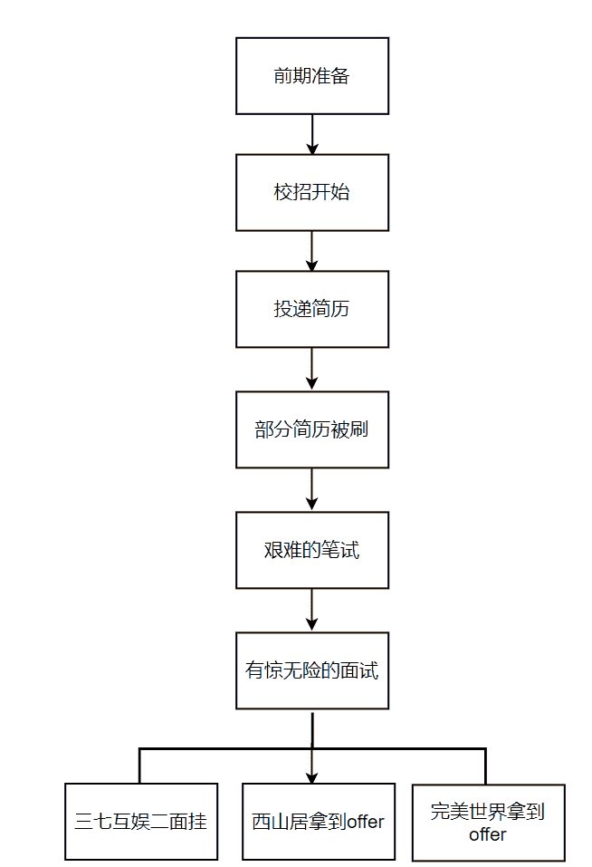

# 第一章 第 2 节 求职经历及结果

> 原文：[`www.nowcoder.com/tutorial/10065/0ee652037d2e4b118dfbd8e4ed6029a6`](https://www.nowcoder.com/tutorial/10065/0ee652037d2e4b118dfbd8e4ed6029a6)

# 1 秋招经历

以下为我这次秋招的整体流程**** 

## 1.1 秋招的前期准备

        我从 2020 年秋招期间开始求职，主要在 8、9 月份，此时互联网公司已经开始秋招，校招提前批从 7 月份开始，我是从 8 月份开始陆续投简历，9 月份是笔试、面试最集中的一个月，因为基本 9 月份是秋招全面开始的一个月，10 月份很多公司会进行最后一轮的秋招，但是此时基本已经有些晚了，因为很多岗位都已经招满了人，此时再去投就很难拿到 offer，所以一定要时刻注意想去的公司的秋招时间，最好别错过了。        我主要准备的内容是 C++，算法，计算机图形学，数据结构，操作系统，计算机网络，设计模式，并且在 6 月份便开始准备一个网络游戏项目，7 月份开始每天都复习上述的知识点，遇到不会的都会百度清楚，记不下来的或者实在是理解不了的就死记硬背了，因为时间真的很紧，只能先硬记下来后面再慢慢搞懂。8 月份那就是每天刷各大论坛的面经了，每看一篇面经就把自己想象成面试者，只要遇到不会的就去查漏补缺，这样的复习持续了一个月，一直到 9 月份，我根据自己掌握的相关技能，初步觉得我已经具备了面试的资格，便开始我真正的秋招之旅。

## 1.2 秋招开始

        9 月份秋招全面开始，我内推了 1 到 2 家公司，其余的都是在官网进行网申，网申的公司有 15 家，网申过的有 10 家，有 网易雷火，网易互娱，完美世界，西山居，多益网络，祖龙娱乐，三七互娱，搜狐畅游，4399，竞技世界。之所以没有投腾讯，字节，是因为我觉得我可能没那个实力，所以先投了这些公司试试水。

## 1.3 简历被刷掉的教训

        我投了 15 家游戏公司，但是有 5 家公司把我的简历刷掉了，有杭州电魂，叠纸游戏等。简历被刷掉的原因我认为有以下几个原因。        一是我所掌握的技能和公司招的该岗位的技能有所差异，也就是掌握的技术还不够，比如有公司要求需要了解分布式，而我对这方面了解甚少，所以未写在简历上，所以建议大家投递公司时一定要确保自己满足该岗位的技能要求，不一定要精通，但一定有过了解。        二是简历写法不规范，导致未能把自己的优点直接反馈给筛选简历的人，因为我的简历完全是自己写的，没有参考任何其他的同岗位的简历写法，所以建议大家写简历之前最好找一些专业人士来指导，或者找一些同岗位的优秀的简历模仿着去写。

## 1.4 艰难的笔试

        上述我网申通过的 10 家公司都有笔试，笔试过的有 3 家（主要算法水平有限，所以建议大家一定要好好刷算法，提升自己的算法水平），分别是完美世界，西山居，三七互娱。笔试主要的考察点各个公司不太一样，根据岗位类型也稍有区别。比如投 C++游戏客户端开发，Unreal 开发，C++就是重点，数据结构，网络原理，操作系统等基本知识也会涉及到。而如果投 unity 开发，那么就会涉及到 C#的知识。根据公司的不同，考察题型也会不同，比如网易主要考察算法能力，所以笔试就是出四道算法题，四个小时的时间做完；而完美世界，西山居等公司会出一些选择，问答题，所包含的知识点就是 C++，操作系统，数据结构，网络原理等。

## 1.5 有惊无险的面试

### 1.5.1 九月上旬 三七互娱 “不太友好”的面试

        我第一个面试的公司是三七互娱，一面采用的面试形式是视频面试，因为是第一次面试，自然是紧张了。我记得当时面试时间是下午的四点半，我早早的三点半就进入了面试会议，因为是第一次面试，没有什么经验，所以担心给面试官不好的印象，所以就准备的很早。终于等到了四点半，我紧张到话都说不清楚了，但是过了 5 分钟，会议里面试官还没来，我以为我记错时间了，反复确认了邮件中的面试时间，确认没有问题，正当我想着面试官为什么还没来的一万种原因的时候，面试官终于进入了会议，随着系统声音提示：“面试官向您发起了视频会议”后，我才恢复了面试的状态，颤抖的小手按下了确认键。        首先一上来就是自我介绍，刚开始说话都有点磕磕绊绊的，我一度觉得自己是不是得了口吃，随着面试的进行，我逐渐进入了状态，面试也逐渐顺利了起来。在我介绍完我做的项目之后，面试官问了问项目上有没有遇到什么难题，当时是如何解决的，我都顺利的答了上来，但是中途面试官问我 C#掌握的怎么样，我回答一般，掌握好的是 C++，但是面试官还是问我 C#中的一些知识，比如：C#中的属性介绍一下，C#委托的实现，C#有哪些集合，因为前期准备并没有专注的去准备这些，所以答得只能用一个字来形容，那就是 “烂”，眼看着面试官问啥啥不会，我有点慌了，想着难道第一个公司的面试就这么结束了吗，所以为了让面试官看到我的优点，我再一次向面试官强调，我 C#只是偶尔用用，并不是很熟悉，C++掌握的还是很好的，说完后，面试官仿佛没听到我说的一样，继续问 C#“折磨”我。        终于一连问了四五个 C#的知识点我都没怎么回答出来之后，面试官终于放弃了对我的“折磨”，转向了问我 unity 的知识，此时我的内心仿佛有一个声音“终于结束了！”。面试最后问的计算机网络，设计模式等知识我答的还是非常流畅的，终于在五十分钟后，一面结束了。面试完我觉得很累，因为面试期间精神高度集中，生怕回答错了问的东西，还好整个面试下来，除了 C#答得不好，其他都说上来了。        我以为三七互娱多半是凉了，没想到一周后给我发了二面通知，便开始准备二面。二面整轮面试问下来，我自我感觉都答得挺好的，从最开始的项目，到后来的数据结构，计算机图形学我都回答了上来，但是一周后三七互娱却发来了感谢信，虽然我也不知道问什么这么顺利的二面能挂掉，但是我觉得一定是我还不够优秀，所以我还需稳固自己所学的知识。

### 1.5.2 九月中旬 西山居 面试的极佳体验

        在面试西山居的时候，我已经获得了本校的保研名额，所以面试的状态是无比轻松的，因为就算面试过了我也不一定会去工作，毕竟毕业要读研究生了。一面，二十分钟，面试官在听我自我介绍完后还是老一套的问我项目上有没有遇到什么问题，是如何解决的，项目的优化等等，很顺利的回答完后，面试官便来了一句：“你有什么想问我的吗？” 。此时我的内心 “what？，问完了？才过了二十分钟，就问了问项目就结束了？”一面结束后我一度认为西山居人招满了，面试我只是因为我笔试通过了，过个流程而已，谁知两天后便接到了二面通知。        二面，四十分钟，面试官还是从项目开始问，然后一路下来问 C++，unity 的掌握程度，用过什么设计模式，常用的数据结构等等，我都轻松的回答了上来，后面便开始和面试官聊天了，比如大学期间为什么选择做游戏呀，最感兴趣的研究方向呀，未来的打算呀，整个面试过程是非常轻松愉悦的，二面过后我觉得西山居应该是稳了。如我所料，两天后，接到三面通知。三面是项目经理面，也是聊天，问我未来的规划，问我如何团队协作开发等等，轻松的三十分钟，三面结束，项目经理直接说愿不愿意去他们公司工作，待遇什么都很好，至此，西山居 offer 到手。        纵观西山居的三场面试，我认为放松下来才是最好的面试状态，面试过程中不要紧张，因为面试官不会特别为难我们，我们又没有仇，是吧。所以放轻松面试，才能把自己最好的一面展现出去，这样也能让面试官感受到是一个自信的且有能力的面试者。

### 1.5.3 九月下旬 完美世界 令人心动的 offer

        完美世界是我很早就投的一家公司，但是面试时间却比较晚。有了前面的面试经验，面完美世界的时候内心也是波澜不惊的。        完美世界一面，一个小时，和我面试的其他公司一样的，在我自我介绍完后面试官直接从项目入手，主要问我项目中的技术要点。比如，你的游戏断线重连机制是如何实现的；游戏中各个客户端表现不一致如何解决；游戏的渲染帧和逻辑帧如何分离；为什么渲染帧要高于逻辑帧；你的游戏用到了什么框架，我回答没用特定的框架，主要按照 MVC 架构去实现的，又问我游戏中哪块是 M，哪块是 V，哪块是 C，然后纠正了我使用的 MVC 架构的问题。问完项目已经过了三十分钟了，虽然磕磕绊绊的都回答上来了，但是部分回答的并不是很好，面试官也纠正了我回答的问题，我还是非常感谢这个面试官的，因为项目中遇到的卡顿问题，在听他的一番解释中顿时理解了该如何去解决。后三十分钟问了 C++，数据结构，和一道智力题，智力题是面试官一步一步引导的才回答出来的。        整个一面结束，我都不确定自己能不能过，因为项目上的确有很多问题存在，但是还好有惊无险，两天后收到了完美世界的二面通知。        二面，四十分钟，二面的面试官侧重点就不一样了，项目只问了出现什么问题，角色的碰撞检测等，后面就开始问我计算机图形学，问到 Mipmap，光线追踪，GI，ShadowMap，软阴影和硬阴影，深度缓冲，环境光遮蔽等知识，这些自然是我的强项，毕竟计算机图形学我复习了很久，都很全面的答了上来，后来又问了问数据结构，操作系统的知识。难度比一面来说稍微降了降，但是还是有些难度的。        HR 面，四十分钟，主要问我在学校拿过什么奖，每个项目负责什么，团队协作能力如何。至此，完美世界 offer 到手，工资也高达 21k*15。        完美世界的所有面试给我的感觉是，的确难，虽然没有让我手撕算法，但是问的知识点都很碎，而且很杂，经常从一个问题扩展出其他问题，所以建议读者复习一个知识点时，可以连同相关的知识点一起复习到，这样全面掌握面试才更有把握。

# 2 求职结果

## 2.1 收获的 offer

我最终拿到了完美世界和西山居的 offer。完美世界拿到 offer 的岗位是 C++游戏开发工程师，西山居拿到的 offer 的岗位是游戏客户端开发工程师。

## 2.2 秋招踩过的坑

*   复习到一个知识点时，不能仅仅搞懂就行，一定要搞懂这个知识点的衍生问题。

因为面试官问一个问题会根据你的回答扩展着追问。比如，C++虚函数的实现原理是什么，你回答是用的虚表和虚表指针，面试官此时就追问了，虚表存在哪，虚表指针什么时候初始化等问题。所以衍生的去学习对面试的帮助很大。

*   面试过程中切勿说自己不熟悉的知识。

面试官问一个问题，最好就回答这一个问题就可以了，不要多嘴说和另为其他的某些方面也有联系，除非你对相关的也非常了解可以说，不了解的情况绝对不要把自己往火坑里带，谁知面试官会不会看你提到了另外一个问题就问了呢，所以最好不要在回答中带有自己不熟悉的知识。

*   面试切不可胡说。

面试官问一个问题，如果不太会或者不太清楚，就和面试官说不会，不要胡乱说，这样会使面试官对你的印象大打折扣。

## 2.3 秋招心态建议

*   笔试和面试遇挫不要气馁，要及时查漏补缺。

秋招过程是漫长而又艰辛的，没有一路顺风，也没有一路遇阻，如果笔试，面试屡屡遇到挫折，一定不要放弃，稳住自己的心态，从每一次的笔试和面试中查漏补缺。

*   笔试和面试顺利不要自负，稳步向前。

不要面试过了一两家公司就过于膨胀，因为说不定是你运气好刚好问到的都会呢。万一下一家公司问到你的知识盲区了呢，所以需要稳扎稳打，巩固自己的知识堡垒。

*   谦虚，放轻松。

时刻保持谦虚学习的态度，笔试，面试没过就找到原因去解决，过了就总结经验，为下一次做更好的准备。面试过程中不要过于紧张，放松自己才能达到最好的状态。

### 2.4 秋招的公司选择

        游戏开发类的岗位校招工资一般是 10k-25k，大厂一般会在 15k 以上，有些中小厂也会开到 15k 以上的薪资，但是我还是建议能去大厂就去大厂（腾讯，网易，字节，完美世界，米哈游等），即便薪资不高，大厂所能给你带来的不论是技术还是项目经验都是一流的，这对你未来的职业生涯的发展也是百利而无一害的。所以秋招要以学习为主，而不要以薪资高低划分公司，大厂有着更高的平台，自然也会有更高的技术，到这些公司学习技术才是你首先需要考虑的事。