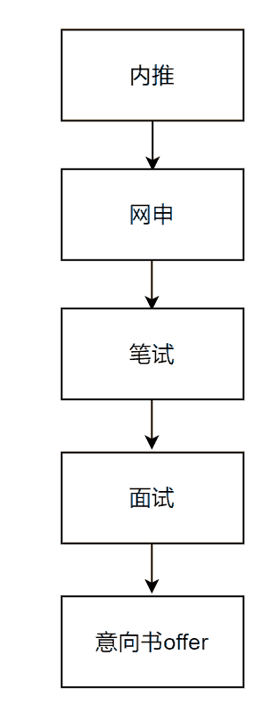

# 第二章 第 1 节 了解校招

> 原文：[`www.nowcoder.com/tutorial/10065/31c07e8d772845a1833f9363cc4f6ad2`](https://www.nowcoder.com/tutorial/10065/31c07e8d772845a1833f9363cc4f6ad2)

# 1 什么是校招

        校招就是校园招聘，主要针对的是应届生，是公司专门面向学生的一种招聘方式，是应届毕业生找工作最好的途径。

## 1.1 校招分类及时间

        校招分为春招和秋招。春招一般从每年的三月份开始，最晚到五月份，而春招提前批最早二月份就会开始。秋招一般从每年的七月份开始，最晚到十月份，而秋招提前批最早会从六月份开始。        校招主要针对的就是应届生。举个例子，我是 2020 年 9 月份步入大四，2021 年 6 月份毕业，所以我就是 21 届毕业生，所以我可以参与 2020 年的秋招以及 2021 年的春招。2020 年校招分为春招和秋招，春招就是 2020 年春季的招聘，此时招的是 20 届的毕业生，所以我是不能参加这次的春招的；到了 2020 年秋天，会迎来一次秋招，此时是招聘 21 届毕业的学生，我就满足了条件，可以参加此次的秋招；再往后走，到 2021 年的春天又会迎来一次春招，我也是满足条件的，可以参加此次的春招。

## 1.2 校招流程

        校招的主要流程是：内推→网申→笔试→面试→意向书(offer)。        

### 1.2.1 内推

        内推一般是简历免筛选，直接进入笔试，或者直接免笔试，进入面试阶段；最普通的内推则是可查简历进度。具体是简历免筛选进入笔试阶段还是免笔试进入面试阶段，主要根据该公司的内部员工推荐的不同而定。所以内推一定要询问内推者是哪种的形式。内推的方式有很多种，以下我列举了一些：

*   找一些内推的群聊

*   找公司内部员工推荐

*   找进入该公司的学长学姐推荐

*   你足够厉害，有人找着推荐你

*   牛客的[内推广场](https://www.nowcoder.com/discuss/referral/all/index)，以及牛客的论坛上也有很多帮助内推的人

        所以在选择想去某一家企业之前，或得内部员工的内推名额是非常重要的。

### 1.2.2 网申

网申是在网上投递简历，此阶段一般会有简历的筛选。**网申的方式：**

*   在公司官网的校招入口投递简历。

*   在一些招聘网站(牛客招聘)投递简历。

*   直接将简历投递到公司指定人员的邮箱。

**注意事项：**

*   一定要确保自己的简历成功上传，不要投递一份空简历过去了。

*   不同的公司简历投递方式不太一样，有些是需要在公司校招网站上填写好简历提交，有些是直接提交做好的简历。

### 1.2.3 笔试

笔试是企业会为该岗位出一套试卷，然后在规定时间提供给我们去做。笔试分为线上笔试和线下笔试，其中线上笔试居多。线下笔试是直接去公司应试。线上笔试则是在各种笔试网站上（如牛客网，赛码网，公司自己的网站等等）完成相应的试题。**注意事项：**

*   线上笔试过程中会开摄像头和屏幕录像，手机也会用微信小程序监控。所以不要想着作弊，否则一经发现可能就进入公司黑名单了。

*   线上笔试过程中是可以使用演草纸的，需提前准备好。

*   线上笔试过程中可中途去上厕所，可短暂离开摄像头前，但不可长时间离开。

*   线上笔试过程中有些公司允许使用本地编辑器写代码，有些不允许，具体视公司笔试规则而定。

*   线上笔试过程中不可讨论，需自己独立完成。

**笔试会出现的题型：**

*   单选题

*   填空题

*   简答题

*   编程题

*   智力题

**笔试经验分享：**

*   想做好笔试一定要多抓基础。因为互联网公司笔试就是考察笔试者的基础，我推荐去牛客上刷笔试基础题，非常有用。

*   多刷算法。笔试考的算法大部分还是较为常见的算法，多刷就会掌握技巧，通过笔试的概率也会大大提高。

*   笔试时合理分配时间。笔试遇到难题不要一直卡在那，先往后做，争取把能做对的题做对。

### 1.2.4 面试

面试分为单面和群面，一般游戏研发岗多为单面（即面试官与你一对一问答）。校招面试一般会有三轮面试（一面，二面，HR 面）：一面多问基础知识和考察算法。二面一般会以项目为主，也会问一些业务问题或者智力题等等。HR 面则主要是考察个人的思想品质，团队协作能力等，一般到了 HR 面基本意味着拿到 offer 了，所以 HR 面朝着正确的价值观去说基本没什么问题。**面试经验分享：**

*   面试一定要有礼貌。面试时有没听清的问题一定要说：“面试官，您的问题我没有听清楚，能劳烦你在说一遍吗，谢谢”。礼貌可以增加与面试者的好感度，这是非常重要的。

*   面试不要紧张。面试过程中不要紧张，回答问题要有条理，让面试官感觉到你的自信。

*   面试一定要实事求是。不要过于夸大自己，给面试官展现自己最真实的一面。

*   面试不要迟到。迟到会使面试官的第一印象变坏，甚至会影响到最终的面试结果，谁都不想和一个不守时的人一起工作，是不是。

*   面试结束一定要说：“感谢面试官给我这次宝贵的面试机会”。

### 1.2.5 意向书(offer)

过了面试就意味着成功被公司录取了，此时有些公司会直接发 offer，比如我面试通过的西山居；而有些公司在发 offer 前先会发意向书，比如我面试通过的完美世界，此时要注意了，拿到意向书并不代表一定会发 offer，有些公司毁意向书的事也是存在的，但是绝大部分公司是会在意向书之后发 offer 的，所以也不用过于担心。

## 1.3 游戏研发岗分类

游戏研发岗有很多分支，比如有 C++游戏客户端开发，Unity 游戏开发，Unreal 游戏开发，游戏引擎研发等等。

*   C++游戏客户端开发：开发中大部分是用 C++语言，对 C++熟练度要求较高。

*   Unity 游戏开发：开发中使用 Unity 游戏引擎，对 C#熟练度和 Unity 使用经验有一定的要求。

*   Unreal 游戏开发：开发中使用 Unreal 游戏引擎，对 C++熟练度和 Unreal 使用经验有一定的要求。

*   游戏引擎研发：用到很多计算机图形学的知识，对计算机图形学的掌握程度要求较高。

以上这些岗位都是可以投递的，求职难度还是蛮高的，主要是因为所需要掌握的知识很多大学是不教的，需要自学。竞争力也是非常大的，就像我现在正在实习，一个研发部门，就只招了两个游戏开发实习生，当时投递的人肯定是非常多的。如果对游戏研发有兴趣，尽量进一些大厂（腾讯，网易，盛大网络，完美世界，金山西山居，三七互娱，巨人网络，吉比特，米哈游，雷霆游戏等）。如果想进大厂，实习经历是非常重要的，所以能尽早实习就去公司实习。

## 1.4 校招心态建议

校招心态也十分重要，投了很多家公司，真正能拿到 offer 的可能很少。所以如果笔试，面试阶段没通过的话千万不要放弃，及时从中发现自己不会或者不熟悉的知识，然后去搞懂，这样从失败中完善自身的不足，上岸的几率就越来越高了。