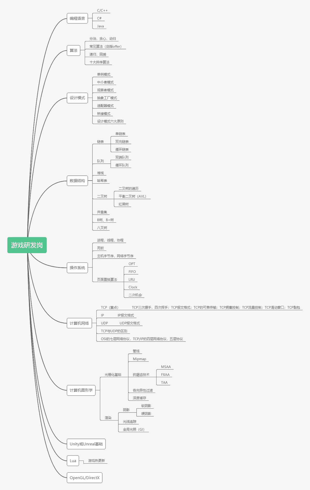

# 第二章 第 3 节 学习规划

> 原文：[`www.nowcoder.com/tutorial/10065/9e0b1c6f07cf40df943e46e625999ddd`](https://www.nowcoder.com/tutorial/10065/9e0b1c6f07cf40df943e46e625999ddd)

# 1 游戏研发岗位技能树

# 2 学习资源推荐

## 2.1 C/C++/C#推荐

*   **《C++ Primer》**：C++神书，学 C++必看。

学习方法推荐：不要从头一页一页的去看，这样看下去看几个月都不一定能看完，有针对性的看一些面试中出现的高频知识点。

*   **《Effective C++》**：选择性学习，学习完此书内容可以更好的规范写 C++的程序。

学习方法推荐：如果有时间可以精读，没时间可以去网上找别人总结好的阅读。

*   **《Effective C#》**：选择性学习，学习完此书内容可以更好的规范写 C#的程序。

学习方法推荐：需要使用 Unity 引擎开发可以阅读，也可以去网上找别人总结好的阅读。

*   **《STL 源码剖析》**：STL 神书，必读。

学习方法推荐：重点看容器那几章，一定要做到精读，因为看懂了面试问的 STL 都随便回答。

*   **我的 C++笔记**：我几个月的复习 C++的笔记，记录了很多 C++易错易混点。

## 2.2 算法学习推荐

*   **《剑指 offer》**：笔试，面试必看。

刷题方法推荐：剑指 offer 的题量较少，可以全部刷完。

*   **Leetcode**：知名算法刷题网站。

刷题方法推荐：按照模块来刷，比如这一周主要刷字符串，下一周动态规划等等，可提高对某一类题型的快速掌握程度。

*   **牛客网**：知名算法刷题网站。

刷题方法推荐：也是按照模块来刷。

## 2.3 设计模式学习推荐

*   **《大话设计模式》**：真心推荐，里面不止简单给出设计模式的概念，还有生动的例子帮助理解。

学习方法推荐：挑重点阅读，比如游戏开发中常用到的单例模式，观察者模式，中介者模式等等，这些做到精读即可。

*   **《Game Programming Patterns》**：也叫 《游戏编程模式》，主要讲设计模式在游戏中的体现和使用，对游戏编程帮助很大。

学习方法推荐：挑重点阅读，比如游戏开发中常用到的单例模式，观察者模式，中介者模式等等，这些做到精读即可。主要看在游戏中具体是如何体现的。

## 2.4 数据结构学习推荐

*   **《大话数据结构》**：同《大话设计模式》，容易理解。

学习方法推荐：数据结构作为一名程序员的基础，需要做到全部都熟练掌握，所以需要通篇精读，如果觉得自己数据结构已经很扎实，可选择性学习。

## 2.5 操作系统学习推荐

*   **我的操作系统学习笔记**：记录了面试常考知识点。

## 2.6 计算机网络

*   **我的计算机网络学习笔记**：记录了面试常考知识点。

## 2.7 计算机图形学

*   **阎令琪老师《计算机图形学入门》课程**：图形学入门最最最好的课程，老师讲课通俗易懂，并且会讲最新的图形学研究技术。

学习方法推荐：所有课程都必须一节不落学完，有些难点可能要学习两道三遍，每遍学习都会领悟新的东西。

*   **《Physically Based Rendering From Theory to Implementation (3rd Edition)》**：PBR，基于物理的渲染，神书，学完并掌握就是神仙。

学习方法推荐：适合有时间的同学阅读，没时间可选择性阅读。

*   **《Real-Time Rendering, Fourth Edition》**：实时渲染，神书，学完并掌握就是神仙。

学习方法推荐：适合有时间的同学阅读，没时间可选择性阅读。

## 2.8 Unity 或 Unreal 基础

**Unity 或 Unreal 官网教程**：有基本的入门项目，可以跟着学习。学习方法推荐：以快速入手为主，不要过于纠结有些 API 的难点，了解引擎每个模块的使用方法即可。

## 2.9 Lua

*   **菜鸟教程**：上面有 Lua 的入门教程，学会基本就可以了，非必须。

学习方法推荐：和学其他语言一样，了解基本语***简单的运用即可，不是面试所必需的。

## 2.10 OpenGL/DirectX

*   **learnOpenGL 网站**:学 OpenGL 最好的网站，网站讲的非常全面，非必须。

学习方法推荐：一般学习这类图形接口的网站都有教程，有时间的跟着一步一步做即可，没时间的就做到了解，不是面试所必需的。