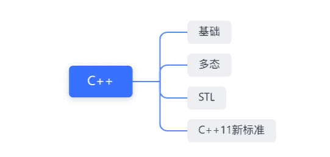

# 第三章 第 1 节 专业技能准备与提升

> 原文：[`www.nowcoder.com/tutorial/10065/762d4f05d0de4d18af25bf3bb2c37f57`](https://www.nowcoder.com/tutorial/10065/762d4f05d0de4d18af25bf3bb2c37f57)

# 1 编程语言的准备与提升

        首先，需要准备的编程语言主要有 C++，C#。因为现在游戏公司主要用的两大游戏引擎是 Unity 和 Unreal，Unity 用到的编程语言是 C#，Unreal 用到的编程语言是 C++。我推荐的是只要投游戏开发岗两个编程语言都要去学习，原因是现在的游戏公司面试基本都会问 C++基础，其次如果会用到 Unity 引擎的话，也会问 C#基础。 **C++的高频知识点有：****基础：**

*   const 的作用

*   static 的作用

*   指针和引用的区别

*   堆和栈的区别

*   C 与 C++的区别

*   new 和 malloc 的异同

*   struct 和 class 的区别

*   inline 的作用，优缺点

*   volatile 的作用

*   explicit 关键字的作用

*   友元类，友元函数

*   左值引用和右值引用的区别

*   引用折叠，常量折叠

*   宏定义

*   成员初始化列表

*   面向对象的三大特征

**多态：**

*   多态的分类及实现

*   重载，重写，隐藏

*   虚函数，纯虚函数，及区别

*   虚函数指针，虚函数表的实现

*   类模板和函数模板

*   强制类型转换运算符

*   RTTI

**STL：**

*   STL(vector，deque，list，stack，queue，priority_queue，set，multiset，map，multimap，unordered_set，unordered_multiset，unordered_map，unordered_multimap)

*   智能指针

**C++11 新标准：**

*   auto 关键字

*   nullptr

*   基于范围的 for 循环

*   decltype 关键字

*   lambda 表达式

*   initializer_list

*   智能指针 shaerd_ptr，unique_ptr

*   右值引用

*   move()函数，将左值强转为右值

**C#的高频知识点**

*   常用的集合和数据结构(Dictionary，List，Queue，Stack，LinkedList，HashSet)

*   程序集的定义

*   属性和数据成员的区别

*   委托的实现

*   反射的定义

# **2 数据结构的准备与提升**

        数据结构是笔试，面试必考点之一，它可以反映出一个面试者的基础如何，所以需要做到对常用的数据结构非常的了解。数据结构是计算机专业的基础，如果是本专业的，以下知识点熟练复习即可，如果是跨专业或者转专业的，以下知识点必须学到，因为面试经常问到。**必须掌握的数据结构：**

*   **链表**(单链表，双向链表，循环链表)

*   **队列**(双端队列，循环队列)

*   **堆栈**(堆和栈的特性)

*   **哈希表**(哈希函数，哈希冲突，rehash)

*   **二叉树**(二叉树的四种遍历方式，平衡二叉树 AVL，红黑树，SB 树)

*   **B 树,B+树**(在数据库中的使用)

*   **图**(深搜，广搜)

**提升：**

*   **八叉树**(空间划分的应用)

*   **并查集**(并查集的概念和用法)

# 3 算法的准备与提升

        算法是互联网公司招开发岗最为关注的核心之一，对算法的掌握程度直接决定了是否可以通过笔试和面试，以下列举的算法是必须熟练掌握的。以下所列举的算法是基础必会算法，如果时间充裕，可以多刷刷相关知识点的其他算法，而且刷算法有一定的技巧，不可以盲目乱刷。比如：有些人一天刷 10 道算法，一个月过去了，算法还是一塌糊涂。刷算法不在多，而在于精，刷一道就要把这一道所蕴含的技巧掌握了，半个月后一样的题拿出来，能立即想出方法解决，才是有效的刷题方式。**必须掌握的算法：**

*   **分治**(二分查找，归并排序，快排等)

*   **贪心**(背包问题等)

*   **动归**(背包问题，最小路径和，最长公共子序列，最长递增子序列，最小编辑代价等)

*   **递归**(Fibonacci，汉诺塔等)

*   **回溯**(深搜，二叉树的后序遍历等)

*   **十大排序算法**(冒泡，选择，插入，希尔，归并，快排，堆排，计数排序，桶排序，基数排序)

*   **二叉树**(先序遍历，中序遍历，后序遍历，层序遍历，最近公共祖先等）

**提升：**

*   **动归**

# 4 设计模式的准备与提升

        设计模式是面试的必考点之一，需要了解一些常见的设计模式，并且知道其具体的应用场景，以及应用的优缺点。设计模式是考察一个面试者对于项目的结构的搭建如何，设计模式用在对的地方可以极大简化项目代码，降低项目各模块的耦合性，对于项目后期扩展和修改都是非常方便的，以下我总结出了我在我的项目中最常使用的几个设计模式，了解过后可以帮助极大的规范你的项目代码。**必须掌握的设计模式：**

*   **单例模式**：它提供了一种创建对象的最好的方式。这种模式涉及到一个单一的类，该类负责创建自己的对象，同时确保只有单个对象被创建。这个类提供了一种访问其唯一的对象的方式，可以直接访问，不需要实例化该类的对象，属于创建型模式。

*   **中介者模式**：可用来降低多个对象和类之间的通信复杂性。该模式提供了一个中介类，该类用来处理不同类之间的通信，降低各个模块的耦合性。属于行为型模式。

*   **观察者模式**：当对象间存在一对多关系时，通常使用观察者模式。当一个对象被修改时，则会自动通知依赖它的对象。属于行为型模式。

*   **抽象工厂模式**：是围绕一个超级工厂创建其他工厂。该超级工厂又称为其他工厂的工厂。这种类型的设计模式属于创建型模式，它提供了一种创建对象的最佳方式。

*   **适配器模式**：是作为两个不兼容的接口之间的桥梁。这种类型的设计模式属于结构型模式，它结合了两个独立接口的功能。这种模式涉及到一个单一的类，该类负责加入独立的或不兼容的接口功能。

*   **桥接模式**：是用于把抽象化与实现化解耦，使得二者可以独立变化。这种类型的设计模式属于结构型模式，它通过提供抽象化和实现化之间的桥接结构，来实现二者的解耦。

**提升：**

*   **命令模式：**请求以命令的形式包裹在对象中，并传给调用对象。调用对象寻找可以处理该命令的合适的对象，并把该命令传给相应的对象，该对象执行命令。主要注意在游戏里的应用。

*   **状态模式：**类的行为是基于它的状态改变的，游戏中广泛应用于有限状态机。

# **5 操作系统的准备与提升**

        操作系统是开发岗的必问点，针对游戏开发岗，以下我总结了最常问的知识点。操作系统在游戏开发的初期很少用到里面的知识，顶多就是写写线程池，用一下协程之类的，但是作为一门计算机专业一大专业课，很多公司笔试面试都是会考的，一般考的都是一些操作系统基础，以下我已经罗列出来。**必须掌握的操作系统：**

*   **进程，线程，协程**(概念，区别，通信，各自的优缺点)

*   **死锁**(条件，解决方法)

*   **主机字节序，网络字节序**

*   **页面置换算法**(OPT，FIFO，LRU，Clock，二次机会)

**提升：**

*   **多线程，锁**(概念，同步方式等)

# 6 计算机网络的准备与提升

        计算机网络是开发网络游戏的基础，游戏开发中使用的网络通信协议是 TCP 和 UDP，所以要对这两种通信协议的原理，概念，用途等非常的了解，以下是我列举的所必须掌握的知识点。**必须掌握的网络知识：**

*   **TCP**(三次握手，四次挥手，报文格式，如何实现可靠传输，拥塞控制，流量控制，滑动窗口，黏包分包，优缺点)

*   **UDP**(报文格式，优缺点)

*   **TCP 与 UDP 的区别**

*   **OSI 的七层网络协议，TCP/IP 的四层网络协议，五层协议**

**提升：**

*   **Socket 网络编程**

*   **Protocol Buffers**

# 7 计算机图形学的准备与提升

        计算机图形学是面试的考察重点，在准备图形学之前我建议首先去看闫令琪老师讲的《现代计算机图形学入门》这门课，看完此门课会对计算机图形学有一个很清晰的了解，并且轻松应对面试，以下是我列举的面试考察的重点。**必须掌握的计算机图形学知识：**

*   **光栅化基础**(渲染管线，Mipmap，抗锯齿，各向异性过滤，深度缓存)

*   **阴影**(软阴影，硬阴影)

*   **抗锯齿**(MSAA，FXAA，TAA)

*   **AABB 包围盒**

*   **空间划分**(八叉树，KDTree)

**提升：**

*   **光线追踪**(路径追踪)

*   **全局光照**(GI)

*   **环境光遮蔽**(AO)

# 8 Unity 或 Unreal 基础

        Unity 和 Unreal 的准备主要和投递的岗位有关，如果投递 Unity 开发则准备 Unity 相关的，投递 Unreal 开发则准备 Unreal 相关的，投的游戏客户端开发就任意掌握一个就行。游戏引擎一般是考察用法，比如用到引擎内的什么模块，用过什么插件等等，所以只需要多使用即可。还有就是熟悉常用的一些引擎优化技术。

# **9 Lua 的准备与提升（非必须）**

        掌握 Lua 是面试的加分项，Lua 主要用于游戏热更新，在面试前可以看一下 Lua 的基本语法，能够使用即可。        提升则需要看一些 Lua 在游戏热更新中的使用。

# 10 OpenGL/DirectX 的准备与提升（非必须）

        掌握 OpenGL 和 DirectX 是面试的加分项，这是图形学的实际应用，可通过调用这些图形接口来绘制画面，所需要准备的是掌握这两种图形接口常用的 API。