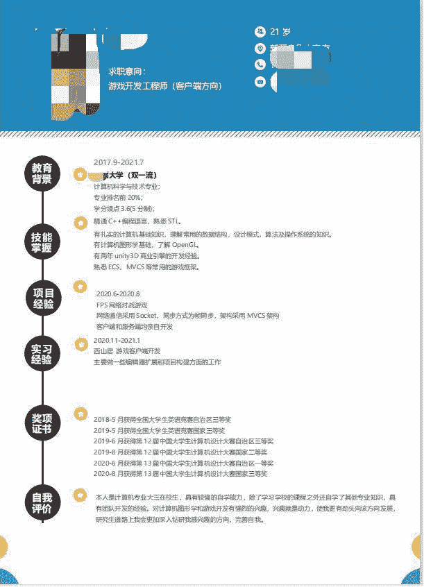

# 第四章 第 1 节 投递简历

> 原文：[`www.nowcoder.com/tutorial/10065/d536a035c0fd4e5797905d3abc946fcb`](https://www.nowcoder.com/tutorial/10065/d536a035c0fd4e5797905d3abc946fcb)

# 1 如何制作一份简历

## 1.1 简历的作用

        简历是去公司的一块敲门砖，优秀的简历往往有更大的几率拿到 offer，而不好的简历可能连笔试或面试的机会都把握不住。所以如何制作一份优秀的简历是在求职前非常重要的一环。

## 1.2 我还算“优秀”的简历

        首先网上教简历写法的有一大堆，但是往往都是鱼龙混杂，不好区分什么简历才是适合自己的且适合所投递岗位的。以下我推荐一下我的简历写法，毕竟我也算是“过来人”，简历通过率也高达 70%~80%呢，如果对写简历没什么头绪的小伙伴可以参考着我的简历来写。

### 1.2.1 教育背景

        教育背景一般是在第一个模块写的，让面试官第一眼便对你有一个大概的了解，在什么学校读书，学历是多少，看一眼便知。这一模块不必大篇幅阐述，尽量做到简洁为主，但是也不能毫无特色，比如你的学校是双一流大学，可在学校后写上双一流，这样可以给自己戴一个双一流的光环。如果你的学校很出名，比如清华、北大之类的，那写不写倒也无所谓。**教育背景模块必须要写的有：**

*   学校

*   毕业时间

*   专业

*   专业排名（可加第一印象分，如果不好就不要写）

*   学分绩点（可加第一印象分，如果不好就不要写）

### **1.1.2.2 专业技能**

        专业技能可在第二个模块直接展示，因为公司招人肯定是看专业技能是否与岗位匹配，所以尽量写在前面，最好一条一条的把自己掌握的专业技能列举出来，这样条理清晰，方便面试官查看。专业技能一定要写自己熟练掌握的，不熟悉的东西最好别往上写，因为面试官面试的知识点大部分都是根据简历内容问的。

### **1.1.2.3 项目经验**

        项目经验可在专业技能下写，一般也是按照自己所做的项目一一列举出来，每个项目可在后方简明注释自己所用到的核心框架、技术等，如果这个项目是组队完成的 ，那么要标明自己负责的是哪一模块的开发，同样的，不可以大篇幅去写，要做到简洁明了。

### 1.2.4 实习经验

        实习经验是用来给简历镀金的，在正式工作之前，如果具有实习经验的话，那么简历通过率还是很高的，因为有实习经验意味着已经体验过公司的工作流程，基本了解当前岗位的工作内容，所以如果有实习经验一定要往简历上写。和上面一样，不需要写的太复杂，写上什么时期在哪个公司实习，做了哪方面的工作内容即可。

### 1.2.5 奖项证书

        这一模块主要列举大学期间参与的比赛以及获得的奖项，参与比赛获奖可体现出自己的实践能力，也是非常重要的。奖项多的话，也是一一列举，只需注明参与什么比赛获得几等奖即可，不用过多描述。

### 1.2.6 自我评价

        自我评价主要是写一写自己的优点，别写缺点就是了，因为是给别人看的，肯定是展现自己好的一面，我推荐自我评价可以多写一些自己对于所投递岗位的热爱，这样也是可以加分的。对于游戏岗来说，肯定是写自己热爱游戏了，以及自己对游戏的看法都可以写写。

## 1.3 我的简历展示（仅供参考）

        

## 1.4 优秀简历模板推荐

[牛客简历助手](https://www.nowcoder.com/quick-fill/show-introduce)可一键填写简历，帮你告别繁琐的简历流程，用起来非常方便，推荐大家使用。

# 2 如何投递一份简历

投递简历的方式有两种，一是内推，二是网申。

## 2.1 内推

        内推一般是简历免筛选，直接进入笔试，或者直接免笔试，进入面试阶段；最普通的内推则是可查简历进度。具体是简历免筛选进入笔试阶段还是免笔试进入面试阶段，主要根据该公司的内部员工推荐的不同而定。所以内推一定要询问内推者是哪种的形式。内推的方式有很多种，以下我列举了一些：

*   找一些内推的群聊

*   找公司内部员工推荐

*   找进入该公司的学长学姐推荐

*   牛客的[内推广场](https://www.nowcoder.com/discuss/referral/all/index)，以及牛客的论坛上也有很多帮助内推的人

## 2.2 网申

        网申是在网上投递简历，此阶段一般会有简历的筛选。        有些公司也会在网申时让填一些信息，游戏开发岗会让填一些问题，比如：“你为什么选择游戏行业?”;"你玩过什么游戏？"；“你认为自己在游戏开发上有什么优势？”等等。这些问题就往热爱游戏的角度去答就好了。**网申的方式：**

*   在公司官网的校招入口投递简历。

*   在一些招聘网站([牛客校招日程](https://www.nowcoder.com/school/schedule))投递简历。

*   直接将简历投递到公司指定人员的邮箱。

**注意事项：**

*   一定要确保自己的简历成功上传，不要投递一份空简历过去了。

*   不同的公司简历投递方式不太一样，有些是需要在公司校招网站上填写好简历提交，有些是直接提交做好的简历。