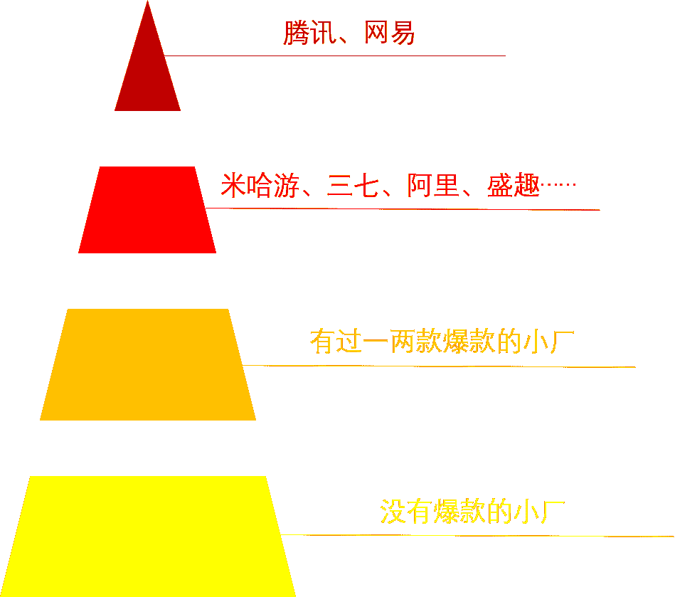

# 第二章 第 1 节 校招求职规划

> 原文：[`www.nowcoder.com/tutorial/10053/298a764201164a0e89ea6d46acc38c1e`](https://www.nowcoder.com/tutorial/10053/298a764201164a0e89ea6d46acc38c1e)

# **1\. 求职规划**

## **1.1 认识自我**

我认为在一切开始之前，有必要对自己做一个全面而准确的评估，所谓“知己知彼，百战不殆”。想求职游戏策划建议从以下几个方面给自己打个分（0~10）：

*   1/对游戏的热爱程度：必须是 10 分，不然真的别来应聘游戏策划，否则即使成功入职，后面也会非常痛苦。

*   2/学校：清北和 QS50（10 分），C9(9 分)，985/强 211(8 分)，末流 211/强一本(7 分)，其他 0~6 分

*   3/专业：游戏设计/数字互动娱乐等对口专业（10 分），CS&软件工程等代码相关专业（8.5 分），其他专业（8 分）

*   4/相关实习和项目：大厂游戏相关实习经历或游戏大赛获奖项目（10 分），中小厂游戏相关实习经历或互联网大厂非游戏实习经历（8~9 分），无相关实习和比赛（7 分）。

*   5/逻辑思维/团队合作能力/沟通能力等软实力（0-10 分）

*   除去第一项，剩下的打完分以后平均一下，如果能达到 8 分以上，基本可以以一线大厂(腾讯/网易)的游戏策划岗位为目标，如果在 7-8 分之间，可以主攻二线厂的同时冲击一线厂，往后以此类推。

## **1.2 了解校招**

传统校招大体分为秋招和春招两个阶段，但是由于这几年互联网公司抢人越来越激烈，再加上上半年一场疫情，2020 届开始校招的格局已经发生了很大的变化。如果不学会拥抱变化，还按之前的经验准备，可能就会错失良机，输在起跑线上。关于校招都发生了哪些变化，我用一个表格简单说明。*

|  | **疫情前校招** | **疫情后校招** |
| **时间** | **7-11 月&2-4 月** | **5-12 月&2-4 月** |
| **阶段** | **秋招提前批/秋招正式/秋招补招/春招** |
| **面试形式** | **线下面试居多** | **线上面试成为主流** |
| **应届要求** | **严格要求应届** | **部分公司要求放宽** |

从表中可以发现，校招的战线拉得更长了，现在基本上一整年都在招应届生，一方面因为海外的同学毕业时间发生了不同程度的变化，企业作出相应的调整，另一方面因为面试转到线上后求职的选择更多，企业之间的人才竞争就更激烈，必然会把战线拉的更长。

## 1.3 游戏策划岗位校招情况

那么，游戏策划岗位的校招情况如何呢？2020 年秋招网易互娱对游戏策划的需求量在二百多人，那求职的人有多少呢，官方的几个群加起来有 3000 人左右，算上没加群的同学可能接近 4000 人，也就是大约 20：1 这样的竞争比。在非技术岗中，这样的竞争比大概处于中游水平，同属非技术岗的产品经理已经是千军万马过独木桥，运营竞争比稍低但薪资普遍不如游戏策划，因此游戏策划岗在非技术岗中还是属于性价比较高的岗位。校招游戏策划在腾讯网易中没有做岗位细分，但是在其他大厂一般分为系统策划/文案策划/数值策划这三个，也有部分公司设有关卡策划/战斗策划岗。其中系统策划是门槛最低的岗位，几乎没有什么硬性要求；文案策划需要一定的文字功底，最好有过写网文或其他文字作品的经验；数值策划需要有一定的数学功底，一般倾向于理科专业（尤其是数学相关专业）的学生；关卡策划和战斗策划就更加专业，需要有一定的游戏设计经验才能胜任。大厂的校招流程一般要通过笔试和两到三轮的专业面试和一轮 hr 面，如果面试都通过了，会发意向书，最后是谈薪和 offer。

## 1.4 开展校招的游戏公司简介

关于游戏公司，腾讯和网易是第一梯队。其中腾讯拥有王者荣耀、和平精英两员大将常年霸占榜一二，占有中国游戏市场最大份额，游戏布局之广泛几乎涵盖了所有品类。网易紧随其后，梦幻西游，阴阳师等大 IP 保证了网易在中国游戏厂商稳坐第二把交椅，网易没有腾讯的 QQ 微信社交帝国作为流量支撑，而凭借强大的游戏研发能力走到今天，对游戏策划的能力要求不言而喻。第二梯队首先是凭原神一飞冲天的米哈游，紧接着有凭 afk 海内外通吃的莉莉丝，凭两款三国 IP 手游翻身的阿里互娱，老牌端游大厂盛趣/完美/搜狐畅游/巨人，主攻海外市场的趣加/igg，页游之虎三七互娱（最近在向精品化转型），被人当成视频网站的二次元游戏公司 bilibili，高调入局的字节跳动，拥有剑侠情缘 ip 的西山居，主打棋牌的 JJworld，还有游族/祖龙/网龙/等等。二线大厂的特点是虽不像腾讯网易拥有自己的游戏帝国，但各自有突出的特点和优势，对相关游戏品类感兴趣的同学来说也是很棒的选择。除去一二梯队的大厂，剩下的游戏公司水平就比较参差不齐了，大体可以分为有过爆款的和没有过爆款的。没有爆款的公司这里不推荐应届生去，可以等有一定经验后再考虑。

## 1.5 **心态建议**

**校招是一场拉力赛，是一场马拉松。**一定要清楚的认识到，岗位不是一次性招满的，大厂们要从 5 月一直到来年 4 月这么长的一段时间内把所有的 offer 发出去，尤其是一些大厂（字节/网易/腾讯/阿里等）有疯狂捞人挂人再捞人的习惯，我个人就被腾讯捞了三次。所以拿到目标 offer 前千万不要放弃投递放弃面试，只要还有 hc，就有上岸的机会。**第一份 offer 很重要，不要只投腾讯网易。**第一份 offer 真的很重要，不仅能给你信心，还能让你对自己的水平有一个更准确的认识，也让你对整个面试流程有个了解，这些对后面的求职都有很大帮助。所以投递游戏公司时一定要广撒网，一线厂二线厂都投一投，不要只盯着腾讯网易，你的自信心一旦被一封又一封的感谢信摧毁，之后的求职会越来越难。

# 2\. 校招规划

在开始为自己目标岗位奋斗之前，最好做一份详细的规划，内容包括但不限于：**1.秋招战略安排 ****2.求职准备工作清单****3****.****时间分配表**

## 2.1 **秋招战略安排**

首先对整个秋招要有战略性和方向性上的把控。首先确定目标行业，进而确定目标岗位，最后确定目标公司。我当时一心想进入互联网这个大行业，但是在在线教育行业和游戏行业之间犹豫，最终选择了兴趣更加匹配的游戏行业，这里给大家一个小建议，选择行业时要多方面因素综合考虑，千万别冲动一时做决定，有时选择比努力更重要。目标公司和岗位要和自身的能力大致匹配，我在前面的自我评价中得到 8 分，因为我自身专业的限制，不能选择美术和开发，所以一开始定的方向是运营和策划，最终还是到聚焦策划，并且是个老二次元，但文字功底和数学能力都不咋样，那么主要目标是 bilibili 的游戏系统策划岗位，并尽自己努力向网易腾讯的游戏设计师岗位冲刺。

## 2.2 **求职准备工作清单**

求职游戏策划，你所要准备的东西有：必要项：一份打磨了 N 遍的简历；越丰富越好的游戏经历/深刻而又全面的游戏理解；一个或以上求职用的小作品；一份不用看稿也能说得很流畅的自我介绍。加分项：一段游戏相关实习经验；刷越多越好的笔试题和面经；一款你参与制作的 demo 或 minigame/一个完整的文学作品（文案策划）等；其他一切和策划岗位技能有关的经历。当然，在有限的时间内不可能拥有所有以上这些东西，所以分清轻重缓急，根据自己的情况列出一份详细的准备工作清单，当准备工作完成后信心满满地开始笔试面试即可。我在第一次面试前能拿得出手的只有一份还不错的简历，没有小作品也没有准备好流畅的自我介绍，被面试官批准备不充分，结果也是不出意料的挂掉，希望大家以我为鉴，不要犯和我一样的错误。

## 2.3 **时间分配表**

由于本专刊是针对应届生，应届生除了秋招还要上课，考试，毕业设计，对于硕士生来说还要处理导师安排的各种科研任务和杂事。因此事先做好时间分配十分有必要，以免造成多件事冲突脑子乱成一锅粥。给大家参考一下我的时间安排：我秋招时白天做科研写论文，晚上用来学习游戏策划有关知识，周末用来实习，这样先把时间安排好就不会手忙脚乱。以及整个秋招过程当中也需要提前做好时间规划，比如 6 月以前整体复习，6-7 月集中复习，7-8 月集中投递简历，9 月集中面试，这样的一个大致的时间规划，把握好自己的整个秋招流程，不至于手忙脚乱。