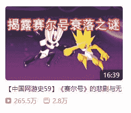
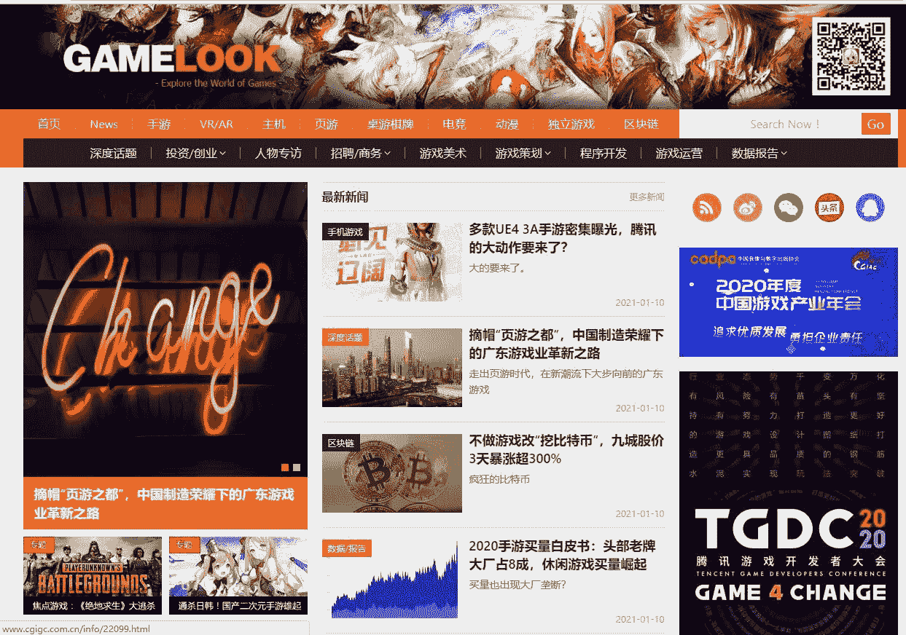

# 第二章 第 2 节 学习规划

> 原文：[`www.nowcoder.com/tutorial/10053/4eee47b5e17e48f093c4a084534a8b72`](https://www.nowcoder.com/tutorial/10053/4eee47b5e17e48f093c4a084534a8b72)

# **1\. 校招岗位技能树**

上图的游戏策划技能树在第三章会对各个部分进行详细讲解。

# **2\. 学习资源推荐**

## 2.1 **玩更多游戏**

这是最重要也是最有用的提升策划实力的方法，但是并不同于普通的玩家玩游戏，游戏策划玩游戏要有针对性的玩，在自己专精的游戏上横向扩展和纵向延伸。比如说你是一个网易《率土之滨》的三年老玩家，那么横向扩展上你需要做的就是玩遍市面上所有成功的 SLG 品类的游戏，例如灵犀互娱的《三国志战略版》，莉莉丝的《万国觉醒》，ELEX 的《列王的纷争（COK）》，腾讯的《宏图之下》等，都玩过一段时间后写一份竞品分析，也就是同类型游戏之间的异同点和优缺点；纵向延伸就是在这些同类游戏中选一款你最喜欢的游戏，更深入体验这个游戏的全部内容，如果你之前是白嫖党，那么对于 SLG 游戏来说，只得到了一小部分游戏体验，大 R 的快乐你根本想象不到，所以你要做的就是充充充，感受大 R 的游戏体验，再比如有的人玩 lol 只玩大乱斗不玩排位，这样的玩家其实根本没有深入体验到游戏的全部内容，也就不能指望他对游戏有什么深入的理解了。

## 2.2 **相关书籍**

首推牛客大学的 Moon 清欢大佬写的付费专刊—《0 基础入行-游戏策划校招必备知识》。专刊第一章是免费的，我看完第一章就决定果断入手了，里面详细讲解了游戏策划的岗位分工，岗位职责，自己游戏策划入门的基础知识和针对面试笔试的解题技巧，非常有用且是接地气的实战利器。其他我看过的书包括:《通关！游戏设计之道》《游戏架构设计与策划基础》《游戏制作人手册-天之虹》《游戏的设计与开发：梦开始的地方》《游戏设计的艺术：一本透镜的书》，其中非常推荐《通关》作为策划入门书，语言诙谐幽默插图很多，轻松愉快看完的同时得到很多干货。更多游戏策划相关书籍推荐知乎上谬谬和谋谋大佬的书单.

| 图书 | 介绍 |
| [《0 基础入行-游戏策划校招必备知识》](https://www.nowcoder.com/tutorial/10013/index) | 适合 0 基础快速入门游戏策划。涵盖基础理解，游戏设计专业知识，游戏设计理论及其应用，校招笔试和面试的试题分析。作者是 LOL 前职业选手，曾就职 JDG 俱乐部教练。 |
| 《通关！游戏设计之道》 | 囊括了游戏设计的整个流程，剧情、设计文档、游戏策略及玩法等内容。语言幽默，图文并茂，不知不觉就能看完一整本。入门级书籍，内容简单容易理解，激发对游戏设计的兴趣。 |
| 《游戏架构设计与策划基础》 | 以当前游戏公司实际游戏策划设计方案为教学实例，介绍游戏策划设计的基本理论。看起来可能会有点枯燥，看完前两本的基础上可以看看这本。 |
| 《游戏制作人手册-天之虹》 | 由《The Game Producer's Handbook》翻译而来。其目的是对业内制作人带来提升和补足，从而提升国内整个行业的产品品质和项目存活/成功几率，进一步完善和规范行业。适合有一定基础的同学阅读，进一步提高自己。 |
| 《游戏的设计与开发：梦开始的地方》 | 本书针对的读者群是游戏业的从业人员和大中学生中的游戏爱好者，也适合作为游戏业界的培训教材及相关高等院校的参考教材。对程序技术方面有比较详细的介绍，适合有一定程序基础的同学阅读。 |
| 《游戏设计的艺术：一本透镜的书》 | 同样是天之虹前辈所翻译的外国著作，适合有一定基础的同学阅读。 |

## 2.3 **教学视频**

我所有的教学视频都是在 b 站看的，感谢 b 站大学。我看过的视频包括：求知鱼的《游戏策划入门直播系列》《游戏策划之夜系列》；鱼一元的《游戏设计手册系列》；清华大学数字娱乐设计课程《游戏心理与策划》；龟派游戏的《从零开始的数值生活系列》；芒果冰 OL 的《中国网游史》等。

| 教学 up 主 | 介绍 |
| 求知鱼 | 原腾讯主策大佬主讲。涉及腾讯游戏项目立项和开发流程、游戏部门组织架构和职能分工、策划岗位职能讲解、游戏玩家转职策划的关键点和条件、游戏策划入门的学习方法和职业晋升之路、游戏各个岗位的薪资和岗位 JD 讲解等等。非常适合新人入门观看。 |
| 鱼一元 | 目前仍在某 3A 游戏公司的大佬制作。既有娱乐性质的视频，也有各种专业知识，在娱乐中就能学到很多游戏设计知识，视频时长不长，适合平时闲的没事看看。也有一些游戏行业的新闻和点评，都值得一看。 |
| 林宾华 |  清华美院游戏设计专业的课程录播视频。主讲林宾华，《产品为王：移动游戏产品设计规则》一书的作者，曾就职于各大网络游戏公司，对游戏设计理解读到。值得一看，且内容并不枯燥。 |
| 龟派游戏 | 一个对数值策划非常非常有帮助的视频，从游戏公式到数值管理，干货满满。主讲刘勇老仙，国内最早一批数值策划，经验丰富身经百战，视频中讲到的许多技巧是实战中能用得上的。目前一共 40 期，如果能完整看完对数值策划的理解会更上一层楼。 |
| 芒果冰 OL | 中国网游史系列帮助芒果冰登上 2018bilibili 百大 up 主颁奖台，每一期都能保持上百万的播放量，内容有趣的同时讲述了中国网游的真实发展史。帮助你了解更多中国网友的故事和牛人，使其成为你面试时的谈资，拉进你和面试官之间的距离。 |

## 2.4 **各种游戏****媒体**

各类游戏媒体是了解游戏行业现状的绝佳途径，这里推荐的游戏媒体有游戏葡萄，游资网，游研社，gamelook 等。

| 游戏媒体 | 介绍 |
| 游戏葡萄 | 从主页就能看出来，主要是针对游戏行业投资人的文章，阅读这些文章能让你大致了解资本青睐的游戏类型；对目前游戏的流行趋势有大致了解；感知游戏行业的风向。 |
| 游资网 | 更多针对游戏行业研发人员的文章，其中有许多游戏团队分享自己开发游戏的新路历程，也有一些宝贵的经验和教训。曾经游资网的论坛也是非常值得一看的，如今没落了。 |
| 游研社 | 主要面向游戏玩家的媒体，其中有最新的游戏资讯，也有一些比较专业的游戏测评，可以多看一些有深度的游戏测评文章提高自己的游戏理解。 |
| gamelook | 比较综合性的网站，无论是普通玩家或者游戏开发者抑或是游戏行业投资人，在 gamelook 都能找到对自己有用的信息。gamelook 包罗万象，但可能对某一领域深耕不足，可以从其中挑选对自己有用的文章阅读。 |

## 2.5 **抱大腿找组织**

抓住各处出没的大佬，包括但不限于牛客/知乎/贴吧/各种游策论坛的大佬，用不要脸的精神请求指导和帮助。另外积极加入一切有关游戏策划的学习交流 qq 群，这些群里通常有丰富的资料包括策划案，系统拆解，竞品分析等，应有尽有。