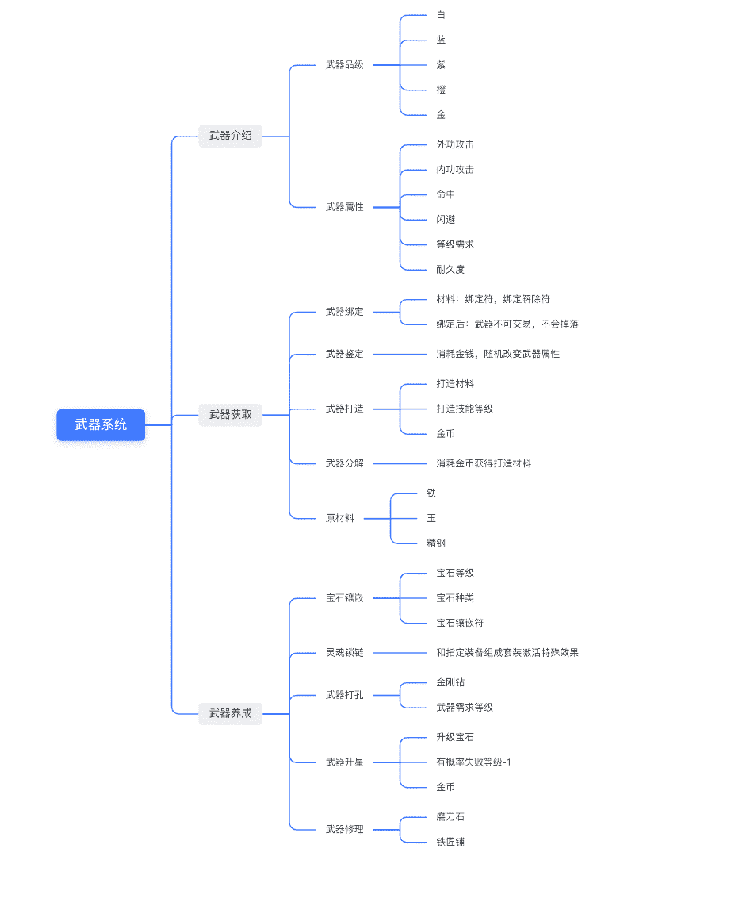

# 第三章 第 1 节 专业技能准备与提升（上）

> 原文：[`www.nowcoder.com/tutorial/10053/cb700ef2f9d14d22b59ae6a30b1cb8eb`](https://www.nowcoder.com/tutorial/10053/cb700ef2f9d14d22b59ae6a30b1cb8eb)

接下来将会对上一章中的技能树做详细解释，包括具体的知识点、技能要求达到的标准、实际面试笔试中针对该技能的例题。游戏策划的技能总体分为软实力和硬实力两大部分。软实力主要包括设计能力，沟通能力，学习能力和逻辑思维四方面。软实力的提升不是一朝一夕可以完成的，也不能用确定的标准来衡量，但是本专刊可以给出一个优秀软实力的范例，供大家参考。硬实力有比较明确的标准。通用的知识是行业认知，另外各个工种有不同的要求，文案策划需要文字功底，数值策划需要数学功底，关卡策划需要会用编辑器和引擎。

# 1\. 设计能力

## 1.1 产品思维

产品思维就是在体验过市面上绝大部分优秀的互联网产品的基础上，善用市场需求-产品功能-具体实现这样的思考方式解决问题。**例题：牛客解决了什么样的核心需求？怎么解决的？****解析：**

*   产品思维第一步，挖掘需求，提出问题。

牛客网所解决的核心需求就是求职，由于企业和求职者之间存在的信息不对称，求职者面临很多问题，比如：缺乏招聘信息；不了解面试笔试情况；缺少学习平台；缺少和其他求职者沟通的社区等。

*   产品思维第二步，针对需求，设计功能。

针对上面提到的一系列问题，可以设计下列功能：发布招聘信息的求职板；各大企业历年面试笔试题库；知识学习资源库；求职者相互交流的讨论区。

*   产品思维第三步，具体落实，功能实现。

牛客网求职板分为社招版和校招版，按照企业性质，行业，岗位，工作地点等分类每天更新企业最新招聘信息，让求职者能迅速找到和自己意愿匹配的岗位信息。牛客网题库按公司，职位，年份分类，笔试方面收录了大量笔试真题，并提供在线编程，模拟考试，专项练习等功能；面试方面提供模拟面试，面试点评等功能，让求职者做到心中有数。牛客网学习板块包含课程、专栏文章、图书馆、项目实战等模块，给求职者提供学习平台。最后牛客特色地设计讨论区和圈子，以 BBS 的形式给求职者提供相互沟通的社区。

## 1.2 创新能力

创新能力是指在体验过所有热门游戏品类，了解各品类游戏的底层设计，了解目前电子游戏技术能实现的功能的基础上，能做出不同玩法的结合或微创新，甚至提出全新玩法的能力。**例题：给明日方舟设计一个新干员，立绘是高个手持铳枪的妹子，给出各项设定和技能描述？****解析：**首先要了解明日方舟中干员包含的机制和元素，包括干员的名称、星级、定位、描述、射程、特性、技能、身材、部署费用、潜能、天赋等。设计时要结合题目中给出的条件，不能有违和感，并且体现出各个元素和机制之间的联系。**示例解答：**新干员撒切尔，是一位来自谢拉格高原的游牧骑士，作为近卫干员加入罗德岛的队伍中，由于她手持铳枪攻击距离较长，可以攻击到身前三格的敌人，但攻击不到自己本身所在格子的敌人，独特的攻击手段使她的攻击可以小幅度击退敌人，撒切尔拥有三个技能，一技能慷慨激昂：可以加快 20%自身攻击速度；二技能高原血统：自身缓慢恢复生命并免疫控制 8 秒；三技能横扫千军：撒切尔的攻击距离增加 1，攻击间隔略微增加，大幅增加攻击击退敌人的幅度。撒切尔的身材在近卫中属于低 DPS，高血量的功能型近卫，部署费用为 18，初始阻挡数为 1。在战术中的位置是提供控制，减速敌人的同时聚怪，配合术士打出爆炸输出，但撒切尔的攻击力并不出众，要合理搭配阵容才能发挥出她的实力。

## 1.3 设计理论

对于系统策划来讲了解系统设计论会有不小的帮助，对于数值策划来说则是数值设计的理论了解的越多越好。**例题：《炉石传说》中卡牌的强度如何比较？怎样保持卡牌的平衡性？****解析：**炉石传说可以说是卡牌游戏中的标杆了，炉石传说的卡牌模型和体系非常经典，正是这套模型体系保证了炉石中所有卡牌的平衡，并且在多次更新后也不会轻易打破平衡。由于整个模型体系说来话长，面试时点到重点即可。炉石传说有一套完整的模型来衡量卡牌的强度。首先是随从身材，白板随从身材和费用之间的关系是：费用*2+1=随从攻击+随从血量，例如鱼人袭击者，2/1 身材费用为 1，淡水鳄：2/3 身材费用为 2，蜘蛛坦克：3/4 身材费用为 3。然后是卡差价值，炉石中过牌十分重要：例如奥术智慧 3 费用过 2 张牌，滋养 5 费用过 3 张牌，疾跑 7 费用过 4 张牌，因此一点卡差=两点费用。最后是随从特技，以潜行和圣盾为例，潜行=圣盾=一点费用。有了以上的价值模型，炉石传说中大部分卡牌的强度都可以统一为费用来进行比较，如果实际费用低于强度则是“超模”，需要适当削弱；如果实际费用高于强度则是“弱卡”，需要适当加强，以此来维持游戏平衡。

# 2\. 沟通能力（在整个面试过程中考察，因此未给出例题）

## 2.1 理解能力

这里所说的理解能力专指能理解美术和程序的语言和思想。一方面有基础审美观，了解美术相关——尤其画风/建模/空间关系等游戏美术名词。另一方面有一定程序基础，尤其对于关卡策划和脚本策划，要有编写基本程序的能力。

## 2.2 表达能力

表达可以分为书面表达和口头表达。书面表达即能写一份完整的策划案，无遗漏细节无产生歧义，能够让团队中每一个人准确理解策划案中的设计，同时具备具象化思维，比如用 “血量高防御高”代替“肉”，用 “具体的时间节点”代替“节奏快/慢”。口头表达即说话有逻辑有层次，并能顾及他人感受。

## 2.3 情绪管理

面对各种冲突和意见分歧时能保持冷静并始终以解决问题为目标。理智面对玩家谩骂，承受得住巨大的工作压力等。

# 3\. 学习能力

## 3.1 自省和接受批评

作为策划不能一意孤行，要能虚心接受批评，接纳合理建议，不断迭代游戏内容。**例题：如果你的策划方案和其他人出现巨大分歧你会怎么办？****解析：**这类问题不仅出现在面试中，后续也一定会真正出现在工作中，当遇到分歧时，首先要做的就是整理情绪，让沟通处在一个和谐愉快地大环境下；然后要摘除自己的个人偏见，比如有人喜欢萝莉而有人喜欢御姐，但是绝不能因为自己的偏好影响决策；最后要表达自己虚心接受批评，接纳合理建议的态度，在讨论过程中不断优化游戏设计。

## 3.2 主观能动性

面对具体项目积极学习各种新知识，例如文案策划做三国项目能主动阅读三国相关史书，阅览三国题材的电视剧，小说，玩三国题材的游戏等。随时随地给自己充电。**例题：从什么时候开始准备应聘游戏策划的，期间做了哪些准备？****解析：**参考本专刊 2.2 学习规划，把自己学习的历程娓娓道来即可。

# 4\. 逻辑思维能力

## 4.1 设计逆推

能从游戏表现大概推测出游戏的内在机制。**例题：试着分析一下王者荣耀的排位匹配系统？这么设计有什么优点？****解析：**首先列出王者荣耀排位匹配的规则，列举的越详细越全面越好，然后针对这些规则思考为什么这么设计，也可以和其他同类游戏做对比。王者荣耀匹配系统设计要素：1、五排优先匹配五排，多人优先匹配多人 2、青铜段位会排到对面机器人 3、段位优先在一个大段位差以内，如果匹配不到则向下兼容 4、所谓连跪后的“福利局”和连胜后的“制裁局”这样设计的优点有：1、尽可能保证排位对局的公平性 2、降低游戏门槛，给新手玩家良好游戏体验 3、“福利局”能防止玩家心态爆炸，游戏体验断崖式下跌；而“制裁局”能一定程度上防止高手开小号刷战绩或代练等不公平游戏行为。4、向下兼容的匹配机制能防止段位太高的玩家因长时间排不到人而放弃排位。

## 4.2 竞品分析

从各个方面客观评价几款类型相同的热门游戏的优缺点，包括玩家群体，各系统设计，充值体验，数值设计等，并能从对比分析中提出自己的见解。**例题：手游放置类游戏都玩过哪些？比较一下他们的优缺点？****解析：**以表格形式给大家提供一些分析角度做参考

|  | 旅行青蛙 | 最强蜗牛 | 剑与远征 |
| 核心玩法 | 休闲放置 | 放置养成 | 卡牌放置 |
| 美术风格 | 日式卡通可爱 | 绘本式卡通搞怪 | 欧美卡通 |
| 战斗系统 | 无 | 纯数值，无操作空间 | 策略性（职业/种族/站位/大招时机） |
| 难度 | 零（全程没有任何难度） | 低（零门槛/武器搭配属性选择上有一点点策略性）有 pvp 纯拼数值 | 中（有一定策略性/属性克制/职业克制/大招效果）有策略性的 pvp |
| 数值平衡 | 无 | 庞大复杂，总体不错 | 优 |
| 养成系统 | 独特性个性极强（定制） | 纯数值（头像解锁都提升数值，汗）/有限的独特性 | 卡牌养成（独特性低） |
| 策略性 | 无 | 极低 | 高 |
| 创新点 | 挂机强制无交互（无时间加速/无） | 收入方式（观看广告）/研运一体/游中游 | 轻度 Roguelike 玩法异界迷宫/种族克制玩法 |
| 受众 | 19-28 岁偏女性玩家 | 短视频 app 用户/碎片时间 | 年轻男 16-28 岁有策略性要求（花时间查攻略/调阵容） |

## 4.3 系统拆解

将大的系统逐级拆分，得到整个系统的所有设计细节。**例题：一个典型 MMOPRPG 游戏的武器系统的有哪些功能？这些功能和哪些其他系统相关？****解析：**可以用思维导图的形式简单拆解一个游戏的武器系统，平时多做拆解练习有助于提高自己系统拆解的能力。
