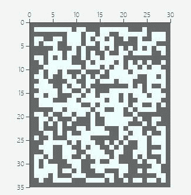
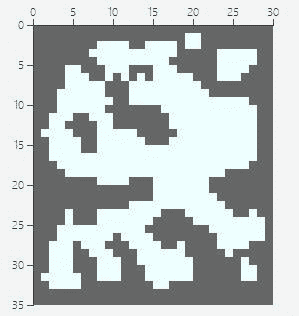

# 第三章 第 2 节 专业技能准备与提升（下）

> 原文：[`www.nowcoder.com/tutorial/10053/d05fe5a5e32f4c1f84213aa163a3954b`](https://www.nowcoder.com/tutorial/10053/d05fe5a5e32f4c1f84213aa163a3954b)

# 5\. 行业认知

包括游戏行业的发展历史，目前游戏行业的发展趋势，国家对游戏方面的政策，资本偏好和玩家偏好，近期游戏行业的大新闻，游戏策划岗位的历史，国内外游戏策划的区别，国内外有名的游戏策划等。总之知道的越多越好。**例题：最近 Party Game 风靡市场，谈谈你的理解？****解析：**Party game 最近风靡的原因主要有以下几点：1/全球疫情的大背景下，人们的社交刚需不能在线下得到解决，因而转为线上。2/party game 有浓厚社交属性的同时不需要太高的操作性和策略性，上手容易，学习成本低的同时轻松明快，很适合没接触过游戏的新手。3/主播的“带货”效应。无论是《动物派对》、《糖豆人》还是《Among us》，都是在大游戏主播的宣传下迅速风靡，由于 party game 容易制造“节目效果”并营造欢乐氛围，主播也乐意游玩，甚至对游戏免费宣传。**Party game 的缺点**1/游戏深度不够，缺乏核心玩家。Party game 为了降低游戏学习成本，通常会放弃游戏深度，从而很难吸引到核心玩家，这就导致游戏的寿命大大缩短。2/可替代性强，用户黏度低。由于 party game 的制作成本较低，技术含量也相对不高，导致一旦一款游戏爆红，市场上会立刻出现大量换皮游戏，从而导致玩家大量流失。因此目前 party game 虽然形成了一股潮流，满足了大环境下玩家的需要，但其本身仍存在问题，如果我来制作一款 party game 不会无脑跟风，而是突出游戏的独特性和内容深度，跟上潮流的同时能留住忠实玩家，这样的 party game 才站得住脚。

# 6\. 文字功底(文案策划)

有大量文字输出的积累，比如在起点上有连载的小说，或写过电视剧或电影的剧本，甚至参与过完整度较高的游戏文案。**例题：以三国历史为大世界观，给一个刺客角色写一段完整的背景故事，并补充他的各项设定？**摘一段王者荣耀马超的背景故事和人物设定供大家参考：据资料显示，马超是一名冷静利落的战士，他本是西凉少寨主之一，但他的父亲在一场阴谋的教唆下，挑起同族相残。少寨主们本共同立誓维护西凉和平，却最终纷纷倒在刀尖之下，马超也被父亲关押。在族中长老帮助下，他连夜逃出，带着牺牲兄弟的遗物——四把冷晖枪， 流落异乡的他，被司马懿利用，以教授御枪之术为交换条件，司马懿让马超进入益城军收集情报……他是来自异乡的流亡儿。不在乎吃喝，只在乎背着的四把枪，夜里睡觉也枕在头下。作为武都军师的司马懿找到了他，以教授御枪之术为交换，条件是混入益城军，收集情报。

# 7\. 数学功底(数值策划)

掌握各种游戏公式和算法，如加法公式/减法公式，圆桌算法/瀑布算法等。掌握常用数学工具，最重要也是最常用的 excel 中的各种功能函数和 vba，其他工具如 matlab 等。**例题：卡池共有 5 个不同英雄，抽到他们的概率相同，问将 5 个英雄抽齐预计需要多少次？****解析：第一张一定可以抽到不重复的卡，因此抽一张不重复英雄的期望是 1，第二张有 4/5 概率抽到不重复英雄，平均需要抽 5/4 次，因此抽两张不重复英雄的期望是 1+5/4，以此类推，抽五张不重复英雄的期望是 1+5/4+5/3+5/2+5/1=11.4 次。**

# 8\. 编辑器和引擎(关卡策划)

会使用至少一个游戏引擎或编辑器，能使用游戏引擎或编辑器进行白盒制作，地图和场景设计，能编写基础的脚本，面试时最好能拿出比较完整的作品（今年某厂的笔试题就是根据要求制作关卡 demo）。**例题：roguelike 游戏中随机生成地图时如何实现的？**生成随机地图的方法有很多，此处引用 eastecho 发表在 indienova 上的文章中的方法。首先，我们要生成一幅随机地图，我们通过控制随机数的范围分布来实现它。一般情况下，我们采用小于 50% 的几率来生成墙，其余的就是地面。地面是可行走的，而墙则是可碰撞的。生成后的地图应该是一个二维数组 mapArray，接下来我们开始遍历整个数组的每个元素，采用的规则（我们叫它 4－5 规则）如下：1、如果当前元素是墙，那么周围超过 4 个墙就还保持为墙 2、如果当前元素是地板，那么周围超过 5 个墙就变为墙 3、循环直至完成 4、重复循环 4～5 次就可以得到结果初始地图循环后生成随机地牢地图

# 9\. 其他能力

Everything。没错，策划是非常需要知识广度的岗位，因为游戏就是一个小世界，而策划就是这个小世界的上帝。行为心理学有助于理解玩家行为，设计反馈机制，经济学则有助于货币系统和交易系统的设计，各种历史和神话知识能让你设计的游戏更有代入感等。另外根据游戏项目的不同，要学习不同的相关知识：如果开发 FPS 项目，就要学习枪支的结构、原理、后座力等；如果开发音乐游戏则需要基本的乐理知识。