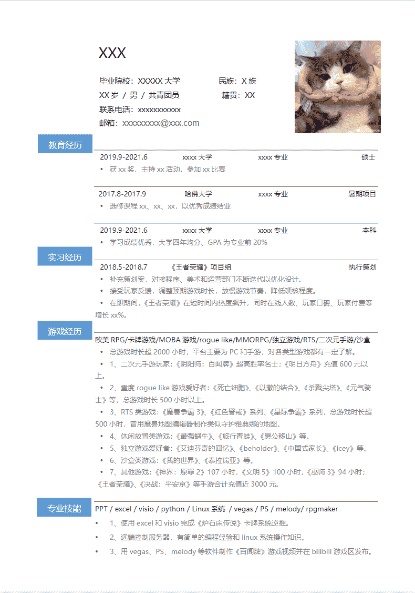

# 第四章 第 1 节 简历撰写要点

> 原文：[`www.nowcoder.com/tutorial/10053/5d06d9f70acb46fa9bf3718439e7e52c`](https://www.nowcoder.com/tutorial/10053/5d06d9f70acb46fa9bf3718439e7e52c)

# **1 如何制作一份简历**

简历主要用在两个地方：网申后 hr 进行简历筛选；面试时面试官针对简历进行提问。可见简历的作用几乎贯穿招聘的整个流程，所以简历非常非常非常重要！对于游戏策划来说简历分为几个大模块：个人信息、教育经历、实习/项目/比赛、游戏经历、求职作品（附页）。

## 1.1 个人信息

简洁清晰，写最有用的信息。姓名自不必说，年龄可以让 hr 看出你的学业是否顺利，一张干净整洁的职业照能给 hr 和面试官良好的第一印象，手机号和邮箱是重要的联系方式，base 城市则和就业选择的公司所在地有关（PS：一些无用信息如星座、血型等千万不要写上去，这只会让人觉得你很幼稚）。

## 1.2 教育经历

教育经历按照习惯由近及远写至本科，包括的信息有学校、时间段、专业、学历&学位、与应聘岗位相关的所修课程、学历期间获得的重量级奖学金或三好学生优秀干部等荣誉称号（PS：如果有短期的交换项目如暑期、半年或一年的也可以写进去）。

## 1.3 实习/项目/比赛

实习和项目应写明公司名称、实习/项目的时间段、所担任的岗位职责、期间所做工作、以及带给你的收获。比赛应写明比赛名称和时间、比赛所获奖项、简单介绍比赛内容、以及带给你的收获。写这一板块需要注意两点，一是如果不是大厂实习和很重量级的比赛奖项的话，一定要用心写写自己的收获，因为一份普通的实习并不能说明你的优秀，面试官更看重你的成长和学习能力；二是这个模块一定要一字一句的仔细打磨，争取做到给面试官眼前一亮的感觉，因为这是最能将你和其他应届生区分开的模块（PS:可以适当包装但是千万不要作假，尤其是涉及数据，否则一旦被查出后果不堪设想）。

## 1.4 游戏经历

求职游戏策划必须的特色模块，一定要有，千万不要把海投用的简历直接拿来投递游戏策划！具体可以按照游戏平台（主机、PC、移动端）或者游戏类型分类，按照你对每一类游戏的理解深度排序，写明自己所玩游戏的名称、时长、充值金额以及所有能展现所玩游戏深度的成就例如：王者段位、全成就、公会会长等。（PS：简历上写的所有游戏都必须吃透，如果是弃了很久的或是游戏时长不长的——要么别写、要么花时间去吃透，因为你写上去的每个游戏都有可能被面试官深挖）

## 1.5 求职作品

系统拆解、游戏理解、游戏测评等均是不错的求职作品。如果是线下招聘可以将求职作品另附一页和简历用别针别在一起，如果是网申则上传文件或附链接即可（PS:最好不要写策划案，因为作为校招生是不太可能写出一份合格的策划案的，写的不好反而会成为减分项）。优秀简历示范及模板推荐