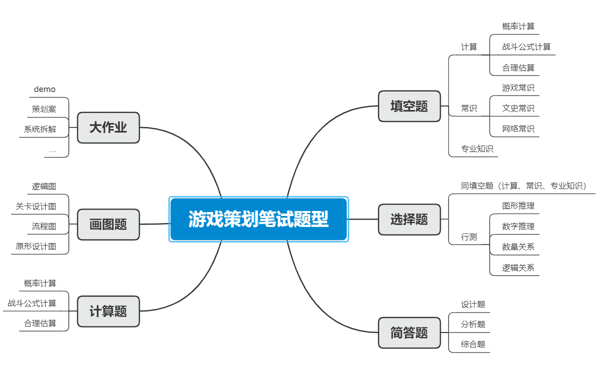

# 第四章 第 2 节 如何通过笔试

> 原文：[`www.nowcoder.com/tutorial/10053/5f9a666e57494e818896288a1fd52b52`](https://www.nowcoder.com/tutorial/10053/5f9a666e57494e818896288a1fd52b52)

简历通过后就会收到企业发来的笔试邀请的邮件，大厂开始笔试的时间相对较早，以网易互娱为例，第一批笔试时间为 8 月 12 日，而一般厂商开始笔试的时间相对较晚，大体在 8 中~10 月初之间。**那么笔试的题型有哪些？****笔试考察的都是哪些能力？****如何准备笔试？**下面的模块中将会详细说明。

# **1 笔试的题型**

游戏策划岗位的笔试题型五花八门，我所做过的笔试卷中出现过的题型总结如下图所示：这里举两个实际例子加深同学们的认识。如某大厂笔试试卷题型设置如下：选择题 40 道（40 分），填空题 5 道（10 分），简答题和计算题共 6 道（50 分）。某二次元厂笔试试卷题型设置如下：大作业——数学建模或制作 demo（50 分），大作业——玩法设计或游戏理解（50 分）。具体的笔试试卷大家可以在[牛客网](https://www.nowcoder.com/contestRoom)上找到真题，目前有搜狐畅游和 4399 等大厂的往年笔试试卷，参考上面的题目进行准备。

# **2 ****如何准备笔试**

由于游戏策划的笔试卷没有固定套路，因此很难有系统性、针对性地去准备，这里仅给出几个大方向供大家参考。

## 2.1、训练游戏理解和玩法设计（最重要）

这部分内容通常以简答题的形式考察，占分非常非常多。平时可以通过自己给自己出题不停提高自己的游戏理解和设计思路，对玩过的每一个游戏的一个系统都可以问是什么？为什么？怎么做。如炉石传说竞技场玩法的组牌规则是什么样的？为何这样设计？如果是你会怎么设计？

## 2.2、复习概率论和数理统计（数值方向）

由于概率计算必考且占分较多，概率论和数理统计这门课需要好好复习。其中古典概型、几何概型、贝叶斯公式、高斯分布、泊松分布是高频考点。

## 2.3、扩充常识

关于游戏的常识可以多看看游戏媒体的新闻，睡前看个一两篇就够了。网络常识可以多关注微博热搜。如果是应聘二次元游戏公司可以了解一下著名番剧的人物和梗。如果还有时间，三国和战国时期有名的将军和战役也可以了解一下。

## 2.4、刷行测题

许多中小型公司为了节约人力物力，干脆把公务员考试的行测题库拿来直接用来筛人。因此多刷点行测题是很有必要的，而且刷的这些题不仅可以用在游戏策划岗的笔试上，很多其他岗位的笔试和公务员笔试也能用的上。牛客网上就可以找到行测题库，大家可以每天刷几十道题，日积月累就能有所提高。

# 3 常见笔试题解析

下面给出一些例题，并给出参考答案。**a. ****游戏行业中的“流水”是指（）**A． 游戏发行商收入 B． 玩家充值总金额 C． 游戏研发商收入 D． 渠道商收入**参考答案：**B**解析：**这里简单盘点一下游戏行业常用术语。DAU(Daily Active User)日活跃用户数量。常用于反映网站、互联网应用或网络游戏的运营情况。DAU 通常统计一日（统计日）之内，登录或使用了某个产品的用户数（去除重复登录的用户），这与流量统计工具里的访客（UV）概念相似。DNU（Daily New Users）： 每日游戏中的新登入用户数量 AU（Active Users）：活跃用户，统计周期内，登录过游戏的用户数相应的，根据统计周期，有 DAU(日活跃用户)，WAU(周活跃用户),MAU(月活跃用户)等。PU ( Paying User）：付费用户 APA（Active Payment Account）：活跃付费用户数这里我们要注意“用户”和“付费用户”的区分，这也将影响收入的计算。ARPU(Average Revenue Per User) ：平均每用户收入，即可通过 总收入/AU 计算得出。ARPPU (Average Revenue Per Paying User)： 平均每付费用户收入，可通过 总收入/APA 计算得出。PUR(Pay User Rate)：付费比率，可通过 APA/AU 计算得出。LTV(Lift Time Value)：生命周期价值，即平均一个用户在首次登录游戏到最后一次登录游戏内，为该游戏创造的收入总计**b. ****怪物猎人中，代表武器锋利度的一种属性名为 _____。****参考答案：**斩味**c. ****尝试分析“皮肤/时装/外观”系统在游戏中的定位、作用、特点。可以以你玩过的某一款游戏进行举例分析，也可以针对该系统对多款游戏进行横向对比分析。****参考答案：**首先时装系统在游戏中的定位是创收系统中 pay to cool 的部分，大部分游戏的时装和游戏玩法无关，如阴阳师中的皮肤系统。而有些游戏会适当赋予时装数值以用来激起人们的购买欲，但是数值控制在基本不影响游戏平衡的范围内，例如王者荣耀的皮肤有微弱的属性加成，因此时装系统和游戏中其他系统的联系不大。时装系统的作用不仅是创收，游戏中通常有免费或游戏币就能购买的时装，例如荒野行动，奇迹暖暖等，这些时装的作用是为了增加玩家之间的区分度，使游戏角色个性化，增强玩家的代入感。另外由于时装系统承载的美术有文化属性，其非常适合用于联动和致敬，如英雄联盟中的刺客信条泰隆、第五人格中的杂技演员雨宫莲等。**d. ****在阴阳师游戏中，御魂有 6 个位置。4 件不同位置的御魂可以获得套装效果。假设在一个副本内，每次掉落一个御魂，掉落在 6 个位置中概率相同。**1）要集齐一套 4 件套，平均需要通关几次副本？2）如果要求 4 件套中，不能有 2 号位，平均需要通关几次副本？3）如果要求 4 件套中，必须有一件是 2 号位，平均需要通关几次副本？**参考答案：**1）第一件御魂不会重复，因此一次就可以拿到，第二件御魂有 5/6 的概率不会重复，因此平均用 6/5 次就可以拿到，以此类推，拿到四件套平均所用的次数为 6/6+6/5+6/4+6/3=5.7 次。2）6/5+6/4+6/3+6/2=7.7 次 3）在第一问的情况下，分为刚好四件且包含 2 号位，刚好四件且不包含 2 号位两种情况。C(4,5)/C(4,6)=1/3, 2/3×5.7+1/3×(5.7+6)=7.7 后面的 6 是单独出 2 号位的期望。

# 4  注意事项

在线笔试不要切换页面超过三次，否则按作弊处理取消资格。大部分笔试试卷题量较大，如果可以，先做大题再做选择填空。