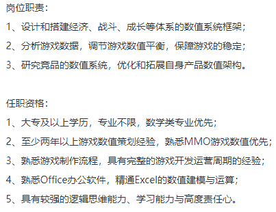

# 第四章 第 3 节 如何通过面试

> 原文：[`www.nowcoder.com/tutorial/10053/12ecfd8ee3394caaa17d86e72865c22f`](https://www.nowcoder.com/tutorial/10053/12ecfd8ee3394caaa17d86e72865c22f)

简历和笔试通常刷掉的是那些海投的和基本条件不过关的人，而面试环节才是真正的筛选符合企业需求的人才的环节。大厂的面试通常有二到三轮专业面试+一轮 hr 面，主要刷人是在专业面环节。一轮面试在整体流程上是有套路的，我把面试分为四个阶段：热身阶段——基础测试——能力边界测试——反问阶段。

# 1 热身阶段

### **热身阶段问什么？**

面试一开始，就进入了热身阶段。这个阶段在社交理论上是属于破冰时间，通常面试官会利用这段时间打量求职者、简单查看求职者的简历、对求职者的基本情况初步了解、缓解面试者的紧张和尴尬。这一阶段问到的典型问题有：做一个简单的自我介绍？为什么想应聘游戏策划？平常喜欢玩什么游戏？可见这一阶段的问题都相对比较容易回答，但是这不代表这些问题不重要，恰恰相反，第一印象在面试评分中可能会占很大的比重，也会影响到后面的面试体验，想要避免被面试官刁难的话就尽量在热身阶段好好表现吧。

### **如何作答？**

首先，要有一份准备好的自我介绍，不一定要背得滚瓜烂熟，但一定要流畅清晰有逻辑。一份合格的自我介绍需要 3-5 分钟，不要太长也不要太短，内容包括你的基本信息（姓名，年龄，哪里人），教育经历，所学专业，最后再简单说说自己应聘游戏策划有什么优势。第二，在简单问题的回答中抛出话头，也就是引导面试官提问。其实有点类似于标题党的原理，将你游戏经历中最闪光的点在不经意间抛出来，让面试官对其感兴趣进而问出你准备好的问题，例如问最近在玩什么游戏？你可以说：最近玩的游戏很多，主要在玩炉石传说，玩的同时一直在 NGA 论坛更新自己写的卡牌分析和攻略，得到了许多玩家的关注。这样回答了问题的同时暗示面试官针对你的卡牌分析和攻略提问。第三，表现出你对游戏的热爱和情怀。这点其实很重要，我在实际面试中见过一些同学上来就说自己游戏玩的不多，平时喜欢看剧和旅游，聊到游戏也是一知半解，这种表现在面试官眼里基本是判了***。最好是能做到聊游戏时滔滔不绝，眉飞色舞，眼里有团火。

# 2 基础测试

### **基础测试问什么？**

这一阶段主要考察求职者对游戏策划岗位职责和工作的基本了解；对游戏乐趣游戏玩法的大体认知；是否跳出玩家思维转为策划思维等基本游戏策划能力。这一阶段问到的典型问题有：你认为游戏策划的工作是什么？《明日方舟》最吸引你的地方是什么？简单描述一下你的项目/比赛/实习过程？

### **如何作答？**

**首先**，熟读岗位职责和任职资格。 “你认为游戏策划的工作是什么”这种题其实是送分题，把招聘网站上的岗位职责和任职资格用自己的话说出来即可。这里贴出一家公司的作为范例：

> 答题模板：我认为我的工作是负责 xxx，xxx，xxx，由于我有 xxx，xxx 能力，我认为我能胜任这份工作。范例作答：我认为我的工作一是负责设计和搭建游戏经济、战斗、成长等体系的数值系统框架；二是分析游戏数据，调节游戏数值平衡，保障游戏的稳定；三是研究竞品的数值系统，优化和拓展自身产品数值架构。首先由于我是理工科专业出身，有比较强的逻辑思维能力和数值分析能力，能快速上手游戏各个系统的数值设计；其次我有过游戏策划岗位的实习经验，熟悉游戏制作流程，具有完整的游戏开发运营周期的经验；第三我尤其擅长 MMO 类游戏，曾经对某 MMO 游戏武器系统的数值设计进行倒推并发布于 NGA 论坛，获得大量关注；第四我熟悉 office 办公软件，精通 excel 的数值建模与计算。

**第二，**对简历上每一款游戏写一段分析评论。由于每一款游戏都有可能被面试官提问到，因此面试前对每一款游戏都仔细打磨出一段分析评论非常有帮助。答题思路最好用 MDA (Mechanics，Dynamics，Aesthetics)理论，这里不展开细讲，网上有许多详细的教程。**第三，**用 STAR（Situation Task Action Result）法则包装自己的经历。STAR 法则是一个非常好用的模板，用它来包装你的每一份经历能更清晰流畅地凸显你的优势。

# 3 能力边界测试

### **能力边界测试问什么？**

如果前面两个阶段都答得很差，可能根本没有这个阶段面试就直接草草结束了。如果进入了能力边界测试阶段，那么恭喜你，你已经成功引起了面试官的注意。因此这一阶段是能否通过面试以及能否拿到 SPoffer 的关键阶段，这一阶段面试官会针对上一阶段求职者的回答进行追问和深挖，并且出一些比较难的设计题，常见问题有例如：针对你所说的《明日方舟》的缺点，如果是你会如何设计改进？《明日方舟》和同类型的塔防游戏相比成功在哪？给《明日方舟》设计一种新地形，并设计一个和新地形特性有关联的 BOSS？

### **如何作答？**

到这一步靠面试技巧已经很难取得好的效果了，更重要的是你平时的积累，对游戏的深入思考，尽量准备更深刻的游戏分析，积累更多的游戏专业知识，扩展你的知识面。这里仅给大家点小建议：**1/**设计题一定不要在细节上开始天马行空，清清楚楚地先把核心玩法机制说明白非常重要，这样你的叙述才显得有逻辑。**2/ **不会的问题不要强答！ 你要知道面试官是在测试你的能力边界，你根本不会还要强行答非所问的话会很扣分，面试官也会很尴尬，可能也就不会再问下去了，遇到不会的问题最好是虚心向面试官请教，这样他会觉得你很真诚，也很谦虚。如果你的能力超过了岗位需求或者超过了大部分求职者，即使你答不上某一题也会被录取的。**3/**备好纸笔好好利用思考时间。在考官读完题后，你可以不必立刻作答，向考官申请两分钟的思考时间，在纸上一条条写下思路的大纲，这样回答的时候会更全面更有条理。**4/**分析时多做横向对比和举例论证。如果想说彩虹六号门槛高，最好能说说 OW 门槛低，CSGO 门槛中等，并且列出具体设计为证如：弹道设计，策略设计，地图设计等。这样分析有理有据并且层次分明，能起到更好的效果。

# 4 反问阶段

面试是一个双向了解，双向选择的过程。反问环节就是给了你一个了解公司了解岗位的机会，所以一定要重视反问环节，问你最想知道的问题，如果实在不知道该问什么，可以参考这几个问题：**“您觉得提高策划专业能力的最好方式是什么？”****“公司的培训期多久，培养方式是什么样的？”****“招人的项目组是做什么类型的游戏？”**另外要注意避开提问的雷区，首先最好不要提问工资相关问题，因为工资在确认 offer 之前都是绝对保密的，而且一般专业面试官也不负责确定你的工资水平，他只负责给你打分；其次不要问自己有没有通过面试，这种无意义的问题会浪费你一个宝贵的提问机会。

# 5 群面

一些公司的一面可能会采取群面的方式，游戏策划群面大多采取无领导小组讨论的形式，大体流程是每人先做两分钟左右的自我介绍，然后合作讨论 30 分钟设计一款游戏。群面的难度和不确定性因素都很大，非常考验求职者的综合能力，尤其是随机应变，沟通能力，逻辑思维能力。那么应该如何应对如此凶险的群面呢？

### 1、找到自己的位置，确定自己的主线任务

如果把群面当成一场游戏，那么这一群面试者就是一个小队，其中应该包含以下几种职业：时间掌控者，负责合理分配 30 分钟的讨论时间并及时提醒团队；领袖，主导讨论的走向，维持讨论秩序，引导大家发言；记者，负责记录和整理讨论的内容和最终方案，并且最后做报告；全能骑士，在讨论设计方案的同时帮助其他职业者更好的完成任务。群面开始后要根据场上的情况尽快确定自己的职业，面试过程中以完成主线任务为第一要务。

### 2、理性讨论，警惕对立思维

设计不是非此即彼，群面最忌无意义的争吵，会浪费宝贵的时间。遇到不同意见时根据需求改进设计，摒弃对立思维，用产品思维思考，例如我需要一个杯子，那么关键就是它要能很好的盛水，而不是能连接蓝牙播放音乐这种看似炫酷实则没用的功能。

### 3、发言时，先总结再补充

群面中切忌各说各的，群面中要仔细倾听其他同学的意见并做记录，轮到自己发言时，先简要把前面同学的观点简单总结一下，自己再做补充，这样既可以体现出你的理解能力和倾听他人的好行为，又可以确保讨论是向着前进的方向发展。

### 4、积极回答补充提问

讨论结束后，面试官会针对讨论结果进行补充提问，这个问题一般是抢答的，如果自我感觉前面讨论过程中的表现有点崩，那么这个阶段一定要积极抢答考官的问题，如果答到点上可以做到绝地翻盘。

# 6 如何通过**HR 面**

HR 面通常刷人的概率比较小，但并不是完全不刷人。HR 面考察的内容我认为是价值观，企业会通过 HR 面筛掉一些和企业价值观相距甚远的候选人，不同企业的价值观不尽相同，我拿阿里巴巴六脉神剑举例：客户第一，团队合作，拥抱变化，诚信，激情，敬业，那么 HR 面就主要考察你这些方面是否基本符合要求。**HR 面常用的题目有：**

> 大学期间遇到最困难的一件事？你是怎么克服困难的？为什么选择从事和所学专业无关的工作？父母对你从事游戏行业有什么看法？从何时开始想成为一名游戏策划的？到现在你都做了哪些准备？对游戏行业高强度的加班有什么看法？

在回答这些问题的过程中，尽可能靠近企业的价值观即可。例如回答遇到最困难的一件事，可以说你参加 minigame 过程中出现了团队成员想法不一致的情况，此时你作为游戏策划，从实际出发，将两个想法的利弊分析清楚，成功说服了队员向着同一个目标努力，最终取得了不错的成绩（体现团队合作）。再例如回答为什么选择和所学专业无关的工作，可以说报考志愿时，土木工程是一个就业前景不错的行业，有国家政策的支持，也喜欢本专业所学的知识，但临近毕业时，时代发生了很多变化，本专业的就业机会很少，实际工作中应用的知识和书本上学的也有一定距离，恰巧自己对游戏一直非常热爱，在游戏理解上也有一定天赋，在做过的实习和参加过的比赛中也找到了属于自己的成就感，因此选择了游戏行业（体现拥抱变化）。