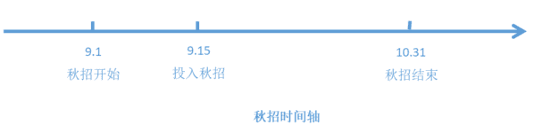
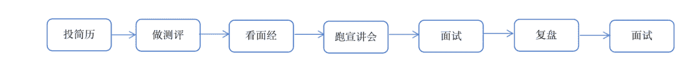
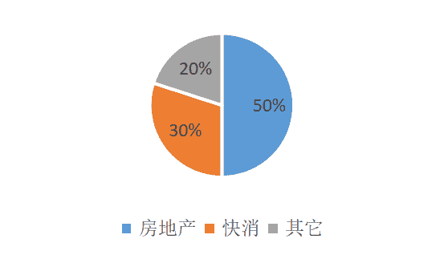
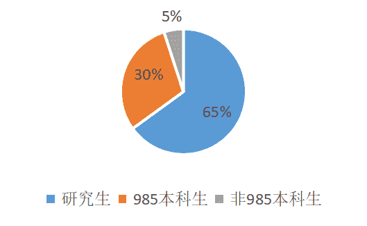
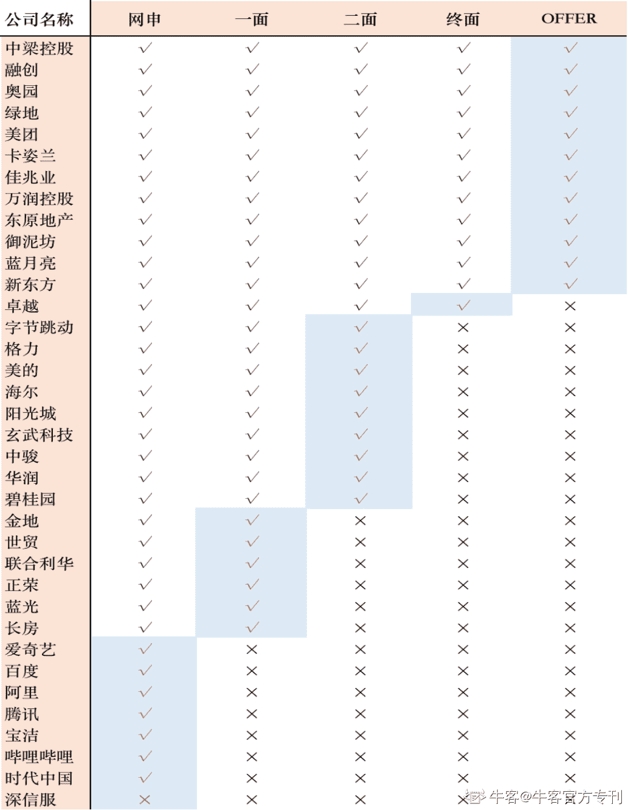

# 第一章 第 1 节 作者介绍

> 原文：[`www.nowcoder.com/tutorial/10060/a52148c6b0d24bce87f200e9821b1e68`](https://www.nowcoder.com/tutorial/10060/a52148c6b0d24bce87f200e9821b1e68)

# **1** **作者背景**

        我是湖南师范大学市场营销专业的一名 2020 届毕业生，参加的是 2019 年秋招，在大学期间有担任团委学生干部的经历，有较多的与专业相关的项目大赛的经验与荣誉，每年评奖评优拿奖学金也是从不缺席，还有在建行、时代中国、今日头条 3 段平台的实习经历，自认为在大学期间已经不留遗憾，过得非常充实了。          从去年秋招开始，陆陆续续拿了蓝月亮、美团、融创等几家公司的 offer。实话说相对整体来看，我的秋招成果不是很好，身边很多 985 学校的研究生学长学姐也有拿了小米、京东、字节跳动的 offer 的，但是人总不能老纵向去比较，在本科生的学历层次中，从我周边同学所拿到的 offer 来看，我 offer 算是拿得比较多，含金量比较高的了，由此想把我“身经百战”的经历写下来，供大家参考，希望能为在找工作的小伙伴尽绵薄之力。

# **2** **求职经历**

           整个秋招我大概是投入了完完整整 45 天的时间。我是 9 月中旬开始正式投入秋招，这时候其实秋招已经开始很久了，大概 8 月底 9 月初就已经开始了，由于当时还在之前实习的公司负责一个比较重要的项目，且是部门交付特别忙的时候，错过了顺丰等很多大公司的招聘，虽然不舍，但大局为重，果断辞职投入秋招大军了。

 

           不过在地产实习的团队氛围以及地产这个行业影响了我秋招的择业标准，以至于秋招的前半段我把大部分精力都放在地产这一块，但后面逐渐意识到地产对于本科生很不友好，地产行业对于学历有硬性要求，除营销管培生外，基本招的都是研究生，而我恰恰不想去做房地产销售。于是我就转换方向了，好在及时刹车，还有机会。9 月中旬一直到 10 月底，每一天都是披星戴月地奔走在湖大、中南和面试地点之间，不停地投简历、做测评、看面经、跑宣讲会、面试、复盘、再面试。

 

        大概投了 84 份简历，每投一份简历都要做对应的网申试题，一般都能有初面的机会，二面大概是 50%的比例通过，终面就只剩 20%的公司通过了。在这些公司中，我大概统计细分了一下，房地产行业占 40%，快消行业占 40%，其他行业占 20%。跑宣讲会和面试的过程中认识了很多找工作的小伙伴，65%都是研究生，30%是中南湖大的本科生，5%是非 985 的本科生。深知在学历上毫无竞争优势的我，只能比别人付出更多的时间和精力了。

 

# **3** **求职结果**

        九月份快结束的时候，拿到了三个 offer。虽然没有特别满意，心里总归有了一丝安慰。秋招是金九银十，十月份来的多是国企、地产、银行、中小型企业，平均每天 3 场面试，湖大研楼对面打印店打印简历的老板已经认识我了，问我怎么还没找到工作，只记得当时一股曾经沧海难为水的感觉涌上心头，但我其实只是没找到自己满意的，就总想再面一面，试一试，毕竟也只是参加了半个月的秋招，还有一个月的时间。

        十月结束，看了下笔记本上记录的公司：百度、阿里、腾讯、宝洁、联合利华、字节跳动、爱奇艺、哔哩哔哩、格力、美的、海尔、佳兆业、阳光城、时代中国、中梁、深信服、玄武科技、正荣、中骏、卓越、绿地、金地、华润、碧桂园、世贸……挂在笔试、群面、二面、终面的都有。不得不感概一句，秋招真的太难了！以下 30 几家公司是记得还比较清晰的具体结果： 