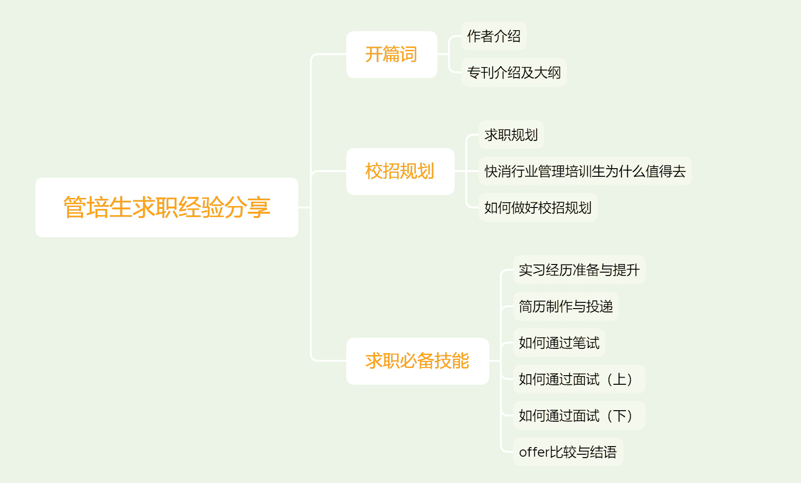

# 第一章 第 2 节 专刊介绍及大纲

> 原文：[`www.nowcoder.com/tutorial/10060/e22de60d513a4300ba7a941e2a9ee1db`](https://www.nowcoder.com/tutorial/10060/e22de60d513a4300ba7a941e2a9ee1db)

# **1 本专刊****是什么？**

        你好，欢迎阅读这本《管培生求职经验分享》。管培生在房地产、快消、金融、银行等行业都有招聘，此专刊主要面向参加校园招聘求职过程中投递行业为快消、投递岗位为管理培训生的同学。若是有想投递其他岗位的同学也可作部分参考，因为行业虽不同，但求职之路是相通的，虽然我最后选择的是快消，但其实我也求职过其他行业，所以对于想求职管培生的感兴趣的都可以来了解一下，希望能为你们的校招求职之路添砖加瓦。

        这本专刊从作者秋招的整个流程入手，涵盖了校招的规划及定位、实习经历与项目经历准备、招聘信息寻找、简历制作、笔试、面试准备以及 OFFER 选择与比较等多个维度，以作者丰富的求职经验，将校招过程中需要注意的问题一一讲解，为你的校招求职之路保驾护航，以拿到满意的 offer。

# **2** **本专刊****适用对象是谁？**

①市场营销、工商管理类等商科相关专业的应届生和准应届生，需要或即将参加校招。 ②其他专业但对快消行业有充分兴趣并想要投递该岗位的学生。

# **3 本专刊****应如何使用？**

 首先是使用的时机。大家最好是在求职之前整体浏览这篇专刊，看文中是否包含你需要了解和学习的内容，并做大致标记。在求职过程中遇到了文中提到的相关内容，可以二次阅读并细看这篇专刊中所提到的相关问题，带着问题有目的的看能提高阅读效率，看是否正好能解决你当下的困惑，如果能那就再好不过了，如果提的问题文中没有覆盖到，还可以在评论区留言，会有相关人员为你解答的。

         其次是了解此刊的整体结构，带着学习目标有针对性的、有框架感的进行学习，下表是此专刊的大纲可供大家参考。

