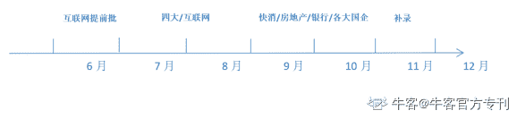

# 第二章 第 1 节 校招介绍

> 原文：[`www.nowcoder.com/tutorial/10060/df39a7165cd34e3d830946b9700deca4`](https://www.nowcoder.com/tutorial/10060/df39a7165cd34e3d830946b9700deca4)

        如果以求职者的身份去划分，可以将企业的招聘分为校园招聘和社会招聘两种形式，校招是校园招聘的简称，主要包括秋招和春招，绝大部分企业校招对象是高校应届毕业生，但极少部分企业也会招聘毕业 2 年以内的往届生，比如新东方、爱奇艺、猿辅导。

         对于应届毕业生来说，校园招聘是进入知名企业的最高效的方式。用人单位对于应届生的工作经验要求不高，主要是看求职者的潜能和软实力，软实力包括沟通、协调、创新、合作、组织能力等，潜能主要包括求职者的个性与特质。所以通过应届生的身份尽自己最大的能力选择一个大平台，对于自身职业规划而言是一个很好的开端。

         关于秋招，全称为“XX（年份）届秋季招聘”，比如“2021 届秋季招聘”，这里的 2021，不是指 2021 年才会举办，而是指针对 2021 年毕业的应届生举办的大型秋季校园招聘项目，一般是 2020 年就会举办。一般秋季招聘，对于有校招需求的企业而言，是一年当中最大型的招聘项目之一。所以秋招，机会多，岗位多，能秋招上岸就尽量秋招上岸。

         关于春招，全称形同秋招，全称为“XX（年份）届春季招聘”，比如“2021 届春季招聘”，这里的 2021，不是指 2021 年才会举办，而是指针对 2021 年毕业的应届生和大三的暑期实习生举办的大型春季校园招聘项目，一般是 2020 年就会举办。春招比秋招招人少，企业也比较少，一般参加春招的人员主要是秋招没找到工作的人，国考或考研失利的人，还有一部分是秋招没找到满意的工作，还想再试试春招的人，加之企业数量减少，竞争会变得比较激烈。

         秋招的时间：6-7 月：互联网提前批；7-9 月：四大/互联网；9-11 月：快消/房地产/银行/各大国企；11-12 月：一些岗位的补录。  

         很多公司的秋招其实从夏天就开始了，大家可能会被“金九银十”这个词误导，想着 9、10 月还早着，到时候再准备，其实不少行业秋招都集中在 8 月份了，比如互联网，甚至有企业 7 月就开始了，建议最好从 7 月份就开始进行笔试、面试的准备，最晚 8 月初。

         春招的时间：网申一般从 2 月份开始，宣讲会集中在 3-4 月，笔试和面试集中在 3-5 月，实际的程序形同秋招。

         秋招和春招相同点在于，流程大致一样：网申-简历筛选-笔试-面试-录用通知，具体流程最好在网申时看企业官网公告的校园招聘流程，以各企业官网公告的流程为准。

         秋招和春招就企业类型而言不同点在于，秋招时冲在最前头的，往往是知名的头部互联网企业，人员需求量大，招聘规模大，岗位多。同时国企和银行，有很多放在 10 月、11 月招聘。春招往往是各省省考的时间。春招则以小规模企业为主，但其中也不乏大企业的补录机会。因为小规模企业在秋招时往往竞争不过大企业，因此对他们而言，最好的选择便是不要挤在大企业的中间，以免变成炮灰，所以小企业、新生企业往往会集中在春招时期，而这时也并不是完全没有大企业的机会了，很多大企业在秋招时招到的人才，会出现各种各样的流失，这时需要通过春招来进行补录。

        个人认为对于应届毕业生来说，无论是春招还是秋招，主要需要做好两个方面的准备：  

1.  思想准备，思想准备包括面试前的企业信息收集、面试过程中的心态建设、面试后的复盘等。
2.  物质准备，包括合适的服装、证件照、生活照、简历、在校期间获得的各类证书原件及复印件等。