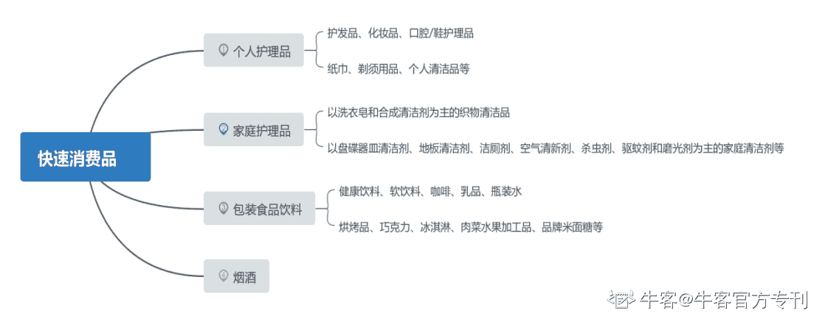
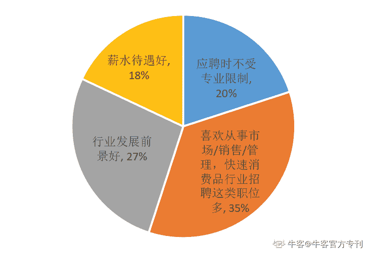
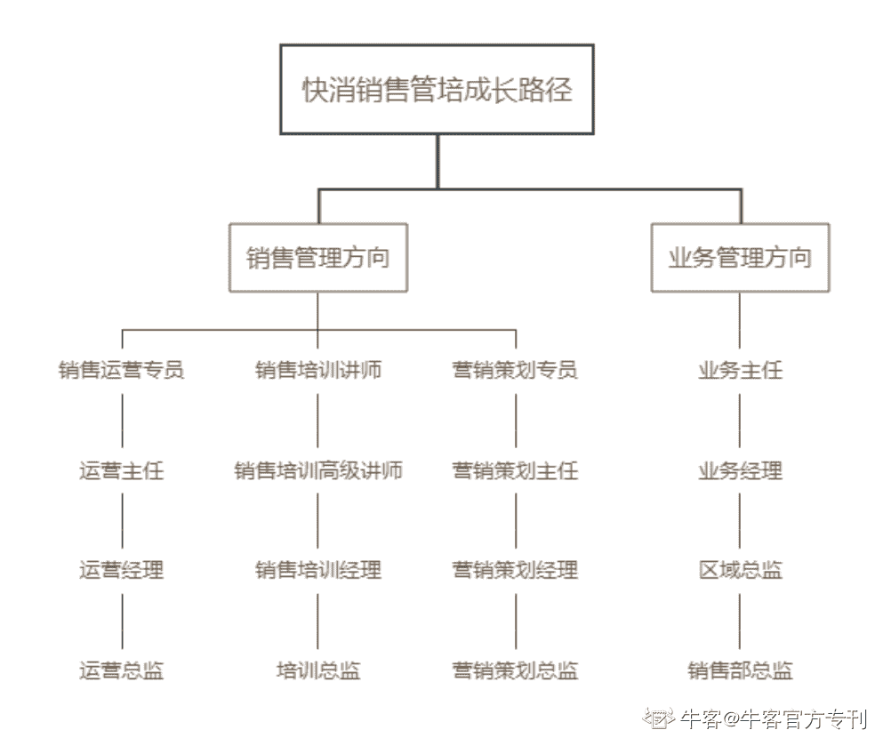

# 第二章 第 2 节 快消行业管理培训生为什么值得去

> 原文：[`www.nowcoder.com/tutorial/10060/b45807dc9d0e43f599970c1057395985`](https://www.nowcoder.com/tutorial/10060/b45807dc9d0e43f599970c1057395985)

        成熟完善的培训体制、多岗位体验轮岗、丰厚的薪酬、良好的发展前景、充足的锻炼机会等这些对于应届生找工作来说都是十分重要的影响因素，以宝洁、欧莱雅、联合利华巨头为首的快消行业一直被应届生视为最想进入的行业，快消行业的管理培训生岗位毋庸置疑是学市场营销、工商管理类等商科相关专业的应届毕业生刚入社会的不二选择。

# **1****快消行业的定义**

        快消是快速消费品的简称，通常指使用寿命较短，消费周期较快的消费品，它包含了 4 大类产品，如图所示。

# **2 应届毕业生选择快消行业的原因**

        管理培训生是以培养未来领导者为目标的项目，再加上快消行业前景十分明朗，几乎满足了应届生对第一份工作的所有期待，我相信一定能够吸引 60%的应届生投身快消行业。某求职网站就大学生毕业选择行业方向快速消费品行业做了一份数据调查分析，其原因主要分为 4 大类。

 

1.  人才需求量大。35%的应届生选择快消行业是因为兴趣，他们喜欢从事市场、销售、管理的工作，快速消费品行业招聘这类职位相对其他行业多，对于人才的需求量更大。
2.  快消行业整体发展前景很好。27%的应届生是因为快消整个行业发展比较稳定，而且近些年都呈现一种积极增长的趋势，整个行业前景是非常光明的。其次，快消行业提供的产品性质是生活必需品，且消耗比较快，它的性质决定，经济环境再怎么不好，它整体的变动不会受大环境冲击太严重。
3.  快消行业门槛较低。20%应届生选择快消行业是因为应聘时不受专业限制，快消行业在招聘的时候对人才的专业背景接受度比较高，除了像财务这类对专业要求比较高的岗位，其他的部门对应聘者的要求是不那么高的，只要你在面试中表现出来的潜能是符合这个部门人才发展需要的，满足这个条件的话，即使专业背景和部门关联度不是那么高，同样也会给到你 offer。
4.  薪酬相对丰厚。18%应届生选择快消行业是薪水待遇比较好，相对于其他行业来说，快消行业给管培生开出的薪资都是非常有吸引力的，这也是吸引应届毕业生去快消行业的一个重要原因。
5.  除此之外，从人才培育机制来看，快消行业是相对比较早推出管理培训生这个项目的，整个运营体系非常完整，对人的培训也很全面。在市场上相对价值比较高，被戏称为职场上的“黄埔军校”。从快消行业出来你的跳槽空间也会相对比别人大，如果想往其他行业跳的难度要比从其他行业出来跨行业跳的难度要低一些。

# **3 快消行业管理培训生的项目特色和成长路径**

        因为作者本人是快消公司的销售管理培训生，所以在此给大家详细介绍快消销售管培生的培养特色与成长路径。

## **3.1 培养特色**

        后面我会以蓝月亮公司的快消销售管培生的岗位具体工作内容和大家详细普及销售管培生所涉及到的工作，而只要是销售类岗位还有一个特性，就是人才流动率高，销售管培也不例外，虽然快消大牌企业都相对稳定，但是人才往往不大稳定，不过销售管培生的项目也有自身的特色，为了能够让新入职的管培在有意义的岗位上得到最好的锻炼，并且取得快速稳健的进步，在整个轮岗设计过程中，一般会设计成三个阶段：  

###     ●第一阶段

        深入一线，了解不同的渠道方向。培养销售工作的最核心能力，学会如何有计划地工作，如何与人打交道，并深入了解传统和现代渠道的销售模式，所以会在不同的销售渠道之间进行转岗，可能有人会问，可不可以不跑门店，不去卖货，答案是——基本上 90%的“外企明星企业”的经理按照公司的培养计划都有少则 3 个月多则 2 年的一线门店经验，而零售管培生的第一阶段更是直接在门店或柜台开始工作，全面学习门店运营的各种工作。  

###     ●第二阶段

        深入业务部门。进入到公司的业务部门是为了提供更多销售渠道的学习机会，譬如大客户渠道，商务渠道，KA 渠道，并且开始团队管理的责任，在实际工作中不断接触和锻炼，也会有企业安排在不同的职能部门进行轮岗，譬如经销商管理部、销售运营部、规划管理部等，通过获取更系统的工作形成闭环思维，提升对销售一线工作的的理解。  

###     ●第三个阶段

        深入团队管理。部门的基本工作都熟悉之后，就要升级到团队管理和协作的能力了，可能需要带领销售团队一起工作，也可能需要带领二线团队一起工作，但具体是哪一个就要看你转正时选择的成长方向了，具体后文会谈到。这个阶段你会学习到如何对团队工作进行有效分配，如何指导激励团队同事共同达成团队目标，从而成为一个合格的领导者。  

## **3.2 成长路径**

        根据上面的销售管培生特色，我们再来谈谈它的成长路径，如下图所示：     

### 3.2.1 销售管理方向

        销售管理方向是一个偏多元化的成长方向，相对于一线成员来说，这些岗位被统称为二线人员，但做的工作都是与销售业务息息相关的工作，主要是三大部分：

1.  销售运营：运营就是除了买卖行为外的一切工作流程总称，基本都能被称为是运营，好的销售团队是赚钱，而好的运营团队就是为赚钱的人赋能，因此一个销售运营经理的重要性也不容小觑，他可能管几十个人的团队，管控一整片区域的经销商，尤其在特别大的公司，以销售密集型为特色的，数据往往很重要，这个部门就是核心支持部门，有过销售经历的人转岗到运营会比较受欢迎。
2.  销售培训：一般销售团队庞大的组织机构都会有专门的销售培训队伍和部门，并且一个销售培训高级讲师，不仅要求你有销售经历，还要求你有销售管理经历，所以如果对于想要谋求其他发展的人而言，这也是一项选择，但是需要注意的一点就是，你不仅需要自己的销售业绩出众，还需要当过销售经理，否则即使你每年都做金牌销售，但没有带过团队，那么你在培训这条职业道路上可能都不会长远，只能是讲师，不太容易升培训经理。
3.  营销策划：营销策划偏向于市场部，销售部和市场部是密不可分的，销售部也可以转到市场部，但是转起来可能不会那么容易，因为两者在工作内容上的差异还是很大的，不过值得一提的是，如果你当上销售经理了，那么有条件积累一下市场经验将会是不错的闪光点，会更有利于你未来在销售总监的道路上继续发展。

### 3.2.2 业务管理方向

        业务管理方向是一个直线式的发展方向，就是通过不断升职扩大管理区域范围和管理团队成员，比如说负责销售区域的不断扩大、销售额提升、销售团队人员规模的提升来作为晋升的发展路线考核。它的常规升职路线为业务主任-业务经理-区域总监-销售部总监，当然有的公司可能对岗位的名称不一样，比如对于主任层级来说，有的叫推广主任、客户主任等。

        以上两种成长方向，你选择了业务管理方向并不代表你一辈子都只能做业务，当你积累了一定的销售经验，你还有其它多元化的发展路径可以继续发挥你的优势，这些方向基本上都是通过与销售相关的职能或部门，以及核心能力相通的岗位实现转岗，也就是我们的销售管理方向；同样地，如果你积累了足够的销售管理经验，也可以选择做业务方向，去一线实现在二线职能岗位接触的所有技能，将理论与实践相结合。