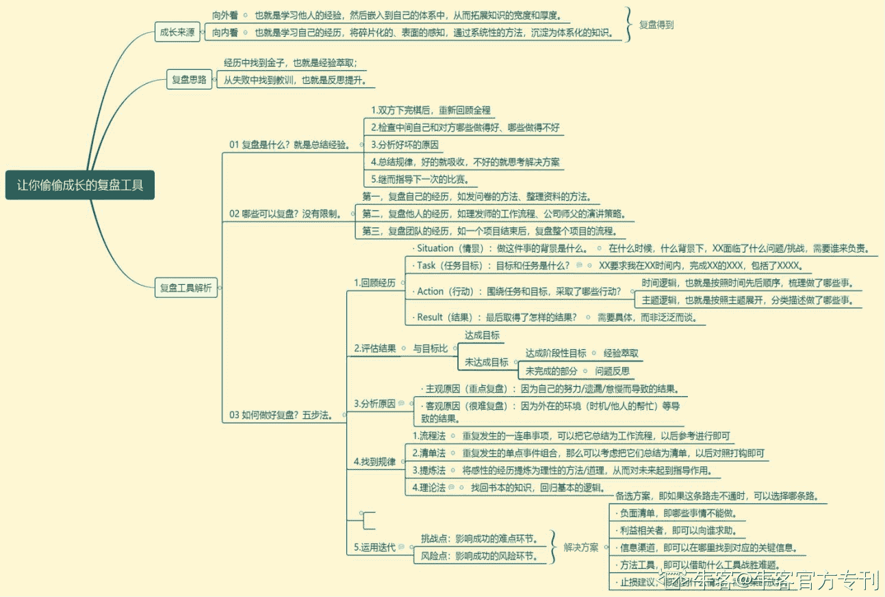

# 第二章 第 3 节 如何做好校招规划

> 原文：[`www.nowcoder.com/tutorial/10060/1d02be5a18ab4295b8779fd1fc5bce59`](https://www.nowcoder.com/tutorial/10060/1d02be5a18ab4295b8779fd1fc5bce59)

# **1 自我认知与****求职****规划**

## 1.1 **先梳理自我**

        参加校招之前要想清楚自己是要考研升学还是要就业，这个非常重要，有的同学是想两头都抓，考研准备到一半又去参加秋招，既耽误了考研学习的时间又不能全心全意参加秋招，最后什么都没得到。所以弄清自己想要什么、想做什么、能做什么，以此来明确参加校招时投递哪些公司、哪些岗位。如果没有这个步骤，可能会盲目跟从别人，别人投什么自己就投什么，看到别人拿了 26W+的互联网 offer 就去投互联网，看到别人拿了北京户口就去投国企，完全不根据自身的实际情况去投递简历，参加面试，这样会浪费很多时间和精力，可能会导致错过很多适合的公司的面试，最后哪个满意的 offer 都没有拿到。结合我自己的经验，为大家总结了以下自我认知的方法：

1.  了解自身优势和性格特点。结合优势才能找到自己擅长的领域，比如项目管理，对一个人的领导力、沟通力、协调能力要求很高，很适合领袖型人格和成就型人格来做；再比如总裁助理，就比较适合耐心、沉稳、细致的人来做。千万不要觉得自己没什么特长就找不到工作了，你进入一家企业，从零开始做你感兴趣的工作，未必没有上升的机会和发展的空间。
2.  通过专业的职业测评。结合专业的职业测评工具，可以了解到你的个人特质，匹配具体的职业方向以及相对应适合的岗位。
3.  通过和已经就业的前辈沟通来帮助自己确定未来的规划，比如可以报名参加[牛客 1V1 求职辅导](https://www.nowcoder.com/courses/cover/live/510)的课程。 

## **1.2 再谈求职规划**

        自我认知清晰之后，怎么去做求职规划呢？

        首先应该了解目前行业发展状况，选择一个处在成长期的行业，若选择传统行业、地产行业这些比较成熟的行业，相比早些年入行的人来说，成长会相对缓慢一些，而选择处在成长期的行业，由于行业带来的红利，新人能更容易获得更快的成长；确定大行业之后就要在其中定自己的小方向，可以结合自己所学的专业和个人性格优势来选择切入岗位；之后再根据是否是公司核心业务来确定岗位，核心的业务型岗位一般包括市场、销售、研发等，这些部门在公司往往容易大规模扩张，那升职加薪也就非常快了；当你明确自己想要从事的工作之后，就可以开始进行深度学习了，通过一段时间的学习之后，有了一定基础，再去开始投简历，开始你的求职之旅。方便大家弄明白这个过程，我画了一个职业规划流程图，如下：

# **2 快消行业管理培训生应该具备的能力和要求**

        下面根据以上推荐的快消公司管培项目，我抽取了三家公司对于面试者的公开要求列了一个小表，读者可以根据自身条件做明细对比。

| **公司** | **联合利华** | **玛氏** | **可口可乐** |
| **管理培训生****应具备的能力** | 1. 全日制本科及以上学历 2. 出色的中英文交流能力 3. 有良好的适应能力和学习能力，乐于不断接受挑战 4. 对快消行业有强烈的热情和兴趣，致力于在此行业长期发展 5. 具有领导能力和团队合作精神，能与来自不同背景的人沟通合作 | 1. 本科及以上学历 2. 在校期间有出色的实践经验和社会活动经历 3. 出色的中英文表达能力 4. 优秀的沟通协助能力，杰出的人际交往技能和团队精神 5. 自我激励，并附有活力，能接受较大的工作压力 6. 诚实正直，态度积极，具有领导潜质，追求卓越并注重结果 7. 开放、创新思维及综合管理发展能力 8. 具有熟练的数据处理能力 | 1. 全日制本科毕业生及以上 2. 出色的分析能力、计划能力、组织能力和学习能力 3. 十足的进取心并愿意在快消行业发展个人职业道路 4. 优秀的团队合作精神、优秀的人际沟通亲和力 5. 有跨国公司实习、海外交流项目、社团领导经历 |

         综合表格中几家公司的要求来看，快消行业对于管培生的硬性要求必须是本科及以上学历，外企的话需要有出色的英文表达能力。共性的软实力要求上包括以下几点：

● 作为一个管培需要具备领导力和合作沟通能力，未来才能站在长远的地方看问题，做出对公司最正确的决策，更好地引领团队前进；

● 在参与各种项目过程中要具有良好的适应和创新能力，能够应变环境变化带来的各种挑战。在实习或者转正之前会被派到很多项目去轮岗，了解公司当下最新的政策和项目并参与其中是非常重要的；

● 需要具备较强的分析计划能力、组织能力、学习能力，具有较强的逻辑思维。会看到很多表格、数据，针对数据要能够精准地看到数据背后的现象和反映的问题，甚至需要自己去输出相应的报表或者 PPT 来给前方赋能，所以能够熟练操作办公软件同时也十分重要；

● 能承受住较大的压力、对快消行业抱有极大的兴趣、拥有较强的进取心。这些是来自于内在动力，关键是要及时地调整好自己的状态和心态，因为快消行业的工作节奏就跟产品消耗的速度一般快，尤其是在一线城市；

●有海外留学、实习经历或者项目经历是加分项。国外快消企业英文阅读和读写能力是硬性要求，但对于国内快消的中小型企业来说，难免也可能会有国外客户接待，如果有海外经验，能以备不时之需。

        以上针对整体管培项目介绍需要具备的能力，大家可能以为快消行业招聘的管培生主要是销售方向的，但其实并非如此。就拿蓝月亮公司的管培生岗位来说，它招聘文控管理、供应链管理、培训管理、销售培训讲师、营运管理、销售管理、审计管理、财务管理、数据开发工程师、人力资源管理、KA 管理、销售运营、产品研发、文案创作、传播策划、消费者研究等共计 49 个校招岗位类别，招聘人数若干，涵盖了人力资源、IT、电子商务、市场、产品、运营、供应链、财务、人资、行政、规划、公共事务等各大模块，具体岗位介绍与投递方式可以通过蓝月亮的[校招招聘链接](http://talent.bluemoon.com.cn/campus)查看。        因为我自身是市场营销专业的学位，意向部门是销售部和市场部，最终选择了以销售管理培训生的角色进入公司的销售部，所以接下来可以给大家分享快消（洗涤）行业十年来一直占据市场份额第一的蓝月亮（中国）有限公司对于销售部与市场部的岗位、对应的具体工作职责和任职要求。 

*以上岗位在转正之前根据个人意愿和部门需求均可轮岗

| **市场部管理培训生** |
| **校招岗位** | **招聘人数** | **工作职责** | **任职要求** |
| **营销策划** | 8 | 1.负责基于营销方向的活动主题、内容、物料等包装和体验的策划；2.负责平台活动素材及营销沟通工具策划，包括但不限于相关文案、平面、视频等策划和创作；3.负责研究用户相关平台的玩法，策划有效的运营/互动方案，增强用户的粘性，促进销售化；4.配合公司的其他策划任务需求。 | 1.逻辑清晰，有良好的创新能力及敏锐的洞察力；2.具备较强的文案策划能力及审美能力；3.乐于跟消费者进行沟通，挖掘需求；4.具有文案策划、平面策划、或者其他策划项目经验者优先考虑 |
| **市场推广** | 8 | 1.结合公司策略，参与产品方案策划，包含产品及套餐的沟通逻辑、沟通话术策划，沟通实践；2.明确门店铺货标准、陈列标准，门店规划、销售计划标准和工具，门店及周边社区信息获取要求；3.同步开展渠道活动审核、渠道价格研究；4.结合门店标准及套餐方案，转化成门店铺货、陈列等业务要素标准；5.辅导财务做门店标准规划、业务提供的门店信息审核，同步给业务进行谈判，以及结合具体门店做具体规划。 | 1.心比较静，逻辑思维、理解能力、抗压能力、表格操作能力较好；2.对市场营销、渠道活动及玩法有一定了解，接触过营销相关策划；3.了解渠道营销相关工作，乐于跟消费者沟通交流,爱做清洁。 |
| **数字营销策划** | 8 | 1.负责用户数据研究和分析，为相关部门提供指导决策、运营动作和方案的数据；2.设计、搭建和优化用户数据系统、客户关系管理系统，协助业务人员做好工具以便让顾问更好地分析和服务用户；3.平台产品内容逻辑及产品逻辑沟通，管理开发进度与产品迭代；4.优化产品体验，与产品部门沟通，推进运营、设计产品开发等日常工作，优化产品体验；5.运用并创新营销玩法，提升销售转化率。 | 1.有良好的语言表达能力及沟通技巧，较强的理解能力和执行力;2.有敏锐的市场洞察力，善于分析，较强的数据分析及逻辑思维能力;2.有责任心，吃苦耐劳，抗压能力强;3.有平台运营思路和经验，有营销活动组织策划经验者、第三方平台运营者优先;4.熟练运用 office 办公软件; |
| **平面策划** | 4 | 1.根据市场/品牌活动要求进行物料设计、优化；2.沟通传达设计策略与要求，推进广告公司完成平面的创意策划与设计，把控广告公司设计输出及整体时间进度；3.参与市场/品牌等相关活动的其他策划工作。 | 1.优秀的理解能力、反应灵敏；2.热爱生活，对生活环境有敏锐的感知能力，有一定创新意识；3.具有较强的美术功底和色彩运用功底及良好的艺术修养；4.熟练掌握相关平面软件优先。 |
| **市场策略策划** | 4 | 1.参与公司业务会议，沉淀公司战略思想，协助输出战略报告；2.负责从策略出发的线上线下相关项目、产品及品牌形象、平台相关的文案撰写以及活动策划；3.开展需求调研工作，了解行业和竞品动态，及时掌握市场信息，制作市场信息报告；4.配合部门其他项目的开展。 | 1.反应灵活，执行力强，决断力强；2.逻辑思维清晰，重点把控能力强；3.敏锐的市场洞察能力，有一定文案策划功底； |
| **消费者研究** | 2 | 1.根据项目需求，开展市场相关调研项目，负责项目策划、执行、数据处理及分析、报告撰写等工作;2.沟通协调各种内外部资源，确保按时按质完成各项消费者研究项目；3.定期输出行业信息、消费者研究报告，为制定市场策略提供依据；4.梳理研究工具及方法，建立研究模型，规范报告形式并不断优化。 | 1.有消费者调研等相关实习工作经验优先考虑；2.具备较强的信息收集与处理能力、调研报告撰写能力；3.拥有一定的计划管理能力，较好的判断能力；4.热爱消费者调研工作，有出色的客户意识，一定的全局观念，工作积极主动。 |
| **文案创作** | 4 | 1.进行消费者研究，了解消费者对文字的理解及看法情况，输出调研报告；2.进行平面文字、广告文案等文字的研究及相关素材搜集、梳理及分析；3.理解公司策略内容，进行广告、平面画面或核心策略文案、稿件等的文案创作信息输出。 | 1.热爱生活，乐观自信，有结果导向；2.有扎实的文字功底，热衷于文案工作；3.有清晰的逻辑思维清晰，良好的沟通能力；4.有创新意识，对生活环境有敏锐的感知能力。 |
| **传播策划** | 8 | 1.根据公司市场战略，制定品牌营销及公关传播策略方案；2.参与品牌、公关传播等相关项目的策划并协调内外部资源推动执行；3.对相关活动、项目进行复盘及效果评估；4.进行消费者行为、公关及品牌传播案例等相关研究和学习。 | 1.认真细致、有责任心、抗压力强；2.性格外向，沟通能力突出，能够跨部门协作；3.思维活跃，逻辑清晰，具有良好的创意策划能力；4.具备 PS、拍摄、剪辑等技能者优先考虑。 |
| **视频策划** | 2 | 1.参与公司品牌广告、产品广告及平台视频内容创作和策划；2.负责产品功能及方法视频的内容拍摄、制作和沟通，主导推进并执行项目；3.与外部创作机构对接，进行 TVC、视频、主视觉等的创作策划；4.参与公司其他有关视频内容传播的项目，确保公司传播内容的策略一致性。 | 1.热爱生活，乐观自信，抗压能力强；2.具备较强的沟通理解能力、思考能力、推动能力；3.有扎实的文字功底，具有良好的文字表述能力；4.具备一定的平面设计能力，熟练操作摄影器材，会 操作主流影视编辑软件: PR、AE 等。 |
| **产品策划** | 7 | 1.研究消费者需求和习惯，市场现状和动向，挖掘产品和市场机会点；2.协助制定新产品策略及目标，确定产品定位和发展规划；3.设计和开发新产品，并配合开展相关市场测试；4.梳理产品销售形态、销售渠道、价格体系，制定产品推广策略和方案。 | 1.市场敏感性强，有- -定的归纳思维、产品设计与问题发现解决能力；2.有一定的创新能力及团队领导能力；3.有一定的成本意识、诚信意识并有全局观念；4.热爱产品策划与开发工作。 |
| **平面设计** | 2 | 1.完成产品包装设计、平面设计与字体设计等工作；2.跟进包装材料和印刷工艺，从视觉效果的角度提出意见与建议，保证设计成品达到最优效果；3.运用项目管理方法、工具，推动产品包装设计项目达到目标；4.总结项目并可优化流程或制定设计规范。 | 1.有一定的目标管理能力；2.关注细节，有一定的创新能力与应变能力；3.性格坚韧，热爱设计工作，并有-一定的成本意识与客户意识；4.有广告/会展平面设计实习工作经验优先；5.熟练使用各种平面及网页设计、office 软件。 |
| **项目管理** | 1 | 1.对项目进行前期调查、收集相关资料，制定项目可行性研究报告，申报立项材料并跟进立项进度；2.制定项目目标及计划、项目进度表、执行和控制计划，控制项目进程，管理过程问题；3.协调项目资源，组织跨部门进度例会、技术研讨会、风险管理会，持续推进项目并解决问题，按时按质交付。 | 1.有系统的项目管理知识，取得 PMP 及相关证书的优先考虑；2.有较强的沟通协调能力，问题发现与解决能力，以及激励能力；3.目标管理能力强，有全局意识，及一定的成本意识和客户意识。 |

*以上岗位在转正之前根据个人意愿和部门需求均可轮岗

#  **3 综合素质提升与技能****学习规划**

        本小节是根据岗位要求学习相关技能这一环节展开来说，知道自己想要选择什么岗位之后去要做哪些方面的提升和规划呢？最好的方式无疑是对比整个管培生招聘需要具备的技能和自身具有的能力，看看自己是否已经符合管培项目对于人才的需求，再来做学习规划，因为销售管理培训生大多是以软实力提升为主，对于硬性技能方面要求可能没这么高，我主要是通过阅读市场营销相关的书籍和复盘我的实习和项目经历来提升自己。下面给大家分享我整理的两个习惯工具——读书和复盘。

## **3.1 有效读书规划**

        对于一本好书，肯定包含大量有价值的内容，最应该做的就是把它读透，把从书中学到的知识融入到自己的脑海中，再用自己的语言体系讲述出来。以上步骤希望对你的阅读有所帮助。

## **3.2 有效复盘规划** 

         想要快速成长必定要学会复盘，以上从个人成长来源、复盘思路、复盘工具分析三个维度详细给大家介绍了如何使用复盘工具，希望在复盘这条路上你能获得些许帮助，大家也可以提出自己觉得比较好的复盘思路一起分享。

## **3.3 相关书籍资源推荐**

●《定位：有史以来对美国影响最大的观念》，是美国史上百本最佳商业经典第一名，号称是美国 CEO 最怕被竞争对手读到的商业奇书，深入阐述了定位理论和操作方法，并配有丰富的实战案例解析，指导企业家成功企业定位，获取商业成功；

●《销售管理必读 12 篇》，这本书高屋建瓴，具有实战论调，把销售工作实战化、实用化；

●《现代销售之父：帕特森的销售策略》，这是一本专记，里面有很多销售方面的内容。当初收音机刚发明出来后，如何将它卖出去、如何管理销售型企业等；

●《销售圣经》，讲的是房地产销售技巧，首次披露了关于销售成功的 105 条戒律等最新内容，华润置地、阿里巴巴、华远等众多知名企业在这本书出版之前就已经大量预购；

●《我把一切告诉你》，本书根据作者真实职场经历而写成的，是一本一口气就能读完的实操性书籍，书中的很多小案例和小故事都值得我们学、借鉴，不论是从事销售、策划、设计还是其他职业，都可以读这本书，书中有提到思维定式的局限，写的非常精彩；

●《免费》，这本书主要是介绍销售过程中如何寻找客户。定位客户后如何用低成本、见效快的方式精准找到客户，不像传统营销投入大量的广告费用，书中主要介绍三种免费到收费的方式，与生活中我们见到的息息相关，值得一看；

●《华为执行力》，这本书主要介绍销售过程中的执行力，究竟什么是执行力，究竟如何做才能打造高效的执行体系，此书有做出详尽的解答。

        以上，主要是用正确的读书方式高效地学习，将所学到的书本理论知识运用到具体的实习经历和项目经历当中去，而后再对实践经历进行逻辑化、体系化地复盘，也能更好地结合实践回过头来理解从书本中学到的知识，从而达到由内而外提升综合素质和各方面竞争能力的目的。