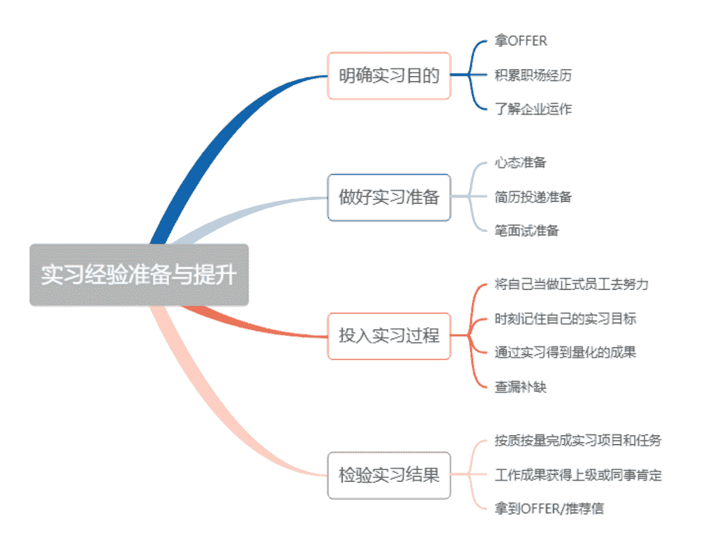
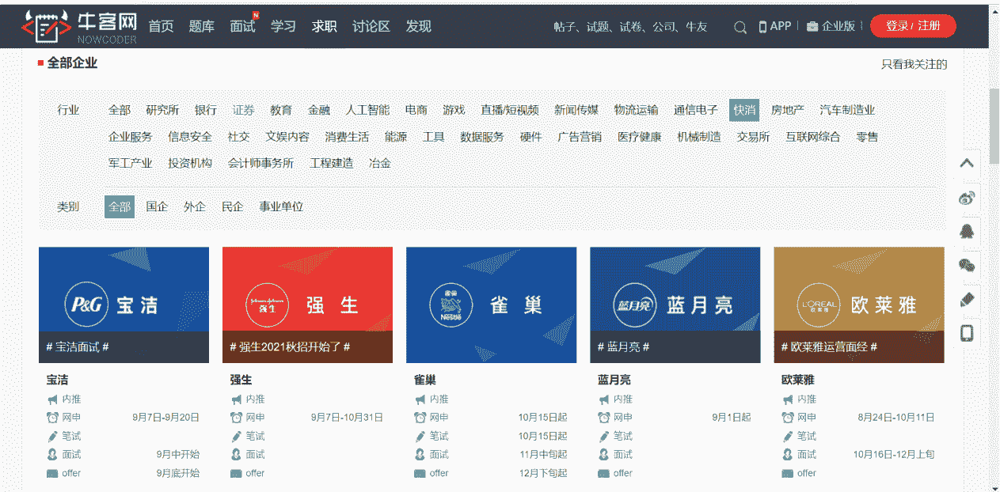
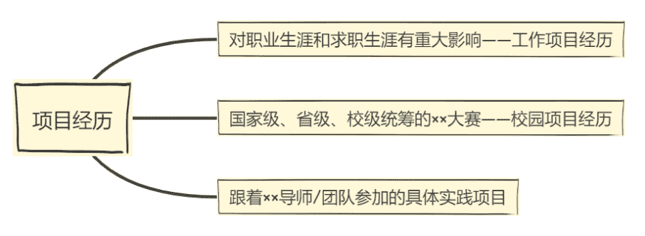
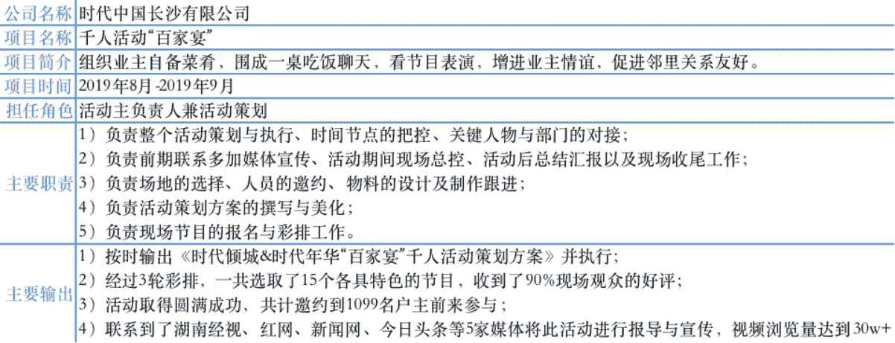
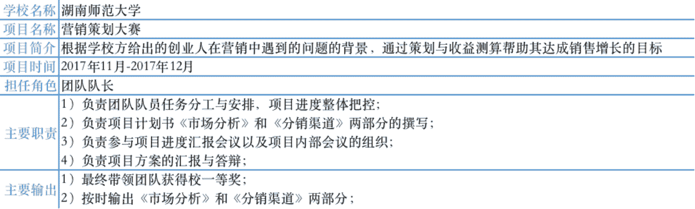
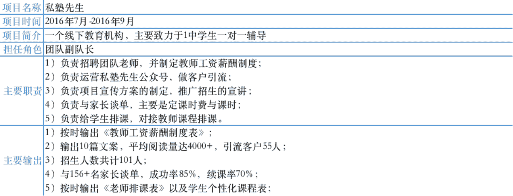
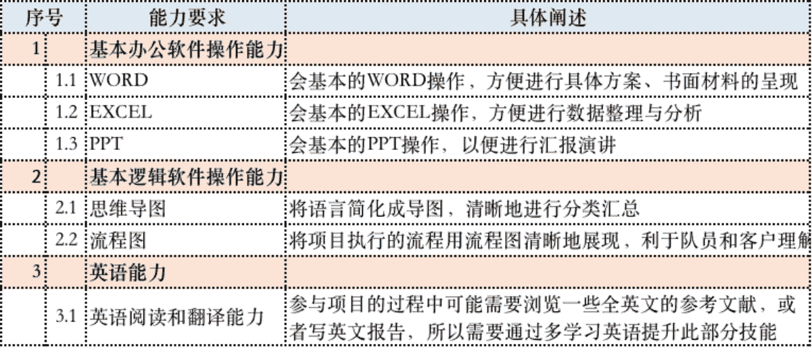
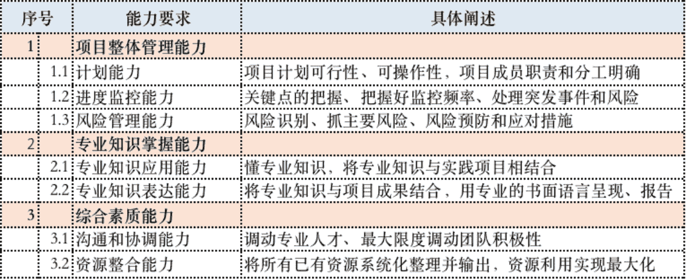

# 第三章 第 1 节 实习经验准备与提升

> 原文：[`www.nowcoder.com/tutorial/10060/c05dc54d204243fc8fb3e8abdff340a8`](https://www.nowcoder.com/tutorial/10060/c05dc54d204243fc8fb3e8abdff340a8)

# 1 实习经验准备与提升

## **1.1 明确实习目的**

        很多学生希望自己在实习中能收获尽量多的知识和经验，那么大家需要先想清楚：你要实习的目的是什么？因为不同的人有着自己不同的追求，有人是为了拿到 offer，有人则是希望自己在出国深造前积累职场经历，有的人为了更多地了解企业的运作。

         对于那些想拿到 offer 的人来说，除了要好好工作，还需要在企业中建立自己的社交关系，无论是和你的上级经理，还是和其他的同事，都要好好相处，因为想要拿到最终的 offer，你的口碑也非常重要；对于想要积累职场经历的人来说，你可以借由实习的机会多接触不同部门的人，甚至是那些和你一起参与项目的实习生，多去了解不同部门在做什么；而对于想要了解企业运作的人来说，可以多找找不同行业中的不同企业来实习。

## 1.2  **做好实习准备**

        心态上，你要把自己当成一个步入职场的人，已经不是在学校里面的学生了，职场都是结果导向型，做任何工作都是需要有输出成果的，工作上犯任何错误都要自己去承担后果，可能是记过、可能是扣工资，严重的话也可能是被开除，这些都要做好心理准备，争取每一件事都做到最好。

         简历投递和笔面试方面，具体如何制作简历、投递简历、通过笔面试技巧等后文都会有说到，读者可以参考。寒暑假实习公司、岗位、投递时间等在[校招日程、笔试日历](https://www.nowcoder.com/school/schedule?property=2894)等都已经总结好了。

          寒暑假期实习的面试没有秋招的面试那么严苛，但同样竞争力也比较大，建议如果能进入比较大的平台尽量去大平台实习，这可能将成为你之后简历上与众不同的一笔、校招面谈的底气和开阔视野的起点。我之前就有利用寒暑假的时间去过字节跳动、华夏银行、时代中国等公司实习，不同的行业学到的东西完全不同，而平台越大，公司机制越完善，管理体制越成熟，你得到的训练也会更加体系化。  

## **1.3 投入实习过程**

●将自己当成正式员工去努力

一定不要抱着“反正待不久”、“都是学校逼着的”“我只是想赚个学分”等想法踏上实习岗位，一旦有这些想法，工作上的事情就极易懈怠，这份实习对你来说将毫无意义。你应做到的是：将自己当成正式员工，全力做好自己的工作，同时对自己还不能胜任的工作，虚心请教和学习。

●时刻记住自己的实习目标

换句话说就是“我想通过这个实习达成什么样的成就？”比如说 A.学会基本的客户沟通技巧 B.对专业的岗位匹配度打分 C.要有业绩达成 D.在工作中，我的专业知识能为我做什么等，这样的小目标会给你的实习工作起到积极的导向作用，而这样有目的的实习也能让你在职场里快速成长。

●通过实习量化成果

为什么说是能够量化的成果，这很大程度上是因为实习经历是需要写在简历上的，而相比起“能够自主完成一次业绩，能够独立做出一套不错的方案”这种不明确的实习经历描述来说，面试官更希望看到“自主独立达成 30w 的业绩考核目标；独立策划出一套获客方案，引流 4w+人数，最后付费客户达到 3000+人数；”这样有明确成果的经历会让 HR 感觉到你的实习是有成果输出的。

●查漏补缺

养成写实习日记的习惯，即使公司没有要求写，自己可以通过记录来看每天完成了什么事情，未完成什么事情，还有什么工作流程可以优化和改进，以此不断提升工作效率，也就是我上文提到的复盘，来达到对工作查漏补缺的作用。可以做成 PPT 给领导邮件汇报一周的工作输出，每月可以做一次总的当面汇报。

## 1.4 **检验实习结果**

●按质按量完成实习项目和任务

●工作成果获得上级或同事肯定

●拿到 OFFER/推荐信

        前面两条检验标准不再赘述，最后若能拿到公司领导给的 OFFER/推荐信，不论是对于你将来在实习公司求职，还是在其他同行业公司求职，都是会有比较大的帮助的，所以如果领导高度认可你的话，申请给你写一封推荐信也不是不可能的。

# **2 项目经历准备与提升**

## **2.1** **项目经历包含哪些**

        学不同专业的人的项目经历类型可能都会有所差别，有的人可能通过实习来的，有的通过参加比赛来的，有的人可能是通过自己学校里面跟着导师或小伙伴团队一起做的，我参与的在校期间项目经历主要包含以下三个方面的经历：

 

*   工作项目经历  

 

*   校园项目经历

 

*   带着团队参加的具体实践项目

## 2.2 **项目经历的重要性和必要性**

        第一，对个人提升来说，有项目经历的人，各方面综合能力和素质都比较强，包括理解力、执行力、团队协作能力、逻辑分析能力等。

        第二，项目经历有利于充实简历，可能有些人的简历中没有拿得出手的实习经历，此时就能写上你能拿得出手的项目经历作为补充，优秀的项目经历能让面试官眼前一亮，并且面试官可以通过简历中所提到的项目经历来提问，从而更详细地了解你的优势。

## **2.3 如何通过项目经历提升自己****/****如何准备参与这样的项目**

        那么到底如何通过项目经历提升自己呢？又或者说如何准备参与这样的项目？像我这种非技术类型的商科管理类专业，参加项目注重的不是在这个过程中输出了多少技能，较为注重的往往是项目管理能力的锻炼，专业知识的应用以及综合素质的提高。那么一般参加一个项目到底需要具备哪些能力呢？可参考以下技能表来做准备和检验：

*   硬技能

   

*   软技能

        总而言之，项目经历涵盖了实习经历、校园实战经历和自己跟着导师或团队参与项目的经历等，对于我们来说项目经历是十分必要的，所以大家如果有参与项目的机会一定要抓住，这可能成为你简历上靓丽的一笔，也可能成为你选择未来道路的重要转折，你可以通过提升硬实力和软实力来提前为参与项目经历做准备，当然也可以在参与项目的过程中提升这两方面的经历。