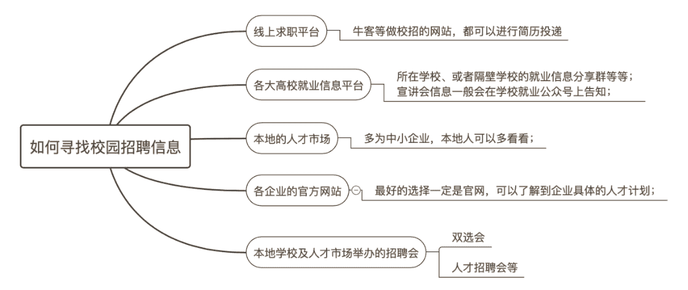
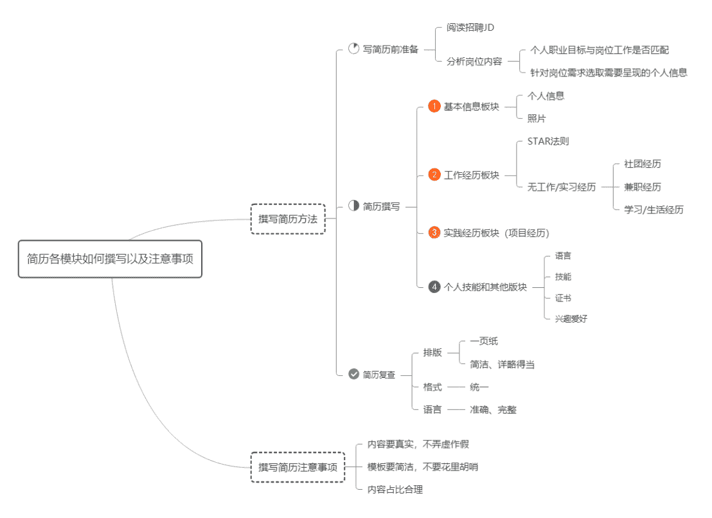
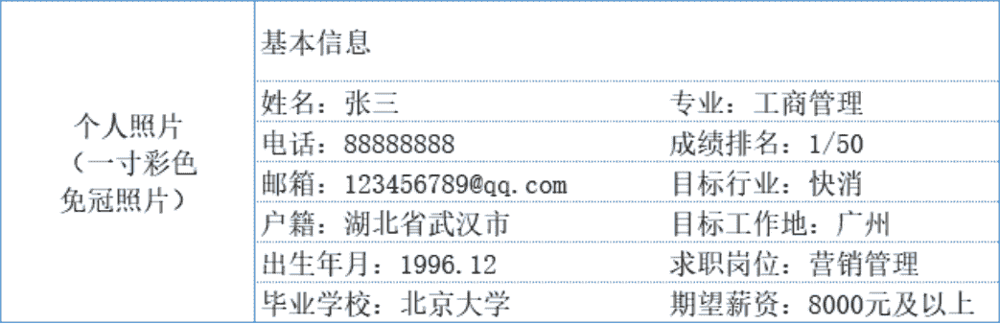
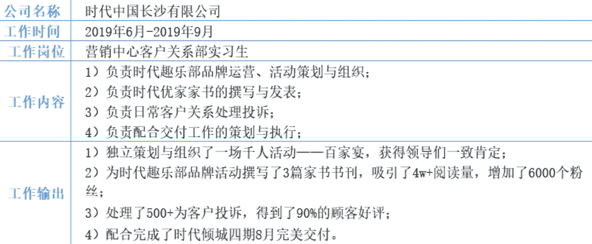
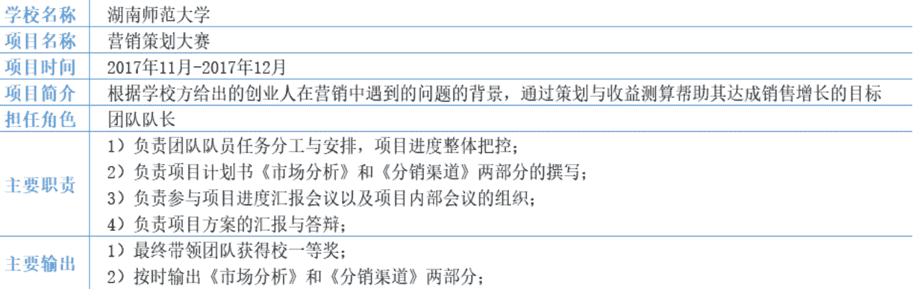
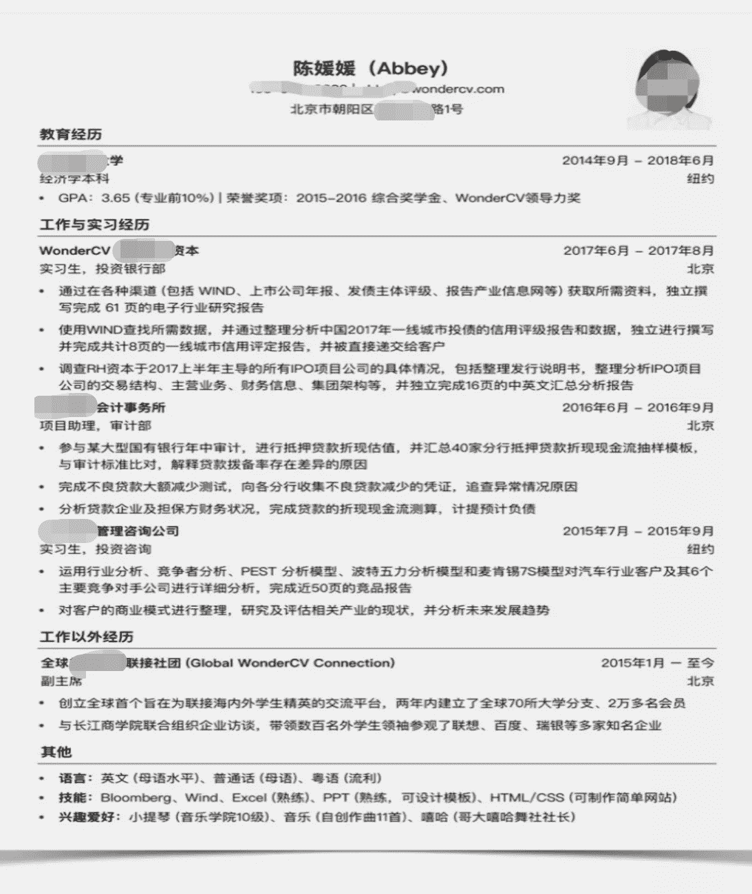

# 第三章 第 2 节 简历制作与投递

> 原文：[`www.nowcoder.com/tutorial/10060/3a58b3eccd734a5d9312421cb170130b`](https://www.nowcoder.com/tutorial/10060/3a58b3eccd734a5d9312421cb170130b)

# **1** **如何寻找校园招聘****信息**

我参加秋招时主要是盯着湖大和中南的就业信息平台看，因为我们学校是以师范类闻名的学校，来宣讲的企业会相对比较少，一般有宣讲会的话基本上都会在这两所 985 学校的官方就业平台上推送出来。网申一般会去线上求职平台上投递，有些学校或学院会开很多场招聘会，也可以去参加，主要有以下五个渠道：

# **2 如何制作以及投递简历**

## **2.1 如何制作一份优秀的简历**

        简历是候选人给面试官的第一印象，简历写得越好，面试官对候选人的印象就越好。简历的主要作用就是获得公司的面试邀请，简历优秀者一定是能满足 HR 简历筛选要求、针对性强、重点突出、阅读体验良好的，更有甚者能让 HR 眼前一亮，就几乎能确定这就是公司想要的候选人标准。话不多说，先看本人总结的一份知识点：

### 2.1.1 撰写简历的方法

        在撰写简历之前，根据招聘 JD 进行简历撰写，针对投递岗位设计简历，找到 JD 关键词，抓住重点需求，判断个人职业目标与岗位工作是否匹配，针对岗位需求选取自己的经历进行匹配，不要直接套用模板，平铺直述，所有岗位都用一份简历，否则公司无法读取到和岗位相关的匹配经验，容易导致简历石沉大海。

         简历正式撰写分为四大模块。

① 基本信息要点包括个人信息和个人照片，要介绍姓名、电话、邮箱、户籍所在地、出生年月、毕业学校、专业、成绩排名、目标行业、目标工作地、求职岗位、期望薪资，注意联系方式一定不要写错；个人照片尽量用穿正装的证件照或者形象照，不要用大头贴。

② 工作经历板块是会被重点关注的板块，最好是按照由近期到之前来排序，结合具体的案例，按照 STAR 法则来撰写，即 S（背景）T（任务）A（行动）R（结果），在什么样的背景下，你的角色是什么，做了什么事情，取得了什么样的结果。主要写清公司名称、工作时间、工作岗位，在公司主要负责的工作内容，具体的工作输出和结果。若是没有相关的工作或者实习经历，则可对以往的担任社团干部的经历、大学期间兼职经历，甚至是学习、生活经历做提炼，同样以 STAR 法则去提炼。可参考以下工作经历描述：
③ 实践经历模块主要是指项目经历，往往反映的是求职者某个方面的实际动手能力、对某个领域或某种技能的掌握程度，一个完整的项目经验包含学校名称、项目名称、项目时间、项目描述、担任角色和结果输出 5 部分内容，前面 3 部分可以用简短语言来介绍，担任角色方面可以重点说明自己的身份、职责，突出自己工作中的难点、重点以及解决问题的方法，描述自己的项目管理能力，或对一些项目风险的解决能力。如果担任的职位与应聘岗位看似不匹配，也可以尽量提炼出一些工作细节，向应聘岗位靠拢，最好是精简，挑重要的说。可参考以下项目经历描述：
        当然有的同学跨专业来找工作，可能在校期间没有相关的项目经历可写，那么这种情况下有两种解决方式：        一是在时间允许的情况下，如果能够参加该岗位对应专业的项目或者比赛，就通过学校跨专业合作的形式去参与相关学院的一些项目或者比赛，很多项目都是 1-2 个月就结束，或许你会觉得学不到什么，或者贡献不了太多，但是都这时候了，你经历过总比没有经历过更好，面试官问到你的时候，好歹能说出个一二三点；        二是马上就要参加校招了，时间不允许你去临时加入到项目中去，在这种情况下，你可以梳理下之前自己做过的课程上的一些小 Project，不要犹豫，把这些小的项目挑一挑，选择关联性最强，或者最能够突出你个人能力的写上去，在描述项目经验时，将重点放在这个项目与职位最直接相关的技能需求上即可。 ④ 个人技能和其他模块主要包括语言、技能、证书和兴趣爱好，尽量每一项内容一行搞定，排版上看起来会比较舒服，此模块主要是给自己补充信息的模块，有利于让面试官更加了解你，就没有必要来一大段自我评价了。

### 2.2.2 撰写简历需要注意的事项

① 排版在一页 A4 纸上，内容简洁，字体统一，语言表达准确；

② 内容务必真实，详略安排得当，重点突出的内容和数据可以加粗；

③ 简历导出成 PDF 模板以便他人查看，文件以岗位+姓名+联系方式命名；

④ 选取合适的简历模板，简洁清晰即可。

### **2.2.3** **优秀简历****示例及****模板推荐**

# 3 投递简历（网申）注意事项

        投递简历也就是我们所说的网申，对于校招的整个环节而言，网申是耗时最长、淘汰率最高的环节之一，需要注意的地方有以下几点：

## **3.1 内容填写完整**

        虽然不是每一个模块的内容都强制要求填写，但是如果你有对应的经历最好还是写上去。简历的完整度会直接影响到简历的得分，很多网申系统后面会有关于技能水平或自我评价的部分，建议认真地多写一些，不要一两句话带过。自我评价可以写一个模板，然后针对不同岗位 JD 做针对性修改，这样也不会花很多时间，我一般是在简历中的自我评价模块做适当的拓展和延伸。 

        比如以产品岗为例，招聘要求为

*   具有良好的交互设计能力、逻辑思维能力、数据分析能力、抗压能力比较强
*   能深层次挖掘用户的核心诉求，为人诚恳，有良好的团结协作能力
*   有互联网产品设计经验，热爱互联网产品

         那么自我评价部分可以针对以上要求，改为如下阐述，书写时可详细写清楚你具备具体的技能是什么

*   数据分析能力和产品设计能力较强。熟练掌握 SPSS、EVIEWS 等数据分析软件，能够熟练使用 XMIND、VISIO、AXURE 等产品工具以及 OFFICE、WPS 等办公软件能够准确地洞悉客户诉求，协助团队及时完成考核任务。擅长与人交流，具有团队协作精神和协调能力，曾因准确洞悉市场细分需求，组建并带领团队在 2 个月内做教育培训项目，获得 15 余万收益
*   对互联网环境、软件开发有深入的了解。对算法、计算机网络等学科进行过深入的学习，熟悉 HTML 标记、CSS、等前端 WEB 开发技术

## **3.2 用词准确化**

        很多网申系统是电脑自动地按照关键字来检索，不会人工检索，所以如果你的申请资料上关键词显示有误，很有可能你就被系统筛选掉了。包括自己之前实习的岗位也要写招聘岗位的名称，不要光写实习生等笼统的职位，尽量是销售管理实习生、产品策划实习生这样的全称。

## **3.3 文档云备份**

        每个公司网申需要填写的信息不同，但大体上不会太偏，网申所填写的信息往往有很多重复项，或者仅需在原有基础上稍加修改即可。没有必要将工作经历、项目经历等重复的文字反复填写，更多的时候是决定需要突出哪段经历、舍弃哪段经历，或者针对岗位修改一下经历的表达方式和关键词，因此备份就很重要。我的方法是把简历的每段经历形成一段话的形式（因为很多公司的网申需要你“叙述”自己的经历，那就不能把简历的内容直接粘过来了。），然后分条备份在一个云文档中，每次网申填内容的时候直接打开这个文档去复制自己需要的那段经历粘贴过去就好了，很省时间，强烈推荐。

## **3.4 投递进度表整理**

        因为校招大部分人会投递几十个公司或岗位，很容易会出现忘记或者混乱的局面，比如不记得投过哪些公司、哪些岗位、网申链接是什么、校招流程是哪些、什么时候面试等，所以强烈建议在开始网申的时候就制作一个线上表格并及时更新表格状态，这样手机电脑可以随时查看和编辑，另外每个网站最好都用相同的用户名和密码，避免忘记。如果是不同的用户名密码，每一条对应的也要记录到表格中，避免忘记。我简单罗列一些表头信息，供大家参考：

 

## **3.5 宣讲会**

        我一直在想宣讲会这部分内容放在哪里比较好，或者直接不谈这部分，思来想去还是放在网申板块比较合适，因为我自己之前就是吃过宣讲会的亏，耽误了很多很多时间，所以觉得还是有必要提一提。

         我的观点是：有选择性地参加宣讲会。去年秋招我前半段时间执着于跑宣讲会，几乎所有想去的公司的宣讲会都去参加，而且有时候同一时间不同地点的宣讲会还要赶场，大概有参加 20-30 场宣讲会，每场 1-3 小时不等，可想而知花了多少时间。后半段实在太累了且跟许多面试冲突就没去过了。

         去宣讲会最大的好处就是能够充分了解企业，现场会发放笔面试直通卡、纪念品之类的，但现场被抽中笔面试直通卡的几率极低，即使被抽中了，花费时间成本太高，后面几轮面试还是会有被刷掉的风险。还有就是 HR 一般会说可以现场投递简历会优先处理，现在几乎所有企业都是走网申，现场投了简历也必须网申，按照规定的流程来，至于现场投的会不会优先处理不得而知，不过也没所谓，总之一定会处理的。宣讲会讲的内容大多都可以从网上查资料获取，时间成本远比去宣讲会要低。当然如果有自己特别想了解的公司或者业务模块，可以看一看，因为有公司的宣讲会会有专业模块的负责人过来，可以去现场提一提你感兴趣的问题。