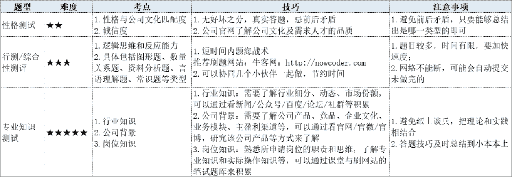
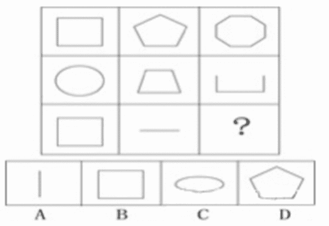
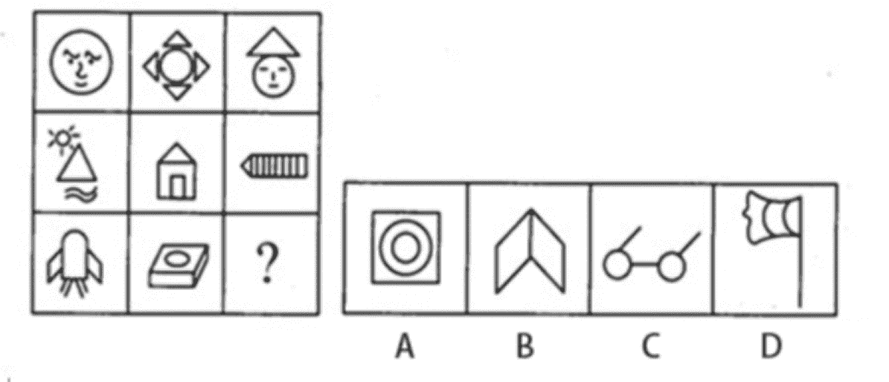
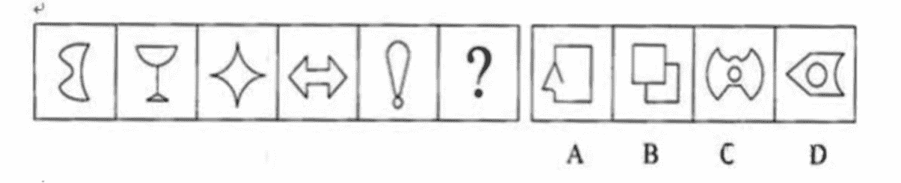
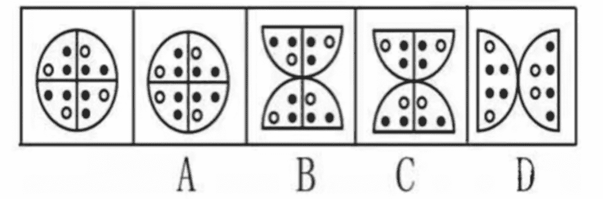
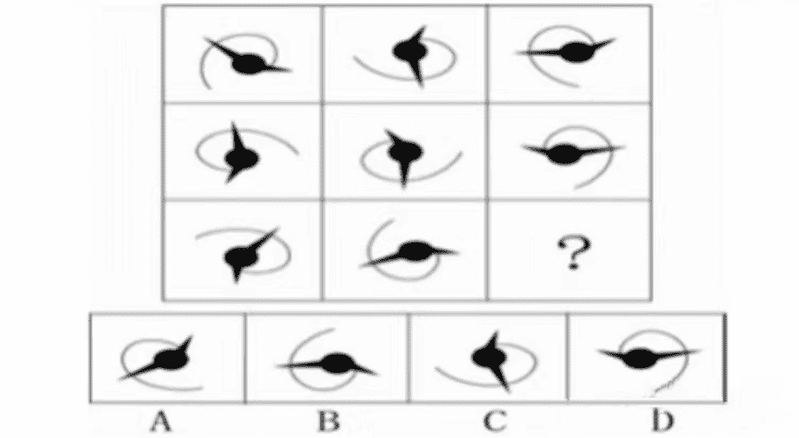

# 第三章 第 3 节 如何通过笔试

> 原文：[`www.nowcoder.com/tutorial/10060/001885ff3fc5491eb1f7a5e88f43d941`](https://www.nowcoder.com/tutorial/10060/001885ff3fc5491eb1f7a5e88f43d941)

# **1 ****笔试的类型与方法**

        笔试一般就是线上测试，也就是网申的测试题，一般时长为 1-2 小时，只有通过了网申、笔试才能够进入到面试环节，所以笔试一定要认真对待，有的公司笔试记录会在 hr 系统里面有保留，之前听说有的同学去应聘某车企的暑期实习生，测评做的不是太认真，最后没有录用。很多时候企业为了避免浪费，测评成绩是保留一年的，也就意味着秋招很有可能这位同学会因为测评成绩默认不过而无法获得面试机会，所以大家一定要认真对待每次测评。大家可能会有疑问，为什么要做笔试题呢？

        笔试既能真实的反映出求职者的一些能力，对学术知识、专业理论水平的掌握程度，又能确保面试官在一对一面试的过程中更详细地了解候选人的情况。下表将从笔试题目类型、难度、考点、答题技巧、注意事项等五个维度来介绍有关笔试的事项：

  

         以上适用于产品岗、运营岗、市场岗、管培岗等非技术类岗位，请大家认真看完表格中总结的内容。竞争是真实且残酷的，整体来说应对笔试的方法也只有一个：学习技巧+不断练习，再就是做题过程中原则为：先易后难，不会的直接过，不要浪费时间，有时间的话再回过头来想难题，也别想着作弊去百度，答题页面退出来一般没有第二次机会了，答题时选择比较安静的环境和邮件推荐的浏览器，机会只有一次，好好把握。

# **2 ****常见笔试题与****思路分析**

        下面针对以上笔试题型分享部分典型题目与解析：

## 2.1 **性格测试**

        这里没有什么典型的例题，时间相对比较充足，因为是性格测试，所以需要测试出你真正的性格属性，需要重复验证，也就是说一个问题后面可以重复或者稍微有变形的再问你一次，所以一定不要答的很随意，要记住自己的选项。一般是让你选最符合和最不符合的，比如问“我是一个喜欢领导别人的人”，后面有五个选项，从最符合到最不符合，这些根据自己的性格选就可以了，一般我们建议如果是好的品质，最不符合还是不要选，其它的中性的无所谓，按照自己性格来就行了，也没有必要一味的往脸上贴金。

## 2.2 **行测****/****综合性测评**

        行测，又被称为综合性测评或者智力测试，大概有以下几个类型的题目，我从我的视角由易到难来给大家举例和分析，可能不是所有人都觉得难度排行如下顺序，供大家参考：

###  ①　文字理解题

        回答思路：这个主要是看语言的理解能力，紧跟材料就可以，往往是考察大家的分析能力和阅读能力，一般不会有那种刻意绕的陷阱，就是注意不要主观的臆测，不要想太多，一切以所给的材料为主就可以。

*   **例题 1：**法律上的处分：指依照所有人的意思，通过某种法律行为对财产进行处理。根据上述定义，以下属于法律上的处分的是（）。

A.承租人将租赁物出卖

B.原材料经过加工成为产品

C.保管人将保管的财物消耗了一部分

D.一位售货员将自己的外套送给了邻居

解答：承租人对租赁物、保管人对其保管的财物不享有所有权，不是“所有人”，B 是一种事实上的处分，不是“法律行为”；D 中售货员是“自己的外套”的“所有人”，其赠送行为是法律行为。故选 D。

*   ** 例题 2：**钢铁被用来建造桥梁、摩天大楼、地铁、轮船、铁路和汽车等，被用来制造几乎所有的机械，还被用来制造包括农民的长柄大镰刀和妇女的缝衣针在内的成千上万的小物品。这段话主要支持了这样一种观点，即（ ）。

A．钢铁具有许多不同的用途

B．钢铁是所有金属中最坚固的

C．钢铁是一种反映物质生活水平的金属

D．钢铁是唯一用于建造摩天大楼和桥梁的物质

解答：A。做这种题目很忌讳同学们不认真读材料，仅靠判断选项就得出答案，其实选项往往都是正确的，而题目考察的是选项与材料的关联度，不仅仅是选项本身观点的正确与否；还有一种是同学们容易犯的错误，容易过度解读，属于“想的太多”，也容易曲解出题人的本意。本题只需要分清楚主谓宾，定位出主语“钢铁”，然后找到主干是三个“被用来制造”，就很容易快速判断出答案应该是 A，材料反映了钢铁具有许多不同的用途。

###  ②　类比推理题

        回答思路：先给出一对相关的词，要求你在备选答案中找出一对与之在逻辑关系上最为贴近或相似的词。注意这种题目其实不难，一定要抓住内在的关联，不要钻牛角尖，本来类比就不能完全一样，很多同学容易自己把自己绕进去。

*   **例题 1：**义工∶职员（ ）

A．球迷∶球员 B．学生∶老师 C．初学者∶生手 D．志愿者∶雇员

解答：D。这种就是理解好题面就行，上面的两种可以做同一个工作内容，但是工作属性不一样，一个非正式，一个正式。A：工作内容不一样，B：工作内容不一样，C：工作属性类似，D 接近。

###  ③　逻辑判断题

回答思路：每题给出一段陈述，这段陈述被假设是正确的，不容置疑的。要求你根据这段陈述，选择一个答案。注意，正确的答案应与所给的陈述相符合，不需要任何附加说明即可以从陈述中直接推出。

*   **例题 1：**对于穿鞋来说，正合脚的鞋子比大一些的鞋子好。不过，在寒冷的天气，尺寸稍大点的毛衣与一件正合身的毛衣差别并不大。这意味着（）。

A．不合脚的鞋不能在冷天穿

B．毛衣的大小只不过是式样的问题，与其功能无关

C．不合身的衣物有时仍然有使用价值

D．在买礼物时，尺寸不如用途那样重要

解答：只有 C 是可以从陈述中直接推出的，应选 C。

###  ④　数字推理题

回答思路：这个考察比较多的，一般就是小学奥数或者公务员行测中的数字推理填空题，总体上不难，但要求考生对数字比较敏感，或是掌握了一定答题套路，知道从哪几种常见规律入手。如

1、差值是固定递增的关系：1，3，5，7，9 或者 2，4，6，8，10 等等

2、平方递增的关系，就要对于平方关系比较熟悉：4（2 的平方），9（3），16（4），25（5），36，49，64，81，100，121，144..最好是 1~20 的平方自己都能背出来

3、立方关系：8（2 的立方），27（3），64（4），125，216，343，512，729，1000...最好 1`10 的立方能够自己背下来

4、质数关系：2，3，5，7，11，13，17，19，23，29....

5、开方关系：2（4 的开方），3（9），4（16）....

*   **例题 1：**257，178，259，173，261，168，263，（）

A．163 B．164 C．178 D．275

解答：这个数列咋一看好像没有规律，而且比较长，可以尝试交叉分组。即奇数项数列：257、259、261、263 为等差数列；偶数项数列：178、173、168、（）等差数列，所以很显然答案 163，选 A。

*   **例题 2：**0，9，26，65，124，（）

A．165 B．193 C．217 D．239

解答：数列中除了 0、9 是多次方数，其他的三个附件有多次方数，如 26 有 25、27，65 有 64，124 有 125、121，分析差值情况，显然只能选项差为 1 的，所以将他们转化为多次方的形式就很清楚，1 的三次方-1，2 的三次方+1，3 的三次方-1，4 的三次方+1，5 的三次方-1，6 的三次方+1，所以答案很清楚选 C。当然这里面也加入了奇偶列的考察。

###  ⑤　图形推理题

思路总结：这应该是得分率最低的题型了。因为图形的表达方式很丰富，所以答题规律性最弱，对同学的观察能力、分析能力和思维的跳跃性是一种很好的检测。一般图形推理每道题包含两套图形和可供选择的 4 个图形。这两套图形具有某种相似性，其变化存在一定规律。要求你从四个选项中选择你认为最适合取代问号的一个。所以正确的答案应不仅使两套图形表现出最大的相似性，而且要符合某种特征。主要有以下技巧

1.图形相同看位置——平移，旋转，翻转（注意位置移动的方向和距离；时针法判断旋转和翻转）。

2.图形相似看样式——遍历，运算。遍历指的是每行或列有相同个数的组成元素，但排列不同，

3.图形杂乱看属性和数量——对称、曲直、封闭和点线面角素：

A.属性：封闭，曲直，对称

B.点——线线接触时数点：交点，顶点，割点，切点；

C.线——线多，数线条，优先数直线；

D.面——所给图形有明显的区域划分（封闭区间）；

E.角——（180 度以内的内角）题中有扇形出现时——数角；棱角分明且多的图形——数角；

F.素（部分）——图形的组成元，或者有几个独立的部分组成

 4\. 折叠图形先看特征面，再看双面关系，旋转确定三面关系；

*   **例题 1：**

  

【解答】D。本题属于数量类。按照“直线居多数直线”的原则，发现每一列的第一个图形的直线数减去第二个等于第三个。 

*   **例题 2：**

 【解答】B，本题属于样式类。求同，每一行三个图形都有一个相同元素，第三行都有一平行四边形。

*   **例题 3：**

 

【解答】D。本题属于样式类。分别是横轴对称、竖轴对称、横竖轴对称、横竖轴对称、竖轴对称，所以选 D。

*   **例题 4：**

【解答】B。平面组成型，元素相同看时针方向，四个扇形组成相同，从黑点向白点画一个箭头，发现四个扇形都是顺时针方向，选 B。

*   ** 例题 5：**

  

【解答】A。本题属于位置类。在图形外面的曲线上添上箭头，会发现，每一行的第一个图形与第三个图形方向一样，第二个方向相反，所以选 A。

## 2.3 **专业知识测试**

        有选择题、填空题、也会有大题，但是少部分企业对于非技术类型的岗位考专业知识，一般都是前面两种类型的笔试题，或是将这部分安排到专业面试中，我秋招过程中笔试还没有遇到过专业知识测试，所以这里也不做过多介绍和分析了。