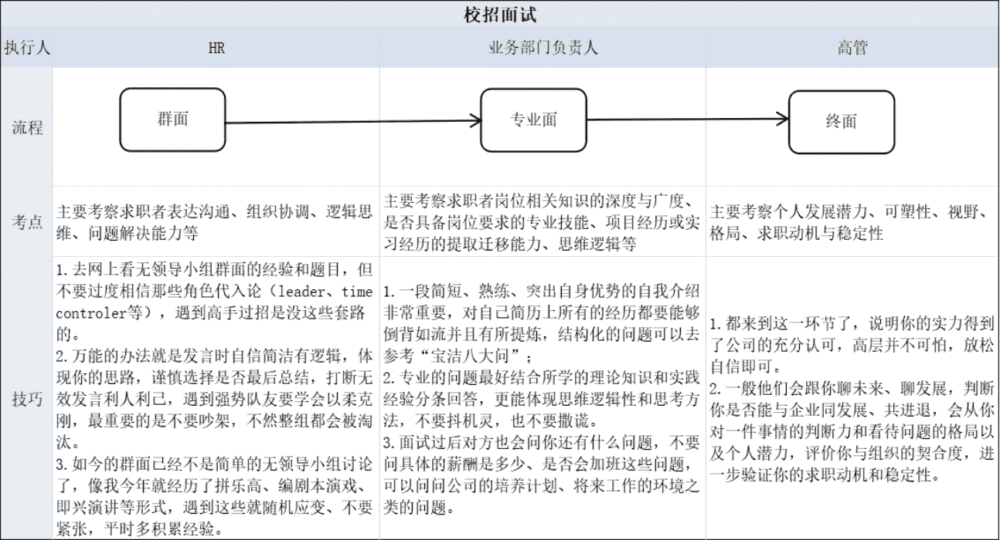
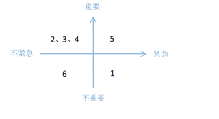
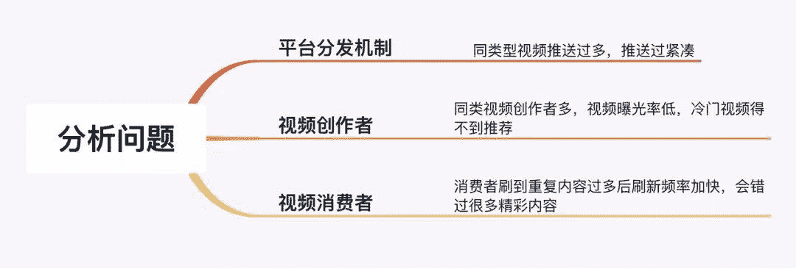
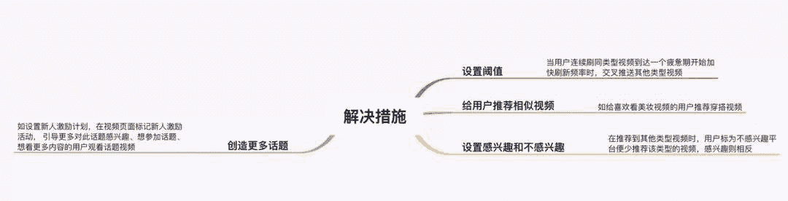
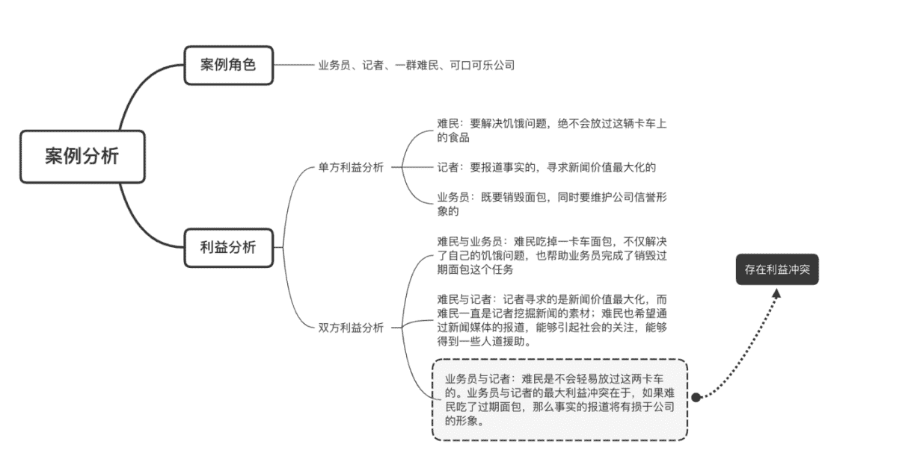

# 第三章 第 4 节 如何通过面试（上）

> 原文：[`www.nowcoder.com/tutorial/10060/319b020b2d8f47f5b10a04d6b3153d07`](https://www.nowcoder.com/tutorial/10060/319b020b2d8f47f5b10a04d6b3153d07)

# **1 面试流程与方法**

        面试一般有三轮，一面、二面、三面主要对应的是群面、业务部门负责人面、高管面，以下是我总结出的面试流程中对应的面试技巧，因面试注意事项和注意细节都是各个环节中通用的，我就附在表后的文字中来体现以供大家参考：

        在面试的时候，除了以上表格中我提到的技巧中的注意事项，很多细节便会决定面试的成功与否，那么快消行业的面试会更关注学生的什么细节呢？其实主要有三个细节：

        一是自我反思。很多快消行业格外注重自我反思的思维，几乎在每个面试环节，面试官都会问：对于你的表现，你有什么反思？因此如果你在面试中能呈现出很好的复盘思维和闭环思考，你将会有更大的可能获得面试官的关注。

         二是学会倾听。在快消行业的工作中，你经常会需要和不同的人沟通，因此面试官更希望你是个懂得倾听的人。以群面为例，很多人急于展现自己，此时他们容易忽略其他人到底在说什么。有的时候，面试官可能会提问，你还记得上一个同事，他代表的是哪个部门？它最核心的诉求是什么吗？因此，如果你能学会倾听，或许你将更容易得到面试官的肯定。

         三是注意真诚。在面试的时候，有些学生为了让自己的能力显得更为卓越，偶尔会夸大自己的某些经历，而这恰恰是企业最忌讳的行为。因此建议大家不要过于包装自己，甚至撒谎。因为大部分面试官阅人无数，特别是快消企业，越到最后的环节，给你面试的人会越资深，因此一旦你过度包装的话，很容易就会被识别出来。

# **2 ****常见面试题****与思路分析**

## 2.1  **群面**

        群面安排在第一轮，企业能够快速筛选出目标求职者，所以淘汰率也是相对较高的，大多群面都会淘汰 50%以上的求职者，所以要通过分析题型、模拟训练来提升自己的群面能力。总的来说步骤是：理解群面各种题型以及解决套路、定位清楚自己群面的角色、学习相关角色中的职责与套路以便最大提供群面贡献度，下面给大家分析群面常见的四种题型和解题思路：

###  ①优先级排序类

回答思路：读题审题——对选项分类——对各类排序——对各类子选项排序——产出整体排序优先级——结合题目要求给出小组结论。

*   **题型 1：**假如你是某广告平台的销售经理，现在在你负责的业务范围内出现了以下问题，请你按照解决问题对以下问题进行排序，并给出排序理由。

1.你的电话已经更换，但是名片并没有更新；

2.由于公司后台流程存在问题，公司每天给客户发送的广告投放表存在数据问题；

3.有一个合作意向极高的客户，希望你出一个广告合作方案；

4.由于公司广告设计部门的广告效果不佳，好几个客户不满意推迟了广告计划；

5.公司合作客户对于广告方案，由于竞争对手的加入，直接要求降低 30%的广告投放；

6.邮箱收到匿名信，反映公司员工存在向客户夸大广告效果的情况。

 **参考答案：**先按四象限法则根据重要性和紧急程度首先粗略排出一个顺序，然后再细分每种情况的内部排序。        排序结果分为重要且紧急，紧急但不重要，重要但不紧急，四个维度。

| 重要且紧急 | 5.公司合作客户对于广告方案，由于竞争对手的加入，直接要求降低 30%的广告投放 |
| 紧急但不重要 | 1.你的电话已经更换，但是名片并没有更新； |
| 重要但不紧急 | 2.由于公司后台流程存在问题，公司每天给客户发送的广告投放表存在数据问题；3.有一个合作意向极高的客户，希望你出一个广告合作方案；4.由于公司广告设计部门的广告效果不佳，好几个客户不满意推迟了广告计划； |
| 重要但不紧急 | 6.邮箱收到匿名信，反映公司员工存在向客户夸大广告效果的情况。 |

 **理由如下：**

        首先，重要且紧急的事必须立马解决，第 5 点由于竞争对手加入，加剧事情的严重性，很有可能造成客户流失使公司蒙受损失。

        接着关于紧急但不重要事件和重要但不紧急事件先后，我们的考虑是：更新名片这件事情紧急但不重要，联系方式关系到客户能否及时联系到人，但是客户可以有多种方式联系到销售经理，不只名片一种途径，排第二是因为，名片更新这件事很容易就完成，而后面 2、3、4 三点面向客户群体所以很重要，但是时间投入成本高，更新名片这件事排前面并不会影响太大。

        第 6 点归为不紧急不重要，排最后，公司员工夸大广告效果并不会对目前业务造成太大损害，属于潜在问题，优先级后置。

        大体顺序出来后，再将紧急但不重要的三件事情排序。

        2 排第一，因为后台流程存在问题导致每天给客户发送的广告投放表存在数据问题，这可能影响现存的所有广告业务，扩大业务的基础是维持好现存业务，所以这点排第一。

        3 排最后，因为跟 4 比起来，3 只是合作意向高的客户，并不一定一定能争取到，所以往后放。

        综上，事件的优先级排序为 5>1>2>4>3>6。

###  ②　问题解决类

        回答思路：读题审题（把问题进行拆解）————分析问题——提出解决措施

*   **题型 2：**抖音目前凭借精准的信息流推荐算法，能够为用户提供其感兴趣的视频内容，但同时也会出现推荐的视频重复度高、视频内容类似的情况，从而减少了用户获取其他信息的可能，作为抖音的产品经理，你如何看待这一现象，如何解决？

** 参考答案：**

a.**题目拆解：**从视频消费者和视频创作者两个维度分析这个现象对用户和创作者的优劣势：

 

**现象：**视频重复度高、视频内容类似。

**影响**：1）视频消费者对于视频消费者而言，同类型作品过多一方面可以使消费者刷到更多感兴趣的同类视频，加强用户使用产品的体验，提升用户粘性。另一方面，推荐视频重复度高、内容类似，会使用户在观看过程中审美疲劳，刷到同一类型视频过多，信息闭塞，长远看来不利于用户留存。

 2）视频创作者

对于视频创作者而言，能够激发传作者创作更丰富的视频，还能基于热门话题被更多推荐蹭流量。另一方面，同类视频过多会导致视频的点赞量和关注度得不到提升。

 **b.分析问题：**我们从分别从平台分发机制、视频创作者、视频消费者三个维度分析问题： 

1）平台分发机制：推荐同类型视频过多，导致平台推荐内容过于重复，消费者刷到太多重复内容。

 2）视频创作者：同类视频创作者过多，相同类型的视频曝光率低，与此同时，冷门视频得不到推荐。

 3）视频消费者：当视频消费者刷到视频内容重复度高，开始感到无聊时，便会加快视频刷新频率，没有完整看完视频内容，这个过程中就可能错过很多精彩内容。

**c.解决措施：**根据上述问题，从针对平台分发机制、针对视频创作者、针对视频消费者三个维度提出以下四点解决措施： 

1）针对平台分发机制：

设置阈值，当用户连续刷同类型视频到达一个疲惫期开始加快刷新频率时，交叉推送其他类型视频。

 2）针对视频创作者：

创造更多话题，如设置新人激励计划，在视频页面标记新人激励活动，引导更多对此话题感兴趣、想参加话题、想看更多内容的用户观看话题视频。

 3）针对视频消费者：

给用户推荐相似视频，如给喜欢看美妆视频的用户推荐穿搭视频。

设置感兴趣和不感兴趣，在推荐其他类型视频时，用户标为不感兴趣平台便少推荐该类型的视频，感兴趣则相反。

###  ③　开放辩论类

**回答思路：**运用 STAR 法则，用场景+任务+行动+结果的结构思考分析。STAR 法则，就是一种讲述自己故事的方式，或者说，是一个清晰、条理的思考回答模板。不管是什么，合理熟练运用此法则，可以轻松的对面试官描述事物的逻辑方式，表现出自己分析阐述问题的清晰性、条理性和逻辑性。

*   ** 题型 3：**一个成功的产品是为了解决痛点和需求，问题是机遇和环境重要还是产品本身能力更重要。（请至少举出五个理由）

 **参考答案：**一个成功的产品，机遇远比产品能力更重要。这并不是说，优质的产品能力就不重要，我们讨论的是，两相比较，哪个对产品的发展更为重要。理由如下：

 **a.产品的需求是会随着环境而变化的。**

一个能够持续的满足用户的需求的产品，才可以称之为优秀的产品。但是需求是会随着环境而变化的。

早期，人们受限于当时的社会环境经济条件等种种原因，没有智能机的需求，即使我们能做出市面上最好的智能手机，也没有办法迅速扩大市场，打造一款真正成功的产品。

优秀的产品并不是凭空想象拍脑袋做出来的，否则为什么需要去做行业调研、背景调研、用户调研等等工作？因为我们需要去验证需求是否存在、机遇是否存在。

否则闭门造车，即使打造出所谓最好的产品，也有可能并没有人买账。

** b.机遇对于一个产品的发展有着至关重要的意义。**

创意可以复制但机遇不可求。雷军有一句名言，站在风口，猪都能飞起来。当然这句名言不能断章取义，他的后半句是，长出一个小翅膀，就能飞得更高。但由此我们也可以看出来，是乘着风起飞要在前还是长出翅膀飞得更高在前。这个先后顺序也能说明机遇与能力孰轻孰重。

毫无疑问，我们需要抓住机遇和风口，否则在你原地踏步，长出翅膀的过程中，可能这阵风就已经过去了。而抓住了机遇，乘着风起飞，后期我们可以通过不断地打磨产品来长出翅膀飞得更高。但没有这阵风，猪是永远没办法起飞的。

而没有抓住机会因势而变的反面案例就是联想，当年联想在中国市场一举打败 IBM，04 年收购 IBM 的 PC 业务，成为全球 PC 的老大。但在之后的十几年里，联想一直禁锢在 PC 端，错过了移动互联网的风潮。

 **c.互联网行业竞争愈发激烈，因此大家都在找增量市场而不是存量市场。**也就是寻找可能地机遇和潜在的市场。如 17 年的直播行业，18 年的短视频风口。

以短视频行业行业为例，初期流量为王，各家通过答题瓜分现金等方式争夺风口的流量，后期各家内容逐步同质化之后开始进入短视频行业下半场，即内容为王。通过邀请 KOL，鼓励 UGC，不断打造更为优质的内容去进行差异化竞争。

 **d.优秀产品都是抓住机遇，小步试错，快速迭代。**

我们都知道，做产品并不是初期一下就能做出一个十全十美的产品，因此我们有 MVP 的概念，即最小可行性产品。

这个产品通常不那么完美，但能满足用户使用的最基本需求，通过 MVP 去测试这个产品是否抓住机遇，机遇和市场是否存在。MVP 成功后，再通过不断地反馈和迭代去优化产品。

很多产品在早期都是不太完整的需要不断试错。我们知道陌陌和微信作为社交类产品，早期都或多或少的存在一些涉黄的风险。微信早期的摇一摇也曾被人吐槽是约炮神器，但这并不影响它成为一款优秀的产品。

微信与 QQ 相比，简洁易用，站在了人们从 web 端逐步向手机移动端迁移的风口，因此抓住了风口迅速成功，后期再对这些部分进行监管或者删除，并不断地去完善产品的功能，持续的满足用户的需求。

 **e.用户价值=新体验-旧体验-替换成本，抓住了机遇，用户的替换成本几乎为 0。这个替换成本就是至关重要的部分了。互联网市场，先入场为王。**

假设你现在能做一款十分优质的社交产品，无论是从功能上还是用户体验还是交互设计上都优于微信，并且接受大家对微信的广泛吐槽，对语音部分增加了进度条，可实现大文件互传等等功能，你把这些方面几乎都做到了 90 分，不能说你这个产品不够优秀，但事实上你依旧很难打败微信。

因为，用户替换是有成本的，特别是对于社交类软件来说替换成本极高，除非你能撬动整个关系链。因此不重视机遇的后果是：你以为自己打造出了优质的产品，但用户视你如鸡肋。

        综上，对于产品的成功，抓住合适的机遇至关重要，之后才是根据市场的反馈不断地调整和打磨产品的能力。

###  ④　角色扮演类

**回答思路：**读题审题——圈定关键词——确定矛盾点——确定矛盾优先级——提出解决方案缓和矛盾

*   **题型 4：**假设你是可口可乐公司的业务员，现派你去偏远地区销毁一卡车的过期面包（不会致命，无损于身体健康）。在途中，刚好遇到一群饥饿的难民堵住了去路，因为他们坚信你所坐的卡车里有能吃的东西。这时报到难民动向的记者也刚好赶来。对于难民来说，他们要解决饥饿；对于记者，他是要报道事实；对于你来说，是要销毁面包。

         现在要求你既要解决难民的饥饿问题，让他们吃这些面包，以便销毁这些面包，又要不让记者报道过期面包的这一事实。请问你将如何处理？说明：面包不会致命，不能贿赂记者，不能损害公司形象。

 **参考答案：**

我们先通过一个思维导图来了解案例角色、分析、梳理单方和双方利益，以便界定问题点，从而思考出解决方案。

 

        通过以上的利益分析我们发现问题主要发生在业务员与记者之间的利益冲突。因为记者是刚刚赶来的，所以他还不知道车上的面包是否过期，而一旦难民吃了面包，那么他就知道事实了。难民一定是要吃的、记者一定是要报道的，业务员面包是一定要销毁的。业务员要么不给、要么给。案例中由于对“一群难民”的概念还是模糊不清，到底是 100 呢还是 1000 个难民呢，到底能不能保证一群难民全部消费掉这辆卡车上的食品呢？这些都不清楚，因此给的话，对公司形象将大大不利。不给的话，时间持续下去，难民势必会哄抢食品，这就造成了一起突发事件。所以最终我们将问题界定为一起危机事件的处理。

**解决方案：**通过对以上的问题界定，得出以下解决方案：

1） 业务员不能主动给难民过期食品，而应僵持下去，让他们自动哄抢食品。在难民哄抢食品并开始吃的时候，业务员应大声疾呼，果断“伪叫”，假装阻止难民哄抢过期面包，同时大喊记者过来一起制止，这样可以向记者表明，业务员的本意即他根本就没有打算让难民吃过期的面包。  

2） 业务员应及时打电话回总部，叫总部运来一车新鲜的面包，以解决难民的饥饿问题。并向总部解释发生的事情以及自己的解决方法。在这个过程中，难民由于饥饿难忍会“消费掉”一些过期面包。  

3） 待总部新面包送来之际，应及时和记者沟通，做好企业公关。比如记者对此次事件的报道，会采访业务员，业务员就应该利用这个机会大打企业公关牌，比如为记者拟好明天报道的题目“过期食品遭哄抢，可口可乐显真情”等等。其实这些都是把这一危机事件当作公关危机来处理。  

4）方案评估。本方案既解决了记者的报道问题，又消耗了一定的过期面包，同时还借助这一事件，大大宣传了企业的人文关怀精神和社会责任，其付出的代价仅仅是一卡车新面包而已，就算是几百万的广告都很难达到这样的公共效应。