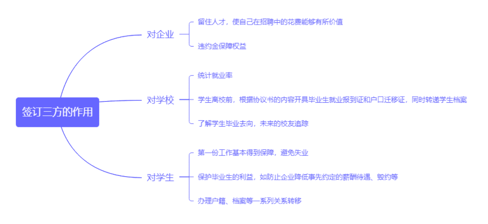
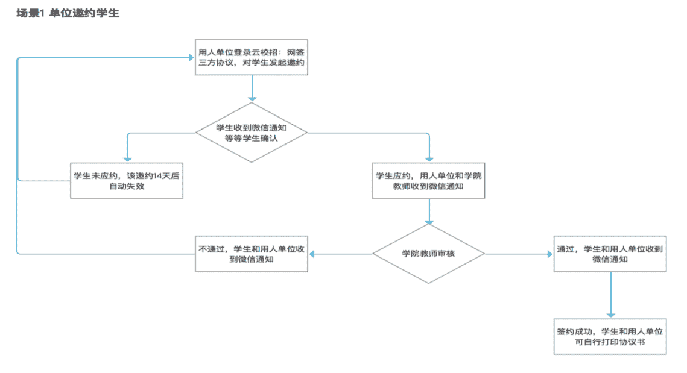
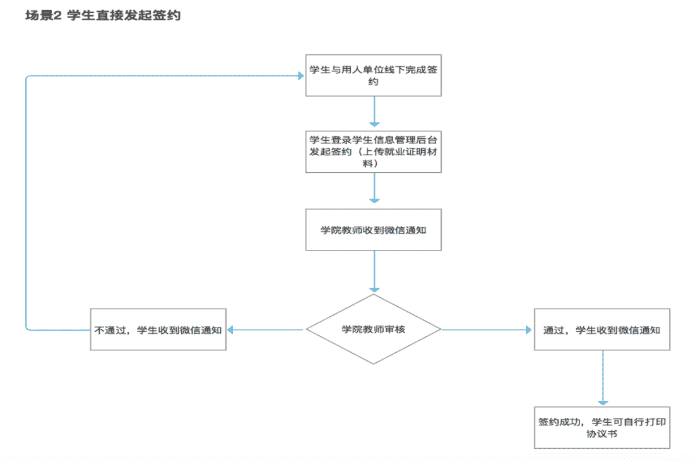
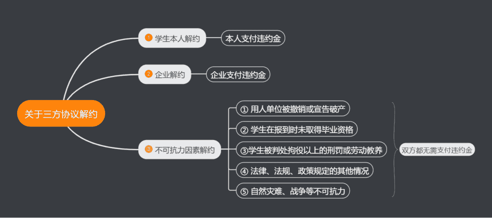
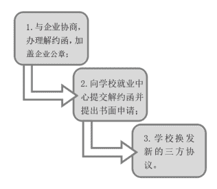
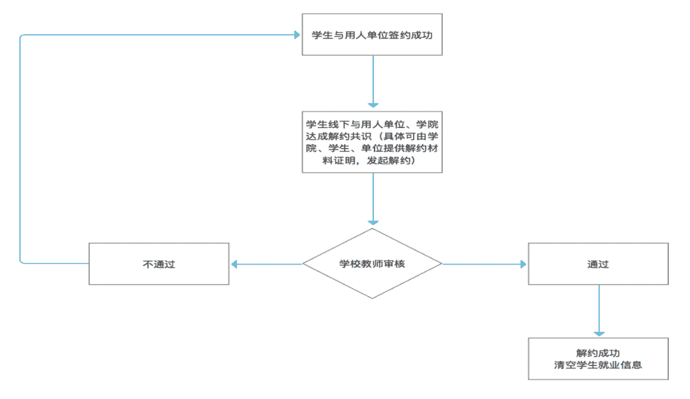

# 第三章 第 6 节 offer 选择与结语

> 原文：[`www.nowcoder.com/tutorial/10060/e00df9565fb04e5ea9948da4f8acfad0`](https://www.nowcoder.com/tutorial/10060/e00df9565fb04e5ea9948da4f8acfad0)

# 1 offer 比较与选择

        校招收尾的时候，部分同学手里的 Offer 都不止一个，优秀者甚至有几个、十几个，而未来只能选择一个作为你职业生涯的第一份工作，那么我们应该如何去比较与选择 offer 呢？我觉得最有效的方法就是抓住自己的核心诉求，结合核心诉求对 offer 提供的条件进行拆分，当然可能为了核心诉求在其他方面会要短暂的牺牲其他诉求，这里我们假设一位同学的核心诉求是为了得到更多的钱，在对比和选择 offer 的时候，我建议从以下几个因素来考虑：

## 1.1 **行业**

        选择朝阳行业，朝阳行业可以赚到更多的钱，即使不想做了也方便跳槽，而夕阳行业，是没得选择的，这直接关乎之后的所有因素，所以选对行业是最重要的。

## 1.2 **公司规模与业内地位**

        作为第一份工作，不建议选择不知名的小公司，小公司背景跳槽与大公司背景跳槽的待遇完全不一样，选择规模大、行业内地位排名靠前的公司，这将有利于你获得更为丰富的报酬、更好的成长环境、更完善的培训体系、更高的起点。

## **1.3 公司现状**

        这要参考公司现在的组织架构以及发展机会，一般来说处在中高速发展的公司需求岗位多，会有更多的机会空出来，抓住这些机会，你才会有更多的提升，尤其是提高自身的核心竞争力和不可替代性对未来发展十分重要。

## 1.4 **岗位以及工作内容**

        建议选择公司核心部门的核心岗位，边缘部门和潜力不足的岗位可以排除。例如两家一样的快消公司，一个给 15k 做支持营运，一个给 12k 做市场策划，肯定是做市场策划，因为支持营运的市场价格以及紧俏度完全比不上市场策划，将来跳槽的身份和身价完全不一样的。

## **1.5 薪酬**

        薪酬包括基本工资、绩效、年终奖、期权、股票、员工福利等，到了此等级才需要考虑薪酬，因为满足前面的条件，薪酬也一定是不会低于你的正常值的。

         以上就是该同学的核心诉求为金钱时判断与选择 offer 主要考虑的因素了，本质上需要关注的就是跳槽选择权、跳槽增值性、金钱持续性、金钱基数。还可能会存在一些离家远近、城市位置、工作强度、公司氛围之类的因素，但这些都不是主要的，如果你的核心诉求不是金钱，而是有稳定的经济收入来源或者是家庭稳定，又或者是要做喜欢的事，那就应该换一种评估方式，重新审视各个维度的信息。

# **2 关于签订三方协议**

## **2.1 三方协议是什么**

        三方协议又叫就业协议书，全称是全国普通高等学校毕业生就业协议书，是指用人单位、普通高等学校和应届毕业生在正式确立劳动人事关系前，经双向选择，在规定期内确立就业关系、明确双方权利和义务而达成的书面协议。学生签三方之前，三方协议被保管在校方手中，协议一式三份，签约后一份自己保存，一份交给学校，一份交给用人单位，（有的地区一式四份，一份交给教育局存档）。

         三方协议具有**唯一性**，由学校所在省或直辖市的教育部门统一印制，一人一编号，学生不能同时与一个以上的企业签订三方协议。

         三方协议的**生效期**是签订三方协议（三方均签名盖章确认）起至学生到用人单位报到并签订劳动合同止。三方协议不等于劳动合同。

         三方协议具有**法律效力**，一旦签署，任何一方不得擅自解除，否则违约方应向权利受损方支付协议条款所规定的违约金。从实际情况来看，多为毕业生违约。

         三方协议**不等于劳动合同**，三方协议是确定就业及用人意向，而劳动合同是确定劳资关系。法律并没有专门针对三方协议予以明确的规定，因**不存在劳资关系**，所以三方协议中的违约金更多地适用于《民法通则》与《合同法》，而劳动合同则是适用于《劳动法》与《合同法》。

## **2.2 三方协议的作用**

        签订三方对于三个主体方都有好处，如下图：

 

## **2.3 签订三方协议的流程**

        签约三方是个既麻烦又不麻烦的事，不麻烦就在于只用三方签个字盖个章写上协议内容即可。麻烦在于三方均要签署，而有些学生签约的企业离学校很远需要邮寄，部分学校和企业办事效率较低，使得整个过程少则一两周，多则一个多月，不过现在经过疫情之后，很多企业与学校都可以走线上网签三方了，就省事了很多。需要注意的是在三方协议签署的过程中，多留点心，如遇拖延情况，可适当催一催。

### 2.3.1 一般来说，线下签约三方的步骤如下图：

###  

### 2.3.2 一般来说，线上网签三方的的步骤如下图：

 

## 2.4 **签订三方协议的注意事项**

        不论你之前口头或者邮件接受了几家公司的 offer，最终都是以三方协议的签订，宣告你第一份工作的归属。虽说一份三方协议不能将一个人与企业牢牢绑定，但是若违约，违约责任人一方面需要赔付 3000-10000 元不等的违约金，另一方面，签订三方协议后会给应届生造成工作已经定好了，不需要再面试了的感觉，有可能会错过更好的机会。所以签订三方协议之前一定要确保以下事项：

### 2.4.1 **确保已经认真分析和考虑毕业去向的各种可能**

        应届生这个身份很重要，对于进很多好的公司来说，可能只有应届毕业生这个身份才有选择，社招是完全没有机会的，错过了应届生毕业这一年签三方，也就意味着放弃了这个选项，比如各大企业的管培生是只针对应届生才有的人才项目。

         在签订三方协议之前，再问问自己：这是否是已经确定无疑的方向了？一般说来应届生毕业后去向有继续求学、考公务员、考事业单位编制、应聘国企、应聘其他企业岗位这几个方向，从一种方向跨越到另一种方向有非常多客观条件的限制与障碍，所以需要三思而后行。

         如果还没有想好，就去查找更多的资料、咨询有经验的老师或者已经工作的学长学姐、静下来仔细分析自己的性格特质、真正的优势与不足、对未来生活的规划，然后定大方向。

### 2.4.2 **确保已经进行了多家 offer 的判断与选择**

        入职之前选择权是抓在自己手里，入职之后可能相对没这么自由了，所以趁着还能选择的时候多去对比，把自己想要了解的问题都记下来，找到各企业的 hr 问清楚，跟同样拿到 offer 的同学互相沟通已知信息、或者跟已经在职的师兄师姐请教、如果没有已在职的师兄师姐的话，推荐大家去牛客讨论区，里面有很多真实的在职人员/实习过的人员可以给到大家建议。总之就是要尽可能的收集不同行业、不同性质公司的相关信息。了解了公司提供岗位的职业发展通道、薪酬福利待遇、工作环境、工作时间和氛围等，再进行对比。

         如果觉得哪家好就可以签约；没那么满意但还可以接受的可以缓一缓，再看看有没有更好的；实在不行的，可以明确答复放弃签约。

### 2.4.3 **确保三方协议上的信息与所谈信息一致**

        还是那句话，所有口头上的承诺都不算数，只有三方协议上的内容才是最后的结果。所以在签之前一定要仔细看协议上的以下关键信息：

*   是否有违约金、金额是多少。超出入职后一个月的工资基本就算高的了，实在拿不定主意最好找学校老师咨询。
*   工作期限和试用期限。合同期限三个月以上不满一年的，试用期不得超过一个月；合同期限一年以上不满三年的，试用期不得超过两个月；三年以上固定期限和无固定期限的劳动合同，试用期不超过 6 个月。
*   试用期与转正后的劳动报酬。按照劳动法规定，试用期工资不得低于本单位相同岗位工资标准的 80%，且不得低于当地最低工资标准。
*   社会保险与公积金的比例规定。企业承担的部分不得低于当地最低标准。
*   无法履约的情况下达成的约定等。

## **2.5 关于三方协议解约**

        三方协议解约不仅仅是指学生本人单方面解约，解约的主体主要包括学生本人解约、企业解约和不可抗力因素导致的解约。

### **2.5.1 学生本人解约**

解约和签约一样，需要谨慎选择，三方协议编号是唯一的，重新申请和解约是比较麻烦的。当然，如果是找到了更好的工作，想要解除原三方协议，是可以的，不过也有风险与成本，还涉及到个人的立场、规划与诚信问题，如果非解约不可，常规的解约流程如下：

#### **①线下解约流程：**

 

#### **②线上解约流程：** 

 

        很多三方协议中有规定违约金的，大部分情况下，违约金不会超过 5000 人民币。当然也有直接是第一个月工资的情况，如果你不想支付这笔违约金，可以先与 HR 协商，软硬兼施，之后有两种可能：

①HR 被你打动，免除违约金，给你出具解约函，退还你三方协议；

② 你不给钱，企业就不退还给你三方协议，想拿到解约函也没门。

第一种情况则皆大欢喜，倘若碰到第二种情况，我们该怎么办呢？先来看以下两点：

①三方协议书不是劳动关系的法律文件，对劳动关系没有法律约束力；

②三方协议具有法律效力，违约要赔偿，但是在签订劳动合同后失效。

        所以，你只要履行了三方的职责，在规定日期内到企业进行报道，相当于三方就失效了，违约金也自动失效，你可以按时去报道并签订劳动合同，然后立马辞职，这样没有违约，也没有耽搁你去其他公司报道入职。但是这样做前提有三点，缺一不可：

 ①你想要解约的这家公司的入职日期之前（你不能同时签订两份劳动合同）

②能够在去新公司之前辞职（一般来说试用期提前 3 天，正式员工提前 30 天）

③你与新公司协商好，凭发你的 offer 入职（协商好不签三方，可以签两方），入职时直接签订劳动合同

        如果以上条件不都满足的话是不能这么操作的，就赔违约金就好了。

### 2.5.2 **企业违约**

        一般而言，很少有企业会违约，毕竟是花了大量的人力成本来招聘，但也并非没有，2020 年受疫情影响下，很多企业收益缩减，大量裁员，首当其冲的就是还未进入公司的应届生，据传✘✘互联网公司一次性解约了数百名应届生。

         若企业有违约的情况，企业需根据条款给毕业生违约金。如果企业就是不想赔钱的话，那就想办法诉诸于法律，不过因为签了三方，此时也可以找校方寻求一定的帮助。

        同时一定要想办法敦促企业要求把三方协议等资料在一个星期内转回到学校方便再找工作，将自己的损失降低到最小化。

### 2.5.3 **不可抗力因素解约**

        常见的不可抗力因素的条款见上方思维导图。因不可抗力而导致三方协议无法继续执行时，双方无需承担责任。具体的不可抗拒因素条款一般会在三方协议中列出，值得注意的是，大部分企业也将“因升学而导致无法及时去企业报到的情况”列入到了不可抗力因素中，此情况下违约，学生也可以不支付违约金。

         以上就是关于三方协议这部分我想说的全部内容了，给大家的忠告就是：签约一定要三思、尽量避免毁约。不然会给你带来很多不必要的麻烦，毁约流程复杂且耗时长，这都是沉没成本，能避免则避免吧。

# **3 结语**

        亲爱的读者，感谢你阅读到这里，本刊的撰写也即将告一段落，希望我以上所谈及的内容多多少少能对你的求职之路有所帮助，让你不会感到是一个人盲目地独自奋战在这或长或短的求职过程中。不要忘记，你身边有成千上万的小伙伴与你一起经历着或相似或不同的求职故事，而我们作为过来人，也会通过各种途径给你们讲述我们的求职经历，帮助你们少走弯路。

         最后，祝你斩获诸多满意的 offer，入职到最满意的公司，愉快地开启你的职业生涯！