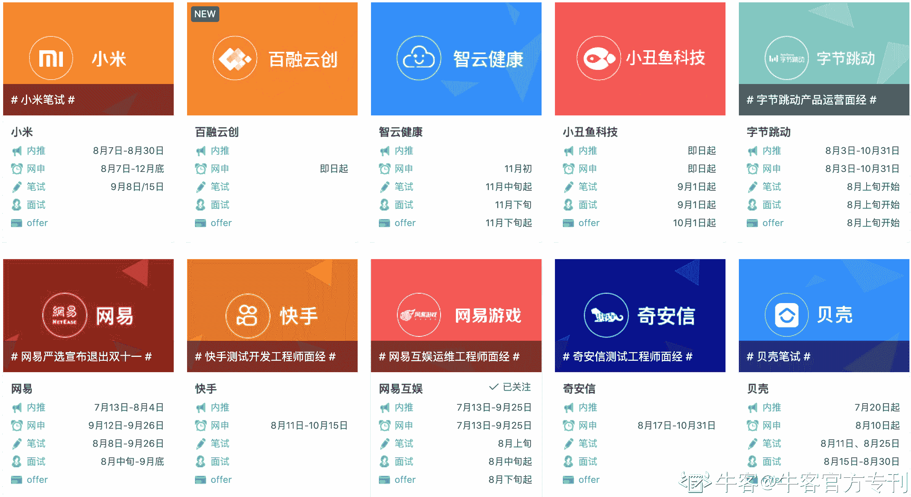
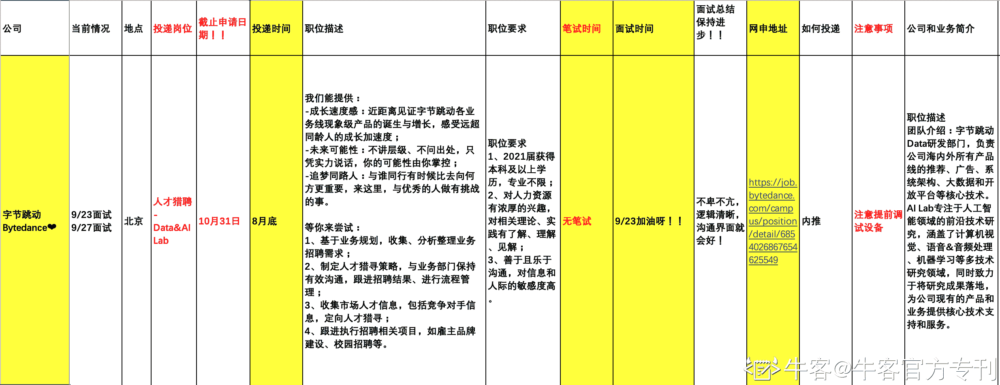
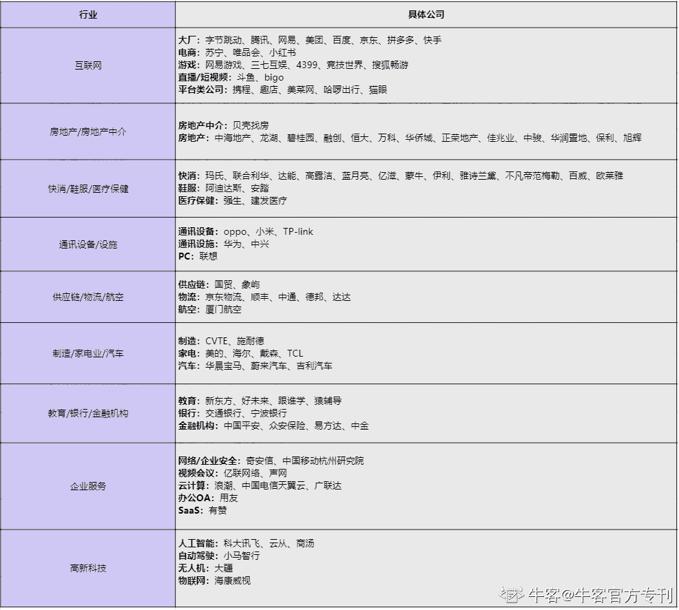
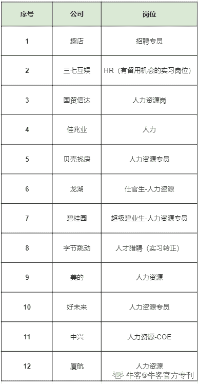

# 第一章 第 1 节 我的秋招求职之旅

> 原文：[`www.nowcoder.com/tutorial/10042/d96100077b54494595cc19c7c46cdb5b`](https://www.nowcoder.com/tutorial/10042/d96100077b54494595cc19c7c46cdb5b)

# **1\. 个人背景**

## 1.1 本硕学校及专业

学历和成绩：211 本科人力专业（年级前 1%，保研）+985 硕管理学专业（班级前 20%，专业方向第一）。

个人评价：本硕专业和人力工作强相关+成绩不错是亮点，学校也还不赖。

## 1.2 和求职相关的个人特色背景

校内实践：班长（2 年）+学生会部长（1 年）+就业指导中心任职（半年，曾协助企业举办过宣讲会和双选会）。

实习：互联网小小厂运营（10 个月）+互联网大厂人力实习（5 个月），两份实习时间比较长+都有不错的产出（可用数据量化）。

竞赛证书：企业人力资源管理师三级证书+英语四六级+计算机二级（office）。

成长经历+个人特色背景：曾在四个不同省市的求学经历，一定程度体现了我具备比较高的适应能力；白羊座♈、外向乐观，平时比较搞笑（这一点和负责招聘工作的 HR 比较适配）。

自我评价：就个人背景而言，自我评价比较一般。

首先，校内实践方面，主要负责的都是班级或者学院部分事务，比较少担任类似学生会主席的领导角色；

其次，实习经历方面，我只有一份人力相关的大厂实习，但是秋招群面时经常遇到两份及以上大厂或者人力不同模块实习经历的同学，感觉自己这部分比较弱；

竞赛证书方面也比较常规，没有什么大型赛事的经验，只是说考取了企业人力资源管理师三级证书，但是除了国企和事业单位其他企业基本没有问到这个。

建议同学们围绕人力岗的任职要求来梳理个人经历，每段经历都可以深挖下：

*   这段经历体现了我的什么能力？
*   这部分能力和人力岗的任职资格强相关吗？
*   这段经历有什么亮点？
*   面试官可能会针对这段经历提什么问题？

# 2\. 求职经历

## 2.1 找实习的渠道

官方渠道：企业官网、微信公众号、学长学姐的内推链接。

第三方渠道：如牛客网等平台、求职微信群、求职公众号、学校或学院或班级微信群。

我自己主要是通过企业官网、求职微信群、牛客网等第三方平台寻找实习机会。 在企业官网进行投递的好处是：可以了解目前进行到面试的哪个环节， 通过求职微信群或者第三方平台进行投递有时可以直接接触到 HR，有助于全面了解岗位和面试进度。

## 2.2 秋招策略介绍

不同行业实际工作时还是有一定差别的，同学们可以根据自己的实际情况来选择海投还是针对具体的行业来投递。海投的话机会更多些，但是需要针对不同行业进行更多准备。我的秋招策略是海投，关注行业包括互联网、人工智能、通信、快消、物流、制造、汽车、房地产、体育、银行等等。

海投原因：因为 2020 年就业形势不太好（疫情+国际形势），所以我采取海投的策略帮自己尽可能多地争取面试机会、早投递早面试早 offer 早占 hc（head count，招聘名额）。因为整体职能岗的候选人很多，hc 又比较少，所以相较于产品、技术、运营等岗位，职能岗的招聘进度会比较慢。但是企业网申时间又截止得比较早，所以我的做法是从 7 月份开始每天关注牛客网和意向公司官网发布的校招通知，有人力岗就尽快投，并且做好记录（如下图）。另外，我在牛客网也遇到很多人力方向求职的小伙伴，会一起抱团建群、共享信息、加油打气！

  

[牛客网校招日程](https://www.nowcoder.com/school/schedule)

校招个人 excel 记录（也可以用在线表格来记录）

 因此我能够保证自己在 9、10 月份有比较多的面试，最多一天五场。2020 年在我投递的所有公司当中，最早面试的是声网和贝壳提前批，8 月份中下旬开始面试，但是人力岗的面试主要还是集中在 9、10 月份（甚至有些 11 月份才开始一面），oc（offer call，录用通知）主要是在 10 月份中下旬，这个招聘节奏大家可以留意一下，短时间没有面试不要紧，赶紧多投递些简历还来得及。

## 2.3 秋招结果总结

| 网申公司数 | 笔试公司数 | 通知/参加/通过一面公司数 | 进入终面公司数 | offer 公司数 |
| 111 | 111 | 44/36/23 | 16 | 12 |

*   关于网申：我主要通过公司官网进行网申，涉及到的行业和公司如下：

*   关于 offer：我在秋招阶段收获的 offer 如下，除此之外，也进入了京东物流、小红书、拼多多和中海地产四家公司的终面环节。

 以上就是关于我个人的简单介绍，经历完秋招感觉自己蜕了一层皮，没有面试、没有 offer、遇到大神的时候经常都会自我怀疑，不过还好，every experimence counts，最后我还是成功收获了心仪的 offer。

接下来，我会就人力岗校招我所做的准备进行分享，希望可以对正在看文章的各位有所帮助。