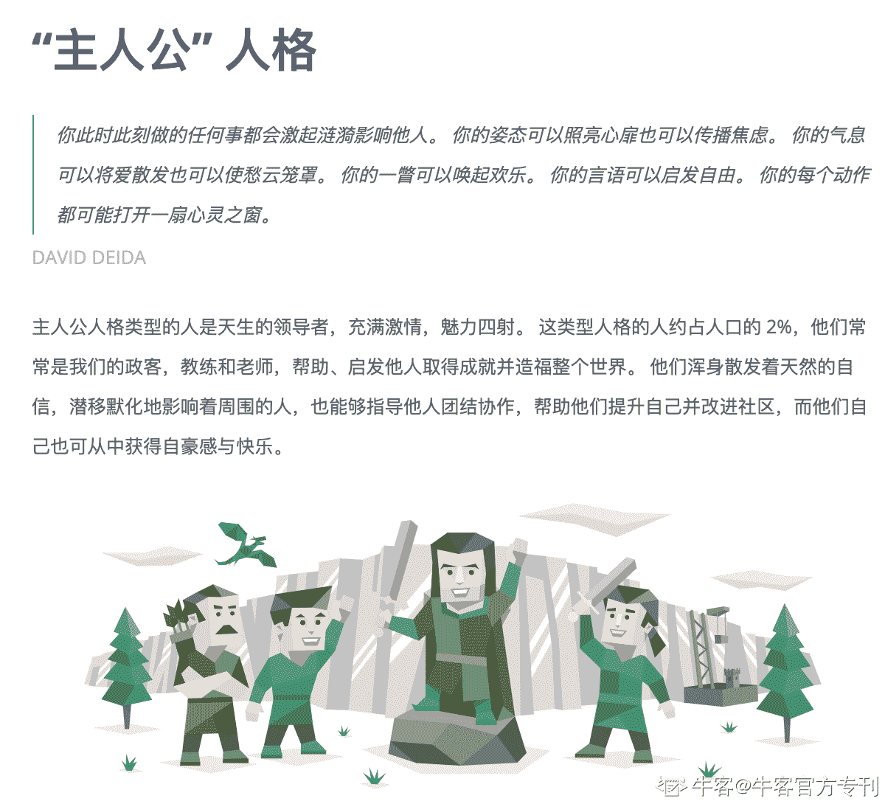

# 第二章 第 1 节 校招求职规划及进度 ing

> 原文：[`www.nowcoder.com/tutorial/10042/3ccf530eadf146f5af5d449ab9427fbf`](https://www.nowcoder.com/tutorial/10042/3ccf530eadf146f5af5d449ab9427fbf)

# 1.求职规划

## 1.1 了解校招

### 1.1.1 校招形式

企业的发展阶段分为初创期、快速发展期、平稳期、衰落期，处于初创期的企业主要通过社招扩充人才，而从第二个阶段起，企业开始通过校园招聘接触应届生来提前储备和培养人才。有的时候由于临时工作量增多，企业也会招聘一些（日常）实习生来分担工作，一般这类实习生是企业的短期劳动力需求，不在企业的人力资源规划当中，因此企业比较少给到日常实习生转正机会。

目前校园招聘的形式包括实习生招聘、秋季招聘和春季招聘，因为我主要经历了实习转正和秋季招聘，所以以下内容主要着眼于这两部分展开。

### 1.1.2 人力岗校招何时开始

实习生招聘：实习一般分为暑期实习（3-4 月份申请）、寒假实习（8-10 月份申请）和日常实习，这里我主要关注的是有转正机会的实习生招聘。大部分企业的暑期实习生招聘都是有明确留用机会的，如腾讯；有的企业实习生招募时间会更早些，如四大的寒假实习；还有一些实习虽然是日常实习，但是表现优秀也会有转正机会，如字节跳动。所以，如果同学的目标是找一份有转正机会的实习，那在面试前就需要先和企业沟通清楚这个实习岗位是否有留用机会、转正需满足的条件。

秋季招聘：对于 21 届意向人力岗的同学而言，2020 年 7 月份就有公司开始陆续发布秋季校园招聘通知了，这里可以关注企业招聘的微信公众号、官网和如牛客网的第三方平台。我最早投递的岗位是京东的 TET 管理培训生（7/6 投递）。22 届及之后关注秋招的同学可以注意下这个时间，多关注些意向公司的招聘公众号和官网动态以保证校招通知出来后尽早投递。到了 10 月底、11 月份，各公司的秋季招聘网申基本都进入尾声了，但仍有岗位需求的企业会发出补录通知，所以同学们也可以密切关注意向公司的相关通知。

春季招聘：一般在每年的 2-4 月开始申请，面向当年的应届毕业生，秋招如果没有收到满意 offer 的同学可以继续关注春招，尽快投递意向岗位，因为一般而言春招的机会会少于秋招。

### 1.1.3 人力岗校招流程

校招基本流程：网申→笔试→群面→单面（1-3 轮）→offer call→录用意向书发放→谈薪→带薪录用意向书发放→签订三方

一般而言，网申基本都需要填写个人基本资料（个人信息、教育背景、学习情况、校内实践、实习经历、项目经历、获奖情况、作品展示等等），除此之外，有些企业还会设置一些开放性问题（为什么想投递这家公司？你的核心竞争力有哪些？公司企业文化等），如果在某家企业有认识的朋友，可以在网申时请朋友帮忙内推。

人力岗的笔试主要是行测和心理测试，但是外企的笔试比较特别，做笔试有点像在玩游戏。有的企业还会在面试前布置个性化的作业，如今年的快手和网易，同学们可以根据企业往年情况进行针对性的准备。

面试方面，一般人力岗的群面形式都是无领导小组讨论，部分企业也会采取小组辩论、个人即兴演讲、多 v 多轮流提问等形式。单面环节则一般是 1v1 半结构化面试，但是也有企业会采取 2v1、3v1、4v1、PPT 答辩等形式。除了比较常见的群面和单面以外，在正式面试之前，有的企业还会有 AI 视频面试（如联合利华、中通快递等），需要同学根据给出问题录制视频或音频进行回答。

### 1.1.4  21 届人力岗校招基本情况

求职难度：☆☆☆

首先，由于疫情和国际形势不稳定等对企业业务的负面影响，许多公司的人力岗 2020 年都开始缩招甚至不招；其次，人力岗普遍对于专业、背景限制较少，加之许多原本打算海外留学的应届毕业生由于疫情原因开始找工作，部分未毕业海外留学生开始提前找工作，还有许多 20 届毕业生也加入到 21 届秋招中，所以总的来说，对于 21 届秋招人力岗而言，人才供给远多于企业需求，人力岗求职难度比较大。不过，由于互联网行业整体受到的负面影响较小，所以对于人力岗的需求会比其他行业大一些。

## 1.2 校招规划

### 1.2.1 自我认知

 以上是我通过剖析得出的自我认知结果，大家也可以通过复盘自己的过往经历，深入全面地分析自己，也可以多做一些心理测试以完善自我认知，比如卡特尔 16 种人格因素问卷、霍兰德职业兴趣测试等等。

卡特尔 16 种人格因素问卷是美国伊利诺州立大学人格及能力测验研究所卡特尔教授编制、用于人格检测的问卷，可以帮助大家更好地了解自己。大家可以到[16personalities](https://www.16personalities.com/ch)这个网站进行测试。通过 12 分钟的问卷作答，我们会得到人格测试的结果以及人际关系、个人优劣势、职业生涯、亲密关系、家庭关系方面的建议（具体如图）。我个人感觉测试结果还是很准的，和自我认知比较相符。

    卡特尔 16 种人格因素问卷结果  霍兰德认为，个人职业兴趣特性与职业之间应有一种内在的对应关系，根据兴趣的不同，人格可分为研究型（I）、艺术型（A）、社会型（S）、企业型（E）、传统型（C）、现实型（R）六个维度，每个人的性格都是这六个维度不同程度的组合。霍兰德职业兴趣测试会结合我们的个性，将我们匹配到合适的岗位，因此其结果常常被用来作为职业规划的一部分。目前网上霍兰德的测试有很多，大家也可以到乐职这个免费的网站进行测试，会给到大家一些关于职业兴趣的参考。

  霍兰德职业兴趣测试结果  这部分主要是通过回顾自己的成长、学习、实践经历搞明白三个问题：我是什么样的人？我想过什么样的生活？我想做什么以及我能做什么。只有足够了解自己，我们才能匹配到合适的岗位。

### 1.2.2 职业规划

*   **关于行业**  | 行业 | 互联网 | 人工智能 | 教育 | 房地产 |
| 发展阶段 | 快速发展期 | 探索期＋快速发展期 | 平稳期+快速发展期 | 平稳期+转型探索期 |
| 氛围特点 | 弱化职级，扁平化氛围，节奏快，强度大，福利待遇好 | 创新科技氛围，开放平等透明，福利待遇好 | 学习氛围好，线下教育较传统，线上教育互联网氛围浓厚 | 奋进，较讲究职级，强度大 |
| 未来趋势 | 发展空间大，大厂多业务发展，中小厂专注某赛道 | 发展空间巨大，发展态势向好，国家政策支持 | 线下教育稳定发展，线上教育快速发展，发展空间大 | 整体发展趋稳，但仍有部分红利 |

个人主要关注的行业

因为我之前两份实习都是在互联网行业，回顾两份实习经历自己还是工作得很开心的，也从两份实习中收获很多，所以在秋招时主要关注的也还是互联网行业。

互联网行业吸引我的点在于：不讲 title、扁平化管理，权力距离低、官僚化程度低；员工比较年轻，交流无障碍；人才密度高，平时和同事工作时可以互相学习、共同成长；业务发展速度快，可以短时间接触了解到尽可能多的业务；福利待遇好，免费健身房、一日四餐能够满足我的基本诉求。

不过因为今年互联网行业的人力岗需求较少，所以我也投递了很多其他行业，如房地产、人工智能、教育等。

关于人工智能行业。“近年来，人工智能对社会和经济影响日益凸显。美国、欧盟在内的多地区先后出台了对人工智能发展的政策，并将其上升至国家战略高度。我国自 2015 年来，多次将人工智能的发展和规划列入国家政策，逐步确立人工智能技术在战略发展中的重要性”，加之目前国内人工智能公司发展态势整体向好，如 AI 四小龙、科大讯飞等等，未来可期。

教育行业发展时间久，一直发展的都还不错，而且今年因为疫情的影响，在线教育快速发展。除了传统的 K12 教育，教育行业涉及的领域也越来越多，互联网大厂也纷纷在教育板块布局，未来教育行业会如何发展，我还是很好奇的。而且我的第一份实习是在在线教育做运营工作，公司整体的学习氛围很棒，我个人还是很喜欢的。

房地产行业虽然有人不看好，但就目前而言房地产业还是有一些发展空间。之前参加宣讲会中海的 HR 介绍，房地产业依旧是 GDP 的大头，目前依然有三大支撑性红利：城镇化红利、居住改善红利、城市更新红利，所以如果向往房地产行业的话，大家还是可以尝试一下的。另外，因为房地产整个行业发展时间比较久，所以会有比较多方法论的沉淀，也有很多行业认可的人才培养项目，如中海地产的海之子、龙湖地产的仕官生等等。如果可以加入到房地产行业一些不错的应届生培养项目中在完善的培养机制中学习，个人发展前景还是不错的。不过虽然很多房企都想互联网化、数字化转型，不过囿于行业特性，整体还是比较传统，和互联网行业差别还是很大。

*   **关于公司**

作为毕业后的第一份工作，我想去行业领先的大企业，锻炼专业基本功，加之我想去互联网行业，所以主要关注的就是互联网大厂，如腾讯、字节跳动等等，其他行业我主要关注的也是行业领先的企业。

因为一般而言，在行业内达到领先地位的企业，一般管理实践都做得不错，值得我加入并学习，另外，一般这类企业平台大、发展好，也适合应届毕业生去大展身手、不断提升自己。

*   **关于岗位**

我选择 HR 岗位的原因是：

一，基于过往经历的复盘，相较于成就自己，我更愿意成就他人，而 HR 做的事情是站在全局视角，为业务部门提供创造性的人力资源管理的解决方案，成为与业务同学并肩战斗的人和探路者，也是成就他人、成就业务，这点和我的成就动机比较匹配；

二，我作为人力本硕科班出身，也希望第一份工作能够最大化利用我所学的理论和知识；

三，在我看来，HR 是一个需要不断学习的岗位，尤其是做招聘，HR 需要站在业务视角去理解为什么我们需要这样的人，去了解公司战略、业务进展和团队分工等信息，所以 HR 需要保持一个不断学习的状态，在做 HR 时自我认知也会不断被更新，这种工作状态正好也是我希望自己第一份工作可以达到的；

四，因为我没有明确想要做什么岗位，相较于其他岗位，我是人力专业本硕加之有大厂人力招聘实习经历，所以申请 HR 岗位会比较有优势。

大家在选择岗位的时候也需要认真思考下：为什么选择这个岗位？我具备哪些岗位所需的核心竞争力？和其他候选人相比，我的竞争力在哪？第一份工作我希望做什么？不想做什么？只有想清楚这些问题，我们才能找到最适合自己的工作。

### 1.2.3 针对 2020 年（2021 届）校招做的准备

  2020 年 11 月份还有需求的企业会陆续发布补招通知，大家可以密切关注企业招聘公众号和企业官网。如果秋招没有拿到满意 offer 的同学，可以再继续等待春招，预计各企业会在 2021 年 2-4 月份陆续发布通知。