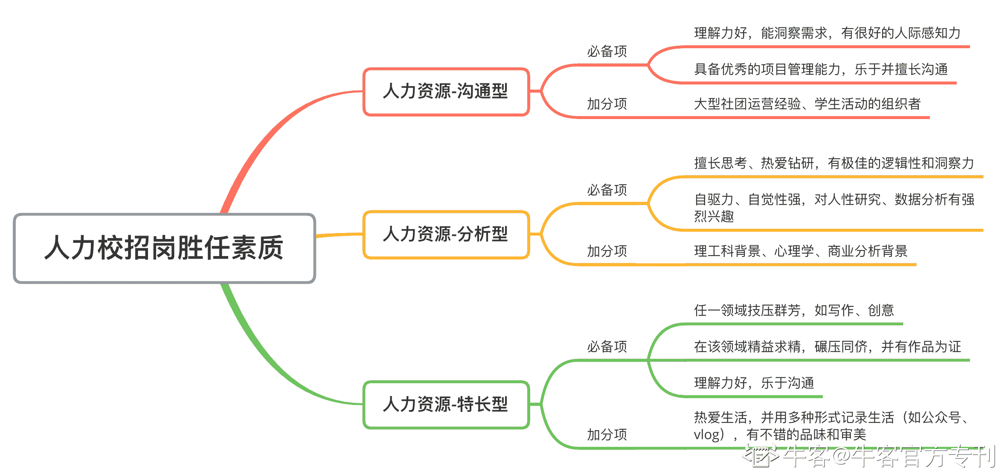
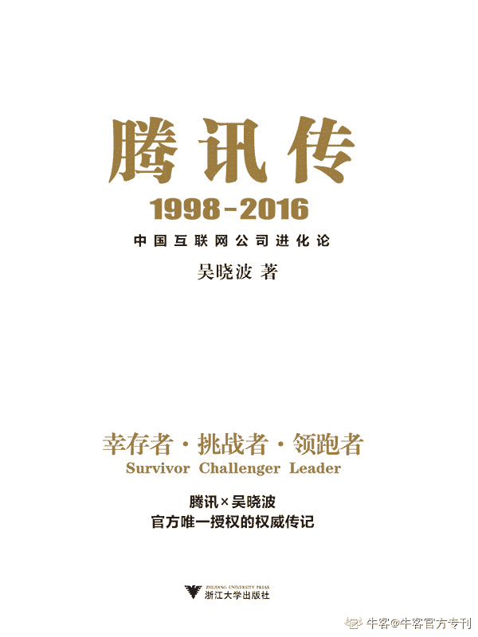
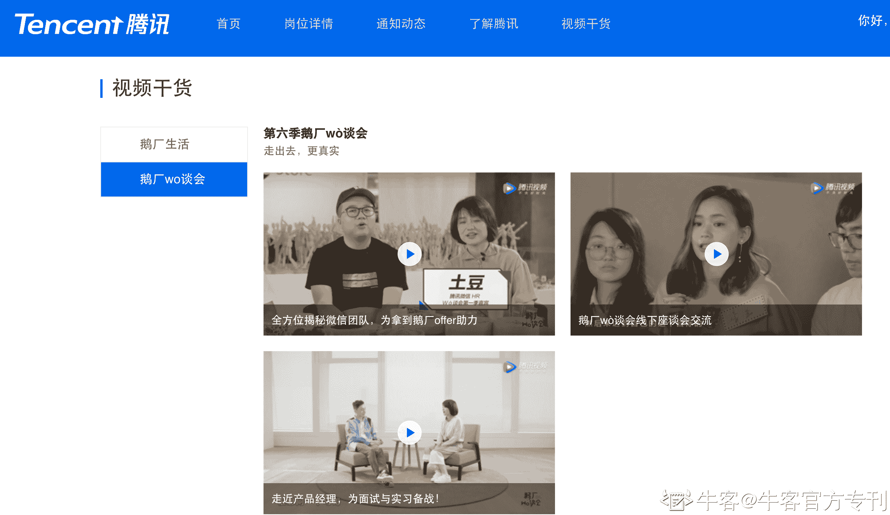
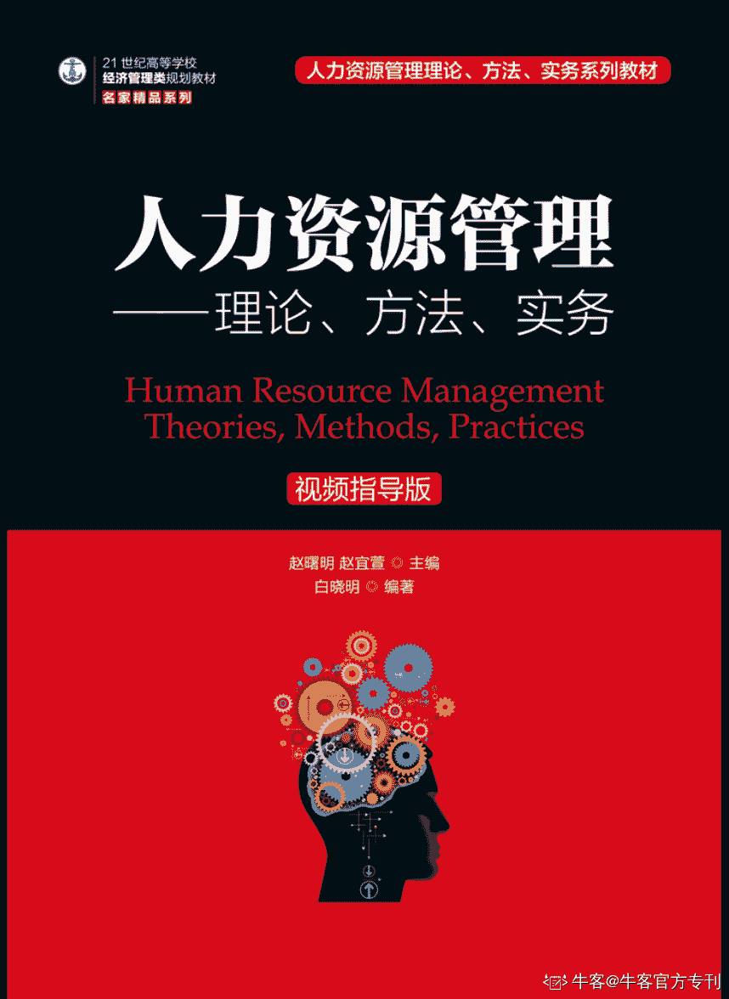
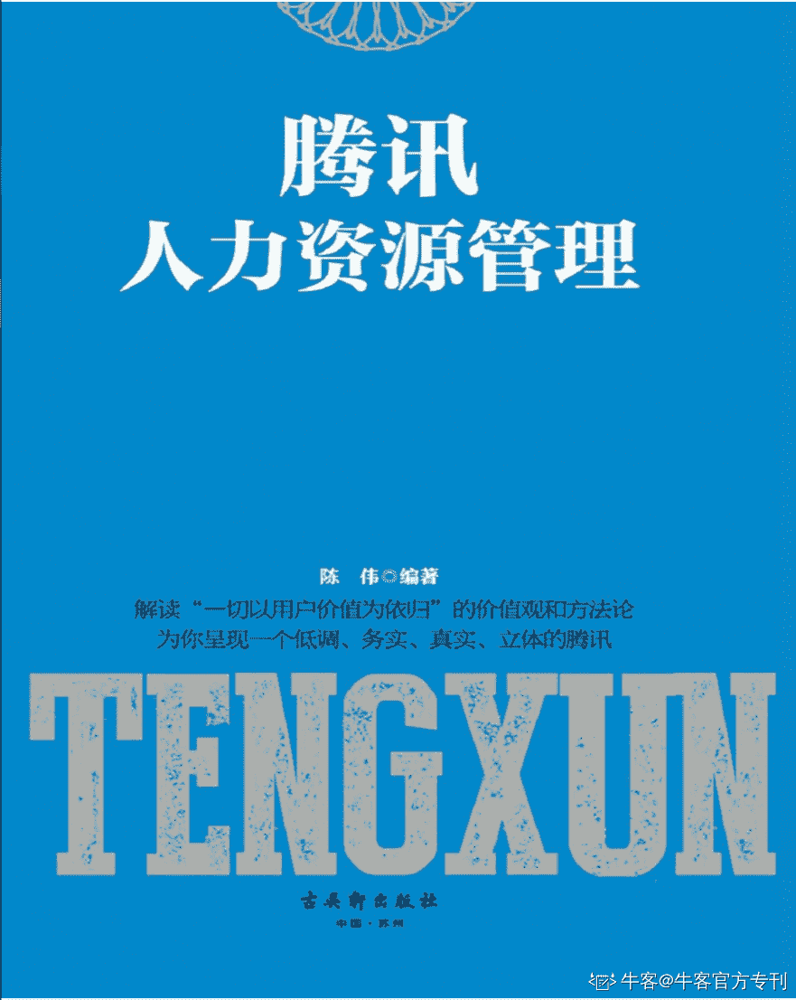
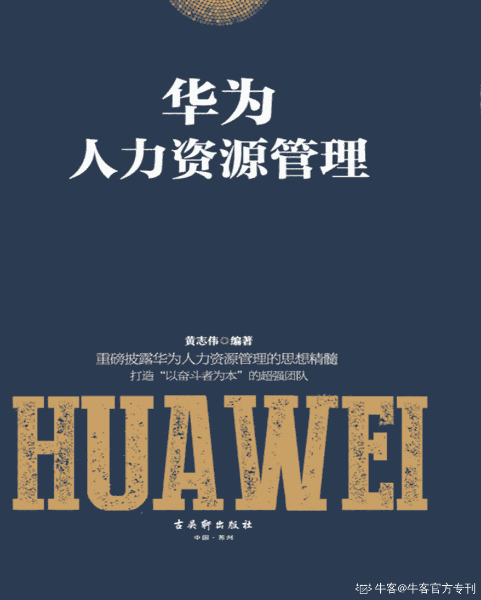
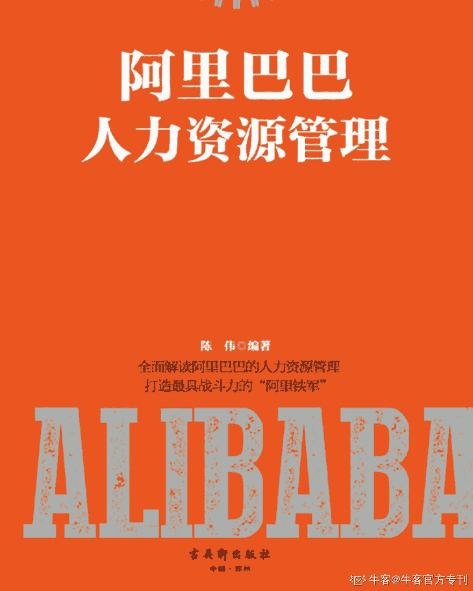

# 第二章 第 2 节 校招中学习规划

> 原文：[`www.nowcoder.com/tutorial/10042/30a739a1cd4840ee98c3c9aa8ef984e5`](https://www.nowcoder.com/tutorial/10042/30a739a1cd4840ee98c3c9aa8ef984e5)

# 学习规划

## 2.1 人力校招岗胜任素质

目前在企业当中，人力资源管理所负责的工作已经远远不局限于“和人打交道”，按人力资源管理六大模块划分，人力工作包含人力资源规划、招聘、培训、绩效管理、员工关系和薪酬福利。

不同企业对于人力资源管理的工作划分也不太一样，主要有三类：

第一类企业会将人力和行政工作放到一起，叫做人力行政岗，如恒大，类似岗位除了需要做人力资源管理六大模块工作以外，还需要负责行政管理相关工作；

第二类企业则会按人力资源管理六大模块的工作进行划分，如薪酬福利专员、招聘专员、培训专员等等，类似岗位主要集中于做人力某一模块的工作，以上两种对于人力资源管理工作的划分方式在传统行业比较常见；

第三类企业会按人力三支柱来划分工作，如 SSC（共享服务中心，主要负责人力流程性、事务性工作）、HRBP（人力资源业务合作伙伴，支持业务部门提供人力资源管理解决方案）、COE（专家中心，主要负责制定人力资源规划、人力相关政策、调研分析等），目前许多互联网企业是按人力三支柱划分工作，其中有的企业会将 SSC 的工作外包出去；

除此之外，像腾讯是按照人力不同方向的工作性质进行投递岗位划分，包括人力资源-沟通型（主要负责招聘、培训等工作，类似管培生）、分析型（主要负责人性与组织特性研究等工作，类似咨询公司）和特长型（主要负责企业文化、雇主品牌和培训策划等工作，类似营销策划）。因此，同学们在投递人力相关职位时，需要认真了解岗位的工作内容以便做好充足准备。

常见的人力资源管理相关岗位的缩写如下，大家也可以了解一下。 | 缩写 | 含义 |
| TA, Talent Acquisition | 人才获取，即招聘 |
| ER, Employee Relationship | 员工关系 |
| C&B, Compensation& Benifit | 薪酬福利 |
| OC, Organization Cultrue | 企业文化、组织文化 |
| OD, Organization Development | 组织发展 |
| TD, Talent Development | 人才发展 |
| LD, Learning &Development | 学习发展 |

 因为不同企业对于人力资源管理岗位划分不同，这里我主要针对人力岗的不同工方向结合腾讯的人力资源校招岗位进行介绍（如下图）。

腾讯人力校招岗位胜任素质（来自腾讯招聘官网）

### 2.1.1 人力-招聘或者培训岗（沟通型）

首先，这类 HR 需要具备不错的理解力，能够洞察需求。在培训工作当中，HR 需要对接业务同事的培训需求，HR 需要深入理解为什么对方会有这样的培训需求，同时去洞察这个需求背后体现的是什么问题，HR 需要思考如何开展培训、邀请谁来培训、什么时间培训才能满足业务同学的这个需求。

其次，这类 HR 需要有很好的人际感知力，乐于并善于沟通。HR 在招聘时需要对接许多外部应聘者，与他们就岗位要求和工作内容进行沟通，这就要求 HR 需要具备很好的人际感知力和沟通能力，能够敏锐地感知到不同的人际关系，以一种双方都感知舒适的方式进行沟通，传递岗位信息，同时获取候选人信息。

最后，这类 HR 还需要具备优秀的项目管理能力。无论校园招聘还是社会招聘，其实都可以看作是一个项目，HR 同样需要在有限的资源和限定的时间内，运用知识、技能、工具和方法，达到一定的项目目标（满足业务同事的需求，招到一定数量、满足要求的候选人）。

因此，如果在校内有大型社团运营经验、组织过学生活动，在理解能力、沟通能力、人际感知能力和项目管理能力方面见长的同学，可以考虑下人力培训和招聘相关的岗位。

### 2.1.2 人力-组织分析、招聘分析、薪酬福利岗（分析型）

首先，这类 HR 需要擅长思考、热爱钻研，有极佳的逻辑性和洞察力。这类 HR 往往是企业人力资源部门专家中心的角色，像 OD（组织发展）需要根据公司战略主导组织架构、设置人才架构和部门间合作机制，这就需要 HR 能够以小见大、站在公司视角去深入洞察、思考、钻研，什么样的架构和机制是匹配公司战略的。

其次，这类 HR 需要自驱力、自觉性强，对人性研究和数据分析有强烈兴趣。如负责 CB（薪酬福利）的 HR 需要对激励理论有全面了解，能够懂得制定什么样的薪酬福利政策能够最大化激发员工潜能，同时让员工满意，愿意为企业花时间出力。另外，因为分析型 HR 的工作难以用数据量化，因此需要 HR 足够自驱、自觉，主观意愿要不断追求卓越，尽可能在制定政策、分析问题时充分考虑各方面因素。

因此，如果同学具备理工科背景，善于思考钻研、逻辑缜密，或者具备心理学背景，对于人性相关知识理论有充分了解，或者有商业分析背景、咨询公司经历，善于分析、解决问题，那比较适合人力分析类相关工作岗位。

### 2.1.3 人力-企业文化、雇主品牌、培训策划岗（特长型）

首先，这类 HR 需要有写作、创意之类的特长，并在此领域精益求精。这类 HR 往往是创意很多、掌握新媒体或者设计技能的同学，在企业内部能够设计活动宣传企业文化，对外能够撰写推文、策划宣讲会打造企业雇主品牌。

其次，这类 HR 需要理解力好、乐于沟通。例如负责培训策划的 HR 同样也需要理解业务同学的培训需求、不断与其沟通减少理解偏差以便策划合适的培训活动。

因此，如果有制作公众号、vlog 相关经验或者有不错审美和品味的同学比较适合于企业文化、雇主品牌和培训策划相关岗位。

因为不同企业对于人力资源相关岗位的工作划分不同，任职资格也不完全一样，所以具体的任职要求还是以企业的岗位介绍为准，同学们可以根据企业岗位的任职要求有针对性地展示自己的胜任素质。

## 2.2 学习资源推荐

人力岗是个更看重素质的岗位，与技术岗关注个人技能、知识背景、项目经验不同，人力岗更关注冰山模型（如图）下如价值观、个性和动机等因素，这部分其实是大家日积月累形成的，短时间内很难可以改变的素质。所以大家可以多花费些时间复盘下自己的过往经历，尤其是大型社团运营、学生活动、相关实习经历等等，分析每段经历体现了自己的什么能力素质，该项能力素质又是如何和人力岗位要求匹配的。  冰山模型 注：冰山模型之上的经验、知识和技能是可以短时间改变和可以学习的，但是冰山模型之下的能力素质是很难短时间改变和培养的。 在完成自我分析之后，大家可以针对人力岗再进行一些知识层面的准备。我一般会在面试前就行业、企业和岗位三个方面进行准备，以互联网的 HR 岗为例。

首先，行业层面，我会密切关注行业动态，比如经常关注 36 氪和澎湃新闻、相关微信公众号（如半佛仙人、19IT 互联网数据中心等）了解互联网的行业动态资讯，尤其会收藏并认真阅读一些行业深度分析的文章并形成自己的见解。另外，大家也可以阅读一些互联网相关的书籍，我自己收藏的包括《腾讯传 1998-2016：中国互联网公司进化论》、《人人都是产品经理》等等，了解这个行业在做什么、这个行业中目前讨论的比较多的是什么，对行业形成初步认知。 行业类书籍推荐其次，公司层面，我会仔细阅读公司的官网、官方公众号、招聘公众号等内容，了解公司的公司架构、业务布局和业务发展情况，同时去主动使用公司的产品，没事刷刷抖音，看看微信朋友圈，同时也留心思考所用产品的优缺点。对于意向公司，我还会去翻之前校招宣讲会的内容，以便有针对性地进行准备，像字节跳动有专门针对 HR 岗位的宣讲会，腾讯的“鹅厂卧谈会”也会有很多干货，推荐同学们去看看。  字节跳动 2021 人力专场宣讲会   腾讯鹅厂卧谈会 最后，岗位层面。如果是非人力专业的同学，可以先去看看人力资源管理的课本，比如赵曙明和赵宜萱老师的《人力资源管理：理论、方法、实务》，除此之外《HR+三支柱》、《腾讯人力资源管理》、《华为人力资源管理》、《阿里巴巴人力资源管理》也都可以看看，进一步了解理论和实践中的人力资源管理是什么样子的。同时，针对意向企业的人力岗位，提前了解该企业人力资源管理工作如何分工、人力岗位的工作内容以及任职要求，可以通过网络渠道或者与学长学姐交流获得相应信息。如果是意向于做招聘的人力岗位，建议大家通过书籍或者网上资料提前熟悉下人才 mapping/盘点和招聘漏斗。 

《人力资源管理：理论、方法、实务》 赵曙明，赵宜萱著

优先级：☆☆☆ 该书以理论+方法+实务的形式全面地展现了人力资源管理整个体系内容，包括人力资源战略与规划、工作分析与设计、招募与甄选、员工培训与开发、职业生涯管理、绩效管理、薪酬与福利管理、劳动安全及劳动关系管理、人力资源管理的新趋势等理论和方法，适合于非人力专业同学全面了解人力资源管理各模块工作。 

《HR+三支柱》马海刚，彭剑锋，西楠著

优先级：☆☆

该书主要围绕目前广为传播并实践的人力资源三支柱模型，从三支柱理论出发，介绍三支柱的由来及其核心观点，并引入腾讯、华为、阿里等国内三支柱先行者的实践案例，适合于非人力专业同学了解人力资源三支柱的来龙去脉及企业中的实际应用。 

优先级：☆

通过之前两本书的阅读，即使是非人力专业的同学应该也可以大致了解整个人力资源管理的工作框架。如果希望深入了解某企业的人力资源管理体系和具体工作内容，可以再找一些相关企业的管理类书籍来深入阅读，不局限于以上三本。另外，也可以通过网上查阅一些关于具体企业管理实践的分析性文章或论文进行深入学习。

以上是我针对人力岗校招求职和学习规划，意向人力岗的同学可以参照一下。

之前有听过腾讯校招 HR 的分享，他评价说，现在同学们为求职所做的准备实在太少了。同样作为毕业的出路之一，和出国、保研、考研相比，同学们可能临近毕业了，没有其他出路了才匆匆开始找工作。为了出国，我们需要早早准备文书和语言成绩；为了保研，我们需要参加各类夏令营和九月推免考核；为了考研，我们会提前一年开始针对初试进行系统复习；可是对于同样重要的求职，我们又花费了多少时间去准备呢？对于个人、行业、企业、岗位的认知和了解，我们充分准备了吗？当时听到 HR 的话，我醍醐灌顶，立刻开始着手准备找工作。所以在这里也建议各位同学找工作宜早不宜迟，好 offer 都是留给真正充分准备的人，加油！