# 第三章 第 1 节 简历撰写—好的简历是成功的开始

> 原文：[`www.nowcoder.com/tutorial/10042/1f326a53fd0242ebb9b01d768abff6e7`](https://www.nowcoder.com/tutorial/10042/1f326a53fd0242ebb9b01d768abff6e7)

# 1.1 如何制作一份简历

## 1.1.1 简历的作用

简历是针对意向岗位个人的核心竞争力或胜任力的展示，简历内容就是在论证为什么我能够胜任这个岗位，和其他人相比，我的优势在哪里。因此，每份简历应该围绕具体岗位进行准备，一份简历投递多个岗位是不可取的。就人力岗而言，我们需要先针对具体人力岗的工作内容和任职要求，提炼出任职要求的必需项和加分项，然后在简历中有针对性地展示。

简历其实不用做的很花哨，逻辑清晰、信息清楚即可，而且现在许多企业都是智能提取简历信息，如果简历做的太复杂或者条理不清楚，反而会影响软件提取关键信息。

## 1.1.2 简历每个模块如何写以及注意事项

应届生的简历篇幅一般在一张 A4 纸，内容包括个人基本信息、教育背景、实习经历/项目经历、校园实践/学生工作、荣誉奖项、语言能力、专业技能和爱好特长，如果有相关作品可以做一个作品集以供 HR 参考。

在制作简历之前，我们可以通过 excel 或者其他软件利用 STAR 法则复盘下所有过往经历，然后在制作简历时有针对性地展示，避免无目的性地简单罗列。我在制作简历时会考虑整体的排版，整体是否详略得当，字体有没有过多显得很乱，相似内容是否对齐，重点内容是否加粗展示，工作成果是否量化等。以下是我推荐的简历模板，都是比较简洁清晰的。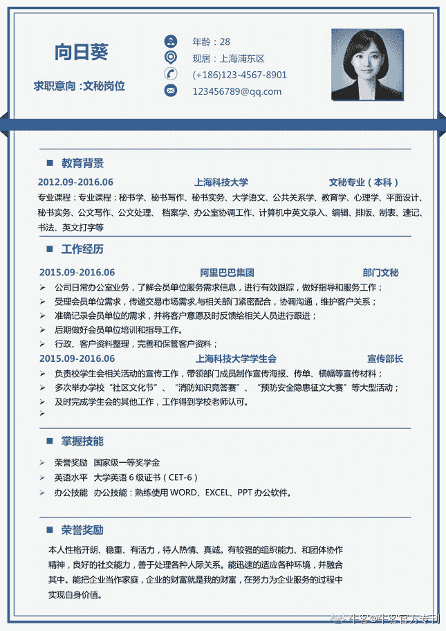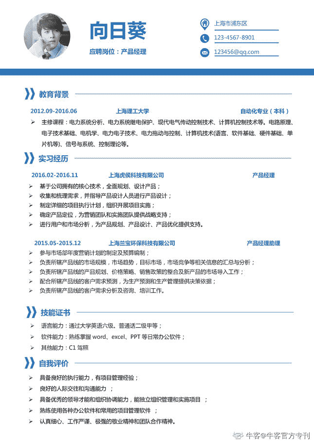

   关于简历各模块内容占比和展示顺序：主要看针对人力岗，我们最想给企业展示什么，个人的核心竞争力、与岗位相关的经历应该在简历最靠前的部分进行展示。在我的面试过程中，面试官主要会问简历前 1/3 的内容，后面的内容很少会关注。在关于能力和特质在简历上的表述，最好不要直接表述”我具备某某能力”，而是用具体的事实、经历、资质证书等来佐证。

*   #### **个人基本信息和教育背景**

个人基本信息：这部分必须包括姓名、联系电话、邮箱和意向岗位。如果岗位工作地点离家比较近，可以再加上籍贯信息。如果个人外形是加分项的话，可以在这部分附上个人照片，但建议简历照片和个人日常照片不要出入过大，至少保证面试时长得和简历上的照片不要差太多，否则加分项可能会变成扣分项。

教育背景：因为我所在学院、所学专业和课程与人力岗强相关，所以我用了比较大的篇幅展示了学校、学院、专业、课程等信息，突出了“成绩排名第一”、“保研”、“奖学金”、高分课程等关键信息。

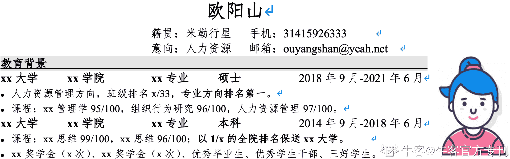

*   #### 实习/项目经历

这部分主要介绍与岗位相关的实习或项目经历，包含所在公司、部门和岗位、所负责工作、工作成果以及工作时长，其中工作成果尽量用数字量化。在我的简历中，一般一段经历只需要两句话来介绍就可以了，一句话介绍所负责工作，另外一句话介绍工作成就，但是因为我的实习经历比较少加上我想更多展示我的招聘实习经历，所以第二段实习用了五句话。

在陈述具体工作内容时，最好用 STAR 法则的框架来写，介绍清楚具体背景（Situation）、任务/目标（Task/Target）、个人行动（Action）和结果（Result）。通过运用 STAR 法则，在简历中介绍清楚当时是在什么情况下，我负责什么工作、想要达成什么目标，为此做出了哪些行动，最终达到了什么结果。

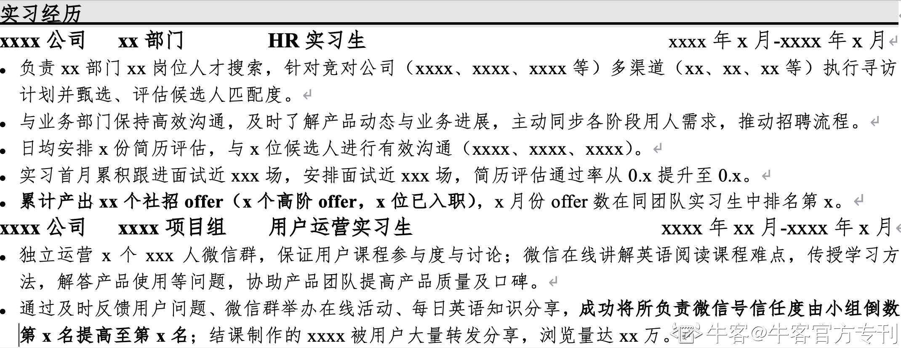

*   #### 学生工作/校园实践

如果个人的实习或者项目经历比较丰富的话，这部分可以适度删减，但是因为我的实习经历比较少，学生工作比较多，所以这部分占到了 1/3 的篇幅。关于校园经历，我的建议是不要过于全面地罗列所有经历，一是这些经历可能和求职岗位相关度不大，无法印证岗位所需胜任力，二是罗列过多也会让面试官认为同学自我认知不够清晰，并不了解自己的核心优势。

就我的简历而言，我列举的校园经历可以分为两类：一，和人力工作相关的（就业指导中心助理，协助举办校园宣讲会）；二，付出努力并且达到不错结果、有成就感的经历（学生会部长、班长、社团部门负责人）。同学们可以参照下将匹配岗位、合适的校园经历放到简历中。

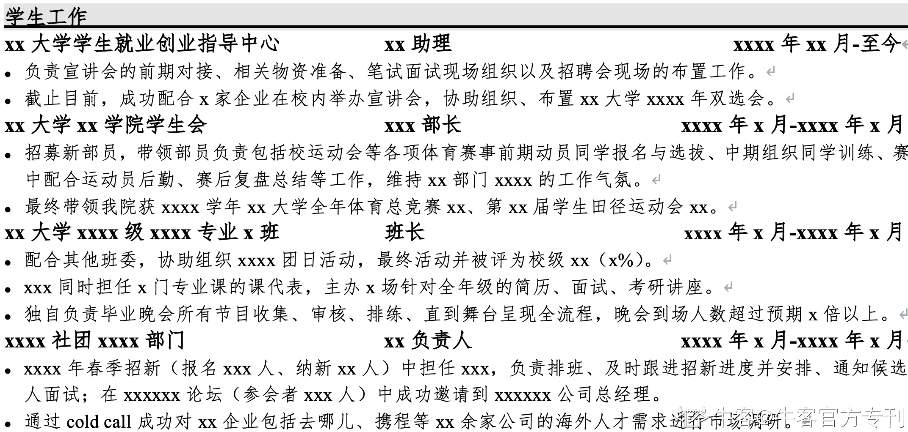

*   #### 荣誉奖项

在我的简历中，这部分内容主要是想通过荣誉称号、各类比赛名次来证明我在专业学习、志愿活动、学生工作、体育活动方面做的都还不错，给面试官留下一个好印象。因为我没有非常重量级的奖项（如国家级创业类比赛等等），所以这部分的展示顺序比较靠后，展示内容也比较少，像我主要列举了一些优秀志愿者、学生工作积极分子、专业比赛和运动相关的奖项，想给面试官印证我专业知识、学生工作、体育活动方面做的还不错。如果同学们有重量级比赛的奖项，可以在简历靠前部分展示，甚至可以在项目经历中单独列出来介绍。

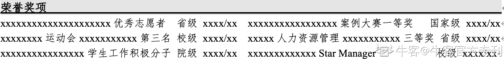

*   #### 技能、爱好、特长

这部分主要是想补充展示一些我的技能、爱好和特长，包括英语能力、与岗位相关的资格证书、相关技能等等。其实在面试过程中，兴趣爱好是一个比较容易被问到的点，我个人兴趣爱好比较多，也有一些技能点，和岗位也有一些相关度，所以这部分我也放到了简历上，不过因为相关度比较低，所以我放到了简历的最后一部分。在爱好特长方面，除了介绍我的爱好以外，我还会拿过往经历佐证“虽然是爱好，但是我也在认真对待，也有取得一些小成绩”，希望能够给面试官留下一个比较正面的印象。

最理想的情况是，兴趣特长和岗位高度相关，可以辅助日常工作，但如果兴趣特长和岗位无关，那我们也应该清楚这些兴趣爱好给我们带来了什么正面影响（如放松身心、保持健康、开阔视野等等）。因为我在简历上写了自己喜欢阅读，所以有面试官问我最近在读什么书，但是那段时间我其实并没有读书，加上没有提前准备，这个问题并没有回答好，还挺尴尬的。如果兴趣爱好相关问题准备充分、回答好，那是加分项，不然很可能会对整场面试带来负面影响。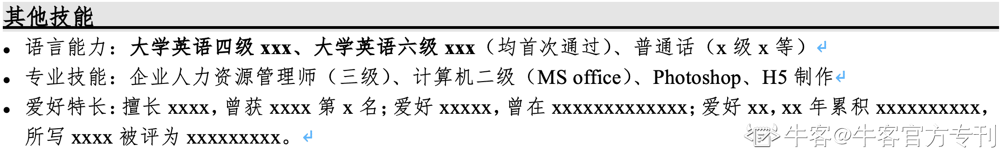

*   #### 其他部分

以上内容主要是基于我的简历进行展开的，但是因为每个人情况不同，所以同学们可以在参照我的简历之后，结合个人情况增添、删减、强化或弱化具体模块内容或者重新进行模块排序。像有的同学会在个人基本信息之后直接列出自己针对意向岗位的核心优势，然后再基于核心优势展开过往经历，有的同学学术成果比较多，也可以单列介绍，总之，简历凸显出个人核心竞争力、整体逻辑清晰、条理清楚即可。

最后，还要注意简历最好以 pdf 和 doc 两种格式保存，pdf 版本用于上传、分享和打印，避免格式混乱，doc 版本用于临时修改，还需要注意简历命名格式，建议以“意向岗位-姓名-手机号-学校”命名，方便 HR 查阅。如果简历上带有照片的话，打印是最好彩打，彩色照片会比较好看。另外，大部分外企会要求提供英文简历，想要网申外企的同学可以提前准备下中英文简历。如果网申国内企业、投递岗位也没有非中文语言要求，那建议大家还是优先提供中文简历，因为负责这类岗位简历筛选和评估的 HR 和业务同学一般还是对中文比较熟悉，方便 HR 筛选评估。

## 1.1.3 简历制作网站推荐-超级简历 WonderCV

因为针对不同的岗位，我们需要制作不同的简历，如果用 Word 制作我们可能会在调整格式等问题上花费比较多的时间，正好现在有很多简历制作软件可以帮助我们高效、快捷地制作简历，我以超级简历 WonderCV 为例（[`www.wondercv.com/`](https://www.wondercv.com/)）。

首先，我们先在网址上导入自己的简历，然后网站会给出一些建议和注意事项，我们可以按需进行修改。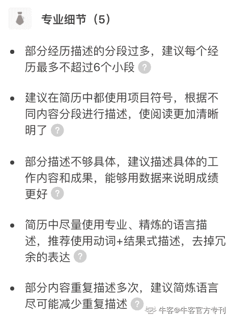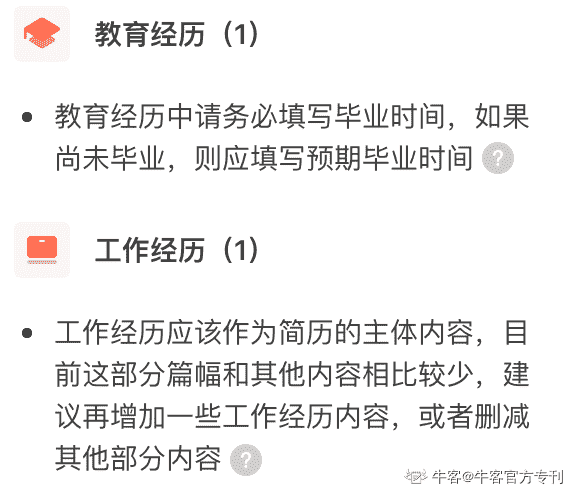

超级简历 WonderCV 给出的建议

然后，网站会根据上传的简历整理出我们的所有经历录入到经历库，我们可以直接根据需求选择某几段经历进行展示，调整某段经历的展示顺序，也可以重新排版、进行模块管理。

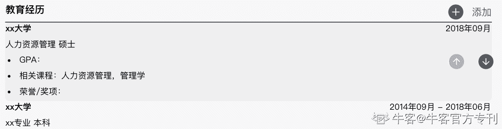

 简历调整好后，我们可以直接在网站下载 pdf 版本，不再需要另外调整，非常方便。这个网站还有很多简历模板，同学们也可以参考下。

此外，[牛客简历助手](https://www.nowcoder.com/quick-fill/show-introduce)，可以针对你的简历快速导出以及调整，同学们也可以用牛客简历助手进行简历的撰写。
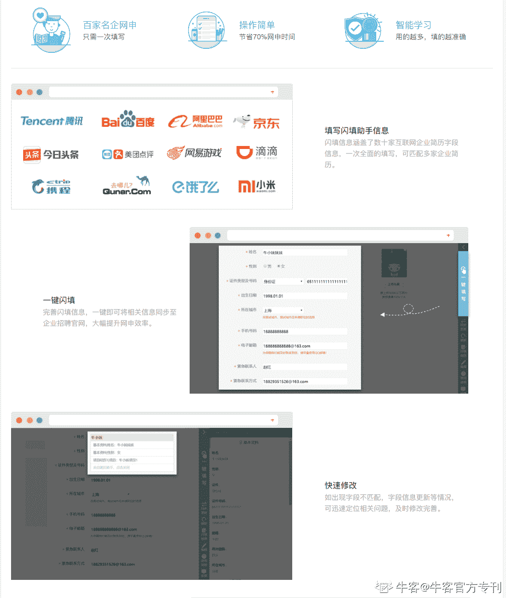