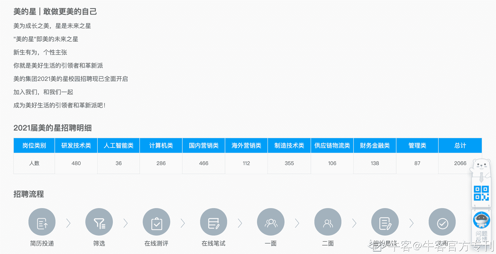
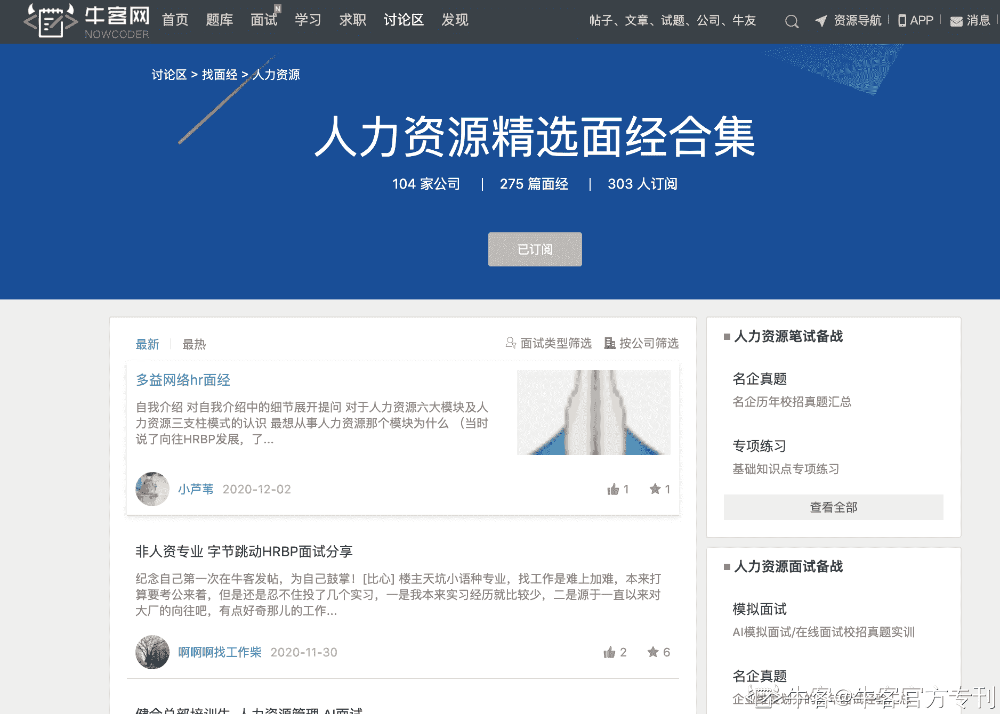
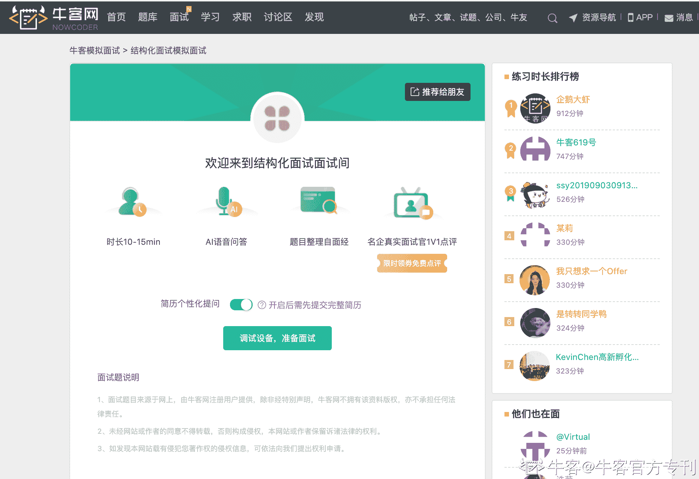
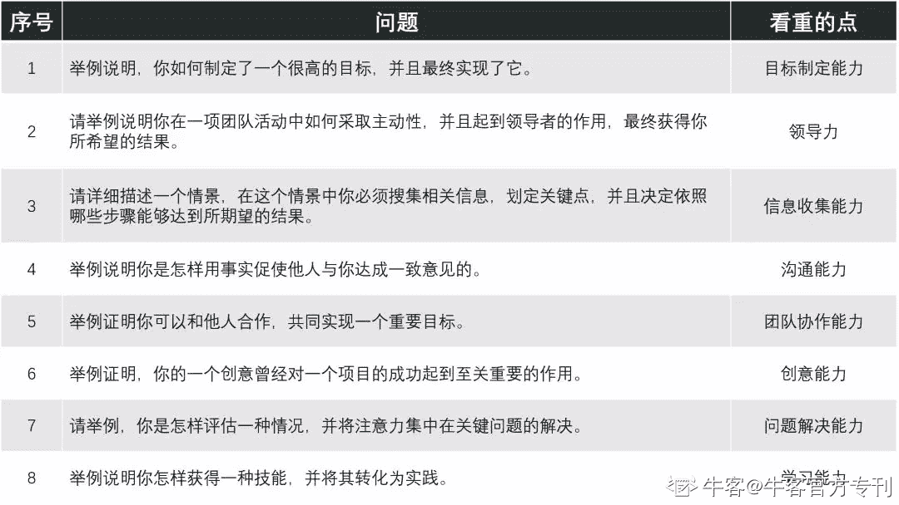

# 第四章 第 2 节 如何准备面试

> 原文：[`www.nowcoder.com/tutorial/10042/cfc46a8cddcd4b819071201aa46540cc`](https://www.nowcoder.com/tutorial/10042/cfc46a8cddcd4b819071201aa46540cc)

# 2.2 如何通过面试

## 2.2.1 如何准备面试

*   #### 提前了解面试形式

首先我们还是需要了解意向企业的面试形式，毕竟知己知彼，才能百战百胜。我们可以通过企业的官网、招聘公众号、网络平台上的面经（牛客网等）了解意向岗位一共有几轮面试、每轮面试的形式、面试时间安排、面试题目等等，最好可以提前模拟面试一下，牛客网上有 AI 结构化面试，大家也可以去体验下。
美的官网招聘流程介绍

牛客网人力资源精选面经

牛客网[AI 模拟结构化面试](https://www.nowcoder.com/interview/ai/index)   [`www.nowcoder.com/interview/ai/index`](https://www.nowcoder.com/interview/ai/index)

 就人力岗而言，一般面试形式都是群面+1-3 轮 1v1 结构化面试，有的企业可能没有群面环节，初面就是单面，有的企业可能群面之后是多 v 多或者其他形式的面试。

*   #### 自我介绍准备

无论是群面还是单面，我们大概率会遇到自我介绍环节，因此提前准备自我介绍是很有必要的。一般最常见的是 1 分钟的自我介绍，不过以防万一大家可以再准备下 30s 和 3 分钟版本的自我介绍。

如果说每个人是一本书的话，那自我介绍就是这本书的大纲。在我看来，自我介绍是个人履历的摘要，一个好的自我介绍可以简明扼要地展现个人的核心竞争力以及与岗位的适配度，甚至可以引导面试官提问。

以我的一分钟自我介绍为例：

> “大家好！我叫欧阳山，本科就读于 xxxx 大学**人力资源管理专业**，之后以**专业第一**保研至 xxxx 大学 xx 学院，现在是 xx 管理专业的一名硕士生。之前我有**两段实习经历**，第一段是在互联网教育公司 xxxx 企业用户运营岗位实习，主要产出是 xxxx，第二段是在 xxxx 企业做 HR 实习生，对接 xxx 业务 xxxx 岗位，主要产出是 xxxx，在同组中排名第 x。基于过往经历的复盘和自我剖析，未来我希望能够在人力资源管理这条道路上继续发展。”

在我的自我介绍中，我想突出的关键点包括**人力相关专业本硕、专业第一保研、两段互联网实习且产出不错、大厂招聘实习、有过自我剖析并复盘了过往经历**，希望能够通过这些关键点给面试官留下一个不错的印象。自我介绍中提及的关键点其实都是我比较熟悉且有成就感的经历，同时通过自我介绍我也引导面试官就我有所准备的关键点进行提问（为什么本科读人力专业？为什么研究生还是读人力专业？简单介绍下互联网招聘实习？自我剖析的结果是什么等等）。

如果是 3 分钟的自我介绍，我还会展开校园实践经历，并且总结我与岗位的适配度。如果是 30s 的自我介绍，我会直接总结我针对申请岗位的三个核心优势（人力本硕、结果导向、成就动机来源于成就他人）。

*   #### 群面

一般人力岗的群面形式都是无领导小组讨论（优先级排序题、两难式问题、多项选择题、资源争夺题、材料分析题等），部分企业也会采取小组辩论、个人即兴演讲、多 v 多轮流提问等形式。

针对群面，我们可以做三方面的准备。第一，关注企业所在行业资讯和企业动态，因为有的时候群面题目会契合热点新闻，我们可以充分了解行业和企业，提前积累些谈资，像京东物流、中通、德邦的群面题目都是和物流行业强相关的；第二，我们可以去了解下相应企业人力岗之前的面试题目，大致了解下题目类型，如果能和同学组局模拟面试就更好了；第三，建议大家做好心理建设，在群面中要保持自信，通过简历筛选评估进入初面的同学们其实都是在同一起跑线的，只要在群面中展示出最好的自己，和小伙伴们团队协作，最后能够完成团队任务，群面就没问题啦！如果对于群面还是没有把握，不知道怎么进步的同学，可以阅读牛客专刊[《群面钻石通关攻略》](https://www.nowcoder.com/tutorial/10030/index)，本篇专刊拆解了群面的各个角色，从应届者求职角度如何去提升，同时从面试官的角度来看应届求职者最应该表现出来的素质。

*   #### 单面

单面环节则一般是 1v1 半结构化面试，面试官提前准备问题，同时也会根据简历以及你的回答进行提问。但是也有企业会采取 2v1、3v1、4v1、PPT 答辩等形式。除了比较常见的群面和单面以外，在正式面试之前，有的企业还会有 AI 视频面试（如联合利华、中通快递等），需要同学根据给出问题录制视频或音频进行回答。

在单面之前我主要在两个方面进行准备，一是复盘过往经历，二是了解意向岗位。

首先，运用 STAR 原则复盘所有过往经历，尤其是那些自我介绍和简历中提及的经历，回忆当时的任务背景（如任务难点）、具体任务目标、采取的具体行动、出于什么动机采取这样的行动、结果如何、为什么成功或失败、后续是否总结成功或失败原因等等。另外，建议大家还可以用宝洁八大问和万科十九问进行结构化面试演练，注意要以之前的经历举例（类似“我曾经/我负责过”之类的表述），而不是假设式回答（类似“如果我遇到某种场景，我会怎么做”的表述）。

宝洁八大问

万科十九问如下，其他企业的面试也可以参照万科十九问进行练习。

1.  对万科的理解。

2.  为什么选择万科？

3.  最讨厌的人是谁？你是怎么跟他相处的？

4.  对不起人和别人对不起你的例子。

5.  大学重来一遍怎么过？

6.  大学的规划，有没有什么明确的目标？

7.  最成功的一件事情？（请简述你在大学期间最让你有成就感的一件事情。当中你遇到了哪些困难，是如何解决这些困难的？你对自己的哪些表现最为满意？）

8.  你大学期间压力最大的一件事情是什么？（最大的挑战？）

9.  最大的挫折是什么？（举例介绍你遇到的最大困境并如何克服？）

10.  有没有和讨厌的人共事过？

11.  你的老师或者长辈认为你哪些地方需要改进？（你的最大缺点是什么？）

12.  举例说明你是如何制定计划，提高某一些方面技能的？

13.  举例说明你是如何在缺少某种资源的情况下，完成某项任务的？

14.  你如何参与组织和策划某一活动？

15.  你大学印象最深的事情？

16.  你是否主动承担过别人的工作和责任？

17.  举例说明你身边两个人发生冲突，为什么，当时两个人各自的想法是什么？

18.  最近的聚会，形式内容，你扮演的角色是什么？

19.  你在大学期间最大的遗憾是什么？什么原因造成这个遗憾？

然后，全面了解意向岗位，包括但不限于岗位职责、任职要求（核心要求）、培养体系、公司主营业务、业务团队分工和发展情况、公司历史、企业文化等等，这部分可以通过公司官网和招聘公众号介绍、宣讲会介绍、与学长学姐交流获得相应的信息。

通过了解岗位、分析自己，然后我们就可以在面试中论证我们与岗位的适配度。

## 2.2.2 面试技巧及注意事项

*   #### 群面

以无领导小组讨论为例。

虽然现在有些资料会将无领导小组讨论按角色进行划分，但我个人是不太建议大家一开始就把自己定位为 leader（领导者）、timer（计时员）、reporter（汇报人）等等，因为过早自身定位可能会被角色限制住，毕竟“无领导”小组讨论本身就弱化了个人的角色。

我在群面时目的只有一个，就是完成团队任务——无论是讨论出一个策划，还是形成完整的论点、论据。所以在群面时，只要有利于达成这个目标的事情，我都会去做，如果我不擅长做，那我也会提议让其他同学做，来帮助推动整场讨论，最后顺利促成结果。如果自己发言顺序靠前，并且自己有比较完善的思路框架，可以先抛出框架，然后请其他同学补充完善，如果没有思路的话，可以大致讲讲自己的思考角度，抛砖引玉；如果自己发言顺序靠后，自己的观点前面同学已经说过了，那可以总结下之前同学的观点，最后争取汇报展示。

群面环节一定要抓住机会展现自己，尤其是在视频面试中，一定要为整场讨论贡献观点或者推动进程、厘清团队讨论思路、及时纠偏。如果暂时没有思路，可以先听听看其他人的观点，然后查漏补缺。如果企业有提供线下群面的机会，建议大家还是优先线下群面，因为线上群面容易受到过多外界因素的影响（如双方网络状况等），而且线上面试无法全面展现一个人的表情、动作、仪态等等，可能会影响讨论效果。

如果是线上面试，建议大家还是按照现场面试来准备，尤其注意着装要正式、视频背景要整洁合适、网络状况最好提前测试好。线上面试千万不能有小动作，尤其是在面试官看不到的视频外，因为面试官可能看不到你在做什么，可能造成不必要的误会。

另外，大家最好提前熟悉下视频面试软件操作，像如何共享文档、共享视图等等，方便讨论时进行操作。在线上面试时，大家最好用 X-mind 或者 Word 或者在线文档进行记录，方便分享，尤其要记清楚题目和每位同学的观点，这样之后讨论会更高效快捷。

*   #### 单面

单面最重要的就是自信，要不断给自己心理暗示：“我就是这个岗位最合适的候选人”。对于面试官提到关于过往经历的问题，用 STAR 法则回答就会很清晰，而且很有框架性。

如果遇到不懂或者不太清楚的问题，可以再问下面试官，请他再阐述一遍。如果遇到没有准备过的问题，可以就自己的理解、结合过往经历来回答，实在不会也没关系，坦诚地告诉面试官，最后反问环节可以再请面试官详细介绍下不明白的问题。其实单面更多就是交流，面试官提问并不是为了考倒我们，更多是想了解我们是否具备岗位要求的胜任素质，所以同学们无需紧张，只要展现出真实的自己就好。

有时可能会遇到面试官采取压力面考察同学们的抗压能力，面试官可能会有意不断质疑甚至反对我们的回答，这时同学们需要放平心态，认清“面试官只是在考察抗压能力，并不是针对自己”，认真思考面试官的问题和质疑，只要理清思路回应面试官就没有问题，一定不要失态！如果遇到暂时想不清楚的问题，我们可以问下面试官是否可以再给些思考时间，如果实在想不起来的话，坦诚地告诉面试官自己暂时没有思路也没有关系，因为面试看的是整体表现，不会因为某个问题没有回答上就否定大家的整场表现。