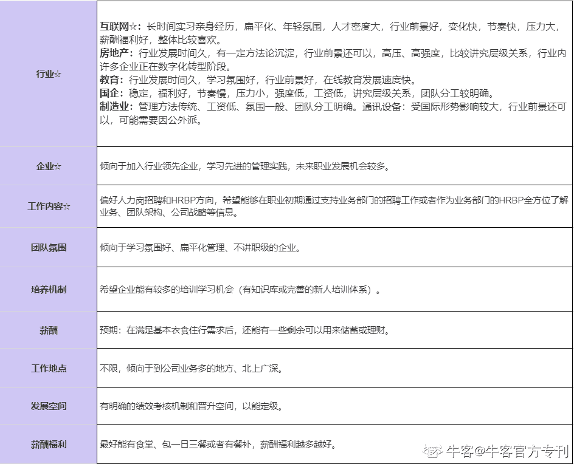

# 第四章 第 3 节 常见面试题解析及 offer 选择

> 原文：[`www.nowcoder.com/tutorial/10042/9fb79ac453494e6794bc4c285238ea9e`](https://www.nowcoder.com/tutorial/10042/9fb79ac453494e6794bc4c285238ea9e)

# 2.3 常见面试题解析

## 2.3.1 群面

*   #### 优先级排序题

优先级排序题是我在 2020 年秋招群面中遇到最多的题目，我参加的拼多多、好未来、用友、德邦人力群面都是排序题，以我在用友面试遇到的题目为例给大家讲解下解题思路：

> **题目：公司业务发展状况不好，需要通过裁员来减少开支，我作为人力资源部经理，需要在三位员工中选择一位裁员：**
> 
> **第一位是小张，他和其他同事关系比较冷淡，但是技术能力很强，如果裁掉的话需要花费比较大的成本重新招聘；**
> 
> **第二位小王，是之前通过总经理介绍进公司的，表现一般，负责工作简单，无功无过；**
> 
> **第三位小李，绩效一般，和同部门同事关系很好，但是总是会说我坏话。**

首先，我们要思考裁员目的是什么、按什么标准来裁员，对于目的和标准达成共识后我们才能进一步讨论。企业裁员的目的是为了减少开支，因此我们选择员工可替代性和裁掉某位员工所带来的损失两方面作为裁员标准。如果裁掉的员工不可替代，那裁掉该员工可能会引起新的成本（招聘成本、培训成本等等）并不能达到减少开支的目的。

然后，我们按照既定的裁员标准分析三位员工。小张技术能力很强，可替代性低，如果裁掉小张企业损失较大；小王负责工作比较简单，可替代性高，但是小王是由总经理介绍进公司的，可能小王可以为公司带来某种资源，裁掉小王可能会给公司带来损失，所以如果决定裁掉小王的话需要先和总经理提前沟通确认；小李绩效一般，可替代性一般，但是和同部门同事关系很好，如果裁掉可能会对部门氛围、员工关系造成一定损失，综上，结合我们的标准，如果小王无法为企业带来资源，那优先裁掉小王，否则裁掉小李，小张应该是最后被裁的。

最后，还可以进一步考虑企业应该如何以比较温和的方式裁员：先同步给员工“企业现处于窘境需要通过裁员减少开支”这个重要信息，管理层认真开会讨论、结合员工所负责工作内容决定裁员名单，争取得到员工理解，同时 HR 需要做好员工再就业帮助工作（联系合作企业帮忙争取工作机会、待公司经营状况好转优先返聘老员工等等）。

其实群面的答案有很多，只要大家可以基本达成共识、言之有理即可。类似的优先级排序题，我们可以按照既定思路来讨论：一、确认目标和排序标准；二、按照目标和标准进行排序；三、总结，同时头脑风暴有没有其他更完善的措施或者未纳入考虑的可能性。如果群面参与人数很多、需要排序的因素也很多，经常会出现大家七嘴八舌、讨论偏题的情况，尤其线上群面中，这个时候如果有同学能够及时纠偏、厘清大家的讨论思路，那会立刻抓住面试官的注意力，会是一个加分项！

*   #### 分析材料、输出观点类题目

这类题目我在 2020 年秋招遇到的次数也比较多，在厦航、京东物流、中通、德邦、跟谁学、美的群面中都有遇到，一般这类群面会要求同学们在短时间内阅读材料并输出观点、然后进行讨论或者辩论，对大家的知识储备和临场应变能力要求比较高。

> **以京东物流群面题目为例：**
> 
> **应急物流是指为应对严重自然灾害、突发性公共卫生事件、公共安全事件及军事冲突等突发事件而对物资、人员、资金的需求进行紧急保障的一种特殊物流活动。应急物流与普通物流一样，由流体、载体、流向、流程、流量等要素构成，具有空间效用、时间效用和形质效用。应急物流多数情况下通过物流效率实现其物流效益，而普通物流既强调效率又强调效益。应急物流可以分为军事应急物流和非军事应急物流两种。疫情期间国家应急物流系统还有哪些待完善的地方，请每位同学发表自己的观点，然后进行讨论并汇总出小组观点。**

这个题目的关键词就是“疫情期间”和“国家应急物流系统”，前述材料主要是在讲解什么是国家应急物流系统。题目阅读完毕，我们应该先回忆疫情期间国家在物流系统方面有没有出现什么问题（回忆下疫情期间的热点新闻），我当时想到的是：疫情刚爆发的时候，国内各省市医院如口罩、护目镜、试剂盒等医疗物资短缺，同时海外有很多愿意供给医疗物资的人们无法将医疗物资运回国内。

然后，我们应该思考国家层面应该如何搭建应急物流系统来解决这个问题。我当时想到的是，国家层面可以搭建一个信息平台，医疗物资供给方和需求方可以在平台上发布供需信息，保证双方信息对称，同时国家层面可以一定程度上促进搭建国际物流系统，提高医疗物资运输速度。

最后，我们可以思考如何进一步完善信息平台以最大化其效用。当时，我们组讨论出的方案是可以和流行病专家和医院医生合作，结合流行病发病规律，运用大数据技术做到疫情爆发前在对应地点储备好医疗物资，有备无患，保证物资充足供应。

其实我当时刚拿到这个题目的时候一点思路都没有，但是因为我的发言顺序靠后，所以在听了前面同学的观点后也有了一些想法，后面也输出一些观点。如果大家在群面时暂时没有想法，不用慌，可以先抛出自己的思路，抛砖引玉，然后先听听看别人的观点，同时积极思考，一方面看之前同学的观点是否需要完善，另一方面也想想有没有其他的创新点。如果自己认为并没有输出有价值的观点，那可以争取做最后的总结展示者，或者在其他人总结展示之后，再补充些自己的观点，总之一定要保证自己对整场讨论有所贡献。

## 2.3.2 单面

其实单面问题不外乎就是宝洁八大问、万科十九问，能够结合自身经历把这 27 个问题准备充分，多积累一些印证自己核心竞争力的过往经历案例，单面就没问题了。接下来我会分享下面试中经常被问到的两个问题和应答策略：

*   #### 你最有成就感的事情是什么？

回答这个问题之前，我们首先要清楚 6 个问题：

1.  为什么这件事情有成就感？

2.  为了达成这个成就我做了哪些努力？（关键是我的努力，而不是团队的努力）

3.  如何证明是我的努力促成了成功？

4.  过程中有没有遇到什么困难？

5.  遇到困难如何解决的？

6.  最终结果如何？

7.  这段经历体现了我的什么能力？

**以我的回答为例：**

> “我最有成就感的事情是，我作为毕业晚会节目组负责人，全流程跟进了所有毕业晚会节目从最初收集、审核，到中间一个月彩排，最终舞台呈现，同学和老师们对晚会节目评价很高，同时到场观众超过预期一倍以上。”**1、为什么这件事情有成就感？**我第一次作为毕业晚会节目组负责人，同时收获了不错的结果。**2、为了达成这个成就我做了哪些努力？**首先，积极向学院老师争取支持（请老师鼓励同学们积极参加毕业晚会，争取更多节目经费预算）；其次，与同学们保持密切沟通，晓之以情，动之以理，不断动员大家加入到毕业晚会节目筹备中；同时，向有丰富节目表演经历的同学学习经验，查漏补缺。**3、如何证明是我的努力促成了成功？**最终结果证明，在我的努力下，我们确实争取到了更多的节目经费，同时许多本身对毕业晚会无感的同学最终也在我的动员下登上了舞台。并且，在听取了有丰富舞台经验同学的建议后，整个舞台呈现效果很好，没有出现任何差错。**4、过程中有没有遇到什么困难？**参与表演的同学在排练中途因为论文、实习的事情想要中途退出，可能影响节目筹备进度。**5、遇到困难如何解决的？**深入了解同学的难处，换位思考切实帮助同学解决问题。对于实习和排练时间冲突的同学，我们调整了排练时间；对于担心参与排练影响论文进度的同学，我们也组建了论文讨论小组，互相督促论文进度。**6、最终结果如何？**最终除了一位同学受伤无法继续参与排练以外，其他同学继续参加排练并且最终顺利参与了演出。到场观众超过预期一倍以上，并且都对晚会节目评价很好。**7、这段经历体现了我的什么能力？**沟通表达能力，因为我需要经常和老师、同学们沟通；项目管理能力，因为我能够顺利完成毕业晚会节目筹备这个小项目；洞察需求的能力，能够发掘同学们的真实需求，并在满足同学们需求的同时达到双赢的效果。

*   #### 分别说出三个最大的优点和缺点

关于优点：这个问题其实在考察大家的自我认知是否清晰，一般说三个自身优点时，我建议大家可以结合岗位要求和自身情况来回答，最好回答那些与人力岗要求相关的优点，比如结果导向、乐于成就他人、擅长沟通等等。

关于缺点：毕竟人无完人，大家有优势，也会有劣势。回答缺点的时候，一方面需要说清楚自己的缺点是什么，但更重要的是要展示出自己为了克服这个缺点或者避免这个缺点带来的负面影响做了哪些努力、取得了哪些进步。我个人不太建议大家提及与岗位核心要求相关的缺点，比如要是应聘人力-招聘岗的候选人说自己最大的缺点是不擅长沟通，那可能就和岗位不太匹配。

# 2.4 关于 offer 选择

就我而言，在考虑 offer 的时候，主要关注行业、企业和工作内容，其他考虑因素还包括团队氛围、培养机制、薪酬、工作地点、发展空间和薪酬福利，具体如下。

 

其实我在选择 offer 的时候还是比较主观的，关键看自己是否喜欢这份工作、这个团队、这家企业，包括是否负责自己期待的工作内容，团队氛围是否适合我，企业前景、业务发展如何等等。另外，因为我应聘的是 HR 岗，在面试时我也会思考：眼前这位 HR 可能是我之后的同事或者上级，我是否适合和这样的人合作，他的职业发展道路是不是我向往的，这家企业的办事风格是不是我喜欢的等等。大家可以根据自己关注的因素对手头 offer 进行综合考虑。

另外我的经验是：如果决定接受某个 offer 了，就不要轻易否定自己的选择，要相信自己的决策。不要与其他同学作比较，不同专业、不同岗位、不同个体没有可比性，未来发展如何更无法预知。而且，我们又不是一签定终生，只不过是当下自己做的一次自己认为正确的选择而已，今后还有很多调整机会，是金子无论在哪都会发光的。