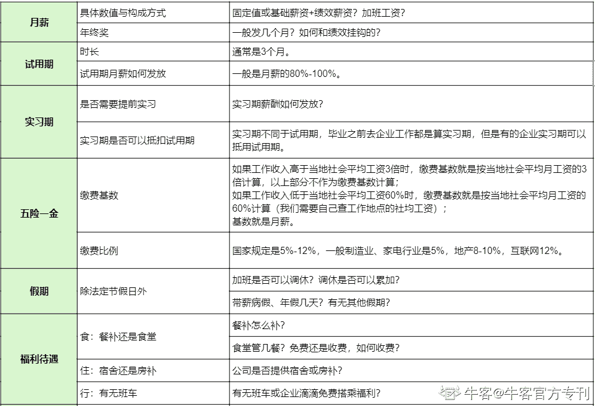
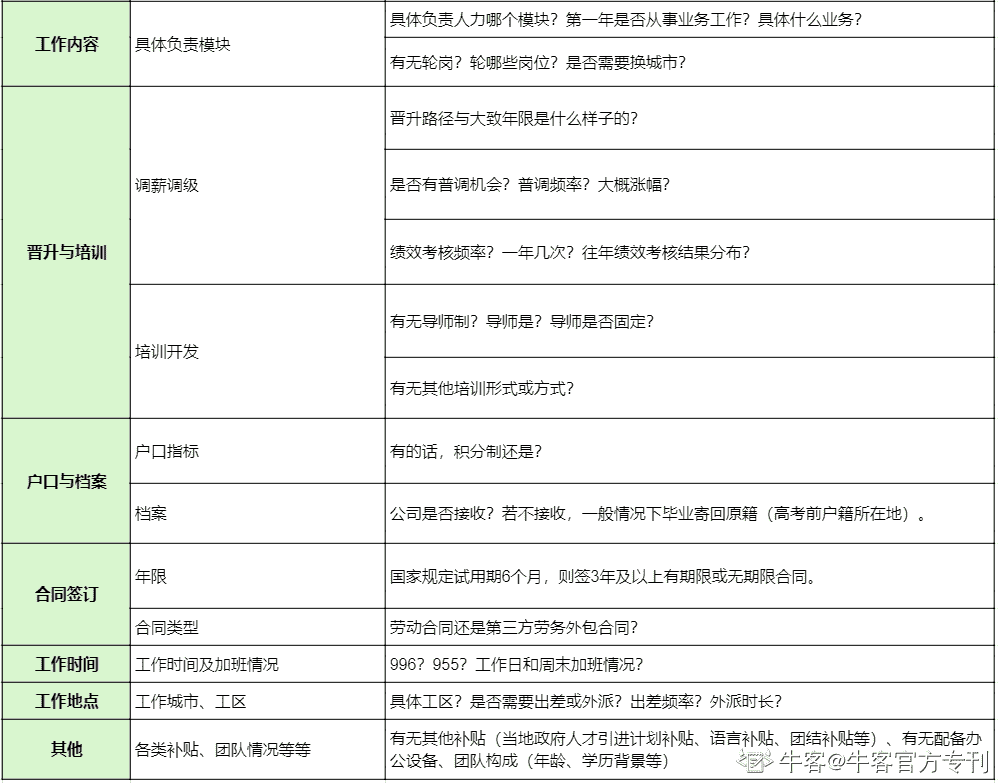

# 第五章 第 1 节 我的校招求职特色经验分享

> 原文：[`www.nowcoder.com/tutorial/10042/edd3cdcbafdf40f2baed49a8afe4023b`](https://www.nowcoder.com/tutorial/10042/edd3cdcbafdf40f2baed49a8afe4023b)

# 1\. 实习中如何争取转正

因为我自己是通过实习转正拿到了心仪的秋招 offer，所以也想和大家分享下关于实习转正的心得。在实习之前，我们需要先和面试官确认这个岗位是否有转正机会，如果有的话转正条件是什么，同时评估自己有多大概率满足转正条件、通过转正面试。如果我们顺利拿到一个有留用机会的实习 offer，同时也非常希望能够成功转正，那我们需要在以下几个方面努力。

首先，最基本的是我们要达到实习生的最低标准：尽快上手工作，熟悉工作，至少做到本职工作不出错，按时完成每日工作。因为我当时实习主要做的是招聘，那我至少要保证每天的面试能够顺利进行、我安排的面试不能出错、针对候选人和业务同事的疑问我能够给出准确回答。

之后，我们要以更高的标准要求自己，在完成手头工作之后，进一步思考如何将手头工作完成得更好。以我的实习为例，在保证顺利完成基本事务性工作之后，我就开始思考怎么样能够尽可能多地找到高优候选人，为了找到高优候选人，我需要做哪些事情，如何高效完成任务等等。事务性工作一般是实习最基础的工作内容，一般是上级布置给我们的任务，但是表现卓越的实习生除了完成基本工作外，还会主动思考工作中还可以完善的地方，并积极采取行动去实践，甚至可以发现现有工作流程或制度中的不足并提出可行的改进建议。

最后，在能够有质量地完成本职实习工作后，我们需要进一步思考如果作为一名正式员工，我们应该做什么。之前在和 leader 交流的时候他说，如果一个实习生只是着眼于他正在做的事情，而没有额外的思考和产出，那我们继续招实习生就好了，为什么还要将实习生转为正式员工呢？我认为，作为正式员工和实习生，看待问题的视角是不一样的。像我在实习的时候，只负责某些岗位的招聘、只对接某几位候选人，我一般只关注个别岗位和候选人，但是，作为正式员工，我需要站在业务、部门甚至公司层面更宏观的视角考虑问题：为什么业务部门会有这样的用人需求？目前业务发展进度如何？业务团队如何分工？公司战略侧重点是什么？作为一位 HR 正式员工，我需要站在全局视角，为业务同事提供创造性和前瞻性的人力资源管理解决方案，做和业务同事并肩战斗的人和探路者。

我是在本部门成功实习转正，但是同学们如果实习的时候想申请跨部门转正的话，可以提前联系相应业务的 hr，了解下对应业务有无用人需求，如果有的话岗位任职要求是什么样的，然后评估下自己是否合适，再决定是否发起跨部门转正申请。因为有的公司是有转正申请次数限制的，我们不要浪费了转正机会。

以上是我关于实习转正的一些心得，希望对大家可以有些借鉴意义。

# 2\. 面试后如何做好复盘

每场面试后，无论结果如何，我们都应该做好复盘，为下次机会做好准备。

一，我们要复盘面试官的问题以及自己的回答；二，思考面试官这个问题的考察点是什么；三，我的回答是否需要完善，如何完善。经历的面试多了我们就会形成自己的面试题库，也会发现其实面试官针对我们简历提出的问题也都大同小异，通过面试-复盘面试-复盘过往经历-再次面试，我们可以不断打磨我们针对特定问题的答案，也会慢慢总结出来面试官对我们的哪段经历最感兴趣，然后有针对性地进行准备。

凡事熟能生巧，面试也是需要练习的。其实我本身并不是一个非常擅长表现自我的人，但是经历的面试多了也慢慢找到感觉了。在秋招阶段，我会经常抓住各种机会去练习面试，包括参加学校的模拟面试、和就业指导中心老师积极沟通、和共同准备秋招的同学保持交流等等。我还把自己职场社交软件上的状态改成“正在看机会”，同时也去争取一些有转正机会的实习岗位。总结下来就是：充分地准备，自信地面试，认真地复盘。

# 3\. 求职过程的心理建设

虽然我通过海投争取到了更多机会，但是多次网申、笔试面试也更费心费力。尤其当网申或者笔试面试不通过时，还会增加许多自我怀疑、焦虑的心理成本，这个时候就需要大家做好求职过程的心理建设，没有通过并不代表我们不优秀，只是说明在现阶段我们不是企业岗位最匹配的候选人而已，仅此而已。因为找工作其实也需要天时地利人和：企业正好有用人需求，我们表现出了与岗位相匹配的能力素质，同时在同一批次的候选人当中我们是最适配的，而没有进入下一环节可能是任何一方面的不适配导致的。

如果笔试或面试失利，我们更应该做的事情应该是静下心来好好复盘，为下次机会做好准备，自己要给自己加油打气，不要丧气，说不定 offer 就在下个转角处等着你！像我自己前期没有 offer，甚至都很少能够走到终面，经历了很多心情沮丧的时刻，不过当拿到第一个 offer 后，心态就不一样了，原来自己还是挺优秀的，并没有很差。所以大家如果也有类似的经历，不要着急，充分准备，一定可以厚积薄发的。另外，我们也可以和一同求职的同学们抱团取暖，分担忧愁，分享喜悦，共享信息！

# 4\. offer 沟通注意要点

当企业决定给我们发 offer 后，会与我们进行 offer 沟通，介绍薪酬构成、福利待遇等信息，因为我们作为应届生，之前可能没有相关经验，所以我总结了一些 offer 沟通时的注意要点以便大家参考。

同学可以参考下就感兴趣的问题进行询问，因为 offer 沟通涉及问题较多，所以建议大家添加 HR 和未来 leader 微信仔细询问了解，另外也可以提前为入职做准备。

**以上就是我的人力岗校招经验分享，全文主要是结合我所经历的求职经历，可能还有一些我没有涉及到的部分，还请同学们分享指正。希望我的分享可以对大家有帮助。祝愿大家一切顺利，都可以收获满意的 offer，江湖再见！**