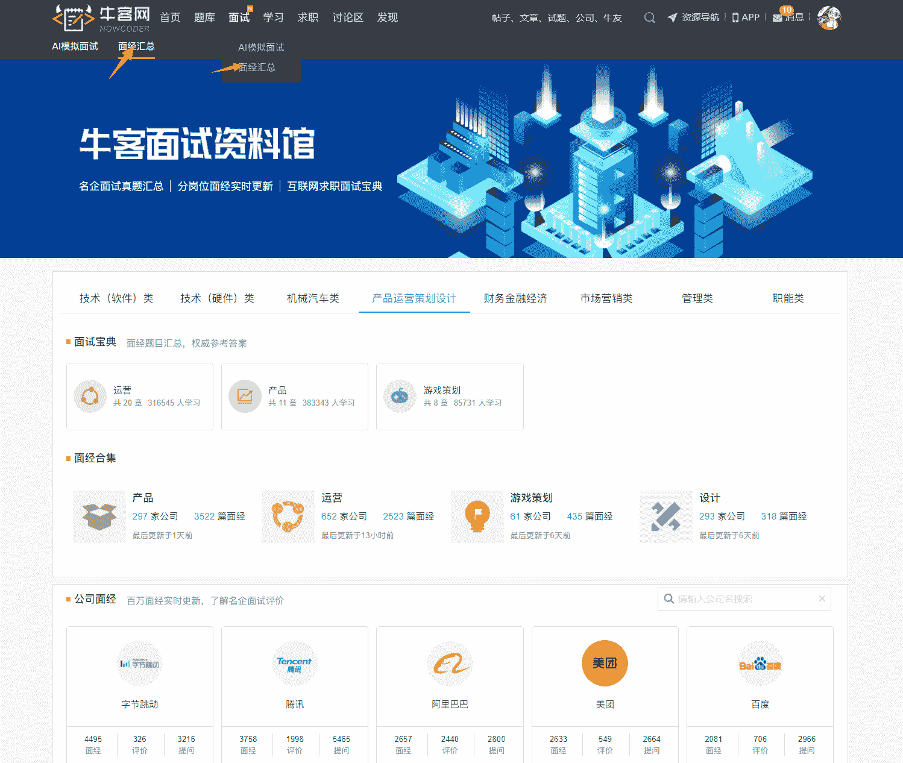
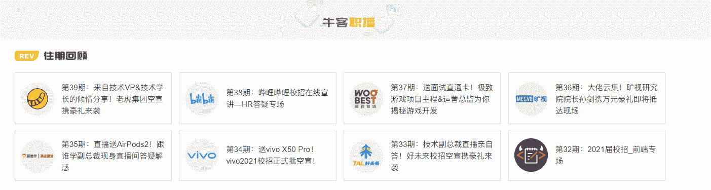
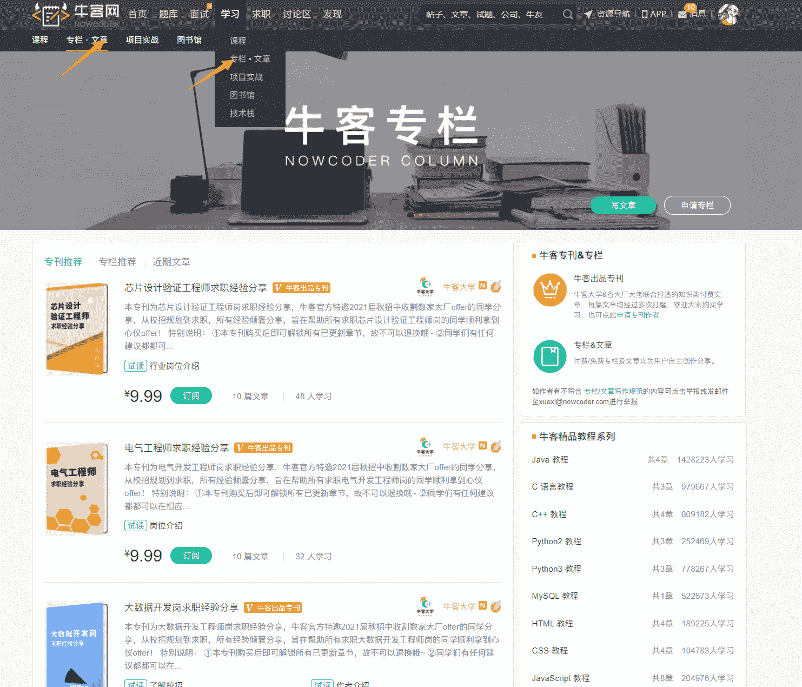
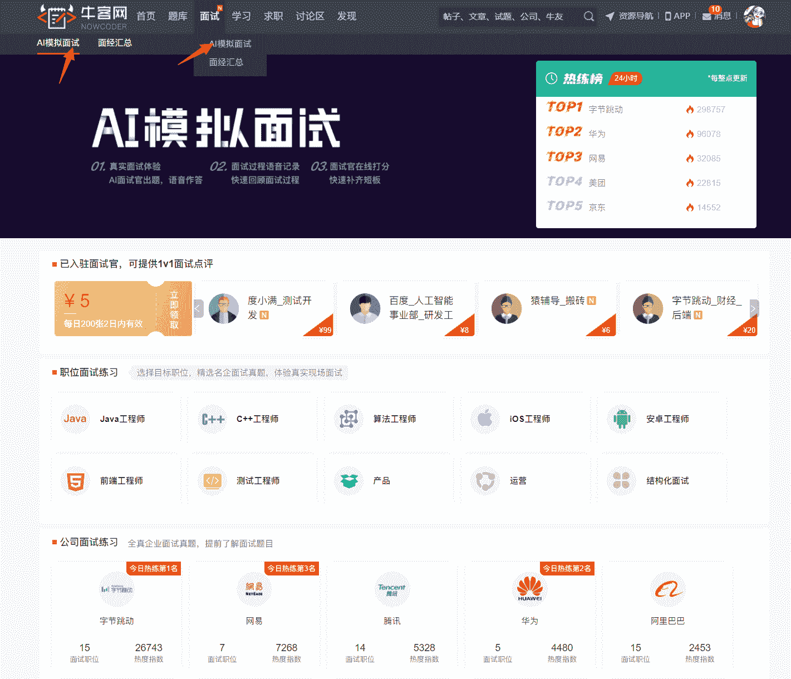
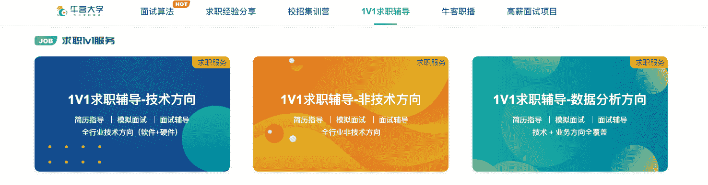

# 面试总攻略

#  面试环节是所有招聘环节中至关重要的一项，考察也会更全面更严格。而提高自己面试应对能力的方法就是：看面经。面经是学长学姐的亲身经历和总结，参考价值之重无需多说。下文会给大家详细列举精选的面经。

大家可以在：牛客网>面试>面经汇总 中有针对性地寻找意向公司的面经，也可以在讨论区搜索特定岗位的相关面经。

推荐大家关注“面经大全”和“牛客论坛”小程序，这里面有上千篇高品质面经汇总以及众多行内人士信息分享，助你了解心仪公司/岗位的面试真题，面试官套路各个击破。

    扫一扫，面经装进口袋     

       看一看，关注行内新态

如果想了解具体某一家公司的招聘标准，面试流程等信息，推荐大家关注**牛客网****>****课程****>****牛客职播。**春招开始后，我们会陆续请到各大厂校招的负责人做客牛客职播，为大家答疑解惑，不方便看直播的同学，也可以过后看录播。

观看牛客职播：[`www.nowcoder.com/courses?from=22sxgl`](https://www.nowcoder.com/courses?from=22sxgl)

有的同学会感觉，单纯只是看面经、看直播，心理不踏实，认为知识点都很分散，直播负责人讲的点也都是比较抽象广泛的，没办法系统地对各知识点、注意事项进行梳理。如果大家也有类似的感受，建议可以通过专栏+面经的交叉学习方式。

牛客专栏是牛客网精心推出的一款面向各个行业和岗位求职、学习的知识服务产品，每个专栏拥有独立的主题，内容皆由各个主题领域大佬分享，旨在帮助大家通过短、精、全的好内容碎片化时间高效学习。大家可以通过专栏学习系统地梳理知识点，再通过阅读面经的方式，吸取更多的面试经验。

点击立刻进入牛客专栏：[`www.nowcoder.com/blog/blogCenter`](https://www.nowcoder.com/blog/blogCenter)?from=22sxgl

    这时候有的同学会说，我准备的时候都认为自己十拿九稳了，但是一到真实面试，就很紧张，把之前准备的全都忘光了，回答得丝毫没有逻辑，结束后十分懊恼。其实出现这种情况的原因是你对未知的恐惧，如果你在面试前进行过模拟，你会从容许多。你们可以到**牛客网>AI 模拟面试**中选择自己的岗位进行模拟面试，在这里，可以真实体验面试场景，会有 AI 面试官为你出题，作答过程中会有语音记录，帮助你进行面后复盘，同时还可选择真实面试官为你在线打分，有助于快速找到自己的短板。

点击立刻进入 AI 模拟面试：[`www.nowcoder.com/interview/ai/index`](https://www.nowcoder.com/interview/ai/index)?from=22sxgl

到此，如果仍然有同学不知道该如何准备面试，如何制定计划。建议报名**牛客网>学习>课程>《1v1 求职辅导课》**，目前有三个方向：技术、非技术、数据分析。这个课程的导师都是拥有丰富校招经验，来自名校名企的资深大佬，会为同学们提供校招全流程的服务，包括简历、笔试、面试、职业规划等求职指导。大家可以根据自己的情况选择最匹配的导师，导师会针对学员的情况做针对性的培训计划，帮助大家快速解决求职中最迫切的问题，助力大家拿到心仪企业的高薪 offer。

**1v1 求职辅导课:**[`www.nowcoder.com/courses?from=22sxgl`](https://www.nowcoder.com/courses?from=22sxgl)

