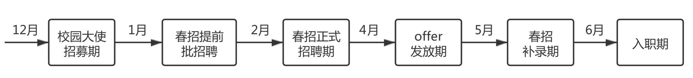

# 整体概述

#  ## 1 春招介绍

     春招，即春季校园招聘，是企业面向应届生和准应届生专门举办的招聘。

2021 年春招是面向 2021 届毕业生的正式校园招聘（也可以称为秋招的补录），以及 2022 年准应届生的实习招聘（分为日常实习和暑期实习）。

有些同学认为，找工作是毕业前的事情，大四再去实习也不迟，完全错误。近年来，互联网企业选人要求越来越严格，应试者的能力水平也在不断提高，绝大部分的同学，在大四求职时，已经有至少一份实习经历。倘若没有实习经历，想在校招中斩获满意的 offer 必会难上加难。 

     所以大三和研一研二的同学，请一定要抓住 2021 年春招机会，找一份能够给你添彩的实习！

## 2 春招时间

     2021 年春节假期在 2 月 12 日-2 月 18 日，所以预估今年春招大概在 2 月底正式开始。

就目前情况来说，线上招聘已经成为大趋势，很多企业会采用线上宣讲+招聘的模式，对比线下招聘，整个流程速度会加快，快的企业能在 1-2 周内走完所有的流程，因此留给同学们的准备时间不多了，真心建议大家要利用好春节前后这段时间，抓紧时间好好准备，争取在春招收获满意的 offer。 

## 3 春招时间流程

下面让牛客带大家详细梳理下春招的招聘流程，只有做到心中有数，才能从容应对哦。

**春招流程图**

12 月-次年 1 月：校园大使招募期

在这个时间段部分企业会进行校园大使招募，主要负责协助企业开展学校宣讲会的事务，除了劳务费外，还会获得实习证明，有的企业甚至还会给出内推或者面试直通卡等福利。

1 月-2 月：春招提前批招聘期

这一批次的招聘对象是学历和能力都相当优秀的同学，企业会给出高于平均水平的薪资待遇，但因为招聘的规模不大，所以不会进行大规模宣传，需要大家时刻关注官方渠道，以免错过网申时间。为了让大家更快速获取这批次的信息，牛客网已经贴心地为大家准备了相关招聘信息的集合，大家记得收藏哦。

21 届校招补招信息:[`www.nowcoder.com/discuss/555810?from=22sxgl`](https://www.nowcoder.com/discuss/555810?from=22sxgl)

22 届实习信息:[`www.nowcoder.com/discuss/587250?from=22sxgl`](https://www.nowcoder.com/discuss/587250?from=22sxgl)

2 月-4 月：春招正式招聘期

大部分计划参与春招的企业都会在这个时间点开放春招网申通道。在这个时间段，将会有大量的岗位放出，需要大家及时去关注并投递。

但是企业何其多，要每一家都关注到位，实属不易。别慌 ，牛客带你走捷径，关注牛客校招日程，就可以一站关注所有公司招聘动态，节省 80%的时间！

牛客校招日程:[`www.nowcoder.com/school/schedule?from=22sxgl`](https://www.nowcoder.com/school/schedule?from=22sxgl)

4 月-5 月：春招 offer 发放期

春招节奏很快，到了 4、5 月份很多公司就开始陆续发放 offer。

收到多家 offer 的同学可以通过对各家公司的薪资待遇、未来发展、个人职业发展等多方面进行考量和对比，选定自己心仪的 offer。

如果大家实在不知道如何对比 offer，可以到牛客网生成自己的 offer 竞争力报告，通过大数据帮助分析，可以更全面地了解 offer 的情况，为大家选择 offer 提供参考。

查薪资，比 offer:[`nowcoder.com/offer/show-v2/index?from=22sxgl`](http://nowcoder.com/offer/show-v2/index?from=22sxgl)

5 月-6 月：春招补录期。

在这个阶段企业会放出一些没有招满人的岗位，以技术岗为主，少量的非技术岗，且数量不多。这一阶段招募的特点是规模小、零散、时间不集中，有些公司的补招甚至不会发布在官网/官方招聘公众号上。而是由用人部门员工或实习生直接招募，他们会在朋友圈/各大论坛/各大招聘网站发布招聘信息，但如果你没有相应认识的人，可能在你还未知道实习消息之前，招募就已经悄然结束了。

这时候，认准牛客网就可以了，牛客网为大家建立了求职内推群，每天为大家收集筛选全网最新且可靠的招聘信息，大家看到合适的直接投递即可。

立刻进群：[`www.nowcoder.com/discuss/398944?from=22sxgl`](https://www.nowcoder.com/discuss/398944?from=22sxgl)

6 月-8 月：入职期。

校招拿到 offer 的同学，拿到毕业证之后就可以入职了，暑假实习的同学，可以跟公司协商入职时间，在约定的时间内办理入职。

## 4 春招具体流程

2021 届毕业生：

网申→笔试→面试→发放 offer→接受 offer→签三方→学生毕业获得双证（毕业证+学位证）→正式入职，签订劳动合同

2022 届准毕业生：

网申→笔试→面试→发放 offer→接受 offer，确认入职时间→按时入职，签订实习合同