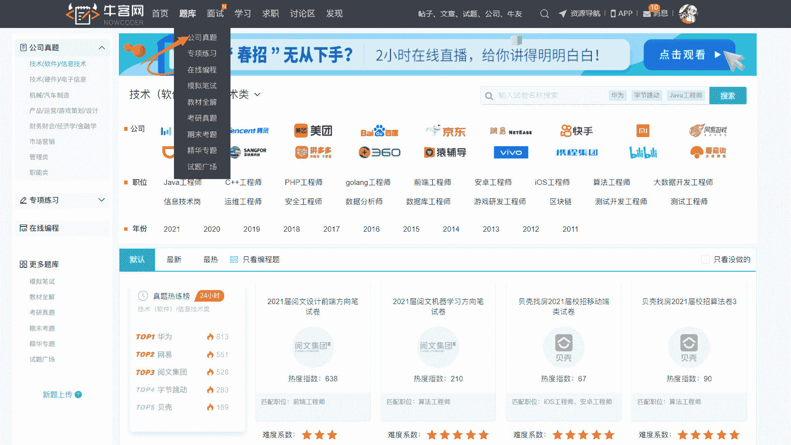
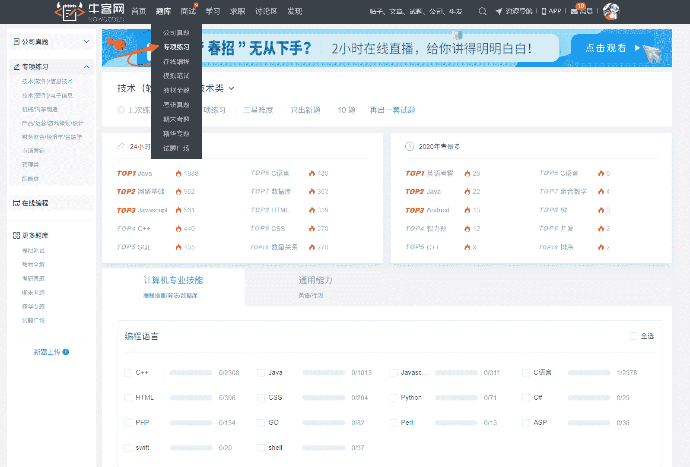
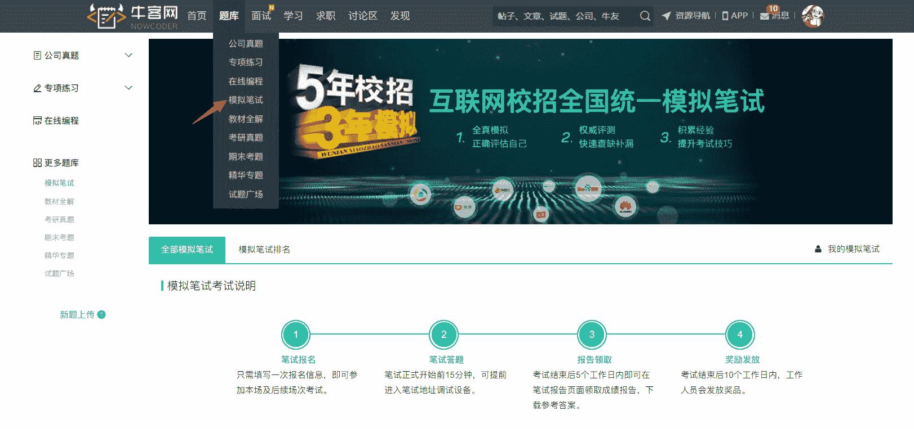

# 笔试阶段

# 笔试是校招刷人最多的环节。近些年，各名企笔试考察难度越来越高，然而每个公司的笔试机会都只有一次，只埋头刷题显然是不够的。你需要提前了解最新出题趋势与真实的在线笔试流程，才能真正做到有备无患。 ### **1** **公司真题**

牛客上涵盖腾讯、百度、字节跳动等各个行业上百家企业历年校招真题，免费支持在线练习。不需要再去全网搜索甚至付费购买真题资源。

**PC 端地址：****牛客网>题库>****公****司真题**

[`www.nowcoder.com/contestRoom?from=22sxgl`](https://www.nowcoder.com/contestRoom?from=22sxgl)

**移动端地址：牛客 app>学习>公司套题**，把题目装口袋，随时随地刷题。
 ### **2 专项练习**

计算机、通信、产品运营、金融、职能、管理、市场营销、行测题库分门别类，根据应聘岗位有针对性地刷题，笔试考点逐个击破。

**PC 端地址：****牛客网>题库>专项练习**

[`www.nowcoder.com/intelligentTest?from=22sxgl`](https://www.nowcoder.com/intelligentTest?from=22sxgl)

**移动端地址：牛客 app>首页>专项练习******  **### **3** **2021 年牛客校招模考**

由多位曾任职大厂并担任过面试官的资深大佬参与命题，熟悉名企校招出题风格与考察要点，帮你了解最真实的名企校招在线笔试流程。
大家可以通过模拟笔试，检查个人复习情况，了解自身知识漏洞，以便查漏补缺，从而顺利通过目标企业校招笔试。
报名链接：[`www.nowcoder.com/mockexam/MockExam?from=22sxgl`](https://www.nowcoder.com/mockexam/MockExam?from=22sxgl)

**