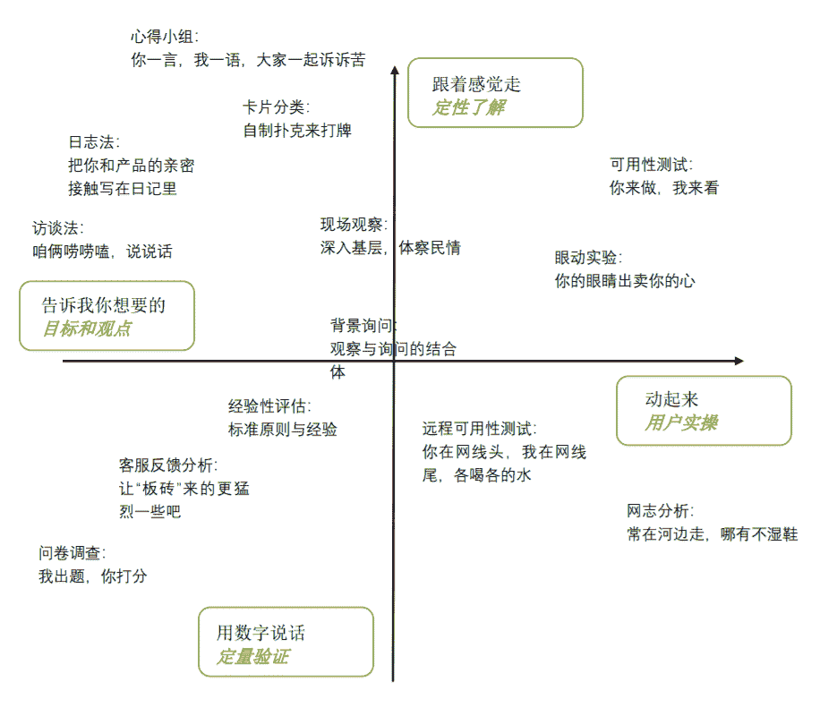
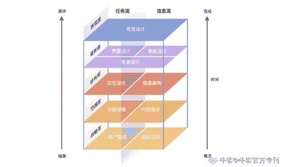
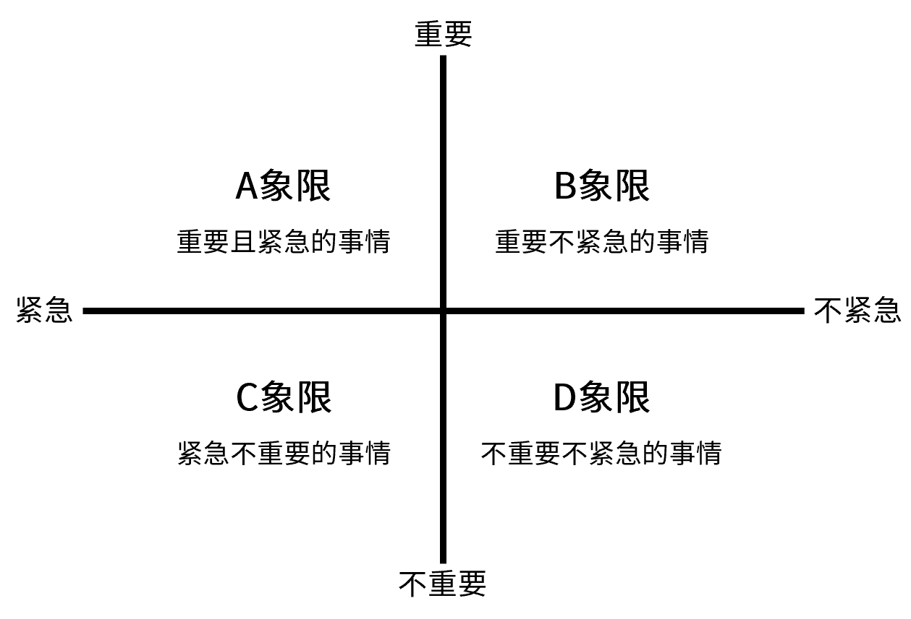
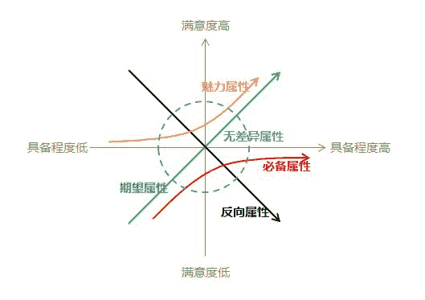
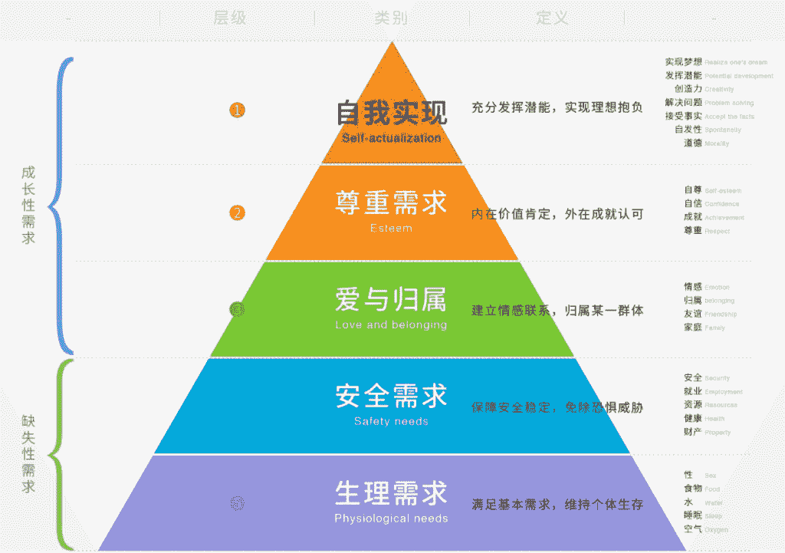
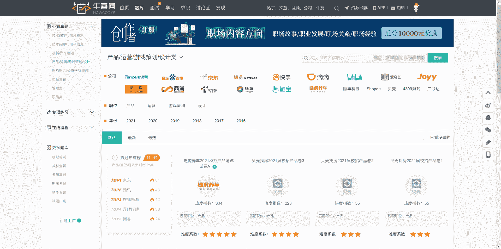

# 非技术岗笔试攻略

#  技术岗笔试题以专业问题、编程题目为主，而非技术岗的笔试更加看重的是考生的思维逻辑能力、解决问题能力以及可塑性，除了有小部分的专业题外，更多的是思维逻辑方面的题目，就是大家常说的行测题。而这类题目，往往被很多同学视为笔试大敌，其实它们都是有迹可循的，只要知道套路、熟悉解题方法，绝大部分的题目都能迎刃而解。

#### **1** **行测**

行测题主要考察候选人的逻辑思维和反应能力。题型包括图形题、数量关系题、资料分析题、言语理解题、常识题等类型。对于行测，很多同学心里没有底，甚至看到就心慌、想跳过。其实行测也是有套路可寻的，只要了解每种题型的特点，掌握解题技巧，加上足够的练习，就可以轻松应对。下面来展开介绍一下常见的题型

1、言语理解。

这类题型是在考察逻辑思维能力，不是考语文！言语理解考察了观察、分析、综合、抽象、概括等逻辑思维能力，如果不能提升相应的逻辑思维能力，做再多题，积累再多词汇，言语理解仍然无法提高。

答题要点：

*   了解关键词句在文段的作用，作者在行文上的写作思路
*   切忌每字都读，不要把时间浪费在无用信息中，学会准确把握文段结构
*   敏锐抓住题干中的关键词、关键句，快速排除选项

2、逻辑推理。

这类题目逻辑关系涉及内容较多，包括全同关系、并列关系、包容关系、交叉关系等，如果按部就班找答案必须研究透逻辑，难度大，耗时高。不过这类型题目也是有一定技巧的，只需要多做多练习，不断培养逻辑思维。

3、类比推理。

造句表明两个词逻辑关系更加明朗。通常是题干给出组相关的词，要求在选项中找出一组与之在逻辑关系上最为贴近或相似的词。类比推理常考题型有三种，分别是：

两词型   A:B

三词型   A:B:C

填空型   A 对于（ ）相当于 B 对于（ ）

解这类型的题目，首先需要熟记常考词语间的逻辑关系,选择最为一致或相似的选项。常考的词语间逻辑关系主要有语义关系、逻辑关系和语法关系，涉及较多常识，需注意积累，而且当仅根据逻辑关系无法确定答案时，需要进行二级辨析，即比较择优，选择最为一致或相似的选项。做题时一定要看完四个选项后再选。

4、数量关系。

最常考的题型有“星期几问题”、“分数比例形式整除”、“等差数列”、“几何边端问题”、“行程问题”、“溶液问题”，大家可以有针对性地去看看这几类常见问题的解法技巧，如果笔试时，发现该题型难度大，可以适当放弃，直接蒙一个答案。

第五，资料分析，资料分析题与数量关系题相比，在弄懂了各种名词代表的含义之后，列出算式相对比较容易，但计算量巨大，一般这类型题目会有 1-2 题，每题会有 2-3 问，一般前 2 问都是相对简单的，所以可以优先把简单的做了，后面两小题，在时间允许下可以做，时间不够的情况下，先去答前面分数占比高的题目。

对于行测，有以下几个做题技巧，大家需要切记：

（1）以 1 分钟为单位，弃掉拿不准的题。

很多人碰到拿不准的题舍不得跳过，可以选择标记一下提醒自己都做完了回头再做，迈过心里的那道坎，虽然绝大多数人根本没有时间回头做。

（2）常识先做，数量最后。

从历年的行测题来看，数量题是最难的，往往需要花费大量的时间和精力，但考试的时间是有限的，我们不能把时间都耗在某几题上，所以建议先把常识题做了，做完再集中做数量题。

（3）先易后难，松紧搭配。

这个道理很容易懂了，先做容易的题目，不但能快速得分，而且能为自己营造一个自行、从容的心理环境，更有利于后面的答题。

非技术笔试中，行测分数少则占比 30%，多则占比 50%，所以大家千万不能掉以轻心，平时要多注意积累和练习，多去看看解题技巧，然后多多练习，做到熟能生巧。想练习行测的同学，可以到**牛客网****>****题库****>****专题练习****>****行测进行练习**。

网址：[`www.nowcoder.com/intelligentTest?from=22sxgl`](https://www.nowcoder.com/intelligentTest?from=22sxgl)

#### **2** **性格测试**

除了行测外，有的企业会外加一轮性格测试，很多考生认为这个测试无关重要，从而掉以轻心。真实情况并非如此，性格测试是企业衡量候选人的价格官、性格是否匹配企业文化的重要依据，每年都有不少的同学挂在了这个环节。下面让我们来具体介绍一下性格测试。

企业最常用的性格测试有两个：

DISC 个性测验：国外企业广泛应用的一种人格测验。

MBTI 职业性格测试：国际最为流行的职业人格评估工具。

性格测试就是企业用一些心理测试题，常见的就是用一些客观事件的描述，让你选择主观的答案。除了性格测试外，有关“人职匹配”的测试还有多种。比如：兴趣与职业匹配测试、个体价值观和职业匹配测试、能力（认知能力、操作能力、社交能力）与职业匹配测试、气质与职业匹配测试等。这些测试都是由专业的人才测评公司研发的，因为类别多、而且不同公司、不同岗位的标准不同，无标准答案。

有的同学会为了自己能顺利通过性格测试，会刻意迎合企业、匹配岗位要求去答题，但因为大多数性格测试题的前后都有相互验证的题目，或者重复的题目，如果出现前后矛盾的情况，会直接影响到测试的评判结果，最后得不偿失。所以，建议大家按照自己的实际情况去答题，放平心态，才是最好的应对方式。

#### **3** **主观题**

**1、****产品****岗**

产品岗主观题题目类型大概有如下几类：

    数理逻辑                     行业分析                         岗位认知

    项目管理                     需求分析&用户研究            名词解释

    竞品分析                     数据分析&数据估算           产品设计

    产品规划                     产品运营

（1）名词解释

【题型介绍】

早期的名词解释比较简单，就是解释一些常见术语或者行业热门名词，例如 ASO，UGC，SAAS，NFC 等等。

近些年的名词解释出现了一些变形，会结合一些具体场景考核考生对于产品及其核心功能和特色的认知。

【解题思路】

该类型考查素质：语言组织，概括能力

该类型考查知识点：用户思维，产品洞察

*   用户思维：由于对象的年龄、知识结构等差异，叙述名词需要考虑对方的接受能力，针对不同对象，进行形象化的订制解答。需要注意的是：少用专业名词及缩写，措辞浅显易懂，可以拿受众易于理解的事物做类比。
*   产品洞察：需要洞察该产品（名词）的核心功能和核心卖点，满足了对方在哪些重要场景下的需求。

**名词解释题目合集：**[`www.nowcoder.com/questionCenter?mutiTagIds=1408&from=22sxgl`](https://www.nowcoder.com/questionCenter?mutiTagIds=1408&from=22sxgl)

（2）需求分析&用户研究

【题型介绍】

作为产品经理，用户思维和需求分析是这个岗位所需的部分核心能力之一。该类问题除了考察具体的方法论，经常结合具体应用或场景，考察应试者的逻辑思维、洞察力等。比如，让应试者判断是否需要删掉或者添加某项功能、或者某产品功能的上线顺序等。

【解题思路】

该题型考察素质：逻辑思维，系统思考

该题型考察知识点：用户调研方法，需求分析

*   用户研究：首先，熟悉用户研究的常用方法，包括了常见的定性研究方法和定量研究方法，以及每种研究方法的使用方式和优缺点。然后，根据用研目的、对象，采取最适合的方法进行用户研究。                              

                                                                                                                                                                                         

图：用户研究方法

*   需求分析：需求分析是从用户提出的需求出发，挖掘用户内心真正的目标，并转为产品需求的过程。用户需求的定义可分为构建用户角色，描述使用场景，定义用户问题。然后，借助 KANO 模型、四象限法则、时间评估与性价比等模型工具，确定需求的优先级。最终将用户需求转化为产品需求。

**需求分析&用户研究题目合集：**

[`www.nowcoder.com/questionCenter?mutiTagIds=1410&from=22sxgl`](https://www.nowcoder.com/questionCenter?mutiTagIds=1410&from=22sxgl)

（3）数据估算&数据分析

【题型介绍】

数据的估算与分析是产品岗位常用的技能要求，该类问题往往是给定限定信息，并对其进行有可能计算的数量的猜想和验证，可以参考费米问题（在科学研究中用来做量纲分析、估算和清晰地验证一个假设的估算问题，例如:“估算今年全国通过网络参加考研培训的人数？”）的解决，主要考察分析问题的能力、逻辑思考的能力。

【解题思路】

该题型考察素质：

逻辑分析能力（能否清晰有条理解决问题）

数据能力（对数据的敏感性，是否关注日常数据）

细节把握能力(是否注意分析细节，并结合实际情况去细化)

该题型考察知识点：用户画像，市场分析，数据分析

依据生活常识，选择与题目相关的数据信息。

通过信息筛选，选择解题路径：估算的关键因素、因素的参数、参数间逻辑。

通过量化估计，计算整条逻辑链，完成问题的解决。

解题要点：

有根据有来源的数据越多，估算结果就越有说服力。可以使用漏斗模型、用户分类和画像等方法进行解题。解题的思路比最终得出结果的更为重要。该类型题目考察的重点是主要结构化思维逻辑。

**数据估算&数据计算题目合集：**[`www.nowcoder.com/questionCenter?mutiTagIds=1415&from=22sxgl`](https://www.nowcoder.com/questionCenter?mutiTagIds=1415&from=22sxgl)

（4）竞品分析

【题型介绍】

竞品分析是基本的产品分析方法，一般是对竞品进行功能层面的横向比较。在考试中，该题型也经常会以模糊的竞品分析的形式出现，此时需要考生自行划分对比维度。

【解题思路】

对于一般的竞品分析，可以参照产品体验五要素，分别从五个要素层面对竞品进行分析。

产品体验五要素：

*   战略层：企业与用户对产品的期望和目标。
*   范围层：产品功能及其内容需求整合。
*   结构层：确定各个要呈现给用户的选项的模式和顺序——即交互设计及其信息架构。
*   框架层：界面设计，导航设计，内容（信息）设计。
*   表现层：用户可直接感知的产品和内容的视觉呈现。

图 1 用户体验五要素

对于一些特殊的竞品分析，则因题而异，一般可采取下面的思路步骤进行分析：

*   划分维度：根据题目要求和对于竞品的理解，划分竞品分析的维度。
*   对比分析：基于不同维度，对竞品作对比分析。
*   得出结论：基于以上分析，得出相应的结论。

**竞品分析题目合集：**[`www.nowcoder.com/questionCenter?mutiTagIds=1411&from=22sxgl`](https://www.nowcoder.com/questionCenter?mutiTagIds=1411&from=22sxgl)

（5）产品设计

【题型介绍】

产品设计题往往是出题频率最高，在整张卷中分值最高，一般也是最难的题。重点考察对用户痛点的理解、需求的把控、产品的定位和核心功能的归纳。

【解题思路】

产品设计题型一般的解题思路为：

目标用户——用户需求或痛点——核心功能——使用场景

考察考点：需求分析、原型设计、PRD 撰写。

答题要点：

交代需求背景、需求目的、需求概要、涉及范围、全局规则、名词说明、交互原型地址等。

将功能、流程、页面等通过用例图、实体图、状态图、流程图等清晰地、整体的呈现出来。

将具体的页面元素、细则说明、各种情况下的跳转、原型等说明清楚。

**产品设计题目合集：**[`www.nowcoder.com/questionCenter?mutiTagIds=1413&from=22sxgl`](https://www.nowcoder.com/questionCenter?mutiTagIds=1413&from=22sxgl)

（6）产品规划

【题型介绍】

产品规划主要在了解市场、用户需求、竞品、外在机会与风险、市场和技术发展态势的基础上，根据公司自身的情况和发展方向，制定出可以把握市场机会、满足消费者需要的产品的远景目标以及实施该远景目标的战略、战术的过程。

考试中多表现为考核以下内容：用户画像，需求分析，产品设计，功能优先级管理等等。

【解题思路】

用户画像/需求分析/产品设计在其他部分均有涉及，在此不多赘述。

产品功能优先级管理，主要从产品战略定位、用户影响程度、技术实现难度三个方面综合考量，可以借助四象限法则、RICE 工具（产品管理优先级排序工具）、KANO 模型、马斯洛需求理论模型等工具。

图：四象限法则

图：KANO 模型

                                                                                                                                        图：马斯洛需求理论模型

**产品规划题目合集：**[`www.nowcoder.com/questionCenter?mutiTagIds=1409&from=22sxgl`](https://www.nowcoder.com/questionCenter?mutiTagIds=1409&from=22sxgl)

（7）产品运营

【题型介绍】

好产品也应该是好运营，在产品考试中也经常会出现运营知识的考题。

产品运营型题目可能会涉及产品冷启动、用户活跃，用户留存，UGC，商业化等运营知识。

【解题思路】

产品运营类题目一般也是先从用户分析出发，结合具体问题给出解决方案。

**产品运营题目合集：**[`www.nowcoder.com/questionCenter?mutiTagIds=1410&from=22sxgl`](https://www.nowcoder.com/questionCenter?mutiTagIds=1410&from=22sxgl)

**2、****运营岗**

运营主观题题目类型大概有如下几类：

    行业分析                 岗位认知                 名词解释

    用户画像                 竞品分析                 运营策略

    运营方案                产品冷启动               新媒体运营

    用户运营                 内容策划                 文案撰写

    营销推广                 活动策划                 线下活动

    数据分析

（1）用户画像

【题型介绍】

用户画像，又称为人物角色（persona），是根据用户社会属性、生活习惯、消费行为等信息抽象而成的一个标签化的用户模型。用户画像分析作为运营人员的一项基本技能，经常在考试中出现。该题型不一定会以单独题目的形式出现，但经常会融入到其他题型中去。

【解题思路】

用户画像确定的一般步骤如下：

第一步，理解用户。合理有效的用户画像是建立在对目标用户充分理解基础之上的，一般建立用户画像之前需要先收集相关数据。

第二步，寻找关键变量。所谓关键变量是指导致目标用户对产品/服务的相关行为产生差异的核心因素。

第三步，聚类。关键变量是帮助用户聚类的核心维度，有了关键变量后则可以通过将每个维度上的“信息值”串联，得到用户画像的核心特征。

第四步，丰富人物形象。将聚类后的典型用户类型进行精细刻画，添加一些细节描述，让用户画像更有画面感。

 考试中如果没有相关数据支持，只能靠考生个人的理解和推测了。

**用户运营题目合集：**[`www.nowcoder.com/questionCenter?mutiTagIds=1420&from=22sxgl`](https://www.nowcoder.com/questionCenter?mutiTagIds=1420&from=22sxgl)

 （2）竞品分析

【题型介绍】

竞品分析在运营工作中经常遇到，一般是对竞品在关键维度上进行横向比较，说明理由或者优缺点。在考试中，经常需要考生根据题目要求自行划分对比维度。

【解题思路】

产品中的竞品分析以横向比较产品功能为主。

运营中的竞品分析则不同，可以根据“AARRR 模型”来对竞品进行对比分析。具体需要根据题目要求，选择关键对比维度展开。

**竞品分析题目合集：**[`www.nowcoder.com/questionCenter?mutiTagIds=1411&from=22sxgl`](https://www.nowcoder.com/questionCenter?mutiTagIds=1411&from=22sxgl)

（3）运营策略

【题型介绍】

运营策略可大可小，既可以是面向整个产品生命周期的策略，也可以是阶段性的或者某个小项目的运营策略。不管面向的问题大小，该题型只要保证思路清晰，有理有据，切实提出一些有效或者有亮点的解决方案即可。

【解题思路】

运营策略题型可以参考如下思路解答：明确目标——分析问题——解决问题，提出解决方案。此外，还可以借助一些工具或者理论框架协助分析问题，例如 SWOT 分析、定位理论、波特五力模型、基本竞争战略理论等等。

 （4）运营方案

【题型介绍】

运营方案题型一般会给定具体的活动或者项目，要求考生按照题目要求给出相应的运营方案，可能包括活动运营、产品推广、内容运营、用户运营等等。

【解题思路】

如果题目没有特别说明，运营方案可以参考“5W1H”来给出，即原因（何因 Why）、对象（何事 What）、地点（何地 Where）、时间（何时 When）、人员（何人 Who）、方法（何法 How）。

如果题目特别说明了方案涉及的方面，运营方案按照题目要求给出即可。

需要特别注意，运营方案一定要结合产品和用户特性。

** 活动运营题目合集：**[`www.nowcoder.com/questionCenter?mutiTagIds=1419&from=22sxgl`](https://www.nowcoder.com/questionCenter?mutiTagIds=1419&from=22sxgl)

（5）产品冷启动

【题型介绍】

产品冷启动是指在产品诞生初期、用户资源缺少、渠道较窄的情况如何获取第一批用户。冷启动的考法一般是从零开始运营一个公众号/微博/知乎/APP，第一批种子用户如何获取。

需要注意的是，种子用户不仅是指第一批用户，它更强调“质”，种子用户要符合产品的定位，并且尽可能具有一定的影响力，即具有 KOL 属性。

【解题思路】

第一步：根据产品定位，确定目标种子用户画像。

第二步：根据种子用户画像，选择获取渠道和方式。

第三步：目标拆解，根据选择的渠道和方式，形成运营方案。

加分项：一些有亮点、有创意的种子用户获取方式或策略。

**互联网常识题目合集：**[`www.nowcoder.com/questionCenter?mutiTagIds=1419&from=22sxgl`](https://www.nowcoder.com/questionCenter?mutiTagIds=1419&from=22sxgl)

（6）新媒体运营

【题型介绍】

新媒体运营在此特指新媒体账号的运营，包括了整体策略方案，用户增长（涨粉），内容运营，用户运营，活动运营等等。

考生在解答该类题型时需要对于具体新媒体平台的特性有所了解，值得关注的新媒体平台有微信公众平台、微博、知乎、抖音。

【解题思路】

新媒体运营可谓“麻雀虽小，五脏俱全”，关于运营的方方面面都可能出现在新媒体运营题型中。在解答该题型时需要根据题目要求具体分析，下面的解题思路可作为参考：

第一步：确定新媒体账号定位，并描述目标用户画像。

第二步：结合新媒体平台特性，根据题目要求，制定相应的运营方案。

第三步：设定新媒体运营目标，效果评估的标准和方法等。

**新媒体运营题目合集：**[`www.nowcoder.com/questionCenter?mutiTagIds=1425&from=22sxgl`](https://www.nowcoder.com/questionCenter?mutiTagIds=1425&from=22sxgl)

（7）用户运营

【题型介绍】

用户运营题型主要涉及用户留存、用户活跃、用户召回、用户成长体系等知识点。其中用户留存和用户活跃是最经常考的点。

该题型可以理解为产品功能设计，也可以理解为用户运营。鉴于是运营岗笔试题，可侧重于运营方面。该题主要考察了产品设计、用户运营等。

用户运营是通过运营的手段提升用户数量、活跃度和忠诚度。主要在三个维度进行用户运营一个是获取新用户，第二个留存旧用户，第三个是刺激不活跃用户，第四个是变现，基本考察的是前三种。主要考法有如何通过活动来获取新用户，如何分层次的运营激励用户，数据分析分析用户下降的原因，用户不活跃的原因，如何提高用户活跃度这几个方面。

【解题思路】

用户运营题型要针对题目的具体要求展开，考生在答题时要注意紧密联系产品特点，以及用户需求。以“用户活跃”为例给出参考解题思路如下：

第一步：分析数据，找出原因，是哪部分用户因为什么而不活跃。

第二步：针对发现的问题，给出相应的解决方案，提升用户活跃。

第三步：设定合理的效果评估标准和数据指标，并对效果进行评估。

**用户运营题目合集：**[`www.nowcoder.com/questionCenter?mutiTagIds=1420&from=22sxgl`](https://www.nowcoder.com/questionCenter?mutiTagIds=1420&from=22sxgl)

（8）内容策划

【题型介绍】

内容策划题型主要考察考生对于热点事件的敏感度，选题策划能力。同时，也要求考生对产品定位、产品功能、内容调性等有一定的了解和认识。

【解题思路】

内容策划题型可以参考如下解题思路：

第一步：梳理近期热点事件，结合产品调性、用户人群，选择最合适的热点。

第二步：根据题目要求，结合热点事件，呈现内容策划方案。

PS.热点事件的选择要注意事件的覆盖范围，产品的目标受众对于事件的熟悉程度，以及事件与受众之间的关联紧密度。

**内容策划题目合集：**[`www.nowcoder.com/questionCenter?mutiTagIds=1418&from=22sxg`](https://www.nowcoder.com/questionCenter?mutiTagIds=1418&from=22sxgl)

（9）文案撰写

【题型介绍】

文案能力是运营的基础能力，也是非常重要的一项技能。通过大量的刻意练习，每个人都能达到一定的文案水平。该题型除了检验考生的文字功底，考生对于产品的理解、用户的理解也非常关键。

【解题思路】

文案撰写题型可以参考下面的解题思路：

Step1：了解产品特性。了解文案是针对于什么产品写的，产品有哪些特色。

Step2：了解目标受众。了解文案针对的目标群体是谁，有什么需求和痛点。

Step3：提炼产品卖点。产品能够为用户带来哪些独特价值，解决什么痛点。

Step4：撰写文案。撰写文案的时候，也要考虑到文案投放的平台的调性。

（10）营销推广

【题型介绍】

营销推广是企业以多种手段向用户推广产品，进行宣传，让其产生购买欲望，产生购买行为的一种方式。营销推广题型往往会通过实际案例进行考核，新媒体推广是考查重点。 

【解题思路】

营销推广题型可以参考下面的解题思路：

第一步：研究产品和目标用户群。挖掘产品能带给目标用户群的独特价值，形成卖点。

第二步：选择营销推广平台，具体需要根据产品特点以及用户群的特点来综合选择。

第三步：形成营销推广方案，要给出一些具体的推广方式，最好能有一两个亮点。

（11）活动策划

【题型介绍】

活动策划，顾名思义，就是以活动的形式实现某些运营目标。最常见的活动策划题型主要有两类，一类是拉新活动，一类是促活活动。

【解题思路】

活动策划题型可以参考下面的解题思路：

第一步：确定活动目标，是拉新，促活，还是其他。

第二步：目标用户分析，发现问题，找出活动策划的着力点。

第三步：策划活动，并给出活动思路或者活动方案。

（12）数据分析

【题型介绍】

数据的估算与分析是产品岗位常用的技能要求，该类问题往往是给定限定信息的有可能计算的数量的猜想的验证，可以参考费米问题（在科学研究中用来做量纲分析、估算和清晰地验证一个假设的估算问题，例如:“估算今年全国通过网络参加考研培训的人数？”）的解决，主要考察分析问题的能力、逻辑思考的能力。

【解题思路】

该题型考察素质：

逻辑分析能力（能否清晰有条理解决问题）

数据能力（对数据的敏感性，是否关注日常数据）

细节把握能力(是否注意分析细节，并结合实际情况去细化)

该题型考察知识点：用户画像，市场分析，数据分析

·依据生活常识，选择与题目相关的数据信息。

·通过信息筛选，选择解题路径：估算的关键因素、因素的参数、参数间逻辑。

·通过量化估计，计算整条逻辑链，完成问题的解决。

解题要点：

有根据有来源的数据越多，估算结果就越有说服力。可以使用漏斗模型、用户分类和画像等方法进行解题。解题的思路比最终得出结果的更为重要。该类型题目考察的重点是主要结构化思维逻辑。

**数据分析题目合集：**[`www.nowcoder.com/questionCenter?from=22sxgl&mutiTagIds=1415&from=22sxgl`](https://www.nowcoder.com/questionCenter?from=22sxgl&mutiTagIds=1415&from=22sxgl)

**3、****游戏策划岗**

游戏策划主观题题目类型大概有如下几类：

    数值计算                     游戏经历                        角色设计

    系统/玩法/关卡设计      文案写作                        游戏分析

（1）岗位知识题

【题型介绍】

    此类题目考查的是游戏策划岗位的专业理论知识，如宫本茂“箱庭理论”、游戏设计方法论等。与其他产品岗位对岗位理论知识考查较多这方面知识不同的是，这部分知识在游戏策划岗位的笔试题中极少涉及。

【备考方式】

    这类题目由于考查极少，且知识点多且杂，很难突击备考，但即使一无所知，对于校招生而言也不会有什么影响。但是，单纯从兴趣以及个人职业生涯规划的角度，对游戏策划岗位感兴趣的话，多看一些游戏策划专业的书籍（例如《游戏设计艺术》）也是很有必要的。

**岗位常识题目合集：**[`www.nowcoder.com/questionCenter?mutiTagIds=3534&from=22sxgl`](https://www.nowcoder.com/questionCenter?mutiTagIds=3534&from=22sxgl)

（2）数值计算

【题型介绍】

    数值计算题，准确地说是“概率统计计算题”，是几乎所有非文案策划的必考题，在某些公司的笔试题中甚至有接近 100%的比例，因此，对概率题保持良好的熟练程度，是通过大多数公司游戏策划笔试的重要条件。

    同时，有些时候，数值计算题目还会涉及一些分析内容，比如，计算出某个概率数值之后，再分析这样的设计方式的设计目的是什么、玩家体验如何等等。

【备考方式】

    做一做高中或者本科的概率大题，只要记得方法就 OK 了，题目难度普遍较低，很少有在校考试压轴题的难度。

（3）游戏经历

【题型介绍】

    游戏经历题并不涉及某个具体游戏，一般是让考生详述自己的游戏生涯，考生要尽可能细地描述自己的玩过的游戏，并介绍玩的程度、获得的成就、消费水平等。

    这是一类考查考生是否有足够胜任游戏策划岗位的游戏经历的题目，几乎所有的游戏策划岗位都会面临这一问题，只不过有的公司将其作为笔试试卷上的一道主观题（如网龙游戏），而有些公司则在简历模板填写过程中要求对这一问题进行回答（如搜狐畅游、多益网络）。

【备考方式】

    游戏策划岗位与其他产品岗位显著不同的一点就在于，在介绍相关项目、实习的同时，游戏策划岗位的简历需要用主要篇幅介绍自己的游戏经历。因此，建议在游戏策划求职开始之前的制作简历阶段，就详细地撰写一份自己的游戏生涯介绍文案，详细列举自己玩过的游戏类型并各举代表作，然后选取其中兴趣最大、时长最长、理解最透彻、消费最高的几款游戏，进行详细描述，内容包括但不限于：

    角色基本信息（级别、门派、种族）

    消费金额（几万元的一定是亮点，如果很少就别写了）

    取得成就（PK 榜第几名，总战力 XX 万，比赛 XX 强，单机游戏无伤通关之类）

    游戏分析（如果有长文可以附在简历后，大大加分项）

    提前准备这样的一份材料，除了写在简历上之外，也可以在遇到这类题目的时候节省大量时间。

（3）角色设计

【题型介绍】

    角色设计题是游戏策划岗位一类常见的设计题目，通常以某个常见的 MOBA 游戏/竞技游戏为范本，让考生为该游戏设计一个新的角色，包括但不限于定位、技能、人设等等涉及到玩法、数值、文案各方面的内容。

【备考方式】

    要答好此类题目，需要对市面上常见的竞技游戏类型有最基础的了解。自己要有至少 1 款熟悉的 MOBA 游戏，了解该游戏的角色定位分类、故事背景、常见的技能数值等。

    这类题目出现频率不算低，可以自己提前独立做一个设计，以备考试用。

（4）系统/玩法/关卡设计

【题型介绍】

    同样作为设计题，这类题目需要根据游戏的特点，设计一整个玩法/关卡的地图、流程、怪物、陷阱等，有时还需要对玩家通过关卡的策略进行描述。

    这类题目是最能看出一个游戏策划（尤其是系统策划、关卡策划）是否具有合格的工作能力的设计题目，有些公司的笔试题甚至只有一道这类的设计题（例如米哈游），希望考生在能力范围内尽可能详细地进行设计。

【备考方式】

要答好此类题目，需要有充足的游戏量，对各种类型游戏中不同性质的游戏玩法、关卡挑战都有所涉猎。例如，对常见的 MMO 游戏、横版过关游戏等以 PVE 为主的游戏类型需要有足够多的了解，了解常见的概念（MMO 里的 CD、AOE、DEBUFF 等）、机制（MMO 里的仇恨、OT 等）以及游戏策略（坦克、输出、辅助的铁三角分类等），才能做出合理的关卡设计。

    这类题目同样频率不低，针对常见的游戏类型（MMO/横版过关），可以分别提前做下设计，锻炼自己的设计能力。

**系统策划题目合集：**[`www.nowcoder.com/questionCenter?mutiTagIds=3529&from=22sxgl`](https://www.nowcoder.com/questionCenter?mutiTagIds=3529&from=22sxgl)

（5）文案写作

【题型介绍】

    文案类的题目是文案策划的最核心考点，几乎所有的文案方向的策划岗位都要大量地考查这方面的能力，例如故事背景描述、技能命名、世界观建设、角色形象刻画等等。

    通常，对于有明确文案策划方向招聘的公司而言，非文案类的策划不会考查文案写作的题目。但是对于某些游戏类型比较“短平快”的买量游戏公司而言，招聘时不会专门招募文案策划；对于这类公司的系统策划岗位，就需要同时担任起文案策划的工作来了。当然，这类游戏公司对游戏策划文案水平的要求也远远不及专门的文案策划。

【备考方式】

    文案策划的能力实际上就是写作能力。因此，平时多进行文字创作是提升自己文案写作能力的最核心方法。而且，许多大公司招募专职文案策划时，都有公开发表的文章字数要求，甚至需要附上文学创作作品。

    同时，由于文案写作题经常需要以某个特定故事背景、历史背景或具体游戏背景为题进行创作，因此，扩展自己各方面的知识面也是很有必要的。

**剧情策划题目合集：**[`www.nowcoder.com/questionCenter?mutiTagIds=3532&from=22sxgl`](https://www.nowcoder.com/questionCenter?mutiTagIds=3532&from=22sxgl)

（6）游戏分析

【题型介绍】

    游戏分析题目与产品岗的产品分析、竞品分析题目较为类似，从游戏的玩法等角度，对某款游戏的目标用户、玩家体验等方面进行分析，系统策划考得尤其多。

    通常题目会给定分析的角度，只需要对这个方面进行分析即可；也有的公司会不限定具体分析角度，而是开放性地出题，例如：“给出一份 XX 游戏的分析报告”，此时就需要从尽可能多的角度对该游戏进行分析，比如用户画像、核心机制、关卡设计、与竞品的区别等等。

【备考方式】

    游戏也是一种产品，做分析时也可以参考产品分析的方法。可以了解一下产品体验的五要素（战略层、范围层、结构层、框架层、表现层），在做游戏的分析时也会用得到。

    当然，最根本的还是要有充足的游戏量。毕竟，要对市面上常见的吃鸡游戏进行分析对比的话，你总得先列出来市面上到底有哪些吃鸡游戏吧？

其实，与其看千百遍攻略，还不如实打实地练习几次，百闻不如一练，想要熟能生巧，就少不了练习。牛客网上有非常多互联网公司的笔试真题，大家可以有目的性地去进行练习。

名企真题题库：`www.nowcoder.com/contestRoom`?from=22sxgl

