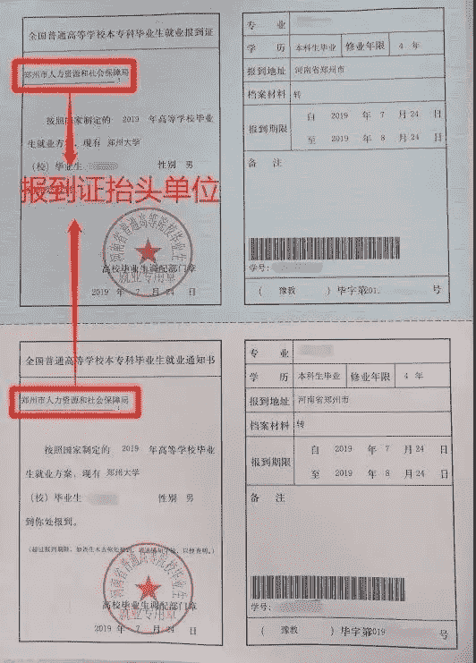
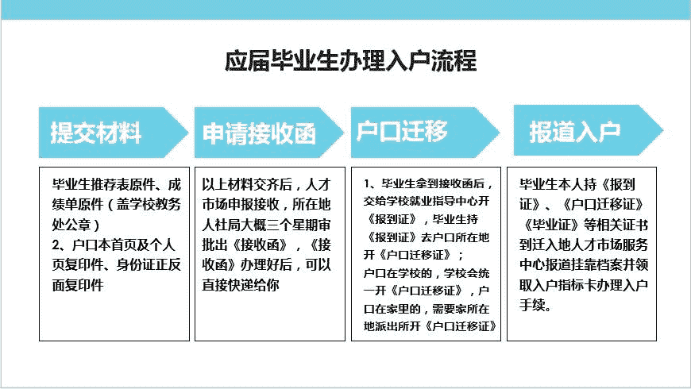

# offer 签约签的准备工作

#  通过重重考验的你， 终于到了拿 offer 的最后一步，那就是谈薪资，选择 offer 啦！

#### 1、薪资报的太高怕直接被 pass 掉，说的太低，又觉得自己太委屈

在谈薪之前, HR 的心里已经有了一个明确的薪酬范围，而且这个范围几乎不会改变。你能做的，就是把握自己的优势，在可谈薪资的范围内，争取拿到自己满意的薪资。谈的时候首先要通过网络或者往届的学长学姐，对所应聘的岗位薪资有一个大概的掌握。

牛客网贴心地为同学们退出了薪资爆料微信小程序，匿名爆料真实薪资，查询相关岗位历年薪资，让应届生谈薪更有底气。

    

#### 2、注意薪资构成

薪资=底薪+绩效+补贴+奖金+其他福利

一定要明确薪资构成，避免谈薪时 10w 年薪，实际到手 6w 的尴尬。

注意税前税后。一份税前 1w 的工资，扣掉税以及五险一金代缴，最后可能只有 7k 左右。

#### 3、多个 offer 我该如何选择？

拿到多个 offer 的同学，不免最后都会有幸福的烦恼，需要做出最后抉择，选择之前，建议要全方位了解即将入职的公司以及岗位职责，包括但不限于公司发展前景、岗位喜爱程度、公司福利待遇，加班情况，工作氛围，晋升空间等。

在这阶段，你可以到**牛客网>发现>查薪资**[**（点击立即生成）**](https://www.nowcoder.com/offer/show-v2/index?from=22sxgl)去生成各家 offer 的竞争力报告，从客观数据的角度分析比较 offer

当然，你也可以多问问身边亲朋好友，或者是牛客网上一同奋战的牛油的意见。可以在牛客讨论区发起 offer 比较，让牛油们一起给你出谋划。

立即发帖：[`www.nowcoder.com/discuss/offer/index?from=22sxgl`](https://www.nowcoder.com/discuss/offer/index?from=22sxgl)

### 5.3.7 三方协议、档案、报到证、户口迁移

毕业季其实也是头疼季，刚确定好毕业去处、搞定好毕业论文，接下来就会开始忙毕业离校手续相关事宜了。

其中三方协议、档案、报到证、户口迁移是与我们每一个人都息息相关的事情。可谓说非常的繁杂，下面就来给大家详细科普一下。

#### 1、三方相关问题

选定最后的 offer 之后，就要进入三方签订的阶段了，绝大部分同学对三方这个问题都是一问三不知的，既不知道三方是干什么的，也不知道三方如何签订，甚至都不知道三方是一份具有法律效力的文件。下面，就来为大家介绍一下三方。

**(****1****）****什么是三方？**

三方协议是《全国普通高等学校毕业生就业协议书》的简称，它是明确毕业生、用人单位和学校三方在毕业生就业工作中的权利和义务的书面表现形式，能解决应届毕业生户籍、档案、保险、公积金等一系列相关问题。

三方协议在毕业生到单位报到（凭《全国普通高等学校本专科毕业生就业报到证》或《全国毕业生研究生报到证》）、用人单位正式接收后自行终止。三方协议一旦签署，就意味着大学生第一份工作就基本确定。

**（****2****）****三方协议的具体流程**

答：找学校取得三方协议-->填写自己的基本信息-->三份全部寄给公司-->公司填写信息并盖章-->公司将三份全部寄回给你-->去学院盖章-->去学校就业中心盖章-->寄一份给公司，自己保留一份，交给学院一份

**（****3****）****签三方注意事项**

*   户口：“保证解决户口”“尽力解决户口”“不保证解决户口”还是“不管户口”。至于户口到底重不重要，有什么用，只能说：你认为重要，他就重要。但是如果你想在一个城市长期发展的话，户口的作用是非常大的。在目前的就业形势和户口政策下，薪水和户口很难两全，同学们要权衡轻重。如果对方承诺解决户口，要把这一条写到备注栏，保护自己的权益。
*   违约金：不要主动问，通常公司在签约的时候回主动跟你说，然后写到三方协议的备注栏，在谈到违约金时，可以协商一下，尽量降低违约金的金额。
*   看用人单位名称是否与单位有效印鉴名称一致，若不一致，协议无效。填写专业名称时，要与学校教务处的专业名称一致，不能简写。
*   可将签约前达成的各种福利待遇在备注栏中说明。
*   签订协议时，要严格按照规定步骤进行。等用人单位填写完毕、盖章后再到学校就业指导中心签字盖章，以防单位在填写的时候，工资待遇等与过去承诺的大相径庭，学生却因为自己和学校都已签字盖章而无法挽回。
*   三方协议在毕业生到单位报到与单位签订劳动合同后失效，因此签订三方并没有进入就业的“保险箱”，还需要接受用人单位实习期、试用期的进一步考察。

**（****4****）****签了三方之后想毁约怎么办**

第一步：需要跟签约单位取得联系，委婉说明自己违约的原因，表达想要违约的意愿，可以先发一封邮件说明情况，再打电话告知。因为邮件可以作为书面证据：你曾告知过签约单位相关情况。

第二步：要求原签约单位出具解约或违约书面退函。因为原三方上大多都约定了违约金，部分企业会要求你缴纳违约金才肯给你解约函，如果违约金比较高，可以跟企业 hr 好好协商，说清自己的难处，打“同情牌”，尽量降低违约金费用。之后有两种可能，要么 HR 被你真情所打动，免除违约金，给你出具解约函，退还你三方协议，要么你不给钱，就不退还给你三方协议，实在不行也不要在钱上过多纠缠，想办法拿到盖章的解约书才是王道。

**（****5****）****毁约流程**

*   与原单位协商，向原单位接收违约，按照三方协议规定，交纳违约金(有些单位不收违约金)，从原单位开出退函。
*   从新单位获取接收函。
*   拿着原单位退函和新单位接收函到就业指导中心领新三方(有时也不需要接收函)。
*   拿新三方与新单位签约。这个过程中，关键在于第一步：如何与原单位协商，拿到退函。具体的情况，不同单位不一样，有的单位可能会拖很久。所以，如果新单位的签约时间很紧，而原单位又不会很快给你开退函的话，那结果很可能是你两家单位都签不了。

牛客为大家整理了一些签三方相关的文章，如果大家看完上诉介绍之后还有很多疑问，可以仔细阅读，相信能解答绝大部分同学对三方的疑惑。

*   三方协议的流程与注意事项汇总

[`www.nowcoder.com/discuss/320692?from=22sxgl`](https://www.nowcoder.com/discuss/320692?from=22sxgl)

*   offer，三方，两方，毁约 这些你需要知道的事 

[`www.nowcoder.com/discuss/144015?from=22sxgl`](https://www.nowcoder.com/discuss/144015?from=22sxgl)

*   #校招常识#关于三方，两方，毁约的那些事 

[`www.nowcoder.com/discuss/15278?from=22sxgl`](https://www.nowcoder.com/discuss/15278?from=22sxgl)

*   【三方协议】夜黑路滑，关于三方，你一定要注意这些！

[`www.nowcoder.com/discuss/24191?from=22sxgl`](https://www.nowcoder.com/discuss/24191?from=22sxgl)

*   应届生扫盲，求职必看！三方协议&签约违约你必须了解的事

[`www.nowcoder.com/discuss/581242?from=22sxgl`](https://www.nowcoder.com/discuss/581242?from=22sxgl)

*   认真整理一波的干货，关于五险一金的扫盲向科普！

[`www.nowcoder.com/discuss/555843?from=22sxgl`](https://www.nowcoder.com/discuss/555843?from=22sxgl)

#### 2、毕业生档案和报到证的常见问题

**（1）****什么是毕业生档案**

毕业生档案 是记述和反映毕业生政治面貌、学习经历、思想表现以及家庭状况、奖惩记录等的综合材料，是用人单位选拔、聘用毕业生的重要依据。在校时叫学籍档案，毕业后叫人事档案。总的来说，它是个人经历的记录，也是人事管理和服务的依据。

**（2）****什么是人事档案**

从学校转出的毕业生档案，成为人事档案，并在后续不断记载个人学习工作经历、政治品质、思想认识、专业素养、工作实绩、遵纪守法以及家庭社会关系等情况，是保障个人权益的重要依据。在工作、学习和生活中都要利用到人事档案，如 招聘录用、职称评定、转正定级、各种政审、办理养老等社会保险、确认工龄、家庭亲属关系证明，以及开具出国、考研有关证明等，所以提醒大家一定要慎重对待自己的档案，不可大意。

**特别提醒：毕业后，学籍档案投递到人事管理机构之后才能变成人事档案。**

**（3）****毕业生档案里都有什么**

毕业生档案相对来说要简单一些，主要包括高中（中专）阶段的学籍材料，以及参加高考的报名材料、高中以上学习阶段的学籍材料和每阶段的报考材料、《就业通知书》（或《就业报到证》），还有党团材料、大学成绩单等等：

*   高校毕业生登记表；
*   学习成绩表；
*   在校期间的一切奖惩材料；
*   入团、入党志愿书；
*   毕业离校前的体检表；
*   毕业生报到通知书（报到证）等。

**（****4****）****档案的用处是什么**

*   保留个人原有干部身份；
*   办理工作调动时需要个人档案；
*   参加公务人员招聘考试，需档案确定身份；
*   办理个人退休手续时，要查看档案记录；
*   专业职称晋升的参考依据；
*   出国政审和公证时，需要查阅个人档案。

**（****5****）****毕业后，档案去哪里**

毕业了，档案要放在哪里呢？这个根据大家的生源地、户籍地和就业情况会有所差异。

一般情况，以下这些机构可以存放人事档案：企事业档案的人事管理部门（例如，人事处、人力资源管理部），政府管辖的人才服务机构（例如，人才交流服务中心），留校暂存（不超过两年）。毕业生首先要弄清楚就业的单位是否有人事档案保管权限，如果没有人事档案保管权限，可根据单位要求，选定委托机构代管；如就业单位不推荐或要求，可自行选择人才服务机构代管，本人需提前与人才交流中心联系办理相关手续，以确保对方可接收档案。

综上，毕业后档案去向有 4 种情况，即：

*   发至生源地人力资源与社会保障局；
*   发至你所在单位（你的单位需要有档案管理权限）；
*   申请档案暂时留校管理（不超过两年）；
*   委托人才市场进行管理；

毕业后一般有如下四种情况：

（一）毕业离校时已经落实就业单位

（二）毕业离校时未落实工作单位，处于待业期

（三）针对出国留学同学

（四）针对国内考研的同学

对于毕业后不同的情况，档案处理方式也不同，[**（点击查看详细情况）**](https://www.nowcoder.com/discuss/24191?from=22sxgl)

**（****6****）****报到证是什么**

报到证的全称是“全国普通高等学校本专科毕业生就业报到证”，也叫派遣证，是应届普通高等学校毕业生到就业单位报到的凭证，也是毕业生参加工作时间的初始记载和凭证。《报到证》分上下两联（内容相同），上联叫报到证（本科生蓝色或研究生粉色）由学校发给毕业生本人，下联也叫通知书（白色，毕业生不得个人持有）则放入学生档案内。 报到期限一般为从签发之日起两个月。

**（****7****）****报到证有什么用**

*   最主要的用处前面已经提及，就是到就业单位报到的证明。毕业生到工作单位就业时，须持报到证。工作单位凭报到证等证件为毕业生办理入职相关手续。
*   毕业生办理落户手续时，除了户口迁移证之外，也要看就业报到证。
*   学校就业相关部门依据报到证为毕业生办理档案投递、组织关系转移和户籍迁移等手续。
*   就业报到证中的白联是毕业生参加工作时间的初始记载和凭证，上面的日期是工龄的开始年限，与退休年龄和养老保险交纳年数都有关。
*   应届毕业生报考公务员一般要看报到证。
*   如果毕业生已拿到报到证，但变更工作单位（一般是跨区）需要改派时要凭报到证办理相关手续。

如果没有报到证，那可能就要被用人单位给拒绝门外了。

如果你毕业时打算考公务员，事业编，教师，医生，国企等工作，这个时候报到证和档案很重要。如果你毕业后打算把户口从老家签到工作所在城市，也要用到报到证。

然而， 并不是所有单位都要你拿报到证去报到。有的单位，并不需要，这个看你自己的就业去向了。这时候，你自己要保管好。因为万一后面你又跳槽，还用得上呢。

报到证是一份凭证，是任何一个合法的人才中心、档案管理机构接收毕业生档案的证明。随着你工龄增长，要退休的时候，还和你的退休年龄、养老保险缴纳有关。

所以，你越早就业，越先去用人单位报到越好，开始计算工龄了呀！

还有更多问题，例如：

已就业的毕业生《报到证》抬头怎么写？

未就业的毕业生《报到证》抬头怎么写？

升学的毕业生《报到证》怎么开？

出国留学的毕业生《报到证》怎么开？

毕业后，如何办理《报到证》改派手续？

报到证丢失怎么办？

... ...

要了解更多报到证相关信息：[**（点击查看详细情况）**](https://www.nowcoder.com/discuss/24191?from=22sxgl)

#### 3、毕业生落户与人才补贴

Part 1 证件说明

身份证：中华人民共和国居民身份证

户口迁移证：户口迁移证是公民的户口所在地变动时，由原户口所在地开具的，由原户口所在地迁往新落户地址的凭证。

户口准迁证：新落户地址派出所开具的，允许办理户口迁移的凭证。一般是有严格落户限制的地方需要开具。

就业报到证： 全称是“全国普通高等学校本专科毕业生就业报到证”，也叫派遣证，是应届普通高等学校毕业生到就业单位报到的凭证，也是毕业生参加工作时间的初始记载和凭证。

Part 2 应届生如何办理户口迁移？

**（一）****应届生办理入户流程**

1、户口在学校的处理：读大学时把户口迁来学校，现在要毕业了，学校就要求把户口迁走，两种选择：

*   迁回原籍（当初从哪里迁来就迁回哪里去）；
*   迁入工作单位所在地

2、户口在老家的情况： 读大学时，户口在老家没有迁移来学校的，现在毕业了，想要入户工作单位所在地，也是可以办理落户的，第一步都是提交材料办理《接收函》，然后带接收函报道证等材料回老家派出所开《户口迁移证》就行；

另外，有些地方农村户口也不错，如果有地可以分红，可以考虑不迁移户口，过几年再考虑迁户口也是可以的。

以下为应届生办理入户的一般流程：

**（二）相关政策规定**

1、户口在学校的毕业生，落实工作单位的，应将户口由学校迁移到工作单位所在地。工作单位所在地公安机关凭省毕业生就业主管部门签发的《就业报到证》和用人单位主管部门的接收证明及学校所在地公安机关签发的《户口迁移证》办理入户手续。

2、户口不在学校的毕业生，落实工作单位的，凭省毕业生就业主管部门签发的《就业报到证》和用人单位主管部门的接收证明，就可将户口由原籍直接迁至工作单位所在地。户口迁出地公安机关凭《就业报到证》和用人单位主管部门的接收证明，直接办理《户口迁移证》，工作单位所在地公安机关不需发《准予迁入证明》。

3、户口在学校的毕业生，要求将户口迁回原籍的，公安机关凭毕业生本人的毕业证和《户口迁移证》办理恢复户口手续。

4、普通高等学校毕业生，毕业离开学校时，还未落实工作单位的，可暂缓 2 年就业。暂缓就业毕业生的户口可继续保留在学校 2 年。毕业生在暂缓就业期间落实工作单位的，公安机关凭省高等学校毕业生就业主管部门签发的《就业报到证》和用人单位主管部门的接收证明，办理户口迁移手续；暂缓就业毕业生，在暂缓期满后仍未落实工作单位的，可按照有关规定将户口迁回原户口迁出地。

5、户口在学校的原农业户口性质毕业生，要求将户口迁回原籍，并要求恢复农业户口性质的，可予办理。为妥善处理好“非转农”后出现的问题，事先应征求申请“农业户口”所在地的乡镇或村委会意见。

6、入学时未将户口办理“农转非”手续的毕业生，落实工作单位后，在办理户口迁出时，户口迁出地公安机关在为其办理“农转非”手续后，以“非农业”户口性质迁出。

7、户口在学校的本省生源毕业生，未落实工作，要求将户口迁回原籍，其父母户口已迁移到本省其他地区的，可直接将户口迁至其父母户口所在地；如果父母一方还在原籍居住的，该毕业生的户口仍应迁回原籍。

8、已领取《迁移证》将户口迁回原籍的毕业生，因故一直未办理落户手续，迁入地公安机关问明情况后，凭原《迁移证》恢复户口；已领取《迁移证》将户口迁往异地，因故一直未办理落户手续的，按有关管理规定办理。

9、普通中等专业学校毕业生分配工作后，人事部门不再发《中等专业学校毕业生分配报到证》。公安机关凭下列毕业生提供的相应证明材料办理户口迁移手续：

（1）被机关录用的，提供地级以上市政府人事部门签发的《录用通知书》。

（2）被事业单位（不含自主经营、自负盈亏、照章纳税、不要财政拨付任何经费的事业单位）聘（录）用的，提供政府人事部门签发的《事业单位聘（录）用毕业生通知书》。

（3）被企业（含各种所有制企业）和自主经营、自负盈亏、照章纳税、不要财政拨付任何经费的事业单位接收的，提供县级以上政府人事部门签发的《毕业生就业通知书》。 

**Part 3 落户实操指南**

具体流程一定要以各市政府官网与人社局公布为准，除了北京上海落户规则比较严苛复杂，其他城市落户政策还是比较宽松的，并且还有相对应的人才补贴政策，只要材料交齐，最后基本都能通过。想了解北京、深圳、广州、上海、南京、杭州这几大城市的落户，可以仔细阅读[**《落户实操指南（点击即可查看）》**](https://www.nowcoder.com/discuss/591319?from=22sxgl)