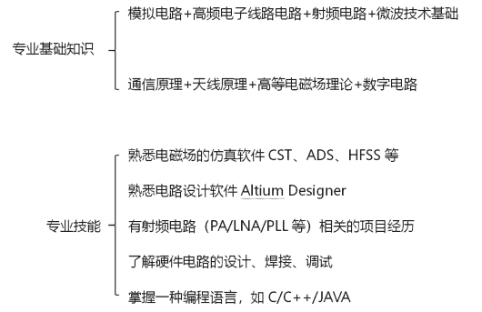
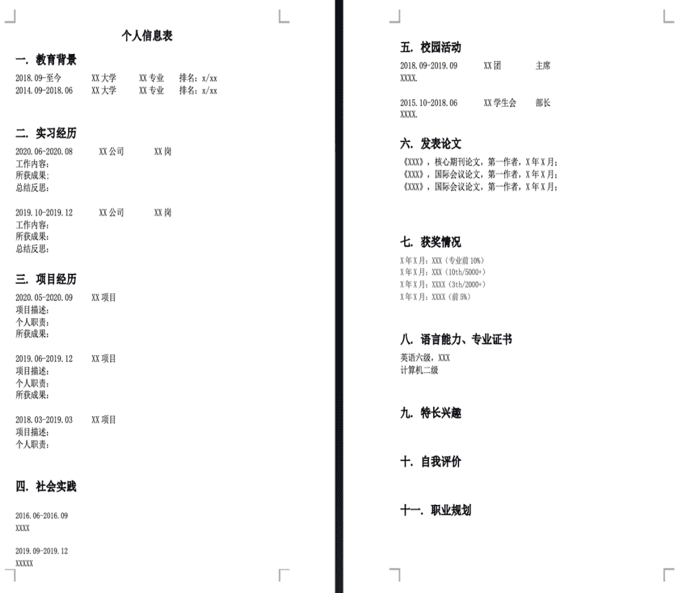
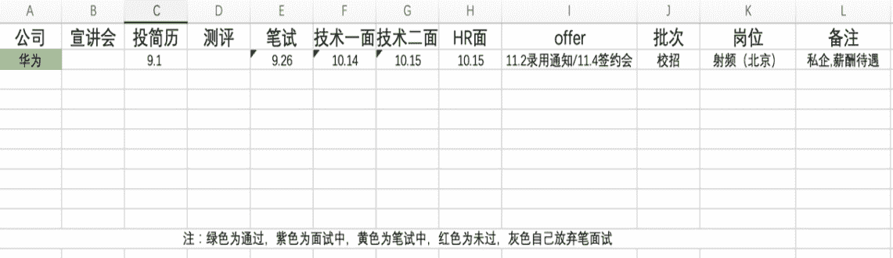

# 第二章 第 1 节 校招准备

> 原文：[`www.nowcoder.com/tutorial/10064/cf028e85e15d4c84abdfdc9d7f035327`](https://www.nowcoder.com/tutorial/10064/cf028e85e15d4c84abdfdc9d7f035327)

        正所谓不打无准备的仗，在秋招开始前，我们需要做一些前期的准备工作，准备工作做得越好，获得 offer 的几率越大。

# 1. **提前做好职业规划**

        意向行业和意向岗位越早明确越好，可结合自身的专业、个人经历和爱好综合进行考虑，行业岗位的选择非常重要，这将直接决定你的复习方向和面试官的考察方向。

# **2****.  ****提前做好时间规划**

        时间安排视个人情况而定，如果是大二、研二距离秋招有一年及以上时间的同学，可以去外面多实习，如何找到实习、如何通过实习转正会在后面的第四章详细讲解。如果时间比较紧张的同学，比如现在开始准备明年的春招，就建议多花时间精力在自身专业技能和专业基础知识的提升上。

        以我个人为例，从 19 年 12 月开始关注一些招聘信息，明确意向岗位后，2~4 月对相关基础知识和专业技能有计划地进行复习，6~8 月参与大厂暑期实习获得转正机会，9 月正式开始秋招，11 月秋招结束。

# **3****.  ****合理安排学习计划**

        主要有专业的基础知识和专业相关技能，这些在后面的笔试和面试中都会用到。基础知识掌握的越扎实越好，复习尽量全面到位，专业技能根据项目经历去延展开。不同的岗位所需的专业技能都不一样，一个简单的方法就是去公司的招聘网站，选择意向岗位，里面会写明岗位要求 1234 点，你看哪点是自己所欠缺的还没有的，就去补足相关的专业知识和技能。

        我秋招主要针对硬件岗里面的射频天线电磁场方向在准备，所需的专业基础知识和专业技能如下。

       **专业基础知识——**

        如果时间比较充足，可以找网课资源看，我用过的网上学习资源有：慕课、B 站、爱课程、网易公开课。然后可以在牛客上刷刷题，题做经典题代表题就够，不用追求量。硬件不像软件必须刷题来增加经验，好多书本的基本知识你理解明白了，题就都能做，刷题是没有什么效果的，毕竟分析电路这类的，改跟线改个元器件就完全不一样了，死记硬背也没啥用，还是重在理解。

        **专业技能——**

        重在结合项目增加实操经历，比如设计电路的 AD 软件会用吗，用它画过什么电路？仿真软件掌握至少一种了吗，设计过微带线谐振腔了吗？电路出问题的时候怎么调试的？这些都重在平时的积累和实操，靠临时抱佛脚还挺难的。实在没有项目的话，买一本《HFSS 入门指导实例》书根据上面的案例，自己用软件画一画，仿真调调效果。

        笔面试对于专业基础知识和专业技能更具体要求，将在后面详细讲解。

# **4****.** **提前关注相关招聘渠道**

*   公司招聘公众号及各高校就业公众号。对我而言，公众号的招聘信息推送更为及时，因为我微信几乎每天都会看，而网站论坛可能几天才看一次，所以直接关注了所有的想去的公司的微信招聘公众号，还关注了清华就业、北航就业等各高校的就业公众号，高校公众号会定期整理推送公司的招聘信息，也是很方便的。不知道该关注哪些公司招聘公众号的同学，可直接百度行业内的排名名单，牛客网公众号里面也会整理好企业的招聘名单。

*   各类高校毕业生的求职微信群、QQ 群。可以找几个方向差不多的小伙伴们，一起共享招聘信息，互帮互助加一些应届生的求职微信群、QQ 群，里面经常会有学长学姐转发招聘信息，还会帮忙内推。

*   第三方网站。第三方网站比如牛客网这类的，还是需要关注下。因为有些研究所没有自己的招聘公众号，都是通过第三方网站来进行招聘的。

# **5****.**** 提前****准备好个人信息**

## 5.1 个人信息表

        个人信息表是帮助我们网申填写信息和针对不同公司的岗位要求修改个人简历的，应包括个人信息、教育经历、实习经历、项目经历、校园实践经历、获奖情况、发表论文等，最后可以整理成一个 word 文档。因为在后续秋招网申的时候，需要手动填写很多信息，基本都有上面提到的个人信息表里面的几大模块，如果每次都打字填写，每次都要花费半小时左右。所以可以准备一个 word 文档，把这些信息全部写下来，网申的时候直接复制粘贴就好。在投不同公司需要改简历的时候也用得上。举个例子，投了 OPPO 的射频岗，过后想投 Intel 的硬件岗。OPPO 射频岗加分项是有电磁场开发经验，而 Intel 的硬件岗的加分项是脚本开发经历。我们就需要把原来简历中天线仿真的项目用 Python 开发的项目替换掉，这时候就把之前整理 Python 开发项目经历直接复制粘贴上去。总之，个人信息表就是为了帮我们节省时间的，梳理自己的过去也有助于找准自己的定位。下面给出示例，

## 5.2 求职进度表

        求职进度表里面应包括意向的所有公司、简历投递时间、测评时间、笔试时间、面试时间、发 OFFER 时间，可用不同的颜色标准，便于后续的规划。实例如下：

##   5.3 照片

        个人证件寸照，基本网申简历也都用得上，有的研究所现场面试也会要求带两张一寸证件照，便于粘贴在现场发的求职表上。有良好的精神面貌的证件照也是体现年轻人积极活力的一种方式。所以，去照相馆拍一个正规好看又精神的证件照吧！顺便可以拍张生活照，国企事业单位那种有可能用得上。之前大学申银行实习的时候有要求过生活照，别的还没遇到过。