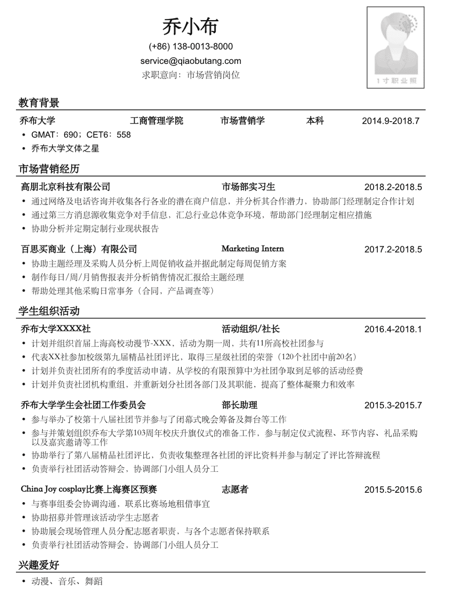

# 第三章 第 1 节 简历制作与投递

> 原文：[`www.nowcoder.com/tutorial/10064/6c639aee21e6485a8486e443fcfc1f2b`](https://www.nowcoder.com/tutorial/10064/6c639aee21e6485a8486e443fcfc1f2b)

        简历是我们给公司留下的第一印象，其好坏直接决定了能否获得面试机会和面试流程的快慢。花里胡哨、内容空洞、找不到重点的简历都会让你直接跟意向公司 SAY Bye-bye。而与招聘岗位匹配度高的简历，可以直接帮你跳过笔试直通面试，甚至会有 HR 主动联系你，拿 offer 的流程比别人快一倍。我秋招的时候，就因为个人简历，有好几个大公司的 HR 主动联系我，说和他们的岗位较为匹配，免笔试直通面试，别人还在测评笔试流程中，我都已经拿到 offer 了。所以，简历是非常非常重要的。下面我将从简历制作原则、简历模板、简历内容及简历投递四个板块进行分享。

# **1****.** **简历制作原则**

        原则有三——

**        第一，切勿造假，保证简历内容的真实性。**入职前都会有背景调查的，若发现简历造假，将直接取消录用资格，严重的还会进入行业黑名单。

**        第二，要****有岗位匹配度****。**项目和经历并不是越多越好，跟岗位的匹配的才好，你的所有项目和经历都是围绕招聘的岗位展开的，不能招聘硬件工程师你简历上写着程序员的经历。

        有个小技巧，同学们可以调研下公司对该岗位的招聘要求，不光是今年的，还有去年和前几年的，提炼出岗位关键字。然后拿出第二章讲过的同学们之前准备过的个人信息表，里面写的实习经历、项目经历、社会实践、校园活动等，只有跟岗位相关的内容采用，无关的舍弃。最后相关的描述项目经历和实践经历时，尽量用公司岗位招聘里要求里写的那种专业性语言进行描述，同时包含岗位关键字并加入专业性的词汇，比如射频的有天线、低噪放、功放、增益、滤波器、调制解调等。以某公司射频设计师的岗位招聘信息为例：

 

        可看到细分为信道、滤波器、射频、射频 4 个方向。

        其中 d 射频方向的岗位关键字为：射频电路原理图 PCB 设计

        参照岗位要求描述的语言，相关的项目经历可以这样描述：

        X 年 X 月~X 年 X 月，参与的射频收发电路设计项目，个人主要负责功放部分的设计、调试及测试工作，期间利用 ADS、HFSS 软件对功放电路进行仿真设计，用 PCB 软件进行电路原理图的绘制，用矢网进行相关电路的匹配调试，频谱仪测试结果表明在 X 频率处获得了 XX 的功率，其增益为 X，满足技术指标的要求，已被应用于 XX 中。（只是举个语言描述的例子，项目的应用背景和具体细节需根据个人情况进行补充）

**        第三，尽量用数据说话。用数据突出个人成****果****。**举个例子，2018 年 6 月获得专业一等奖学金， 添加数据后修改为 2018 年 6 月获得专业一等奖学金（3th/800），这就是用数据来体现奖项的含金量。

# **2****.** **简介模板选择**

        模板以简洁清晰美观为主，注意一定不要花哨。

        因为我们的简历是给 HR 看的，他们需要从我们的简历上快速获取有用的信息，即岗位所需要的专业技能和专业素养。每天 HR 要查看上千份简历，形式太繁复的简历只会干扰他们提取有用的信息。

        比如下面简历模板 1（图片来自网络），黑白色、简单明了，重点突出，很适合工科类的同学们。千万别觉得这个模板太过简单，在 WORD 上自己调整，注意字体格式等的统一，还是需要花费一番功夫的，切勿粗心大意，出现行间距不一、字体不统一、横线不一样长等低级错误。

        

        简历模板 2 同样来自网络，这种模板比较常见，我们可以一起来对比下。模板 2 看上去可能更好看，但并不太建议用左右两列的模板。一般来说，人的阅读习惯是从上往下，从左往右。若左右列宽差不多容易分散注意力，而像模板 2 的左窄右宽，注意力会集中在宽边，但左边的图形和柱状图没有意义，却白白浪费了宝贵的空间，压缩了右边的空间。同学们应在有限的空间内尽可能多地展现自己的优势。所以，这两个模板还是更为推荐模板 1，极简也是一种美。当然，如果简历上实在没什么好写的，一页纸都写不满的同学，就可以像模板 2 这样来占空间了。

 

# **3****.** **简历内容**

        简历里面的几个大的模块主要有个人信息、教育背景、专业技能、项目经历、实习经历、校园经历、获奖经历等。

*   **个人信息。**个人信息包含姓名、电话、邮箱、籍贯、政治面貌等。一定要确保简历上的联系方式电话和邮箱能联系到自己。

*   **教育背景。**说实话，很多招聘公司确实比较看重学历，研究所这类的会比较关注成绩排名。如果学校好的话，建议放在最前面，学校一般可以放在后面，前面可以先放专业技能和项目经历来突出个人优势。

*   **专业技能和项目经历**个人认为是简历上最为重要一部分。可以分开写，也可以合在一起写，在项目经历中突出自己的专业技能。简历上的项目要丰富，一页纸的简历项目以 3 个为宜，如果含金亮高的项目较多，可以适当增加篇幅。项目介绍千万不要草草带过，一定要字字斟酌，用精炼的语言进行概括，并重点突出你的个人成果。项目经历可按照 STAR 原则进行描写，即 Situation(情景)、Task(任务)、Action(行动)和 Result(结果)。简单来说就是做了什么项目，达到了什么效果，你个人独立负责了什么，项目中遇到了哪些问题，问题如何解决的。项目经历缺乏的同学，就写课程设计吧，硬件类的同学课程设计都焊接过收音机、设计过小车吧？实验课没少上吧？把你觉得比较难的实操性较强的课程设计整理出来也是可以写的。但你一定要保证你写进简历上的项目是熟悉的而不是虚构的。因为项目是面试的重点，几乎每个面试官都会问到项目中的具体细节问题，来考察项目的真实性以及你的专业性。

*   **实习经历。**大厂的实习、实习岗位与校招岗位匹配度高的这类实习经历尽量放在前面。实习期间做了什么事达到了什么效果，还是重点突出你的专业性。

*   **校园经历。**如果相关的项目和实习经历比较多，校园经历部分不是特别突出的就可以不写，比如像社团/班级干部这种的。但对于国企这类更注重综合能力的公司或是招聘要求里写明有干部经历的优先，班长团委这种的就需要写。

*   **个人评价**我觉得一般可以不写，但如果你的简历内容太少就写吧。如果简历内容太少，一页纸都写不满的话，就把个人评价放在最后，再次强调下个人优势。

# **4\.** **简历投递**

        制作好了简历，如何进行简历的投递呢？主要有以下几种方式：

*   **内推**

        能走内推就走内推，内推的作用是免简历筛选和提前进行考核，能节省一定的时间成本，有些公司内推还可以免笔试。可以找自己的师兄师姐熟人这种帮忙内推，牛客里面经常有各种公司的内推码，同学们可以关注下[牛客内推广场](http://www.nowcoder.com/discuss/referral/all/index)：          

*   **官网投递**

        选择你想加入的公司，进入官网投递。官网投递一般每个公司都有相应的个人信息板块需要填，相比于内推，个人信息会更全面更准确，但每次手动输入填写的话都需要花费 20~40 分钟不等，所以同学们把之前第二章讲的准备好的个人信息表利用起来，网申的时候直接复制粘贴就好，能省下不少时间。

*   **微信公众号**

        各个学校的就业指导中心公众号，都有相关公司的投递通道。

*   **邮箱投递**

        若是研究所航天院这种，需要用邮件把简历发过去的，邮件发送时间最好在下午，且尽量避免在周一事情最多的时候和周五快放假的时候发。此外，一定要注意**邮件礼仪**：

1. 附件中简历命名按照姓名+学校+应聘岗位+联系方式的原则，千万不要就写个名字就发过去了。简历格式采用 pdf 格式，避免因 word 的版本不同而造成乱码。

2\. 邮件开口有称呼，结尾要有问候语和署名。

3\. 邮件正文不要空白，用两三句短句进行一个简短的自我介绍。

示例如下：

        