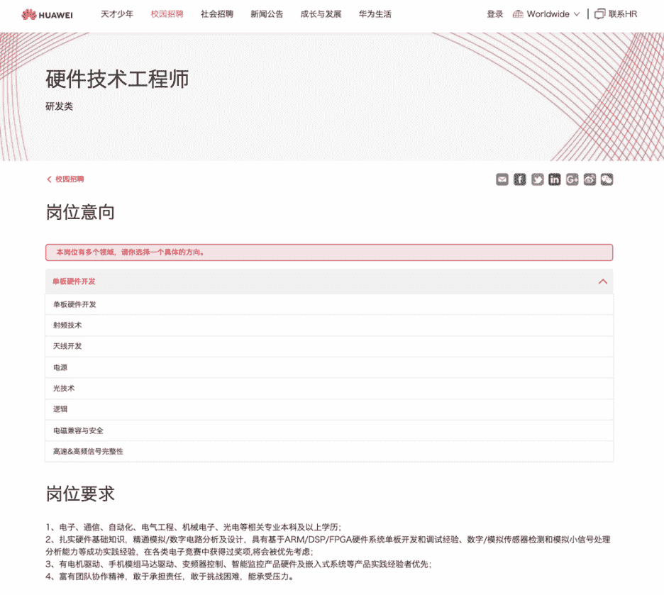
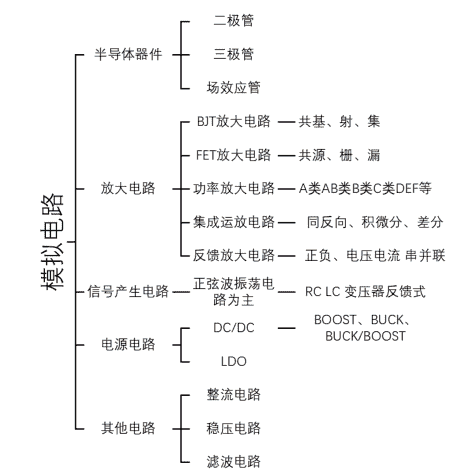
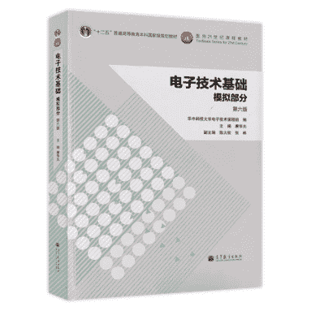
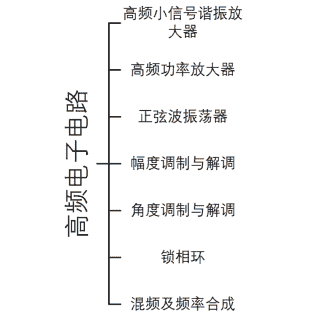
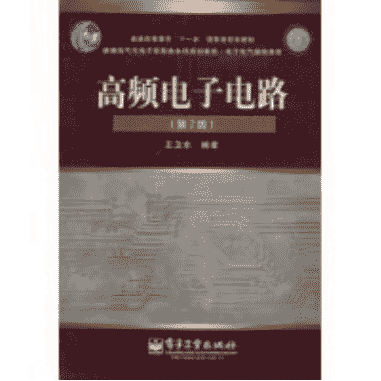
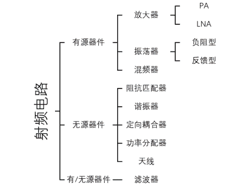
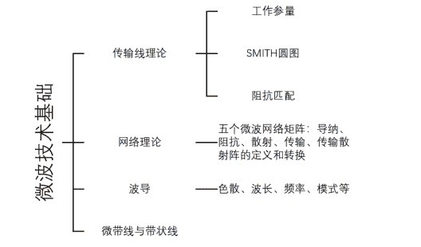
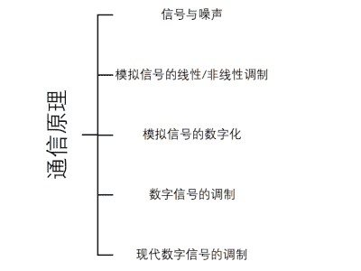
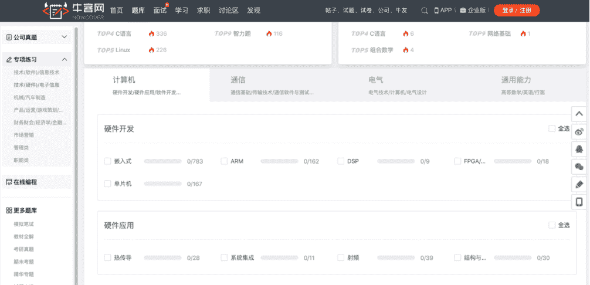

# 第三章 第 2 节 如何笔试

> 原文：[`www.nowcoder.com/tutorial/10064/1a93dc1f442a4000b9db1db33eaaa713`](https://www.nowcoder.com/tutorial/10064/1a93dc1f442a4000b9db1db33eaaa713)

        简历筛选通过后，就进入笔试阶段了。

        企业笔试的目的是批量筛选可以参加面试的同学，我们参加笔试是为了可以顺利进入面试，所以同学们精力应更多地花在面试准备上。但是，如果笔试不通过，连面试机会都没有，所以笔试还是应该给予重视！笔试一般会在工作日一周内出结果，如果一周内都没有通知面试，基本是挂了。

# 1 **笔试注意事项：**

## 1.1   笔试前

        做好准备工作，按笔试邀请邮件里的要求，调试好电脑的网络环境和摄像头等。还需选择一个安静的环境，准备好纸和笔（很重要！！需要计算、需要画电路图拍照上传）。

## 1.2 笔试中

        认真阅读答题须知，注意答题时间，合理安排，控制好答题速度。特别注意下，有的公司为了避免作弊，试卷是不能返回上一道题目的。不要出现先做后面的大题，再返回做前面的选择题却发现返回不了，只能空着的情况。

## 1.3 笔试后

        对出现过的题目进行总结并做好笔记，不会的题目查漏补缺，下次出现同类型的题目要保证自己一定会做。

# 2 **笔试分类：**

一般可分为三类：

**1****.** **性格测试类。**

        放平心态，几乎不挂人，没有所谓的正确答案，根据自身情况作答即可。注意下前后一致，我之前好几次都发现最后几道题是前面出现过的，这就是用来检验同学们有没有撒谎、前后矛盾的。

**2****.** **测评类。**

        类似于行测、包含阅读理解、逻辑思维、空间推理、数字规律等，少部分国企还考了英语阅读，跟英语六级的阅读难度差不多。一般时间会比较紧张，这个同学们可以刷刷题库，如牛客行测题库。此外，一定要注意答题速度，尽量在规定的时间内答完所有的题目。测评类会有一定的淘汰率。

**3****.** **专业知识类。**

        这类难度最大，淘汰率最高。毕竟华为、oppo、vivo、大疆这类大厂投的简历成千上万份，要是都能进入面试，还不得给面试官累趴下呀。所以，专业笔试会刷掉一大波人，想进入后面的面试环节，专业知识基础必须扎实。

        下面将和同学们重点聊一聊有关专业知识的笔试。

        对硬工来说，专业笔试涉及的范围非常广，包括模拟电路、数字电路、单片机、IC 设计、DSP、嵌入式等等，有小部分复习不到很正常。笔试时要注意时间的把控，设置要求，如有的是不能返回上一道题目进行修改的，不追求满分，但要抓重点拿大分，保证会的题目全都能做对，能顺利进入面试环节。下面将对该部分进行重点讲解。

## **2.1 专业知识的笔试**

### 1.  题型

        一般分为纯选择题和选择+填空+大题两种，难度前者小于后者。

        华为、美的只有选择题（单选+不定项）；oppo、vivo、大疆等大多数公司是选择、填空、大题相结合的形式。

## 2.  考点

        对硬件工程师而言，笔试涉及范围很广，按硬工细分方向的不同（以华为为例，里面就细分为单板开发、射频技术、天线开发、电源等多个方向），考察重点也有所不同。下面我主要以射频技术方向为例进行讲解。

 

        射频属于信号中的模拟类，射频工程师主要是研发用于基站、手机、蓝牙等通信射频模块相关的，国内有条件开展相关课程的高校相对较少，学生能接触到高频的项目的机会不多，所以这方面的人才还是比较稀缺，薪酬待遇属于硬工中最高梯队的，今年月薪能给出 30k，最低的也在 15K 以上。

        下面开始将对笔试各考点内容及相关知识的掌握度进行讲解：

### · 考点 1：模拟电路

        既然射频是模拟类，模拟电路的考察必不可少。模电算是大学中最难的一门专业课了，是不是很多同学觉得很难学懂？其实，课本中的模电最重要的无非就是放大电路——从放大倍数较小的 BJT、FET 电路到放大倍数较大的功放电路。

        模拟电路的考点如下图画的技能树所示。没有画在技能树中的部分时间比较紧张的同学就可以不复习了，有精力的同学可以看看。技能树中的电源电路和放大电路需要掌握电路分析方法还需要能记住各自的代表电路，要做到没有书也要能画出来。尤其是晶体管的三类共基、共射、共集放大电路图一定要熟记，在笔试大题中的出现概率较高。信号产生电路和整流稳压电路要掌握电路的原理和分析方法，能计算出电路参数。像半导体器件这类要熟练掌握各自的原理、效应、概念、应用场景等。

 

推荐书籍：大学教材《电子技术基础模拟部分》康华光编

 

推荐网课：清华华成英老师《模拟电子技术基础》

天津大学《模拟电子技术基础》

### · 考点 2：高频电子线路

        射频是一种高频电磁波，具有远距离传输能力，在无线领域中已经被广泛采用，如手机、蓝牙、WIFI、GPS、RFID、ZigBee、IoT、卫星、通讯、雷达、天线等等。所以，高频电子电路也是经常在笔面试中出现的。其考点如下图技能树所示，谐振功率放大器、幅度调制解调、正弦波振荡器经常出现在大题计算中，需重点掌握电路的组成、分析方法和参数计算，锁相环、混频器要掌握各部分的组成及各自的原理作用，容易出现在填空题中。而角度调制解调的题出现偶尔出现，掌握分析方法即可。

 

推荐书籍：《高频电子电路》王卫东著

 

推荐网课：西安电子科技大学《高频电子电路分析基础》

### · 考点 3：射频电路

        射频器件分为包含有源器件和无源器件，简单地说，需要电源的就是有源器件，不需要电源的是无源器件，有源器件一般用于信号变换或放大，无源器件用于信号的传输、分配，滤波器既有有源也有无源的。射频电路的考点如下图所示，对于各个器件的组成、原理、重要性能指标、实验测试、应用等都需重点掌握。

 

推荐网课：华南理工大学褚庆昕《射频电路与天线》

                  哈尔滨工业大学《天线原理》

### · 考点 4：微波技术基础

        考点如下图所示。其中，传输线理论尤为重要，如传输线的工作参量如反射系数、驻波比、输入阻抗、回波损耗等其定义公式和相互间的转换计算，SMITH 图串并电感电容在图上的变化，阻抗匹配等等都需重点复习。网络理论需要熟悉五个矩阵的定义，并能进行简单计算，在大题和选择题中偶尔出现。波导的几个相关公式和微带线带状线做了解即可。

 

推荐网课：厦门大学《微波技术基础》

北京航空航天大学《微波技术》

西安电子科技大学《微波技术与天线》

### · 考点 5：通信原理

        通信原理需要大概过一遍，这部分不用像前面提到的 4 个考点一样看的特别细，重点掌握下噪声系数的定义和计算，再熟悉基本的数字调制技术、通信标准、多址方式即可，会在选择题中出现。

 

推荐书籍：大学教材《通信原理》清华大学出版社

 

### · 其他：

        实验仪器的操作也会考察，比如频谱仪的相位噪声、检波方式；示波器的探头、触发方式、电源波纹这种的，这就需要同学们平时在实验室多操作多留心，或者看看题库，笔试时遇到了就把它记下来。如果时间较充足准备比较充分的同学，还可以把数字电路、单片机基础、信号完整性、PCB 设计、电磁兼容等全部过一遍。一般来说，前面的几大考点对于射频方向已经足够了，同学们可根据自己的时间合理安排学习计划，有时间可做下题库，检验下是否掌握牢固了，题做几套精的就行，不用追求量，要注意电路的分析和解题思路。牛客上有相关硬件笔试题目的[企业真题及专项练习](https://www.nowcoder.com/contestRoom?categories=1)，如下图所示：

