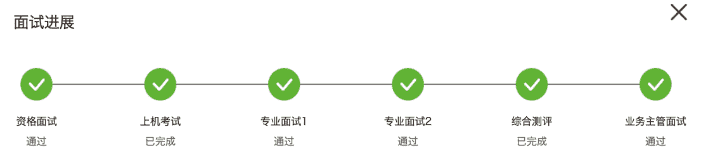

# 第三章 第 3 节 如何面试

> 原文：[`www.nowcoder.com/tutorial/10064/ffc249d44e4e4a4d958f57a63bea7308`](https://www.nowcoder.com/tutorial/10064/ffc249d44e4e4a4d958f57a63bea7308)

        如果你已经过了简历和笔试，进入面试阶段了，恭喜你，离 offer 又近了一步。作为面试小女王，只要是我参加了的面试，基本就没有不过的。每一场面试都能给面试官留下良好的印象，被评价“综合素质很不错“，“主管对你的印象非常好”，“就是我们想要的人”，华为、爱立信、海格通信等都是拿到首批 offer，催我提前去实习这种的。在我看来，并不是我有多么厉害，而是面试都是有迹可循的，可以提前花时间准备和现场发挥的。概括起来，面试时我有以下特点：

1. 不卑不亢，自信坚定，对专业充满热情，给面试官的感觉是因为喜欢且慎重思考后才选择该行业和职位的，而不是被迫选择。

2. 主动开启话题，做话题的引导者，把控节奏，把面试官往自己擅长的方向上引，最大化地展现自己的优势。

3\. 体现自己的专业性和不可取代性，告诉面试官为什么这份工作我来做才合适。

4. 遇到不懂的不会的问题不是装懂，而是大方承认并用相关的经历巧妙化解。

5. 每次面试后复盘总结，查漏补缺。

下面我将从面试形式、面试礼仪、面试流程及技巧多方面进行讲解，帮助同学们顺利通过面试，拿到心仪的 offer.1

# 1 面试形式

        受疫情的影响，今年面试多采用线上面试的形式，线上面试一般分为视频面试和电话面试。线上面试不能跟面试官面对面交流，不如线下直观清晰，但节省了大量的时间成本和交通成本。

        个人认为，与面试官的交流深度和效率都是：现场面试＞视频面试＞电话面试。现场面试更能直观反映出应聘者的综合能力，也便于了解面试官的专业水平和公司环境。所以，北京能参加现场面试的我都尽量参加了，而深圳、广州这种跟学校不在同一省份的，就选择了线上面试的形式。一般来说，现场面试在面试当天或者面试后第二天就能知道结果，而线上面试会在面试后的一周内给到回复。

# 2 面试礼仪

*   时间观念

        同学们都知道不能迟到，要提前到。但并不是到的越早越好。

        因为你到的太早的话，面试官、HR 可能有别的工作或者正在面试前几位候选者，还需另外花时间来招呼你，是不是也挺麻烦的呢？所以，同学们提前 15 分钟左右达到面试地点即可。

        对于线上面试，提前选好一个安静的环境，检查好摄像头、麦克风等设备，提前 15 分钟打开面试界面，等待面试官上线即可。

*   仪容仪表

        现场面试虽然我们不用正装出席，但 T 恤、短裤这类的还是尽量避免，着装以简洁、干净、大方为主，稍微正式些，体现出对公司的重视一定没错，尤其是国企事业单位这种的。

        视频面试时，上半身背挺直，体现一个良好的精神面貌，需要注意下自己的面部表情：面带微笑，眼神坚定，并与面试官保持眼神交流。

        电话面试时，面试官看不到同学们的着装表情等，唯一感受到的就是声音，因此要特别注意声音语速语调的把控：语速不要太快，语调按情景些许变化，不要像白开水一样，让人觉得索然无味。

        有个小技巧：对于线上面试的准备，同学们可以提前用手机录视频，模拟面试情景，看自己有没有做小动作，脸部表情是否僵硬，语速语调是否合适等等。在视频中很容易就能看到平时自己没有注意到的一些小瑕疵，然后及时改正。

*   礼节

        多使用敬词，如您好，请，谢谢这类的。

        手机设为静音，面试官讲话时要认真倾听，保持尊敬，不要东张西望或有小动作，不要打断他说话，等他说完了再回答等等。总之，要给面试官留下一个落落大方，谦虚谨慎，热情积极的好印象。

# 3 面试流程

        硬工的面试一般包含技术面、HR 面和主管面/高层面，不同公司的流程不一样，如下图所示为华为硬工的面试流程，包含两轮技术面和一轮主管面，如果前一轮面试没有通过，面试就自动终止，无法进入下一轮面试。一般来说，技术面在前且不止一轮，侧重考察求职者的专业能力和与岗位的匹配度，淘汰率较高；而 HR 面和主管面在后，侧重考察求职者的稳定性和发展前景，淘汰率低于技术面。

 

## 3.1 技术面

        技术面一般包含自我介绍、项目介绍、专业技能等，侧重对专业能力和岗位匹配度的考察。

### 3.1.1 自我介绍

        提前准备好 1 分钟、2 分钟的自我介绍。

**示例：**面试官好，我叫 X，来自 X 大学 X 专业，研究领域是 X，所学课程有 X，曾做过 X 项目，我想求职贵公司的 XX 工程师职位，谢谢。

        从大体上来看，这位同学的自我介绍中规中矩，因为完整的介绍了自己的信息和想求职的岗位，但是却没有什么亮点之处。因为面试官并不能从这份自己介绍中了解到求职者具体在哪些方面有哪些能力，是不是和求职岗位相匹配。这份自我介绍放到任何一位求职其他岗位的同学身上也同样适用。因此，这样的自我介绍无功无过。你是否适合该岗位以及你的专业能力，面试官还需在后面的交谈中进一步求证。

        那么，我们应该如何准备一份好的自我介绍，让我们自我介绍完，面试官就觉得这是我们想要的人，有跟你进一步深入交流的欲望呢？

先花时间考虑清楚以下问题：

1. 自己曾经有多少个与求职行业相关的项目经验

2\. 获得过哪些高含量的证书、奖励 or 发表过多少篇论文，论文级别如何

3\. 自己对这个领域认知和知识储备如何

4\. 相较于别的求职者，自己有什么特点，有哪些过人之处

        面试官的目的是要找到适合岗位的候选人，你现有的能力与岗位越匹配越好。所以，一份好的自我介绍始终是围绕行业岗位展开的，是同学们过往经历中与岗位匹配的部分，并且有别于他人的。

        下面给出一个自我介绍的示例，同学们可根据自己的情况进行修改，在面试前准备好并演练说通顺。当然，面试时自我介绍也不可说的像背书一样，要边思考边说，不同情况下随机应变。

**改进后示例：**面试官好，我叫 X，来自 X 大学 X 专业，获得过 X 奖学金/排名前 X（好的成绩排名体现了学习能力）、发表了 X 论文有 X 专利（学习转化为成果）。我应聘的是贵公司的 X 岗位，因为这不仅与我的所学专业相关，而且我有与之相关的项目经历和实习经历（说明了选择该岗位的理由），在 X 项目中由我独立负责 X 部分，实现了 XX，在 X 公司三个月的实习中，我在 X 岗位上主要负责 X，实现了 XX（以过往相关经历体现出与岗位的匹配度，挑最具代表的说，成果最好数据化）。贵公司作为 X 行业翘楚，有先进的 X 技术，这也正是与我的职业规划相匹配的（表明有提前对公司进行初步了解）。我期待自己能在此发挥我的专业所长，与公司一同成长进步。谢谢。

### 3.1.2 简历内容相关的问题

        这部分围绕简历展开，以项目为主，同学们需深度思考自己简历上写的每一个实习/项目经历。比如：

*   简单介绍下这个项目？团队的规模、你担任的什么角色、负责的哪部分？

*   现在做到哪种程度了？量产了吗？

*   做项目时你遇到最大的困难是什么，如何解决的

*   项目的创新点在哪？

### 3.1.3 专业及技术知识

        若简历上的项目与岗位要求匹配，就会着重考察项目相关的专业基础知识，即书本上的理论和项目中的实际应用。如果简历上的项目较少或者跟岗位不太相关，会考察你的基础知识。

        比如有过功放的项目，那么对功放的指标参数，如输出功率、增益、效率、1dB 压缩点等需要对其定义熟悉，包括项目***放怎么测试的，软件怎么画图的，电磁场怎么仿真的等等都会细问。若聊的再深入点，功放属于放大器，那么对放大器有什么了解，除了功放，对小信号放大器，MOS、BJT 这种认识如何。如果你回答有了解，那么面试官一定会深入继续跟你聊下去，了解你的知识储备和深度。这种情况千万不要不懂装懂，因为面试官很容易就把你问倒。如果触及到自己的知识盲区，就直接承认这块我没有复习到，我下去补充学习下，谢谢您的建议就可以了。或者说虽然我不太了解您说的问题，但我之前做的 X 也是跟这个比较类似的，您感兴趣的话我可以给您讲讲，把面试官带到你自己熟悉的领域去，这就属于面试技巧了。但是面试前项目相关的问题一定要复习全面，要做到触类旁通，比如项目中写了功放，复习时就要把放大器全部复习到，尽可能减少知识盲区。

        还有一种情况，就是你的项目和岗位较为匹配，前面的和面试官的沟通也比较好，面试官最后可能会直接给你公司项目的电路模块直接让你分析，考察你的专业能力，这个难度较大，能做出来就基本是 SP 了。华为技术二面的面试官最后给了我三道大题让我分析，都是他们做过的项目中的，我有道题解题思路有点问题，面试官还给我详细讲解了，确实很佩服他们的专业素养。

## 3.2 HR 面

        HR 面一般会问一些你的个人经历和家庭情况方面的问题。

*   个人经历

最成功/最挫败/最有挑战性的一件事情？

抗压能力如何？

团队合作能力如何？

优/缺点有哪些？

PS：提前思考，各准备一个具体实例，一定要是自己亲身经历的，不要编造，很容易被看穿。

*   家庭情况

父母是做什么的？是否独生子女？

父母对你岗位/工作地点的意见？

PS：这个就是为了考察你的稳定性和去他们公司的概率大小。准备好话术，正常发挥基本都没问题。

## 3.3 主管面

主管面一般也会问一些项目相关的问题，但对项目的考察没有技术面细，一般会问项目中遇到的困难、项目中的创新点这种的。还有：

*   为什么想来我们公司？
*   职业规划？
*   为什么想做 X？对这个行业有过哪些了解？
*   对射频领域、射频工程师有什么理解？

PS：如果最后问以后进来想做哪些方向？对薪酬有什么要求？这种的基本是稳了~

        好啦，硬件求职经验专刊至此全部结束。

        每个人在求职的道路上都是不断摸索前进的，别人的经验和总结都只能起到一个辅助参考作用，还是需要同学们自己不断总结复盘，不断学习，脚踏实地，走出一个专属于自己的康庄大道。

        如果我的经验能够给与你们一些帮助，那么我就很开心啦。

最后，祝大家：

前程似锦

未来可期！